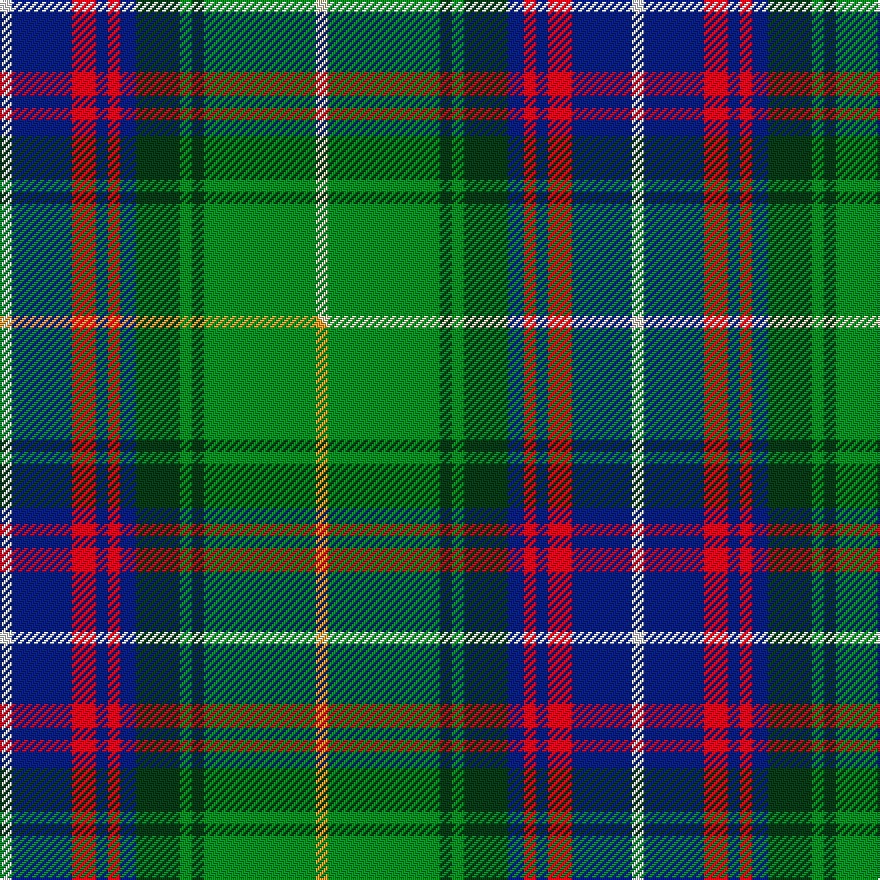

This page is one **sett** — a single exact thread-count. It belongs to the [tartan](/setts/w3g28dg3g3dg11db4r3db3r6db15wi3/)
(the same proportion at any scale), whose colour order is pattern [WBRBRBGGGGW](/stripes/wbrbrbggggw/).

Part of the [Wojtek Memorial Trust](/tartans/wojtek-memorial-trust/) tartan — the named design grouping this sett with its other cloths.

Sourced from tartans-authority.  It is a [11 stripe tartan](/stripes/stripes11/).

Original link [https://www.tartanregister.gov.uk/tartanDetails.aspx?ref=10921](https://www.tartanregister.gov.uk/tartanDetails.aspx?ref=10921)

Dataset <small>— provenance for this record, inherited from the source manifest</small>

<dl class="dataset-prov">
<dt>source</dt><dd><a href="/sources/tartans-authority/">Scottish Tartans Authority</a></dd>
<dt>data captured from</dt><dd><a href="https://github.com/thetartan/tartan-database/blob/master/data/tartans-authority/data.csv">https://github.com/thetartan/tartan-database/blob/master/data/tartans-authority/data.csv</a></dd>
<dt>data date</dt><dd>2013 <small>(this record)</small></dd>
<dt>licence</dt><dd><a href="https://creativecommons.org/licenses/by-nc-nd/4.0/">CC BY-NC-ND 4.0</a></dd>
</dl>

Capture chain <small>— the hands this data passed through, oldest first; each capture carries its own licence</small>

<ol class="capture-chain">
<li><a href="https://www.tartansauthority.com/">Scottish Tartans Authority</a> <small>the heritage body's archive — its tartan-ferret record browser is retired (links repaired to the SRT, above)</small></li>
<li><a href="https://github.com/thetartan/tartan-database">thetartan/tartan-database</a> <small>2016-2017</small> · <a href="https://creativecommons.org/licenses/by-nc-nd/4.0/">CC BY-NC-ND 4.0</a> <small>Levko Kravets's frozen compilation — the capture we vendored, and where its CC licence text came from</small></li>
<li>this dictionary <small>captured 2026-06-10 · commit 5bf86c7566</small> <small>each re-capture is a git commit to data/sources</small></li>
</ol>

## Register references

External register numbers recorded for this tartan.

- Scottish Register of Tartans: [10921](https://www.tartanregister.gov.uk/tartanDetails?ref=10921)
- Scottish Tartans Authority (ITI): 10921

## Thread count
Wi/6 DB30 R12 DB6 R6 DB8 DG22 G6 DG6 G56 W/6

One full sett is **316 threads**.

## Palette
<table><thead><tr><th>Colour</th><th>Shade</th><th>OKLCh</th></tr></thead><tbody><tr><td>DB</td><td><code style="background-color:#082077;">#082077</code> <small style="color:#888">#082077</small></td><td><small style="color:#888">oklch(30.0% 0.149 265.1)</small></td></tr><tr><td>DG</td><td><code style="background-color:#053819;">#053819</code> <small style="color:#888">#053819</small></td><td><small style="color:#888">oklch(30.0% 0.075 151.3)</small></td></tr><tr><td>G</td><td><code style="background-color:#008B2A;">#008B2A</code> <small style="color:#888">#008B2A</small></td><td><small style="color:#888">oklch(55.4% 0.170 145.9)</small></td></tr><tr><td>W</td><td><code style="background-color:#E8CCB8;">#E8CCB8</code> <small style="color:#888">#E8CCB8</small></td><td><small style="color:#888">oklch(86.3% 0.042 57.7)</small></td></tr><tr><td>R</td><td><code style="background-color:#D60020;">#D60020</code> <small style="color:#888">#D60020</small></td><td><small style="color:#888">oklch(55.2% 0.224 25.5)</small></td></tr><tr><td>W</td><td><code style="background-color:#FCFCFC;">#FCFCFC</code> <small style="color:#888">#FCFCFC</small></td><td><small style="color:#888">oklch(99.1% 0.000 89.9)</small></td></tr></tbody></table>

# Sample pattern

## Compared to the master

This cloth is one sett of its design; the master sett (the exemplar the design is anchored on) is below for comparison.

Its **ΔTartan distance** from the master is **0.01** — the same measure the nearest-tartans table ranks by (0 is identical; a re-scale of the same cloth is near 0, a recolour or a different proportion further).

<figure class="master-compare" style="margin:0">

this sett
master sett ★

<figcaption style="color:#888;font-size:smaller">One weave of this sett against the <a href="/setts/w3db15r6db3r3db4dg11g3dg3g28lo3/">master sett ★</a>, split on the diagonal: a shared proportion runs seamlessly across it with only the shades shifting; a different proportion breaks on it.</figcaption>
</figure>

## Nearest tartan variants

The nearest existing variants by ΔTartan distance, with this cloth at the top so the swatches line up against it.

ΔTartan

Threads

Variant

Sett

—

316

<a href="/variants/s11/w3g28dg3g3dg11db4r3db3r6db15wi3~x2~w3502055-wi4000000/">Wojtek Memorial Trust</a>

<a href="/ttd/edit/#slug=w3db15r6db3r3db4dg11g3dg3g28lo3~x2&amp;base=w3g28dg3g3dg11db4r3db3r6db15wi3~x2~w3502055-wi4000000" title="compare in the TTD">0.01</a>

316

<a href="/variants/s11/w3db15r6db3r3db4dg11g3dg3g28lo3~x2/">Wojtek Memorial Trust</a>

<a href="/ttd/edit/#slug=r2g6lb1g1lb1g1lb3dt8y1b1~x4~dt1102249-b2308259&amp;base=w3g28dg3g3dg11db4r3db3r6db15wi3~x2~w3502055-wi4000000" title="compare in the TTD">1.48</a>

188

<a href="/variants/s10/r2g6lb1g1lb1g1lb3dt8y1t1~x4~dt1102249-t2308259/">Haines Family (Personal)</a>

<a href="/ttd/edit/#slug=r5w1db10g10w1y1g2lb2w1~x2&amp;base=w3g28dg3g3dg11db4r3db3r6db15wi3~x2~w3502055-wi4000000" title="compare in the TTD">2.08</a>

120

<a href="/variants/s9/r5w1db10g10w1y1g2lb2w1~x2/">Mary, Queen of Scots</a>

<a href="/ttd/edit/#slug=db2r1db10w1o4g8y1g2~x4&amp;base=w3g28dg3g3dg11db4r3db3r6db15wi3~x2~w3502055-wi4000000" title="compare in the TTD">2.28</a>

216

<a href="/variants/s8/db2r1db10w1o4g8y1g2~x4/">Ayrshire</a>

<a href="/ttd/edit/#slug=db9n3db2w2db9n6db3w3db3g18dg8r2~x2&amp;base=w3g28dg3g3dg11db4r3db3r6db15wi3~x2~w3502055-wi4000000" title="compare in the TTD">2.30</a>

250

<a href="/variants/s12/db9n3db2w2db9n6db3w3db3g18dg8r2~x2/">Patterson, William J.M. (Personal)</a>

<a href="/ttd/edit/#slug=g5dt2g17ly2db5ly2o5db17g2ly4~x2&amp;base=w3g28dg3g3dg11db4r3db3r6db15wi3~x2~w3502055-wi4000000" title="compare in the TTD">2.32</a>

226

<a href="/variants/s10/g5dt2g17ly2db5ly2o5db17g2ly4~x2/">Antrim Irish County Tartan</a>

<a href="/ttd/edit/#slug=o3b2g19b6g2b6dg14dr4w2~x2&amp;base=w3g28dg3g3dg11db4r3db3r6db15wi3~x2~w3502055-wi4000000" title="compare in the TTD">2.37</a>

222

<a href="/variants/s9/o3b2g19b6g2b6dg14dr4w2~x2/">Royal Pharmaceutical, Society</a>

<a href="/ttd/edit/#slug=db4ly4db26t5db5t8ly10g8dg5g5dg22n3~x2&amp;base=w3g28dg3g3dg11db4r3db3r6db15wi3~x2~w3502055-wi4000000" title="compare in the TTD">2.37</a>

406

<a href="/variants/s12/db4ly4db26t5db5t8ly10g8dg5g5dg22n3~x2/">State Seal of Montana (Fashion)</a>

<a href="/ttd/edit/#slug=db2r1db10w1dy4g8y1g2~x4&amp;base=w3g28dg3g3dg11db4r3db3r6db15wi3~x2~w3502055-wi4000000" title="compare in the TTD">2.50</a>

216

<a href="/variants/s8/db2r1db10w1dy4g8y1g2~x4/">Ayrshire District Tartan</a>

<a href="/ttd/edit/#slug=db11r1db2r3db1do8g11w1g11do8db8y1r1y1~x2&amp;base=w3g28dg3g3dg11db4r3db3r6db15wi3~x2~w3502055-wi4000000" title="compare in the TTD">2.51</a>

248

<a href="/variants/s14/db11r1db2r3db1do8g11w1g11do8db8y1r1y1~x2/">Allen Northumbrian Family Tartan</a>

## Neighbour map

Every grey dot is one of 13621 variants placed by the first two principal components of the ΔTartan feature space (42% of its variance). Red is this tartan; blue dots are its nearest — click one to open its page.

<svg viewBox="0 0 640 380" role="img" style="max-width:100%;height:auto;border:1px solid #e0e0e0;border-radius:4px;display:block" xmlns="http://www.w3.org/2000/svg"><image href="/nn/cloud.v1.png" width="640" height="380"/><a href="/variants/s11/w3db15r6db3r3db4dg11g3dg3g28lo3~x2/"><circle cx="155.0" cy="160.2" r="4" fill="#3465a4"><title>Wojtek Memorial Trust</title></circle></a><a href="/variants/s10/r2g6lb1g1lb1g1lb3dt8y1t1~x4~dt1102249-t2308259/"><circle cx="129.2" cy="174.1" r="4" fill="#3465a4"><title>Haines Family (Personal)</title></circle></a><a href="/variants/s9/r5w1db10g10w1y1g2lb2w1~x2/"><circle cx="150.6" cy="167.2" r="4" fill="#3465a4"><title>Mary, Queen of Scots</title></circle></a><a href="/variants/s8/db2r1db10w1o4g8y1g2~x4/"><circle cx="190.9" cy="176.9" r="4" fill="#3465a4"><title>Ayrshire</title></circle></a><a href="/variants/s12/db9n3db2w2db9n6db3w3db3g18dg8r2~x2/"><circle cx="138.4" cy="174.3" r="4" fill="#3465a4"><title>Patterson, William J.M. (Personal)</title></circle></a><a href="/variants/s10/g5dt2g17ly2db5ly2o5db17g2ly4~x2/"><circle cx="188.6" cy="190.1" r="4" fill="#3465a4"><title>Antrim Irish County Tartan</title></circle></a><a href="/variants/s9/o3b2g19b6g2b6dg14dr4w2~x2/"><circle cx="173.8" cy="189.3" r="4" fill="#3465a4"><title>Royal Pharmaceutical, Society</title></circle></a><a href="/variants/s12/db4ly4db26t5db5t8ly10g8dg5g5dg22n3~x2/"><circle cx="140.9" cy="192.1" r="4" fill="#3465a4"><title>State Seal of Montana (Fashion)</title></circle></a><a href="/variants/s8/db2r1db10w1dy4g8y1g2~x4/"><circle cx="196.1" cy="180.4" r="4" fill="#3465a4"><title>Ayrshire District Tartan</title></circle></a><a href="/variants/s14/db11r1db2r3db1do8g11w1g11do8db8y1r1y1~x2/"><circle cx="150.8" cy="161.1" r="4" fill="#3465a4"><title>Allen Northumbrian Family Tartan</title></circle></a><circle cx="152.5" cy="159.6" r="5" fill="#c00000"/><text x="320" y="376" text-anchor="middle" font-size="11" fill="#999">ground</text><text x="11" y="190" text-anchor="middle" font-size="11" fill="#999" transform="rotate(-90 11 190)">complexity</text></svg>

ID: /variants/s11/w3g28dg3g3dg11db4r3db3r6db15wi3~x2~w3502055-wi4000000/
