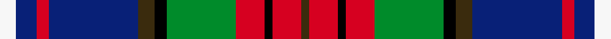

This page is one **sett** — a single exact thread-count. It belongs to the [tartan](/setts/w4db5r3db22dy4k3g17r7k2r7dy2/)
(the same proportion at any scale), whose colour order is pattern [GRKRGKGBRBW](/stripes/grkrgkgbrbw/).

Part of the [Crosser Crozier](/tartans/crosser-crozier/) tartan — the named design grouping this sett with its other cloths.

Sourced from house-of-tartan.  It is a [11 stripe tartan](/stripes/stripes11/).

Original link http://www.house-of-tartan.scotland.net/house/TartanViewjs.asp?colr=Def&tnam=1779

## Provenance

Earliest known date: 1983 Count taken from a sample in a pattern book belonging to Jardines Outfitters, Glasgow 27/05/1983

## Thread count
W/8 DB10 R6 DB44 DY8 K6 G34 R14 K4 R14 DY/4

One full sett is **292 threads**.

## Palette
<table><thead><tr><th>Colour</th><th>Shade</th><th>OKLCh</th></tr></thead><tbody><tr><td>DB</td><td><code style="background-color:#082077;">#082077</code> <small style="color:#888">#082077</small></td><td><small style="color:#888">oklch(30.0% 0.149 265.1)</small></td></tr><tr><td>G</td><td><code style="background-color:#008B2A;">#008B2A</code> <small style="color:#888">#008B2A</small></td><td><small style="color:#888">oklch(55.4% 0.170 145.9)</small></td></tr><tr><td>K</td><td><code style="background-color:#000000;">#000000</code> <small style="color:#888">#000000</small></td><td><small style="color:#888">oklch(0.0% 0.000 0.0)</small></td></tr><tr><td>W</td><td><code style="background-color:#F7F7F7;">#F7F7F7</code> <small style="color:#888">#F7F7F7</small></td><td><small style="color:#888">oklch(97.6% 0.000 89.9)</small></td></tr><tr><td>R</td><td><code style="background-color:#D60020;">#D60020</code> <small style="color:#888">#D60020</small></td><td><small style="color:#888">oklch(55.2% 0.224 25.5)</small></td></tr><tr><td>DY</td><td><code style="background-color:#3A2B0D;">#3A2B0D</code> <small style="color:#888">#3A2B0D</small></td><td><small style="color:#888">oklch(30.0% 0.049 82.0)</small></td></tr></tbody></table>

# Sample pattern

## Nearest variants

The nearest existing variants by ΔTartan distance, with this cloth at the top so the swatches line up against it.

ΔTartan

Threads

Variant

Sett

—

292

<a href="/variants/s11/w4db5r3db22dy4k3g17r7k2r7dy2~x2/">Crosser Crozier Family Tartan</a>

<a href="/ttd/edit/#slug=w4db5r3db22y4k3g17r7k2r7y2~x2&amp;base=w4db5r3db22dy4k3g17r7k2r7dy2~x2" title="compare in the TTD">0.00</a>

292

<a href="/variants/s11/w4db5r3db22y4k3g17r7k2r7y2~x2/">Crosser, Crozier</a>

<a href="/ttd/edit/#slug=w4db5r3db22ly4k3g17r7k2r7ly2~x2&amp;base=w4db5r3db22dy4k3g17r7k2r7dy2~x2" title="compare in the TTD">0.00</a>

292

<a href="/variants/s11/w4db5r3db22ly4k3g17r7k2r7ly2~x2/">Crozier/Crosser</a>

## Neighbour map

Every grey dot is one of 13620 variants placed by the first two principal components of the ΔTartan feature space (42% of its variance). Red is this tartan; blue dots are its nearest — click one to open its page.

<svg viewBox="0 0 640 380" role="img" style="max-width:100%;height:auto;border:1px solid #e0e0e0;border-radius:4px;display:block" xmlns="http://www.w3.org/2000/svg"><image href="/nn/cloud.v1.png" width="640" height="380"/><a href="/variants/s11/w4db5r3db22y4k3g17r7k2r7y2~x2/"><circle cx="100.2" cy="134.0" r="4" fill="#3465a4"><title>Crosser, Crozier</title></circle></a><a href="/variants/s11/w4db5r3db22ly4k3g17r7k2r7ly2~x2/"><circle cx="93.0" cy="131.9" r="4" fill="#3465a4"><title>Crozier/Crosser</title></circle></a><circle cx="100.6" cy="133.8" r="5" fill="#c00000"/><text x="320" y="376" text-anchor="middle" font-size="11" fill="#999">ground</text><text x="11" y="190" text-anchor="middle" font-size="11" fill="#999" transform="rotate(-90 11 190)">complexity</text></svg>

ID: /variants/s11/w4db5r3db22dy4k3g17r7k2r7dy2~x2/
