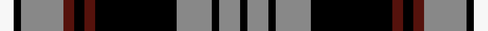

This page is one **sett** — a single exact thread-count. It belongs to the [tartan](/setts/w4k2o12dr3k3dr3k23o10k2o6k2/)
(the same proportion at any scale), whose colour order is pattern [KRKRKBKBRKW](/stripes/krkrkbkbrkw/).

Sourced from house-of-tartan.  It is a [11 stripe tartan](/stripes/stripes11/).

Original link [http://www.house-of-tartan.scotland.net/house/TartanViewjs.asp?colr=Def&tnam=8081](http://www.house-of-tartan.scotland.net/house/TartanViewjs.asp?colr=Def&tnam=8081)

## Provenance

Earliest known date: pre 2007 From a woven sample from the weavers, Marton Mills.

Dataset <small>— provenance for this record, inherited from the source manifest</small>

<dl class="dataset-prov">
<dt>source</dt><dd><a href="/sources/house-of-tartan/">House of Tartan</a></dd>
<dt>data captured from</dt><dd><a href="https://github.com/thetartan/tartan-database/blob/master/data/house-of-tartan/data.csv">https://github.com/thetartan/tartan-database/blob/master/data/house-of-tartan/data.csv</a></dd>
<dt>data date</dt><dd>2017-01-10 <small>(dataset default)</small></dd>
<dt>licence</dt><dd><a href="https://creativecommons.org/licenses/by-nc-nd/4.0/">CC BY-NC-ND 4.0</a></dd>
</dl>

Capture chain <small>— the hands this data passed through, oldest first; each capture carries its own licence</small>

<ol class="capture-chain">
<li><a href="http://www.house-of-tartan.scotland.net/">House of Tartan</a> <small>the weaver/retailer's database — the site is now offline; the URL is kept as the ultimate source's identity</small></li>
<li><a href="https://github.com/thetartan/tartan-database">thetartan/tartan-database</a> <small>2016-2017</small> · <a href="https://creativecommons.org/licenses/by-nc-nd/4.0/">CC BY-NC-ND 4.0</a> <small>Levko Kravets's frozen compilation — the capture we vendored, and where its CC licence text came from</small></li>
<li>this dictionary <small>captured 2026-06-10 · commit 5bf86c7566</small> <small>each re-capture is a git commit to data/sources</small></li>
</ol>

## Thread count
W/8 K4 O24 DR6 K6 DR6 K46 O20 K4 O12 K/4

One full sett is **268 threads**.

## Palette
<table><thead><tr><th>Colour</th><th>Shade</th><th>OKLCh</th></tr></thead><tbody><tr><td>N</td><td><code style="background-color:#3C4C6C;">#3C4C6C</code> <small style="color:#888">#3C4C6C</small></td><td><small style="color:#888">oklch(41.7% 0.058 263.6)</small></td></tr><tr><td>DR</td><td><code style="background-color:#55120C;">#55120C</code> <small style="color:#888">#55120C</small></td><td><small style="color:#888">oklch(30.0% 0.099 29.3)</small></td></tr><tr><td>G</td><td><code style="background-color:#008B2A;">#008B2A</code> <small style="color:#888">#008B2A</small></td><td><small style="color:#888">oklch(55.4% 0.170 145.9)</small></td></tr><tr><td>K</td><td><code style="background-color:#000000;">#000000</code> <small style="color:#888">#000000</small></td><td><small style="color:#888">oklch(0.0% 0.000 0.0)</small></td></tr><tr><td>W</td><td><code style="background-color:#F7F7F7;">#F7F7F7</code> <small style="color:#888">#F7F7F7</small></td><td><small style="color:#888">oklch(97.6% 0.000 89.9)</small></td></tr><tr><td>O</td><td><code style="background-color:#888888;">#888888</code> <small style="color:#888">#888888</small></td><td><small style="color:#888">oklch(62.7% 0.000 89.9)</small></td></tr><tr><td>O</td><td><code style="background-color:#A65C11;">#A65C11</code> <small style="color:#888">#A65C11</small></td><td><small style="color:#888">oklch(55.0% 0.125 58.3)</small></td></tr><tr><td>DP</td><td><code style="background-color:#4B0B4F;">#4B0B4F</code> <small style="color:#888">#4B0B4F</small></td><td><small style="color:#888">oklch(30.1% 0.125 325.4)</small></td></tr></tbody></table>

# Sample pattern

## Nearest tartan variants

The nearest existing variants by ΔTartan distance, with this cloth at the top so the swatches line up against it.

ΔTartan

Threads

Variant

Sett

—

268

<a href="/variants/s11/w4k2o12dr3k3dr3k23o10k2o6k2~x2~o2500000/">Auld Lang Syne, Grey Weavers Tartan</a>

<a href="/ttd/edit/#slug=w4k2n12dr3k3dr3k23n10k2n6k2~x2&amp;base=w4k2o12dr3k3dr3k23o10k2o6k2~x2~o2500000" title="compare in the TTD">0.10</a>

268

<a href="/variants/s11/w4k2n12dr3k3dr3k23n10k2n6k2~x2/">Auld Lang Syne, Grey (Fashion)</a>

<a href="/ttd/edit/#slug=k6lb2n2lb3n2lb2n30k20w6k4~x2~n1900000&amp;base=w4k2o12dr3k3dr3k23o10k2o6k2~x2~o2500000" title="compare in the TTD">1.70</a>

288

<a href="/variants/s10/k6lb2n2lb3n2lb2n30k20w6k4~x2~n1900000/">Nunavut</a>

<a href="/ttd/edit/#slug=k2r1dg10k10lb4k2lb2k2lb5k2lb2~x2&amp;base=w4k2o12dr3k3dr3k23o10k2o6k2~x2~o2500000" title="compare in the TTD">1.72</a>

160

<a href="/variants/s11/k2r1dg10k10lb4k2lb2k2lb5k2lb2~x2/">Bijral</a>

<a href="/ttd/edit/#slug=k6lb2n2lb3n2lb2n30k20w6k4~x2&amp;base=w4k2o12dr3k3dr3k23o10k2o6k2~x2~o2500000" title="compare in the TTD">1.74</a>

288

<a href="/variants/s10/k6lb2n2lb3n2lb2n30k20w6k4~x2/">Nunavut (District)</a>

<a href="/ttd/edit/#slug=ki37w18k37r2k2r2~x2~ki0705267-k0700000&amp;base=w4k2o12dr3k3dr3k23o10k2o6k2~x2~o2500000" title="compare in the TTD">2.23</a>

314

<a href="/variants/s6/ki37w18k37r2k2r2~x2~ki0705267-k0700000/">Hakkarain (Personal)</a>

<a href="/ttd/edit/#slug=w12lb2k5lb2k10lb2k15lb2k20lb2y25lb2~x2&amp;base=w4k2o12dr3k3dr3k23o10k2o6k2~x2~o2500000" title="compare in the TTD">2.28</a>

368

<a href="/variants/s12/w12lb2k5lb2k10lb2k15lb2k20lb2y25lb2~x2/">Liberty Square</a>

<a href="/ttd/edit/#slug=n22k2n2k2n2k16w16k3~x2&amp;base=w4k2o12dr3k3dr3k23o10k2o6k2~x2~o2500000" title="compare in the TTD">2.37</a>

210

<a href="/variants/s8/n22k2n2k2n2k16w16k3~x2/">Laksaa (Manx)</a>

<a href="/ttd/edit/#slug=k21o2k8w2o16n6k2n8~x2&amp;base=w4k2o12dr3k3dr3k23o10k2o6k2~x2~o2500000" title="compare in the TTD">2.41</a>

202

<a href="/variants/s8/k21o2k8w2o16n6k2n8~x2/">Ardmore (Fashion)</a>

<a href="/ttd/edit/#slug=lo32db10k52db10w5k24db16w10k11lo15&amp;base=w4k2o12dr3k3dr3k23o10k2o6k2~x2~o2500000" title="compare in the TTD">2.44</a>

323

<a href="/variants/s10/lo32db10k52db10w5k24db16w10k11lo15/">Cavan County Crest (Fashion)</a>

<a href="/ttd/edit/#slug=k36w3k10w3dg28dr6k18~x2~dg1804158&amp;base=w4k2o12dr3k3dr3k23o10k2o6k2~x2~o2500000" title="compare in the TTD">2.45</a>

308

<a href="/variants/s7/k36w3k10w3dg28dr6k18~x2~dg1804158/">Wild Highlanders</a>

## Neighbour map

Every grey dot is one of 13621 variants placed by the first two principal components of the ΔTartan feature space (42% of its variance). Red is this tartan; blue dots are its nearest — click one to open its page.

<svg viewBox="0 0 640 380" role="img" style="max-width:100%;height:auto;border:1px solid #e0e0e0;border-radius:4px;display:block" xmlns="http://www.w3.org/2000/svg"><image href="/nn/cloud.v1.png" width="640" height="380"/><a href="/variants/s11/w4k2n12dr3k3dr3k23n10k2n6k2~x2/"><circle cx="211.7" cy="150.7" r="4" fill="#3465a4"><title>Auld Lang Syne, Grey (Fashion)</title></circle></a><a href="/variants/s10/k6lb2n2lb3n2lb2n30k20w6k4~x2~n1900000/"><circle cx="205.8" cy="124.9" r="4" fill="#3465a4"><title>Nunavut</title></circle></a><a href="/variants/s11/k2r1dg10k10lb4k2lb2k2lb5k2lb2~x2/"><circle cx="154.4" cy="163.7" r="4" fill="#3465a4"><title>Bijral</title></circle></a><a href="/variants/s10/k6lb2n2lb3n2lb2n30k20w6k4~x2/"><circle cx="205.0" cy="124.8" r="4" fill="#3465a4"><title>Nunavut (District)</title></circle></a><a href="/variants/s6/ki37w18k37r2k2r2~x2~ki0705267-k0700000/"><circle cx="213.9" cy="129.4" r="4" fill="#3465a4"><title>Hakkarain (Personal)</title></circle></a><a href="/variants/s12/w12lb2k5lb2k10lb2k15lb2k20lb2y25lb2~x2/"><circle cx="202.7" cy="145.4" r="4" fill="#3465a4"><title>Liberty Square</title></circle></a><a href="/variants/s8/n22k2n2k2n2k16w16k3~x2/"><circle cx="188.4" cy="177.1" r="4" fill="#3465a4"><title>Laksaa (Manx)</title></circle></a><a href="/variants/s8/k21o2k8w2o16n6k2n8~x2/"><circle cx="195.3" cy="173.2" r="4" fill="#3465a4"><title>Ardmore (Fashion)</title></circle></a><a href="/variants/s10/lo32db10k52db10w5k24db16w10k11lo15/"><circle cx="167.1" cy="174.2" r="4" fill="#3465a4"><title>Cavan County Crest (Fashion)</title></circle></a><a href="/variants/s7/k36w3k10w3dg28dr6k18~x2~dg1804158/"><circle cx="206.5" cy="155.6" r="4" fill="#3465a4"><title>Wild Highlanders</title></circle></a><circle cx="194.7" cy="143.5" r="5" fill="#c00000"/><text x="320" y="376" text-anchor="middle" font-size="11" fill="#999">ground</text><text x="11" y="190" text-anchor="middle" font-size="11" fill="#999" transform="rotate(-90 11 190)">complexity</text></svg>

ID: /variants/s11/w4k2o12dr3k3dr3k23o10k2o6k2~x2~o2500000/
