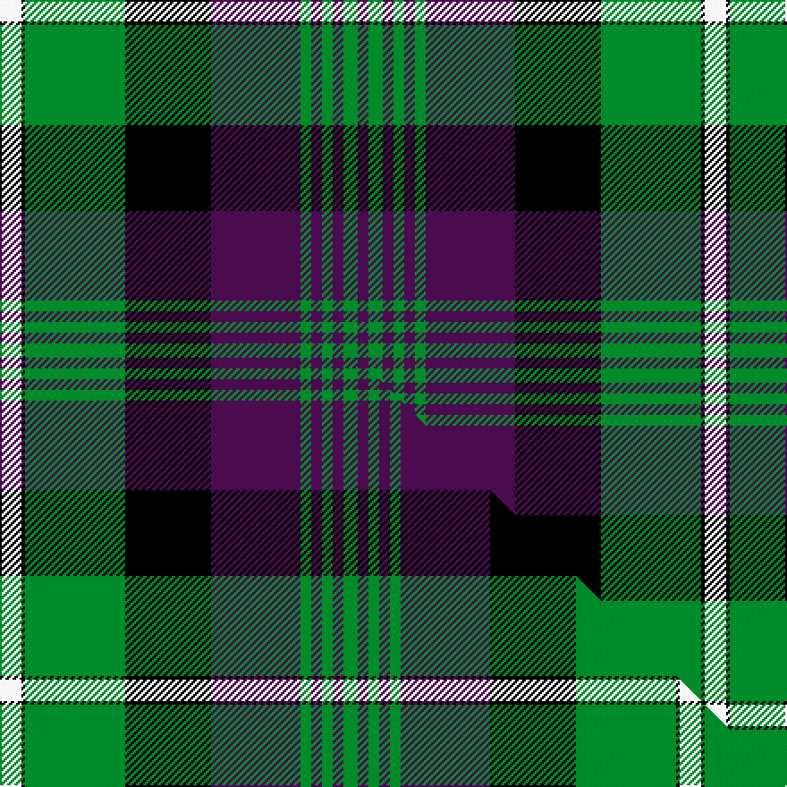

This is one **variant** — a specific cloth: this exact thread count and colourway, with its own
provenance below. It is one weaving of the [sett](/setts/w6k1g28k24dp25g3dp3g3dp3g4dp3/) (the scale-free proportion — the
same cloth at any scale or shade), whose colour order is pattern [BGBGBGBKGKW](/stripes/bgbgbgbkgkw/).

Part of the [Rennie](/tartans/r/re/rennie/) tartan — the named design grouping this sett with its other cloths.

Sourced from tartans-authority.  It is a [11 stripe tartan](/stripes/stripes11/).

Original link [https://www.tartanregister.gov.uk/tartanDetails.aspx?ref=716](https://www.tartanregister.gov.uk/tartanDetails.aspx?ref=716)

Dataset <small>— provenance for this record, inherited from the source manifest</small>

<dl class="dataset-prov">
<dt>source</dt><dd><a href="/sources/tartans-authority/">Scottish Tartans Authority</a></dd>
<dt>data captured from</dt><dd><a href="https://github.com/thetartan/tartan-database/blob/master/data/tartans-authority/data.csv">https://github.com/thetartan/tartan-database/blob/master/data/tartans-authority/data.csv</a></dd>
<dt>data date</dt><dd>1981 <small>(this record)</small></dd>
<dt>licence</dt><dd><a href="https://creativecommons.org/licenses/by-nc-nd/4.0/">CC BY-NC-ND 4.0</a></dd>
</dl>

Capture chain <small>— the hands this data passed through, oldest first; each capture carries its own licence</small>

<ol class="capture-chain">
<li><a href="https://www.tartansauthority.com/">Scottish Tartans Authority</a> <small>the heritage body's archive — its tartan-ferret record browser is retired (links repaired to the SRT, above)</small></li>
<li><a href="https://github.com/thetartan/tartan-database">thetartan/tartan-database</a> <small>2016-2017</small> · <a href="https://creativecommons.org/licenses/by-nc-nd/4.0/">CC BY-NC-ND 4.0</a> <small>Levko Kravets's frozen compilation — the capture we vendored, and where its CC licence text came from</small></li>
<li>this dictionary <small>captured 2026-06-10 · commit 5bf86c7566</small> <small>each re-capture is a git commit to data/sources</small></li>
</ol>

## Register references

External register numbers recorded for this tartan.

- Scottish Tartans Authority (ITI): 716

## Thread count
W/12 K2 G56 K48 DP50 G6 DP6 G6 DP6 G8 DP/6

One full sett is **394 threads**.

## Palette
<table><thead><tr><th>Colour</th><th>Shade</th><th>OKLCh</th></tr></thead><tbody><tr><td>DP</td><td><code style="background-color:#4B0B4F;">#4B0B4F</code> <small style="color:#888">#4B0B4F</small></td><td><small style="color:#888">oklch(30.1% 0.125 325.4)</small></td></tr><tr><td>W</td><td><code style="background-color:#F7F7F7;">#F7F7F7</code> <small style="color:#888">#F7F7F7</small></td><td><small style="color:#888">oklch(97.6% 0.000 89.9)</small></td></tr><tr><td>G</td><td><code style="background-color:#008B2A;">#008B2A</code> <small style="color:#888">#008B2A</small></td><td><small style="color:#888">oklch(55.4% 0.170 145.9)</small></td></tr><tr><td>K</td><td><code style="background-color:#000000;">#000000</code> <small style="color:#888">#000000</small></td><td><small style="color:#888">oklch(0.0% 0.000 0.0)</small></td></tr></tbody></table>

# Sample pattern

## Compared to the master

This cloth is one sett of its design; the master sett (the exemplar the design is anchored on) is below for comparison.

Its **ΔTartan distance** from the master is **1.05** — the same measure the nearest-tartans table ranks by (0 is identical; a re-scale of the same cloth is near 0, a recolour or a different proportion further).

<figure class="master-compare" style="margin:0">

this sett
master sett ★

<figcaption style="color:#888;font-size:smaller">One weave of this sett against the <a href="/setts/w6k1g28k24dp25g3dp3g3dp3g4/">master sett ★</a>, split on the diagonal: a shared proportion runs seamlessly across it with only the shades shifting; a different proportion breaks on it.</figcaption>
</figure>

## Nearest tartan variants

The nearest existing variants by ΔTartan distance, with this cloth at the top so the swatches line up against it.

ΔTartan

Threads

Variant

Sett

—

394

<a href="/variants/s11/w6k1g28k24dp25g3dp3g3dp3g4dp3~x2/">Rennie (Name)</a>

<a href="/ttd/edit/#slug=w6k1g28k24dp25g3dp3g3dp3g4~x2&amp;base=w6k1g28k24dp25g3dp3g3dp3g4dp3~x2" title="compare in the TTD">1.05</a>

380

<a href="/variants/s10/w6k1g28k24dp25g3dp3g3dp3g4~x2/">Rennie (Personal)</a>

<a href="/ttd/edit/#slug=w6k1g29k23dp27g3dp3g3dp3g4~x2&amp;base=w6k1g28k24dp25g3dp3g3dp3g4dp3~x2" title="compare in the TTD">1.08</a>

388

<a href="/variants/s10/w6k1g29k23dp27g3dp3g3dp3g4~x2/">Rennie Family Tartan</a>

<a href="/ttd/edit/#slug=k9o2k2n2o18n2k2r1k20n33r2~x2~o2500000-n1900000&amp;base=w6k1g28k24dp25g3dp3g3dp3g4dp3~x2" title="compare in the TTD">1.76</a>

350

<a href="/variants/s11/k9o2k2n2o18n2k2r1k20n33r2~x2~o2500000-n1900000/">Pride of Scotland Silver</a>

<a href="/ttd/edit/#slug=y3k1g22k20dp20g2dp2g2dp2g3~x4&amp;base=w6k1g28k24dp25g3dp3g3dp3g4dp3~x2" title="compare in the TTD">1.92</a>

592

<a href="/variants/s10/y3k1g22k20dp20g2dp2g2dp2g3~x4/">Urbino (Fashion)</a>

<a href="/ttd/edit/#slug=y3k1g22k20dp20g2dp2g2dp2g3~x4~dp1607327&amp;base=w6k1g28k24dp25g3dp3g3dp3g4dp3~x2" title="compare in the TTD">1.92</a>

592

<a href="/variants/s10/y3k1g22k20dp20g2dp2g2dp2g3~x4~dp1607327/">Urbino</a>

<a href="/ttd/edit/#slug=db17r2db2r6db32r2k34g32r6g2r2g17~x2&amp;base=w6k1g28k24dp25g3dp3g3dp3g4dp3~x2" title="compare in the TTD">2.21</a>

548

<a href="/variants/s12/db17r2db2r6db32r2k34g32r6g2r2g17~x2/">MacDonald #4</a>

<a href="/ttd/edit/#slug=r3k2db25k28g25k2r1db2~x2&amp;base=w6k1g28k24dp25g3dp3g3dp3g4dp3~x2" title="compare in the TTD">2.42</a>

342

<a href="/variants/s8/r3k2db25k28g25k2r1db2~x2/">Common Kilt Tartan</a>

<a href="/ttd/edit/#slug=dr4db12k18db4y22lb1y2lb2y3lb2~x4&amp;base=w6k1g28k24dp25g3dp3g3dp3g4dp3~x2" title="compare in the TTD">2.42</a>

536

<a href="/variants/s10/dr4db12k18db4y22lb1y2lb2y3lb2~x4/">Windsor</a>

<a href="/ttd/edit/#slug=db30k2db2k2db2k32g15r2g4r4g30~x2&amp;base=w6k1g28k24dp25g3dp3g3dp3g4dp3~x2" title="compare in the TTD">2.42</a>

380

<a href="/variants/s11/db30k2db2k2db2k32g15r2g4r4g30~x2/">Scottish Tourist Board (1981) (Corp)</a>

<a href="/ttd/edit/#slug=db16r2db2r5db29r2k31g29r5g2r2g16~x2&amp;base=w6k1g28k24dp25g3dp3g3dp3g4dp3~x2" title="compare in the TTD">2.45</a>

500

<a href="/variants/s12/db16r2db2r5db29r2k31g29r5g2r2g16~x2/">MacDonald #3</a>

## Neighbour map

Every grey dot is one of 13656 variants placed by the first two principal components of the ΔTartan feature space (42% of its variance). Red is this tartan; blue dots are its nearest — click one to open its page. The map is a flat projection of a many-dimensional space — [how to read it](/posts/neighbourhood-maps/).

<svg viewBox="0 0 640 380" role="img" style="max-width:100%;height:auto;border:1px solid #e0e0e0;border-radius:4px;display:block" xmlns="http://www.w3.org/2000/svg"><image href="/nn/cloud.v1.png" width="640" height="380"/><a href="/variants/s10/w6k1g28k24dp25g3dp3g3dp3g4~x2/"><circle cx="189.8" cy="119.0" r="4" fill="#3465a4"><title>Rennie (Personal)</title></circle></a><a href="/variants/s10/w6k1g29k23dp27g3dp3g3dp3g4~x2/"><circle cx="194.5" cy="117.0" r="4" fill="#3465a4"><title>Rennie Family Tartan</title></circle></a><a href="/variants/s11/k9o2k2n2o18n2k2r1k20n33r2~x2~o2500000-n1900000/"><circle cx="225.3" cy="97.1" r="4" fill="#3465a4"><title>Pride of Scotland Silver</title></circle></a><a href="/variants/s10/y3k1g22k20dp20g2dp2g2dp2g3~x4/"><circle cx="200.4" cy="126.7" r="4" fill="#3465a4"><title>Urbino (Fashion)</title></circle></a><a href="/variants/s10/y3k1g22k20dp20g2dp2g2dp2g3~x4~dp1607327/"><circle cx="182.0" cy="102.7" r="4" fill="#3465a4"><title>Urbino</title></circle></a><a href="/variants/s12/db17r2db2r6db32r2k34g32r6g2r2g17~x2/"><circle cx="152.3" cy="138.3" r="4" fill="#3465a4"><title>MacDonald #4</title></circle></a><a href="/variants/s8/r3k2db25k28g25k2r1db2~x2/"><circle cx="199.4" cy="128.9" r="4" fill="#3465a4"><title>Common Kilt Tartan</title></circle></a><a href="/variants/s10/dr4db12k18db4y22lb1y2lb2y3lb2~x4/"><circle cx="171.3" cy="118.6" r="4" fill="#3465a4"><title>Windsor</title></circle></a><a href="/variants/s11/db30k2db2k2db2k32g15r2g4r4g30~x2/"><circle cx="185.2" cy="137.2" r="4" fill="#3465a4"><title>Scottish Tourist Board (1981) (Corp)</title></circle></a><a href="/variants/s12/db16r2db2r5db29r2k31g29r5g2r2g16~x2/"><circle cx="150.4" cy="142.3" r="4" fill="#3465a4"><title>MacDonald #3</title></circle></a><circle cx="188.0" cy="112.9" r="5" fill="#c00000"/><text x="320" y="376" text-anchor="middle" font-size="11" fill="#999">ground</text><text x="11" y="190" text-anchor="middle" font-size="11" fill="#999" transform="rotate(-90 11 190)">complexity</text></svg>

ID: /variants/s11/w6k1g28k24dp25g3dp3g3dp3g4dp3~x2/
