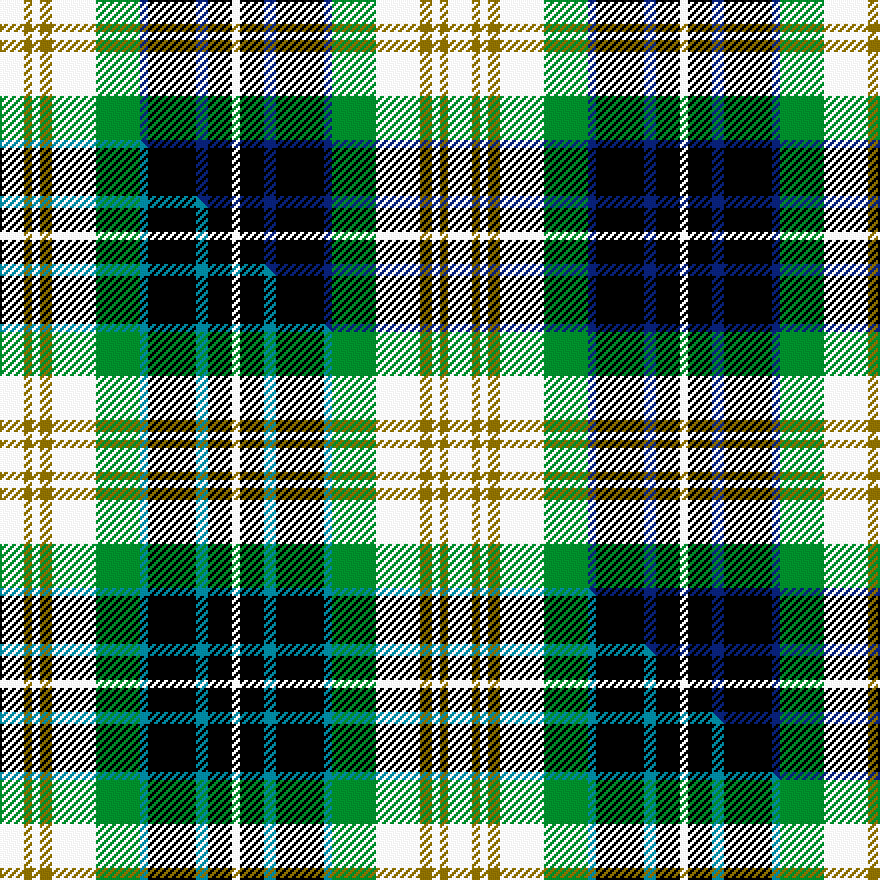

This page is one **sett** — a single exact thread-count. It belongs to the [tartan](/setts/w6y2w2y3w11g11db2k12db3k6w2/)
(the same proportion at any scale), whose colour order is pattern [WGWGWGBKBKW](/stripes/wgwgwgbkbkw/).

Part of the [Fitzpatrick](/tartans/fitzpatrick/) tartan — the named design grouping this sett with its other cloths.

Sourced from weddslist.  It is a [11 stripe tartan](/stripes/stripes11/).

Original link http://www.weddslist.com/cgi-bin/tartans/pg.pl?source=sts

Dataset <small>— provenance for this record, inherited from the source manifest</small>

<dl class="dataset-prov">
<dt>source</dt><dd><a href="/sources/weddslist/">Weddslist</a></dd>
<dt>data captured from</dt><dd><a href="https://github.com/thetartan/tartan-database/blob/master/data/weddslist/data.csv">https://github.com/thetartan/tartan-database/blob/master/data/weddslist/data.csv</a></dd>
<dt>data date</dt><dd>2016-11-17 <small>(dataset default)</small></dd>
<dt>licence</dt><dd><a href="https://creativecommons.org/licenses/by-nc-nd/4.0/">CC BY-NC-ND 4.0</a></dd>
</dl>

Capture chain <small>— the hands this data passed through, oldest first; each capture carries its own licence</small>

<ol class="capture-chain">
<li><a href="https://www.weddslist.com/tartans/">Weddslist</a> <small>the living privately compiled reference</small></li>
<li><a href="https://github.com/thetartan/tartan-database">thetartan/tartan-database</a> <small>2016-2017</small> · <a href="https://creativecommons.org/licenses/by-nc-nd/4.0/">CC BY-NC-ND 4.0</a> <small>Levko Kravets's frozen compilation — the capture we vendored, and where its CC licence text came from</small></li>
<li>this dictionary <small>captured 2026-06-10 · commit 5bf86c7566</small> <small>each re-capture is a git commit to data/sources</small></li>
</ol>

## Thread count
W/12 Y4 W4 Y6 W22 G22 DB4 K24 DB6 K12 W/4

One full sett is **224 threads**.

## Palette
<table><thead><tr><th>Colour</th><th>Shade</th><th>OKLCh</th></tr></thead><tbody><tr><td>DB</td><td><code style="background-color:#082077;">#082077</code> <small style="color:#888">#082077</small></td><td><small style="color:#888">oklch(30.0% 0.149 265.1)</small></td></tr><tr><td>G</td><td><code style="background-color:#008B2A;">#008B2A</code> <small style="color:#888">#008B2A</small></td><td><small style="color:#888">oklch(55.4% 0.170 145.9)</small></td></tr><tr><td>K</td><td><code style="background-color:#000000;">#000000</code> <small style="color:#888">#000000</small></td><td><small style="color:#888">oklch(0.0% 0.000 0.0)</small></td></tr><tr><td>W</td><td><code style="background-color:#F7F7F7;">#F7F7F7</code> <small style="color:#888">#F7F7F7</small></td><td><small style="color:#888">oklch(97.6% 0.000 89.9)</small></td></tr><tr><td>Y</td><td><code style="background-color:#8B6E00;">#8B6E00</code> <small style="color:#888">#8B6E00</small></td><td><small style="color:#888">oklch(55.1% 0.113 90.4)</small></td></tr></tbody></table>

# Sample pattern

## Compared to the master

This cloth is one sett of its design; the master sett (the exemplar the design is anchored on) is below for comparison.

Its **ΔTartan distance** from the master is **0.05** — the same measure the nearest-tartans table ranks by (0 is identical; a re-scale of the same cloth is near 0, a recolour or a different proportion further).

<figure class="master-compare" style="margin:0">

this sett
master sett ★

<figcaption style="color:#888;font-size:smaller">One weave of this sett against the <a href="/setts/w6y2w2y3w11g11t2k12t3k6w2/">master sett ★</a>, split on the diagonal: a shared proportion runs seamlessly across it with only the shades shifting; a different proportion breaks on it.</figcaption>
</figure>

## Nearest tartan variants

The nearest existing variants by ΔTartan distance, with this cloth at the top so the swatches line up against it.

ΔTartan

Threads

Variant

Sett

—

224

<a href="/variants/s11/w6y2w2y3w11g11db2k12db3k6w2~x2/">Fitzpatrick</a>

<a href="/ttd/edit/#slug=w6y2w2y3w11g11t2k12t3k6w2~x2&amp;base=w6y2w2y3w11g11db2k12db3k6w2~x2" title="compare in the TTD">0.05</a>

224

<a href="/variants/s11/w6y2w2y3w11g11t2k12t3k6w2~x2/">Fitzpatrick</a>

<a href="/ttd/edit/#slug=k4g4k2g12k6w3k6n2w4n2w15r3~x2&amp;base=w6y2w2y3w11g11db2k12db3k6w2~x2" title="compare in the TTD">1.28</a>

238

<a href="/variants/s12/k4g4k2g12k6w3k6n2w4n2w15r3~x2/">Hayama Shirt Honten, The</a>

<a href="/ttd/edit/#slug=k4g4k2g14k6w3k6n2w4n2w15r3~x2&amp;base=w6y2w2y3w11g11db2k12db3k6w2~x2" title="compare in the TTD">1.44</a>

246

<a href="/variants/s12/k4g4k2g14k6w3k6n2w4n2w15r3~x2/">Hayama Shirt Honten, The</a>

<a href="/ttd/edit/#slug=w20k3w3k3w3k16g17y5g17k16db16k3db3~x2&amp;base=w6y2w2y3w11g11db2k12db3k6w2~x2" title="compare in the TTD">1.86</a>

454

<a href="/variants/s13/w20k3w3k3w3k16g17y5g17k16db16k3db3~x2/">Gordon Dress #2</a>

<a href="/ttd/edit/#slug=db12w2db2r2db3k11g12k2g3k2g12db12w13r2~x2~db1004274&amp;base=w6y2w2y3w11g11db2k12db3k6w2~x2" title="compare in the TTD">1.95</a>

332

<a href="/variants/s14/db12w2db2r2db3k11g12k2g3k2g12db12w13r2~x2~db1004274/">Scottish National Dress</a>

<a href="/ttd/edit/#slug=w3k2w7k2w2k7g8k1w2k1g8k7db7r2~x2&amp;base=w6y2w2y3w11g11db2k12db3k6w2~x2" title="compare in the TTD">1.99</a>

226

<a href="/variants/s14/w3k2w7k2w2k7g8k1w2k1g8k7db7r2~x2/">MacKenzie Dress - 1950 (Clan)</a>

<a href="/ttd/edit/#slug=y5g2r2g12k9lb12r2lb2r2lb2~x2&amp;base=w6y2w2y3w11g11db2k12db3k6w2~x2" title="compare in the TTD">1.99</a>

186

<a href="/variants/s10/y5g2r2g12k9lb12r2lb2r2lb2~x2/">Lobban (Personal)</a>

<a href="/ttd/edit/#slug=db12w2db2r2db3k11g12k2g3k2g12db12w13r2~x2&amp;base=w6y2w2y3w11g11db2k12db3k6w2~x2" title="compare in the TTD">2.23</a>

332

<a href="/variants/s14/db12w2db2r2db3k11g12k2g3k2g12db12w13r2~x2/">Scotland's National, Dress (Fashion)</a>

<a href="/ttd/edit/#slug=g12dt3g3dt3g3k15lb20b3~x2~dt1204274-b2308259&amp;base=w6y2w2y3w11g11db2k12db3k6w2~x2" title="compare in the TTD">2.31</a>

218

<a href="/variants/s8/g12db3g3db3g3k15lb20t3~x2~db1204274-t2308259/">Lemania</a>

<a href="/ttd/edit/#slug=dg17lb3dg17k15w33db8w33k15dg17lb3dg17lb3~x2&amp;base=w6y2w2y3w11g11db2k12db3k6w2~x2" title="compare in the TTD">2.33</a>

684

<a href="/variants/s12/dg17lb3dg17k15w33db8w33k15dg17lb3dg17lb3~x2/">MacRobart Family Tartan</a>

## Neighbour map

Every grey dot is one of 13620 variants placed by the first two principal components of the ΔTartan feature space (42% of its variance). Red is this tartan; blue dots are its nearest — click one to open its page.

<svg viewBox="0 0 640 380" role="img" style="max-width:100%;height:auto;border:1px solid #e0e0e0;border-radius:4px;display:block" xmlns="http://www.w3.org/2000/svg"><image href="/nn/cloud.v1.png" width="640" height="380"/><a href="/variants/s11/w6y2w2y3w11g11t2k12t3k6w2~x2/"><circle cx="61.3" cy="185.7" r="4" fill="#3465a4"><title>Fitzpatrick</title></circle></a><a href="/variants/s12/k4g4k2g12k6w3k6n2w4n2w15r3~x2/"><circle cx="71.1" cy="166.7" r="4" fill="#3465a4"><title>Hayama Shirt Honten, The</title></circle></a><a href="/variants/s12/k4g4k2g14k6w3k6n2w4n2w15r3~x2/"><circle cx="70.5" cy="164.3" r="4" fill="#3465a4"><title>Hayama Shirt Honten, The</title></circle></a><a href="/variants/s13/w20k3w3k3w3k16g17y5g17k16db16k3db3~x2/"><circle cx="51.3" cy="173.8" r="4" fill="#3465a4"><title>Gordon Dress #2</title></circle></a><a href="/variants/s14/db12w2db2r2db3k11g12k2g3k2g12db12w13r2~x2~db1004274/"><circle cx="57.6" cy="169.5" r="4" fill="#3465a4"><title>Scottish National Dress</title></circle></a><a href="/variants/s14/w3k2w7k2w2k7g8k1w2k1g8k7db7r2~x2/"><circle cx="54.6" cy="169.0" r="4" fill="#3465a4"><title>MacKenzie Dress - 1950 (Clan)</title></circle></a><a href="/variants/s10/y5g2r2g12k9lb12r2lb2r2lb2~x2/"><circle cx="72.0" cy="181.9" r="4" fill="#3465a4"><title>Lobban (Personal)</title></circle></a><a href="/variants/s14/db12w2db2r2db3k11g12k2g3k2g12db12w13r2~x2/"><circle cx="56.9" cy="170.5" r="4" fill="#3465a4"><title>Scotland's National, Dress (Fashion)</title></circle></a><a href="/variants/s8/g12db3g3db3g3k15lb20t3~x2~db1204274-t2308259/"><circle cx="81.6" cy="185.9" r="4" fill="#3465a4"><title>Lemania</title></circle></a><a href="/variants/s12/dg17lb3dg17k15w33db8w33k15dg17lb3dg17lb3~x2/"><circle cx="98.3" cy="165.5" r="4" fill="#3465a4"><title>MacRobart Family Tartan</title></circle></a><circle cx="61.3" cy="184.8" r="5" fill="#c00000"/><text x="320" y="376" text-anchor="middle" font-size="11" fill="#999">ground</text><text x="11" y="190" text-anchor="middle" font-size="11" fill="#999" transform="rotate(-90 11 190)">complexity</text></svg>

ID: /variants/s11/w6y2w2y3w11g11db2k12db3k6w2~x2/
