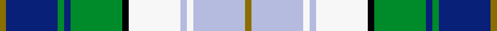

This is one **variant** — a specific cloth: this exact thread count and colourway, with its own
provenance below. It is one weaving of the [sett](/setts/y1db8g1db1g8k1w8lb1w1lb8y1/) (the scale-free proportion — the
same cloth at any scale or shade), whose colour order is pattern [GBGBGKWWWWG](/stripes/gbgbgkwwwwg/).

Sourced from register-of-tartans.  It is a [11 stripe tartan](/stripes/stripes11/).

Original link [https://www.tartanregister.gov.uk/tartanDetails.aspx?ref=3539](https://www.tartanregister.gov.uk/tartanDetails.aspx?ref=3539)

Dataset <small>— provenance for this record, inherited from the source manifest</small>

<dl class="dataset-prov">
<dt>source</dt><dd><a href="/sources/register-of-tartans/">Scottish Register of Tartans</a></dd>
<dt>data captured from</dt><dd><a href="https://github.com/thetartan/tartan-database/blob/master/data/register-of-tartans/data.csv">https://github.com/thetartan/tartan-database/blob/master/data/register-of-tartans/data.csv</a></dd>
<dt>data date</dt><dd>27/01/2005 <small>(this record)</small></dd>
<dt>licence</dt><dd><a href="https://www.tartanregister.gov.uk/copyright">Crown copyright</a></dd>
</dl>

Capture chain <small>— the hands this data passed through, oldest first; each capture carries its own licence</small>

<ol class="capture-chain">
<li><a href="https://www.tartanregister.gov.uk/">Scottish Register of Tartans</a> · <a href="https://www.tartanregister.gov.uk/copyright">Crown copyright</a> <small>the living register — still published by National Records of Scotland</small></li>
<li><a href="https://github.com/thetartan/tartan-database">thetartan/tartan-database</a> <small>2016-2017</small> · <a href="https://creativecommons.org/licenses/by-nc-nd/4.0/">CC BY-NC-ND 4.0</a> <small>Levko Kravets's frozen compilation — the capture we vendored, and where its CC licence text came from</small></li>
<li>this dictionary <small>captured 2026-06-10 · commit 5bf86c7566</small> <small>each re-capture is a git commit to data/sources</small></li>
</ol>

## Register references

External register numbers recorded for this tartan.

- Scottish Register of Tartans: [3539](https://www.tartanregister.gov.uk/tartanDetails.aspx?ref=3539)
- Scottish Tartans Authority (ITI): 6722
- Scottish Tartans World Register: 3037

## Thread count
Y/4 DB32 G4 DB4 G32 K4 W32 LB4 W4 LB32 Y/4

One full sett is **304 threads**.

## Palette
<table><thead><tr><th>Colour</th><th>Shade</th><th>OKLCh</th></tr></thead><tbody><tr><td>LB</td><td><code style="background-color:#B5BBDE;">#B5BBDE</code> <small style="color:#888">#B5BBDE</small></td><td><small style="color:#888">oklch(79.9% 0.050 277.6)</small></td></tr><tr><td>DB</td><td><code style="background-color:#082077;">#082077</code> <small style="color:#888">#082077</small></td><td><small style="color:#888">oklch(30.0% 0.149 265.1)</small></td></tr><tr><td>G</td><td><code style="background-color:#008B2A;">#008B2A</code> <small style="color:#888">#008B2A</small></td><td><small style="color:#888">oklch(55.4% 0.170 145.9)</small></td></tr><tr><td>K</td><td><code style="background-color:#000000;">#000000</code> <small style="color:#888">#000000</small></td><td><small style="color:#888">oklch(0.0% 0.000 0.0)</small></td></tr><tr><td>W</td><td><code style="background-color:#F7F7F7;">#F7F7F7</code> <small style="color:#888">#F7F7F7</small></td><td><small style="color:#888">oklch(97.6% 0.000 89.9)</small></td></tr><tr><td>Y</td><td><code style="background-color:#8B6E00;">#8B6E00</code> <small style="color:#888">#8B6E00</small></td><td><small style="color:#888">oklch(55.1% 0.113 90.4)</small></td></tr></tbody></table>

# Sample pattern

## Nearest tartan variants

The nearest existing variants by ΔTartan distance, with this cloth at the top so the swatches line up against it.

ΔTartan

Threads

Variant

Sett

—

304

<a href="/variants/s11/y1db8g1db1g8k1w8lb1w1lb8y1~x4/">Robinson, Barbara Ann (Personal)</a>

<a href="/ttd/edit/#slug=y4db22g3k3g3k3g12w22k2r3~x2&amp;base=y1db8g1db1g8k1w8lb1w1lb8y1~x4" title="compare in the TTD">2.30</a>

294

<a href="/variants/s10/y4db22g3k3g3k3g12w22k2r3~x2/">Californian MacLeod</a>

<a href="/ttd/edit/#slug=y4t25g3k3g3k3g13w24k2r3~x2&amp;base=y1db8g1db1g8k1w8lb1w1lb8y1~x4" title="compare in the TTD">2.56</a>

318

<a href="/variants/s10/y4t25g3k3g3k3g13w24k2r3~x2/">MacLeod Special Dress (Dance)</a>

<a href="/ttd/edit/#slug=y4db25g3k3g3k3g13w24k2r3~x2&amp;base=y1db8g1db1g8k1w8lb1w1lb8y1~x4" title="compare in the TTD">2.65</a>

318

<a href="/variants/s10/y4db25g3k3g3k3g13w24k2r3~x2/">MacLeod, Californian</a>

<a href="/ttd/edit/#slug=ly5lb14k3ly7g3k3g7k6db24w3~x2&amp;base=y1db8g1db1g8k1w8lb1w1lb8y1~x4" title="compare in the TTD">2.98</a>

284

<a href="/variants/s10/ly5lb14k3ly7g3k3g7k6db24w3~x2/">Kagame (Personal)</a>

<a href="/ttd/edit/#slug=w4dy4k3dy9g13k3w3k3w3k9y4lb20w3~x2&amp;base=y1db8g1db1g8k1w8lb1w1lb8y1~x4" title="compare in the TTD">3.00</a>

310

<a href="/variants/s13/w4dy4k3dy9g13k3w3k3w3k9y4lb20w3~x2/">Clodagh/Cork</a>

<a href="/ttd/edit/#slug=w6g6w6g12lb8g14ly24k4lb4k4dp44w12g20k4lb5&amp;base=y1db8g1db1g8k1w8lb1w1lb8y1~x4" title="compare in the TTD">3.11</a>

335

<a href="/variants/s15/w6g6w6g12lb8g14ly24k4lb4k4dp44w12g20k4lb5/">Wexford County Crest (Fashion)</a>

<a href="/ttd/edit/#slug=r3k1lb10k1g2k1db8g12k1y3~x2&amp;base=y1db8g1db1g8k1w8lb1w1lb8y1~x4" title="compare in the TTD">3.17</a>

156

<a href="/variants/s10/r3k1lb10k1g2k1db8g12k1y3~x2/">Sullivan (Estimated threadcount)</a>

<a href="/ttd/edit/#slug=g5db22g6k10w24y2db2w2r2~x2&amp;base=y1db8g1db1g8k1w8lb1w1lb8y1~x4" title="compare in the TTD">3.29</a>

286

<a href="/variants/s9/g5db22g6k10w24y2db2w2r2~x2/">Haymarket Dress Blue Trade Tartan</a>

<a href="/ttd/edit/#slug=lb4r4lb12w12k4g4db8r1w1db1y1~x2&amp;base=y1db8g1db1g8k1w8lb1w1lb8y1~x4" title="compare in the TTD">3.31</a>

198

<a href="/variants/s11/lb4r4lb12w12k4g4db8r1w1db1y1~x2/">Arisaig NS Canada</a>

<a href="/ttd/edit/#slug=lyi3ly3lyi12k2ly2lo2ly8k2db12dp8k2dp2~x2~lyi3202083-ly2804101&amp;base=y1db8g1db1g8k1w8lb1w1lb8y1~x4" title="compare in the TTD">3.33</a>

222

<a href="/variants/s12/lyi3ly3lyi12k2ly2lo2ly8k2db12dp8k2dp2~x2~lyi3202083-ly2804101/">Merise and Lars (Personal)</a>

## Neighbour map

Every grey dot is one of 13621 variants placed by the first two principal components of the ΔTartan feature space (42% of its variance). Red is this tartan; blue dots are its nearest — click one to open its page.

<svg viewBox="0 0 640 380" role="img" style="max-width:100%;height:auto;border:1px solid #e0e0e0;border-radius:4px;display:block" xmlns="http://www.w3.org/2000/svg"><image href="/nn/cloud.v1.png" width="640" height="380"/><a href="/variants/s10/y4db22g3k3g3k3g12w22k2r3~x2/"><circle cx="59.1" cy="130.1" r="4" fill="#3465a4"><title>Californian MacLeod</title></circle></a><a href="/variants/s10/y4t25g3k3g3k3g13w24k2r3~x2/"><circle cx="83.0" cy="128.5" r="4" fill="#3465a4"><title>MacLeod Special Dress (Dance)</title></circle></a><a href="/variants/s10/y4db25g3k3g3k3g13w24k2r3~x2/"><circle cx="72.7" cy="121.7" r="4" fill="#3465a4"><title>MacLeod, Californian</title></circle></a><a href="/variants/s10/ly5lb14k3ly7g3k3g7k6db24w3~x2/"><circle cx="47.3" cy="153.7" r="4" fill="#3465a4"><title>Kagame (Personal)</title></circle></a><a href="/variants/s13/w4dy4k3dy9g13k3w3k3w3k9y4lb20w3~x2/"><circle cx="14.0" cy="154.5" r="4" fill="#3465a4"><title>Clodagh/Cork</title></circle></a><a href="/variants/s15/w6g6w6g12lb8g14ly24k4lb4k4dp44w12g20k4lb5/"><circle cx="55.0" cy="125.3" r="4" fill="#3465a4"><title>Wexford County Crest (Fashion)</title></circle></a><a href="/variants/s10/r3k1lb10k1g2k1db8g12k1y3~x2/"><circle cx="89.2" cy="135.7" r="4" fill="#3465a4"><title>Sullivan (Estimated threadcount)</title></circle></a><a href="/variants/s9/g5db22g6k10w24y2db2w2r2~x2/"><circle cx="93.1" cy="130.2" r="4" fill="#3465a4"><title>Haymarket Dress Blue Trade Tartan</title></circle></a><a href="/variants/s11/lb4r4lb12w12k4g4db8r1w1db1y1~x2/"><circle cx="44.4" cy="123.4" r="4" fill="#3465a4"><title>Arisaig NS Canada</title></circle></a><a href="/variants/s12/lyi3ly3lyi12k2ly2lo2ly8k2db12dp8k2dp2~x2~lyi3202083-ly2804101/"><circle cx="27.2" cy="166.4" r="4" fill="#3465a4"><title>Merise and Lars (Personal)</title></circle></a><circle cx="39.5" cy="151.3" r="5" fill="#c00000"/><text x="320" y="376" text-anchor="middle" font-size="11" fill="#999">ground</text><text x="11" y="190" text-anchor="middle" font-size="11" fill="#999" transform="rotate(-90 11 190)">complexity</text></svg>

ID: /variants/s11/y1db8g1db1g8k1w8lb1w1lb8y1~x4/
