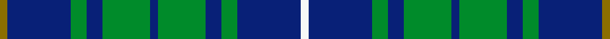

This page is one **sett** — a single exact thread-count. It belongs to the [tartan](/setts/y1db8g2db2g6db1g6db2g2db8w1/)
(the same proportion at any scale), whose colour order is pattern [GBGBGBGBGBW](/stripes/gbgbgbgbgbw/).

Sourced from register-of-tartans.  It is a [11 stripe tartan](/stripes/stripes11/).

Original link https://www.tartanregister.gov.uk/tartanDetails.aspx?ref=400

2 attestations — the source records this cloth was collapsed from (oldest owns this page)

<ul>
<li>01/01/2006 — Bruce (Personal) (register-of-tartans, <a href="https://www.tartanregister.gov.uk/tartanDetails.aspx?ref=400">record</a>)  <em>A personal tartan designed for the wedding of the designer to Miss Shalini Bodani on 15th July 2006. Robert had the choice of wearing a Bruce or a Gordon tartan, and replaced the red in the Bruce with the blue from the Gordon. This tartan was originally woven by Celtic Crafts in Edinburgh.</em></li>
<li>2006 — Bruce (Personal) (tartans-authority, <a href="http://www.tartansauthority.com/tartan-ferret/display/6832/">record</a>)  <em>A personal tartan designed by a Robert Bruce for his wedding. Robert had the choice of wearing a Bruce or a Gordon and replaced the red in the Bruce with the blue from the Gordon.</em></li>
</ul>

## Register references

External register numbers recorded for this tartan.

- Scottish Register of Tartans: [400](https://www.tartanregister.gov.uk/tartanDetails.aspx?ref=400)
- Scottish Tartans Authority (ITI): 6832

## Thread count
Y/4 DB32 G8 DB8 G24 DB4 G24 DB8 G8 DB32 W/4

One full sett is **304 threads**.

## Palette
<table><thead><tr><th>Colour</th><th>Shade</th><th>OKLCh</th></tr></thead><tbody><tr><td>DB</td><td><code style="background-color:#082077;">#082077</code> <small style="color:#888">#082077</small></td><td><small style="color:#888">oklch(30.0% 0.149 265.1)</small></td></tr><tr><td>G</td><td><code style="background-color:#008B2A;">#008B2A</code> <small style="color:#888">#008B2A</small></td><td><small style="color:#888">oklch(55.4% 0.170 145.9)</small></td></tr><tr><td>R</td><td><code style="background-color:#D60020;">#D60020</code> <small style="color:#888">#D60020</small></td><td><small style="color:#888">oklch(55.2% 0.224 25.5)</small></td></tr><tr><td>W</td><td><code style="background-color:#F7F7F7;">#F7F7F7</code> <small style="color:#888">#F7F7F7</small></td><td><small style="color:#888">oklch(97.6% 0.000 89.9)</small></td></tr><tr><td>Y</td><td><code style="background-color:#8B6E00;">#8B6E00</code> <small style="color:#888">#8B6E00</small></td><td><small style="color:#888">oklch(55.1% 0.113 90.4)</small></td></tr></tbody></table>

# Sample pattern

## Nearest tartan variants

The nearest existing variants by ΔTartan distance, with this cloth at the top so the swatches line up against it.

ΔTartan

Threads

Variant

Sett

—

304

<a href="/variants/s11/y1db8g2db2g6db1g6db2g2db8w1~x4/">Bruce (Personal)</a>

<a href="/ttd/edit/#slug=g7r4g14db10g5db10w2db10g5db5~x2&amp;base=y1db8g2db2g6db1g6db2g2db8w1~x4" title="compare in the TTD">1.76</a>

264

<a href="/variants/s10/g7r4g14db10g5db10w2db10g5db5~x2/">Edmonstone (Clan)</a>

<a href="/ttd/edit/#slug=dr3g3db3g14db3g3db3lb5db18y2db8y2~x2&amp;base=y1db8g2db2g6db1g6db2g2db8w1~x4" title="compare in the TTD">2.47</a>

258

<a href="/variants/s12/dr3g3db3g14db3g3db3lb5db18y2db8y2~x2/">California Burns (Personal)</a>

<a href="/ttd/edit/#slug=r1g8db2g2db6g1db6g2db2g8y1~x4&amp;base=y1db8g2db2g6db1g6db2g2db8w1~x4" title="compare in the TTD">2.84</a>

304

<a href="/variants/s11/r1g8db2g2db6g1db6g2db2g8y1~x4/">Bruce of Crionaich (Personal)</a>

<a href="/ttd/edit/#slug=g21db4w4db32g12y4g8r4g6db12&amp;base=y1db8g2db2g6db1g6db2g2db8w1~x4" title="compare in the TTD">2.98</a>

181

<a href="/variants/s10/g21db4w4db32g12y4g8r4g6db12/">Harkness Hunting</a>

## Neighbour map

Every grey dot is one of 13620 variants placed by the first two principal components of the ΔTartan feature space (42% of its variance). Red is this tartan; blue dots are its nearest — click one to open its page.

<svg viewBox="0 0 640 380" role="img" style="max-width:100%;height:auto;border:1px solid #e0e0e0;border-radius:4px;display:block" xmlns="http://www.w3.org/2000/svg"><image href="/nn/cloud.v1.png" width="640" height="380"/><a href="/variants/s10/g7r4g14db10g5db10w2db10g5db5~x2/"><circle cx="229.0" cy="249.5" r="4" fill="#3465a4"><title>Edmonstone (Clan)</title></circle></a><a href="/variants/s12/dr3g3db3g14db3g3db3lb5db18y2db8y2~x2/"><circle cx="273.4" cy="193.6" r="4" fill="#3465a4"><title>California Burns (Personal)</title></circle></a><a href="/variants/s11/r1g8db2g2db6g1db6g2db2g8y1~x4/"><circle cx="297.5" cy="215.6" r="4" fill="#3465a4"><title>Bruce of Crionaich (Personal)</title></circle></a><a href="/variants/s10/g21db4w4db32g12y4g8r4g6db12/"><circle cx="223.7" cy="196.1" r="4" fill="#3465a4"><title>Harkness Hunting</title></circle></a><circle cx="311.3" cy="226.7" r="5" fill="#c00000"/><text x="320" y="376" text-anchor="middle" font-size="11" fill="#999">ground</text><text x="11" y="190" text-anchor="middle" font-size="11" fill="#999" transform="rotate(-90 11 190)">complexity</text></svg>

ID: /variants/s11/y1db8g2db2g6db1g6db2g2db8w1~x4/
