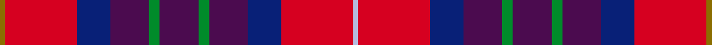

This page is one **sett** — a single exact thread-count. It belongs to the [tartan](/setts/y1r13db6dp7g2dp7g2dp7db6r13lb1/)
(the same proportion at any scale), whose colour order is pattern [GRBBGBGBBRW](/stripes/grbbgbgbbrw/).

Sourced from register-of-tartans.  It is a [11 stripe tartan](/stripes/stripes11/).

Original link https://www.tartanregister.gov.uk/tartanDetails.aspx?ref=10149

2 attestations — the source records this cloth was collapsed from (oldest owns this page)

<ul>
<li>26/01/2010 — McMurchie Family, John and Jessie (Personal) (register-of-tartans, <a href="https://www.tartanregister.gov.uk/tartanDetails.aspx?ref=10149">record</a>)  <em>The John and Jessie McMurchie Family tartan was designed and woven to honour the strength, compassion and uncommon perseverance of John (1887-1961) and Jessie McMurchie (1895-1979)and their four daughters, Sarah, Margaret, Jacqueline and Elizabeth. The tartan was designed and woven by Sarah (McMurchie) Brown's grandson Mackenzie Frere in consultation with the four McMurchie sisters who chose the colours. Dark blue is a reminder of the ocean that John McMurchie crossed in 1908 to arrive in Canada. Purple symbolizes the amethyst, Jessie McMurchie's birth stone. Green represents John McMurchie's great love of the garden. The light blue and yellow that criss cross the tartan, signify the blue and sunny skies of Alberta. Red symbolises Canada. Each red square is divided into four: one for each of John and Jessie's daughters. The John & Jessie McMurchie Family tartan has been designed for the use of all descendants of John and Jessie McMurchie, in Canada and around the world.</em></li>
<li>26th Jan. 2010 — McMurchie (Personal) (tartans-authority, <a href="http://www.tartansauthority.com/tartan-ferret/display/10149/">record</a>)  <em>The John and Jesse McMurchie Family tartan was designed and woven to honour the strength, compassion and uncommon perseverance of John (1887-1961) and Jesse McMurchie (1895-1979)and their four daughters, Sarah, Margaret, Jacqueline and Elizabeth. The tartan was designed and woven by Sarah (McMurchie) Brown's grandson Mackenzie Frere in consultation with the four McMurchie sisters who chose the colours. Dark blue is a reminder of the ocean that John McMurchie crossed in 1908 to arrive in Canada. Purple symbolizes the amethyst, Jesse McMurchie's birth stone. Green represents John McMurchie's great love of the garden. The light blue and yellow that criss cross the tartan, signify the blue and sunny skies of Alberta. Red symbolises Canada. Each red square is divided into four: one for each of John and Jesse's daughters. The John & Jesse McMurchie Family tartan has been designed for the use of all descendants of John and Jesse McMurchie, in Canada and around the world.</em></li>
</ul>

## Register references

External register numbers recorded for this tartan.

- Scottish Register of Tartans: [10149](https://www.tartanregister.gov.uk/tartanDetails?ref=10149)
- Scottish Tartans Authority (ITI): 10149

## Thread count
Y/2 R26 DB12 DP14 G4 DP14 G4 DP14 DB12 R26 LB/2

One full sett is **256 threads**.

## Palette
<table><thead><tr><th>Colour</th><th>Shade</th><th>OKLCh</th></tr></thead><tbody><tr><td>DB</td><td><code style="background-color:#082077;">#082077</code> <small style="color:#888">#082077</small></td><td><small style="color:#888">oklch(30.0% 0.149 265.1)</small></td></tr><tr><td>G</td><td><code style="background-color:#008B2A;">#008B2A</code> <small style="color:#888">#008B2A</small></td><td><small style="color:#888">oklch(55.4% 0.170 145.9)</small></td></tr><tr><td>LP</td><td><code style="background-color:#B5BBDE;">#B5BBDE</code> <small style="color:#888">#B5BBDE</small></td><td><small style="color:#888">oklch(79.9% 0.050 277.6)</small></td></tr><tr><td>N</td><td><code style="background-color:#4B0B4F;">#4B0B4F</code> <small style="color:#888">#4B0B4F</small></td><td><small style="color:#888">oklch(30.1% 0.125 325.4)</small></td></tr><tr><td>R</td><td><code style="background-color:#D60020;">#D60020</code> <small style="color:#888">#D60020</small></td><td><small style="color:#888">oklch(55.2% 0.224 25.5)</small></td></tr><tr><td>Y</td><td><code style="background-color:#8B6E00;">#8B6E00</code> <small style="color:#888">#8B6E00</small></td><td><small style="color:#888">oklch(55.1% 0.113 90.4)</small></td></tr></tbody></table>

# Sample pattern

ID: /variants/s11/y1r13db6dp7g2dp7g2dp7db6r13lb1~x2/
