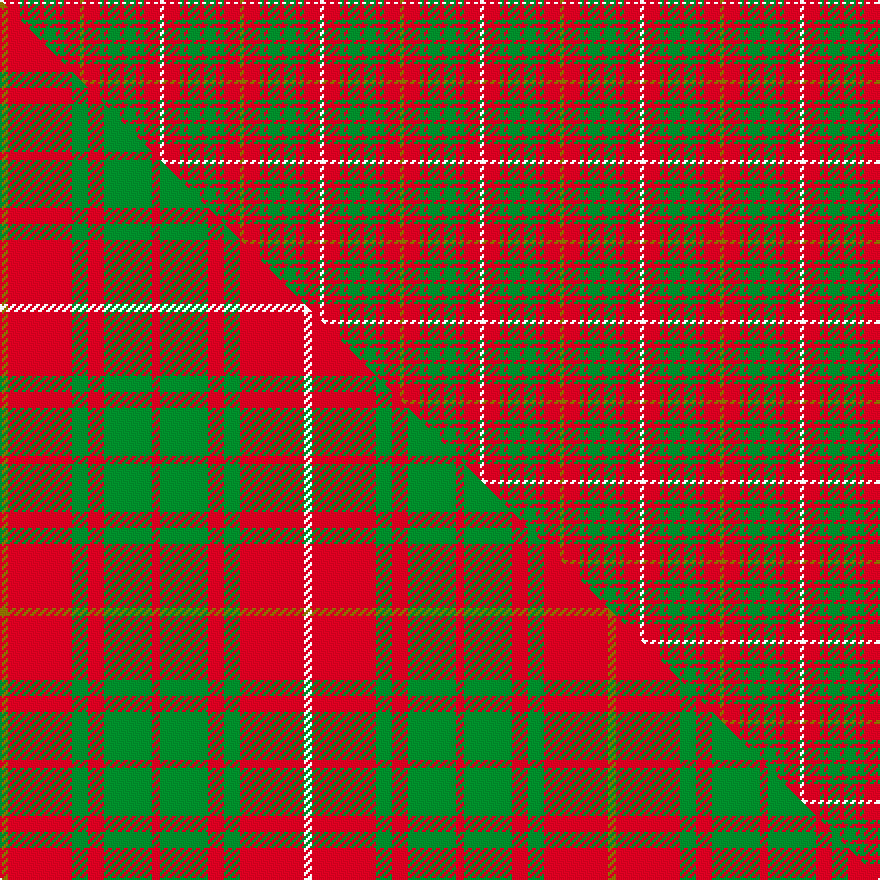

This is one **variant** — a specific cloth: this exact thread count and colourway, with its own
provenance below. It is one weaving of the [sett](/setts/y1r4g1r1g3r1g3r1g1r4w1/) (the scale-free proportion — the
same cloth at any scale or shade), whose colour order is pattern [GRGRGRGRGRW](/stripes/grgrgrgrgrw/).

Part of the [Bruce](/tartans/bruce-3/) tartan — the named design grouping this sett with its other cloths.

Sourced from weddslist.  It is a [11 stripe tartan](/stripes/stripes11/).

Original link [http://www.weddslist.com/cgi-bin/tartans/pg.pl?source=x](http://www.weddslist.com/cgi-bin/tartans/pg.pl?source=x)

Dataset <small>— provenance for this record, inherited from the source manifest</small>

<dl class="dataset-prov">
<dt>source</dt><dd><a href="/sources/weddslist/">Weddslist</a></dd>
<dt>data captured from</dt><dd><a href="https://github.com/thetartan/tartan-database/blob/master/data/weddslist/data.csv">https://github.com/thetartan/tartan-database/blob/master/data/weddslist/data.csv</a></dd>
<dt>data date</dt><dd>2016-11-17 <small>(dataset default)</small></dd>
<dt>licence</dt><dd><a href="https://creativecommons.org/licenses/by-nc-nd/4.0/">CC BY-NC-ND 4.0</a></dd>
</dl>

Capture chain <small>— the hands this data passed through, oldest first; each capture carries its own licence</small>

<ol class="capture-chain">
<li><a href="https://www.weddslist.com/tartans/">Weddslist</a> <small>the living privately compiled reference</small></li>
<li><a href="https://github.com/thetartan/tartan-database">thetartan/tartan-database</a> <small>2016-2017</small> · <a href="https://creativecommons.org/licenses/by-nc-nd/4.0/">CC BY-NC-ND 4.0</a> <small>Levko Kravets's frozen compilation — the capture we vendored, and where its CC licence text came from</small></li>
<li>this dictionary <small>captured 2026-06-10 · commit 5bf86c7566</small> <small>each re-capture is a git commit to data/sources</small></li>
</ol>

## Thread count
W/2 R8 G2 R2 G6 R2 G6 R2 G2 R8 Y/2

One full sett is **80 threads**.

## Palette
<table><thead><tr><th>Colour</th><th>Shade</th><th>OKLCh</th></tr></thead><tbody><tr><td>G</td><td><code style="background-color:#008B2A;">#008B2A</code> <small style="color:#888">#008B2A</small></td><td><small style="color:#888">oklch(55.4% 0.170 145.9)</small></td></tr><tr><td>R</td><td><code style="background-color:#D60020;">#D60020</code> <small style="color:#888">#D60020</small></td><td><small style="color:#888">oklch(55.2% 0.224 25.5)</small></td></tr><tr><td>Y</td><td><code style="background-color:#8B6E00;">#8B6E00</code> <small style="color:#888">#8B6E00</small></td><td><small style="color:#888">oklch(55.1% 0.113 90.4)</small></td></tr><tr><td>W</td><td><code style="background-color:#F7F7F7;">#F7F7F7</code> <small style="color:#888">#F7F7F7</small></td><td><small style="color:#888">oklch(97.6% 0.000 89.9)</small></td></tr></tbody></table>

# Sample pattern

## Compared to the master

This cloth is one sett of its design; the master sett (the exemplar the design is anchored on) is below for comparison.

Its **ΔTartan distance** from the master is **0.49** — the same measure the nearest-tartans table ranks by (0 is identical; a re-scale of the same cloth is near 0, a recolour or a different proportion further).

<figure class="master-compare" style="margin:0">

this sett
master sett ★

<figcaption style="color:#888;font-size:smaller">One weave of this sett against the <a href="/setts/y1r8g2r2g6r1g6r2g2r8w1/">master sett ★</a>, split on the diagonal: a shared proportion runs seamlessly across it with only the shades shifting; a different proportion breaks on it.</figcaption>
</figure>

## Nearest tartan variants

The nearest existing variants by ΔTartan distance, with this cloth at the top so the swatches line up against it.

ΔTartan

Threads

Variant

Sett

—

80

<a href="/variants/s11/y1r4g1r1g3r1g3r1g1r4w1~x2/">Bruce</a>

<a href="/ttd/edit/#slug=y1r8g2r2g6r1g6r2g2r8w1~x2&amp;base=y1r4g1r1g3r1g3r1g1r4w1~x2" title="compare in the TTD">0.49</a>

152

<a href="/variants/s11/y1r8g2r2g6r1g6r2g2r8w1~x2/">Bruce</a>

<a href="/ttd/edit/#slug=y1r8g2r2g6r1g6r2g2r8w1~x4&amp;base=y1r4g1r1g3r1g3r1g1r4w1~x2" title="compare in the TTD">0.49</a>

304

<a href="/variants/s11/y1r8g2r2g6r1g6r2g2r8w1~x4/">Bruce (Vestiarium)</a>

<a href="/ttd/edit/#slug=r8g2r2g6r1g6r2g2r8y1&amp;base=y1r4g1r1g3r1g3r1g1r4w1~x2" title="compare in the TTD">0.80</a>

67

<a href="/variants/s10/r8g2r2g6r1g6r2g2r8y1/">Bruce</a>

<a href="/ttd/edit/#slug=y1r8g2r2g6r1g6r2g2r7db1w1~x4&amp;base=y1r4g1r1g3r1g3r1g1r4w1~x2" title="compare in the TTD">0.81</a>

304

<a href="/variants/s12/y1r8g2r2g6r1g6r2g2r7db1w1~x4/">Bruce County</a>

<a href="/ttd/edit/#slug=y1r8g2r2g6r1g6r2g2r7db1w1~x2&amp;base=y1r4g1r1g3r1g3r1g1r4w1~x2" title="compare in the TTD">0.81</a>

152

<a href="/variants/s12/y1r8g2r2g6r1g6r2g2r7db1w1~x2/">Bruce County District Tartan</a>

<a href="/ttd/edit/#slug=w1db1r7g2r2g6r1g6r2g2r8lo1~x4&amp;base=y1r4g1r1g3r1g3r1g1r4w1~x2" title="compare in the TTD">1.12</a>

304

<a href="/variants/s12/w1db1r7g2r2g6r1g6r2g2r8lo1~x4/">Bruce County (District)</a>

<a href="/ttd/edit/#slug=dp3r4g3db3r7g17r3db5g4r21g7dp3r6w3~x2&amp;base=y1r4g1r1g3r1g3r1g1r4w1~x2" title="compare in the TTD">1.75</a>

344

<a href="/variants/s14/dp3r4g3db3r7g17r3db5g4r21g7dp3r6w3~x2/">MacKinnon #3</a>

<a href="/ttd/edit/#slug=w2r4lb2g8r16g2db4r2g16r6db2g2r3lb2~x2&amp;base=y1r4g1r1g3r1g3r1g1r4w1~x2" title="compare in the TTD">1.86</a>

276

<a href="/variants/s14/w2r4lb2g8r16g2db4r2g16r6db2g2r3lb2~x2/">MacKinnon #2</a>

<a href="/ttd/edit/#slug=dp2r3g2db2r6g16r2db4g2r16g8dp2r4w2~x2&amp;base=y1r4g1r1g3r1g3r1g1r4w1~x2" title="compare in the TTD">1.86</a>

276

<a href="/variants/s14/dp2r3g2db2r6g16r2db4g2r16g8dp2r4w2~x2/">MacKinnon</a>

<a href="/ttd/edit/#slug=r3g3r3g14r3g3r3db5r18y2r8y2~x2&amp;base=y1r4g1r1g3r1g3r1g1r4w1~x2" title="compare in the TTD">2.66</a>

258

<a href="/variants/s12/r3g3r3g14r3g3r3db5r18y2r8y2~x2/">Burns Family Tartan</a>

## Neighbour map

Every grey dot is one of 13621 variants placed by the first two principal components of the ΔTartan feature space (42% of its variance). Red is this tartan; blue dots are its nearest — click one to open its page.

<svg viewBox="0 0 640 380" role="img" style="max-width:100%;height:auto;border:1px solid #e0e0e0;border-radius:4px;display:block" xmlns="http://www.w3.org/2000/svg"><image href="/nn/cloud.v1.png" width="640" height="380"/><a href="/variants/s11/y1r8g2r2g6r1g6r2g2r8w1~x2/"><circle cx="317.6" cy="207.8" r="4" fill="#3465a4"><title>Bruce</title></circle></a><a href="/variants/s11/y1r8g2r2g6r1g6r2g2r8w1~x4/"><circle cx="317.6" cy="207.8" r="4" fill="#3465a4"><title>Bruce (Vestiarium)</title></circle></a><a href="/variants/s10/r8g2r2g6r1g6r2g2r8y1/"><circle cx="356.0" cy="232.8" r="4" fill="#3465a4"><title>Bruce</title></circle></a><a href="/variants/s12/y1r8g2r2g6r1g6r2g2r7db1w1~x4/"><circle cx="277.7" cy="188.2" r="4" fill="#3465a4"><title>Bruce County</title></circle></a><a href="/variants/s12/y1r8g2r2g6r1g6r2g2r7db1w1~x2/"><circle cx="277.7" cy="188.2" r="4" fill="#3465a4"><title>Bruce County District Tartan</title></circle></a><a href="/variants/s12/w1db1r7g2r2g6r1g6r2g2r8lo1~x4/"><circle cx="274.3" cy="186.9" r="4" fill="#3465a4"><title>Bruce County (District)</title></circle></a><a href="/variants/s14/dp3r4g3db3r7g17r3db5g4r21g7dp3r6w3~x2/"><circle cx="211.2" cy="176.1" r="4" fill="#3465a4"><title>MacKinnon #3</title></circle></a><a href="/variants/s14/w2r4lb2g8r16g2db4r2g16r6db2g2r3lb2~x2/"><circle cx="218.1" cy="166.9" r="4" fill="#3465a4"><title>MacKinnon #2</title></circle></a><a href="/variants/s14/dp2r3g2db2r6g16r2db4g2r16g8dp2r4w2~x2/"><circle cx="218.6" cy="166.1" r="4" fill="#3465a4"><title>MacKinnon</title></circle></a><a href="/variants/s12/r3g3r3g14r3g3r3db5r18y2r8y2~x2/"><circle cx="325.8" cy="186.8" r="4" fill="#3465a4"><title>Burns Family Tartan</title></circle></a><circle cx="266.1" cy="243.8" r="5" fill="#c00000"/><text x="320" y="376" text-anchor="middle" font-size="11" fill="#999">ground</text><text x="11" y="190" text-anchor="middle" font-size="11" fill="#999" transform="rotate(-90 11 190)">complexity</text></svg>

ID: /variants/s11/y1r4g1r1g3r1g3r1g1r4w1~x2/
