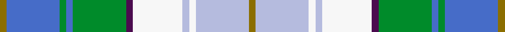

This is one **variant** — a specific cloth: this exact thread count and colourway, with its own
provenance below. It is one weaving of the [sett](/setts/y2b16g2b2g16dp2w15lb2w2lb16y2/) (the scale-free proportion — the
same cloth at any scale or shade), whose colour order is pattern [GBGBGBWWWWG](/stripes/gbgbgbwwwwg/).

Part of the [Robinson, Barbara Ann](/tartans/r/ro/robinson-barbara-ann-2/) tartan — the named design grouping this sett with its other cloths.

Sourced from tartans-authority.  It is a [11 stripe tartan](/stripes/stripes11/).

Original link [https://www.tartanregister.gov.uk/tartanDetails.aspx?ref=6722](https://www.tartanregister.gov.uk/tartanDetails.aspx?ref=6722)

Dataset <small>— provenance for this record, inherited from the source manifest</small>

<dl class="dataset-prov">
<dt>source</dt><dd><a href="/sources/tartans-authority/">Scottish Tartans Authority</a></dd>
<dt>data captured from</dt><dd><a href="https://github.com/thetartan/tartan-database/blob/master/data/tartans-authority/data.csv">https://github.com/thetartan/tartan-database/blob/master/data/tartans-authority/data.csv</a></dd>
<dt>data date</dt><dd>Jan. 2005 <small>(this record)</small></dd>
<dt>licence</dt><dd><a href="https://creativecommons.org/licenses/by-nc-nd/4.0/">CC BY-NC-ND 4.0</a></dd>
</dl>

Capture chain <small>— the hands this data passed through, oldest first; each capture carries its own licence</small>

<ol class="capture-chain">
<li><a href="https://www.tartansauthority.com/">Scottish Tartans Authority</a> <small>the heritage body's archive — its tartan-ferret record browser is retired (links repaired to the SRT, above)</small></li>
<li><a href="https://github.com/thetartan/tartan-database">thetartan/tartan-database</a> <small>2016-2017</small> · <a href="https://creativecommons.org/licenses/by-nc-nd/4.0/">CC BY-NC-ND 4.0</a> <small>Levko Kravets's frozen compilation — the capture we vendored, and where its CC licence text came from</small></li>
<li>this dictionary <small>captured 2026-06-10 · commit 5bf86c7566</small> <small>each re-capture is a git commit to data/sources</small></li>
</ol>

## Register references

External register numbers recorded for this tartan.

- Scottish Tartans Authority (ITI): 6722

## Thread count
Y/4 B32 G4 B4 G32 DP4 W30 LB4 W4 LB32 Y/4

One full sett is **300 threads**.

## Palette
<table><thead><tr><th>Colour</th><th>Shade</th><th>OKLCh</th></tr></thead><tbody><tr><td>LB</td><td><code style="background-color:#B5BBDE;">#B5BBDE</code> <small style="color:#888">#B5BBDE</small></td><td><small style="color:#888">oklch(79.9% 0.050 277.6)</small></td></tr><tr><td>G</td><td><code style="background-color:#008B2A;">#008B2A</code> <small style="color:#888">#008B2A</small></td><td><small style="color:#888">oklch(55.4% 0.170 145.9)</small></td></tr><tr><td>B</td><td><code style="background-color:#466CC8;">#466CC8</code> <small style="color:#888">#466CC8</small></td><td><small style="color:#888">oklch(55.1% 0.149 265.0)</small></td></tr><tr><td>DP</td><td><code style="background-color:#4B0B4F;">#4B0B4F</code> <small style="color:#888">#4B0B4F</small></td><td><small style="color:#888">oklch(30.1% 0.125 325.4)</small></td></tr><tr><td>W</td><td><code style="background-color:#F7F7F7;">#F7F7F7</code> <small style="color:#888">#F7F7F7</small></td><td><small style="color:#888">oklch(97.6% 0.000 89.9)</small></td></tr><tr><td>Y</td><td><code style="background-color:#8B6E00;">#8B6E00</code> <small style="color:#888">#8B6E00</small></td><td><small style="color:#888">oklch(55.1% 0.113 90.4)</small></td></tr></tbody></table>

# Sample pattern

## Nearest tartan variants

The nearest existing variants by ΔTartan distance, with this cloth at the top so the swatches line up against it.

ΔTartan

Threads

Variant

Sett

—

300

<a href="/variants/s11/y2b16g2b2g16dp2w15lb2w2lb16y2~x2/">Robinson, Barbara Ann (Personal)</a>

<a href="/ttd/edit/#slug=y3lb21db12g3db3y3db3gi8g5db2g7w3~x2~db1003265-gi1902194&amp;base=y2b16g2b2g16dp2w15lb2w2lb16y2~x2" title="compare in the TTD">2.91</a>

280

<a href="/variants/s12/y3lb21db12g3db3y3db3gi8g5db2g7w3~x2~db1003265-gi1902194/">Holroyd, John (Personal)</a>

<a href="/ttd/edit/#slug=w3g7dt2g5db8dt3ly3dt3g3dt12lb21ly3~x2~dt1204274-db1406275&amp;base=y2b16g2b2g16dp2w15lb2w2lb16y2~x2" title="compare in the TTD">2.93</a>

280

<a href="/variants/s12/w3g7db2g5dbi8db3ly3db3g3db12lb21ly3~x2~db1204274-dbi1406275/">Holroyd, John (Personal</a>

<a href="/ttd/edit/#slug=lb8y2g4y2dp4y2lb8w15ly2~x4&amp;base=y2b16g2b2g16dp2w15lb2w2lb16y2~x2" title="compare in the TTD">3.08</a>

336

<a href="/variants/s9/lb8y2g4y2dp4y2lb8w15ly2~x4/">Edmonton, City of</a>

<a href="/ttd/edit/#slug=ly7g11db4lb31db4g11dy4db14w3db4~x2&amp;base=y2b16g2b2g16dp2w15lb2w2lb16y2~x2" title="compare in the TTD">3.10</a>

350

<a href="/variants/s10/ly7g11db4lb31db4g11dy4db14w3db4~x2/">State Seal of Nebraska (Fashion)</a>

<a href="/ttd/edit/#slug=w30lb4db6dp4db6g6db12g13lt4~x2~lb3203246-db1404245-g2203152-lt3606199&amp;base=y2b16g2b2g16dp2w15lb2w2lb16y2~x2" title="compare in the TTD">3.37</a>

272

<a href="/variants/s9/w30lb4db6dp4db6g6db12g13lt4~x2~lb3203246-db1404245-g2203152-lt3606199/">Sound of Iona</a>

<a href="/ttd/edit/#slug=w30t4db6dp4db6g6db12g13lb4~x2~t2405244-lb3203246&amp;base=y2b16g2b2g16dp2w15lb2w2lb16y2~x2" title="compare in the TTD">3.73</a>

272

<a href="/variants/s9/w30t4db6dp4db6g6db12g13lb4~x2~t2405244-lb3203246/">Sound of Iona</a>

<a href="/ttd/edit/#slug=y3lb6lg20db5g3db15ly3db3lg3~x2~lg2904173-db1404245-g2304202-ly3104101&amp;base=y2b16g2b2g16dp2w15lb2w2lb16y2~x2" title="compare in the TTD">3.86</a>

232

<a href="/variants/s9/y3lb6lg20db5g3db15ly3db3lg3~x2~lg2904173-db1404245-g2304202-ly3104101/">WestJet</a>

<a href="/ttd/edit/#slug=dt2y10dg4lp5dg2lp3dg2lp5dg4dt15lr2~x2~y2302166-dg1806142&amp;base=y2b16g2b2g16dp2w15lb2w2lb16y2~x2" title="compare in the TTD">3.93</a>

208

<a href="/variants/s11/dt2y10dg4lp5dg2lp3dg2lp5dg4dt15lr2~x2~y2302166-dg1806142/">Elwyn Glen (Corporate)</a>

<a href="/ttd/edit/#slug=db2g2db11n2w8lb12ly2lb2~x2&amp;base=y2b16g2b2g16dp2w15lb2w2lb16y2~x2" title="compare in the TTD">3.94</a>

156

<a href="/variants/s8/db2g2db11n2w8lb12ly2lb2~x2/">Elora (District)</a>

## Neighbour map

Every grey dot is one of 13656 variants placed by the first two principal components of the ΔTartan feature space (42% of its variance). Red is this tartan; blue dots are its nearest — click one to open its page. The map is a flat projection of a many-dimensional space — [how to read it](/posts/neighbourhood-maps/).

<svg viewBox="0 0 640 380" role="img" style="max-width:100%;height:auto;border:1px solid #e0e0e0;border-radius:4px;display:block" xmlns="http://www.w3.org/2000/svg"><image href="/nn/cloud.v1.png" width="640" height="380"/><a href="/variants/s12/y3lb21db12g3db3y3db3gi8g5db2g7w3~x2~db1003265-gi1902194/"><circle cx="119.2" cy="175.0" r="4" fill="#3465a4"><title>Holroyd, John (Personal)</title></circle></a><a href="/variants/s12/w3g7db2g5dbi8db3ly3db3g3db12lb21ly3~x2~db1204274-dbi1406275/"><circle cx="115.8" cy="173.8" r="4" fill="#3465a4"><title>Holroyd, John (Personal</title></circle></a><a href="/variants/s9/lb8y2g4y2dp4y2lb8w15ly2~x4/"><circle cx="151.1" cy="206.8" r="4" fill="#3465a4"><title>Edmonton, City of</title></circle></a><a href="/variants/s10/ly7g11db4lb31db4g11dy4db14w3db4~x2/"><circle cx="140.9" cy="179.7" r="4" fill="#3465a4"><title>State Seal of Nebraska (Fashion)</title></circle></a><a href="/variants/s9/w30lb4db6dp4db6g6db12g13lt4~x2~lb3203246-db1404245-g2203152-lt3606199/"><circle cx="131.3" cy="196.1" r="4" fill="#3465a4"><title>Sound of Iona</title></circle></a><a href="/variants/s9/w30t4db6dp4db6g6db12g13lb4~x2~t2405244-lb3203246/"><circle cx="123.9" cy="193.7" r="4" fill="#3465a4"><title>Sound of Iona</title></circle></a><a href="/variants/s9/y3lb6lg20db5g3db15ly3db3lg3~x2~lg2904173-db1404245-g2304202-ly3104101/"><circle cx="191.4" cy="213.3" r="4" fill="#3465a4"><title>WestJet</title></circle></a><a href="/variants/s11/dt2y10dg4lp5dg2lp3dg2lp5dg4dt15lr2~x2~y2302166-dg1806142/"><circle cx="156.3" cy="215.0" r="4" fill="#3465a4"><title>Elwyn Glen (Corporate)</title></circle></a><a href="/variants/s8/db2g2db11n2w8lb12ly2lb2~x2/"><circle cx="127.3" cy="210.6" r="4" fill="#3465a4"><title>Elora (District)</title></circle></a><circle cx="116.5" cy="190.8" r="5" fill="#c00000"/><text x="320" y="376" text-anchor="middle" font-size="11" fill="#999">ground</text><text x="11" y="190" text-anchor="middle" font-size="11" fill="#999" transform="rotate(-90 11 190)">complexity</text></svg>

ID: /variants/s11/y2b16g2b2g16dp2w15lb2w2lb16y2~x2/
