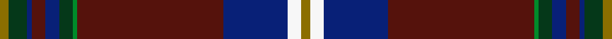

This is one **variant** — a specific cloth: this exact thread count and colourway, with its own
provenance below. It is one weaving of the [sett](/tartans/b/ba/banause-zunft-zu-olte/) (the scale-free proportion — the
same cloth at any scale or shade), whose colour order is pattern [GGBBBGGBBWG](/stripes/ggbbbggbbwg/).

Part of the [Banause-Zunft zu Olte](/tartans/b/ba/banause-zunft-zu-olte/) tartan — the named design grouping this sett with its other cloths.

Sourced from register-of-tartans.  It is a [11 stripe tartan](/stripes/stripes11/).

Original link [https://www.tartanregister.gov.uk/tartanDetails.aspx?ref=189](https://www.tartanregister.gov.uk/tartanDetails.aspx?ref=189)

2 attestations — the source records this cloth was collapsed from (oldest owns this page)

<ul>
<li>01/05/2006 — Banause-Zunft zu Olte (register-of-tartans, <a href="https://www.tartanregister.gov.uk/tartanDetails.aspx?ref=189">record</a>)  <em>'Banause-Zunft zu Olte' translates as 'the Philistines' Guild from Olten'. The club was formed in 1964 in Olten, Switzerland. Whilst Banause translates as philistine, it should be interpreted as 'fuddy-duddy' or 'pompous'. The club looks upon itself as an extended family that undertakes charitable works, satirical reviews and the odd drink.</em></li>
<li>2006 May — Banause-Zunft zu Olte (Corporate) (tartans-authority, <a href="https://web.archive.org/web/*/http://www.tartansauthority.com/tartan-ferret/display/6935/*">record</a>)  <em>Banause-Zunft zu Olte translates as the Philistines' Guild from Olten and the explanation is that this was formed in 1964 in Olten - a town in central Switzerland. Whilst Banause translates as philistine, it's really a humorous and exaggerated way of saying fuddy-duddy or pompous. Zunft means 'Guild' and the club tends to look upon itself as a large self-supporting family that undertakes charitable works, satirical reviews and the odd drink.</em></li>
</ul>

Dataset <small>— provenance for this record, inherited from the source manifest</small>

<dl class="dataset-prov">
<dt>source</dt><dd><a href="/sources/register-of-tartans/">Scottish Register of Tartans</a></dd>
<dt>data captured from</dt><dd><a href="https://github.com/thetartan/tartan-database/blob/master/data/register-of-tartans/data.csv">https://github.com/thetartan/tartan-database/blob/master/data/register-of-tartans/data.csv</a></dd>
<dt>data date</dt><dd>01/05/2006 <small>(this record)</small></dd>
<dt>licence</dt><dd><a href="https://www.tartanregister.gov.uk/copyright">Crown copyright</a></dd>
</dl>

Capture chain <small>— the hands this data passed through, oldest first; each capture carries its own licence</small>

<ol class="capture-chain">
<li><a href="https://www.tartanregister.gov.uk/">Scottish Register of Tartans</a> · <a href="https://www.tartanregister.gov.uk/copyright">Crown copyright</a> <small>the living register — still published by National Records of Scotland</small></li>
<li><a href="https://github.com/thetartan/tartan-database">thetartan/tartan-database</a> <small>2016-2017</small> · <a href="https://creativecommons.org/licenses/by-nc-nd/4.0/">CC BY-NC-ND 4.0</a> <small>Levko Kravets's frozen compilation — the capture we vendored, and where its CC licence text came from</small></li>
<li>this dictionary <small>captured 2026-06-10 · commit 5bf86c7566</small> <small>each re-capture is a git commit to data/sources</small></li>
</ol>

## Register references

External register numbers recorded for this tartan.

- Scottish Register of Tartans: [189](https://www.tartanregister.gov.uk/tartanDetails.aspx?ref=189)
- Scottish Tartans Authority (ITI): 6935

## Thread count
Y/4 DG8 DB2 DR6 DB6 DG6 G2 DR64 DB28 W6 Y/4

One full sett is **264 threads**.

## Palette
<table><thead><tr><th>Colour</th><th>Shade</th><th>OKLCh</th></tr></thead><tbody><tr><td>DB</td><td><code style="background-color:#082077;">#082077</code> <small style="color:#888">#082077</small></td><td><small style="color:#888">oklch(30.0% 0.149 265.1)</small></td></tr><tr><td>DR</td><td><code style="background-color:#55120C;">#55120C</code> <small style="color:#888">#55120C</small></td><td><small style="color:#888">oklch(30.0% 0.099 29.3)</small></td></tr><tr><td>DG</td><td><code style="background-color:#053819;">#053819</code> <small style="color:#888">#053819</small></td><td><small style="color:#888">oklch(30.0% 0.075 151.3)</small></td></tr><tr><td>G</td><td><code style="background-color:#008B2A;">#008B2A</code> <small style="color:#888">#008B2A</small></td><td><small style="color:#888">oklch(55.4% 0.170 145.9)</small></td></tr><tr><td>W</td><td><code style="background-color:#F7F7F7;">#F7F7F7</code> <small style="color:#888">#F7F7F7</small></td><td><small style="color:#888">oklch(97.6% 0.000 89.9)</small></td></tr><tr><td>Y</td><td><code style="background-color:#8B6E00;">#8B6E00</code> <small style="color:#888">#8B6E00</small></td><td><small style="color:#888">oklch(55.1% 0.113 90.4)</small></td></tr></tbody></table>

# Sample pattern

## Nearest tartan variants

The nearest existing variants by ΔTartan distance, with this cloth at the top so the swatches line up against it.

ΔTartan

Threads

Variant

Sett

—

264

<a href="/variants/s11/y2dg4db1dr3db3dg3g1dr32db14w3y2~x2/">Banause-Zunft zu Olte</a>

<a href="/ttd/edit/#slug=dg18g2db5dr45lb3db18lb3dr8lr2~x2~dg1806142-g2408144-lb3103284-lr3200000&amp;base=y2dg4db1dr3db3dg3g1dr32db14w3y2~x2" title="compare in the TTD">2.36</a>

376

<a href="/variants/s9/dg18g2db5dr45lb3db18lb3dr8lbi2~x2~dg1806142-g2408144-lb3103284-lbi3200000/">MacNiven</a>

<a href="/ttd/edit/#slug=r8db8dg1db1dg27dp1y1dp3y3w1~x2&amp;base=y2dg4db1dr3db3dg3g1dr32db14w3y2~x2" title="compare in the TTD">2.73</a>

198

<a href="/variants/s10/r8db8dg1db1dg27dp1y1dp3y3w1~x2/">Holyoke St. Patrick's</a>

<a href="/ttd/edit/#slug=dr44do3lb2g14lb2y4dr4do2dr4y4lb2db12do6dr6y7lb2~x2&amp;base=y2dg4db1dr3db3dg3g1dr32db14w3y2~x2" title="compare in the TTD">3.00</a>

380

<a href="/variants/s16/dr44do3lb2g14lb2y4dr4do2dr4y4lb2db12do6dr6y7lb2~x2/">North West Mounted Police (Commemo)</a>

<a href="/ttd/edit/#slug=dt47y1db27lr4g5y1lr8b1db1~x2~dt1000000-lr3201060&amp;base=y2dg4db1dr3db3dg3g1dr32db14w3y2~x2" title="compare in the TTD">3.20</a>

284

<a href="/variants/s9/dt47y1db27lr4g5y1lr8b1db1~x2~dt1000000-lr3201060/">Brighton Mac Dermotte</a>

<a href="/ttd/edit/#slug=w3dr30dg3db3dr3dy3db8lb3dy3db3w3~x2&amp;base=y2dg4db1dr3db3dg3g1dr32db14w3y2~x2" title="compare in the TTD">3.35</a>

248

<a href="/variants/s11/w3dr30dg3db3dr3dy3db8lb3dy3db3w3~x2/">Lansdowne Course, Blairgowrie Golf Club</a>

<a href="/ttd/edit/#slug=p1dr1p1dr6dg26mi14dr20lb1dr1lb1dr2m1~x2~p2312307-mi2506332&amp;base=y2dg4db1dr3db3dg3g1dr32db14w3y2~x2" title="compare in the TTD">3.41</a>

296

<a href="/variants/s12/p1dr1p1dr6dg26mi14dr20lb1dr1lb1dr2m1~x2~p2312307-mi2506332/">Scobie (Blackford)</a>

<a href="/ttd/edit/#slug=n45g3db7r2db7g3n4w2dp36w2n11db4&amp;base=y2dg4db1dr3db3dg3g1dr32db14w3y2~x2" title="compare in the TTD">3.43</a>

203

<a href="/variants/s12/n45g3db7r2db7g3n4w2dp36w2n11db4/">Scottish Parliament (Official)</a>

<a href="/ttd/edit/#slug=db16dr1db2dr3db1dr9db1dr3db2dr1db6dg3lb3dg5dr28w3dr3w3~x2&amp;base=y2dg4db1dr3db3dg3g1dr32db14w3y2~x2" title="compare in the TTD">3.43</a>

334

<a href="/variants/s18/db16dr1db2dr3db1dr9db1dr3db2dr1db6dg3lb3dg5dr28w3dr3w3~x2/">Royal Bahrain (Royal)</a>

<a href="/ttd/edit/#slug=dr44do3w2g14w2y4dr4do2dr4y4w2db12do6dr6y7w2~x2&amp;base=y2dg4db1dr3db3dg3g1dr32db14w3y2~x2" title="compare in the TTD">3.44</a>

380

<a href="/variants/s16/dr44do3w2g14w2y4dr4do2dr4y4w2db12do6dr6y7w2~x2/">North West Mounted Police</a>

<a href="/ttd/edit/#slug=dt54db14y3db3w3db3g9dy7db2dy9w2~x2~dt1204274-db1406275&amp;base=y2dg4db1dr3db3dg3g1dr32db14w3y2~x2" title="compare in the TTD">3.47</a>

324

<a href="/variants/s11/db54dbi14y3dbi3w3dbi3g9dy7dbi2dy9w2~x2~db1204274-dbi1406275/">Holyrood Corporate Tartan</a>

## Neighbour map

Every grey dot is one of 13656 variants placed by the first two principal components of the ΔTartan feature space (42% of its variance). Red is this tartan; blue dots are its nearest — click one to open its page. The map is a flat projection of a many-dimensional space — [how to read it](/posts/neighbourhood-maps/).

<svg viewBox="0 0 640 380" role="img" style="max-width:100%;height:auto;border:1px solid #e0e0e0;border-radius:4px;display:block" xmlns="http://www.w3.org/2000/svg"><image href="/nn/cloud.v1.png" width="640" height="380"/><a href="/variants/s9/dg18g2db5dr45lb3db18lb3dr8lbi2~x2~dg1806142-g2408144-lb3103284-lbi3200000/"><circle cx="322.4" cy="140.9" r="4" fill="#3465a4"><title>MacNiven</title></circle></a><a href="/variants/s10/r8db8dg1db1dg27dp1y1dp3y3w1~x2/"><circle cx="314.6" cy="104.4" r="4" fill="#3465a4"><title>Holyoke St. Patrick's</title></circle></a><a href="/variants/s16/dr44do3lb2g14lb2y4dr4do2dr4y4lb2db12do6dr6y7lb2~x2/"><circle cx="301.4" cy="110.1" r="4" fill="#3465a4"><title>North West Mounted Police (Commemo)</title></circle></a><a href="/variants/s9/dt47y1db27lr4g5y1lr8b1db1~x2~dt1000000-lr3201060/"><circle cx="334.0" cy="95.8" r="4" fill="#3465a4"><title>Brighton Mac Dermotte</title></circle></a><a href="/variants/s11/w3dr30dg3db3dr3dy3db8lb3dy3db3w3~x2/"><circle cx="262.3" cy="142.0" r="4" fill="#3465a4"><title>Lansdowne Course, Blairgowrie Golf Club</title></circle></a><a href="/variants/s12/p1dr1p1dr6dg26mi14dr20lb1dr1lb1dr2m1~x2~p2312307-mi2506332/"><circle cx="271.3" cy="101.4" r="4" fill="#3465a4"><title>Scobie (Blackford)</title></circle></a><a href="/variants/s12/n45g3db7r2db7g3n4w2dp36w2n11db4/"><circle cx="312.5" cy="117.5" r="4" fill="#3465a4"><title>Scottish Parliament (Official)</title></circle></a><a href="/variants/s18/db16dr1db2dr3db1dr9db1dr3db2dr1db6dg3lb3dg5dr28w3dr3w3~x2/"><circle cx="328.0" cy="105.6" r="4" fill="#3465a4"><title>Royal Bahrain (Royal)</title></circle></a><a href="/variants/s16/dr44do3w2g14w2y4dr4do2dr4y4w2db12do6dr6y7w2~x2/"><circle cx="277.7" cy="102.2" r="4" fill="#3465a4"><title>North West Mounted Police</title></circle></a><a href="/variants/s11/db54dbi14y3dbi3w3dbi3g9dy7dbi2dy9w2~x2~db1204274-dbi1406275/"><circle cx="336.5" cy="119.4" r="4" fill="#3465a4"><title>Holyrood Corporate Tartan</title></circle></a><circle cx="347.4" cy="103.9" r="5" fill="#c00000"/><text x="320" y="376" text-anchor="middle" font-size="11" fill="#999">ground</text><text x="11" y="190" text-anchor="middle" font-size="11" fill="#999" transform="rotate(-90 11 190)">complexity</text></svg>

ID: /variants/s11/y2dg4db1dr3db3dg3g1dr32db14w3y2~x2/
