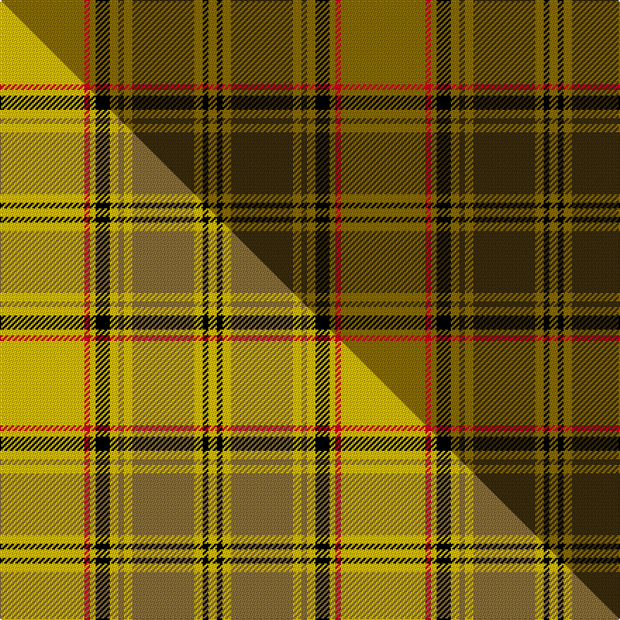

This is one **variant** — a specific cloth: this exact thread count and colourway, with its own
provenance below. It is one weaving of the [sett](/tartans/d/du/dunbarton-2/) (the scale-free proportion — the
same cloth at any scale or shade), whose colour order is pattern [GKGGGGGKGRG](/stripes/gkgggggkgrg/).

Part of the [Dunbarton](/tartans/d/du/dunbarton-2/) tartan — the named design grouping this sett with its other cloths.

Sourced from house-of-tartan.  It is a [11 stripe tartan](/stripes/stripes11/).

Original link [http://www.house-of-tartan.scotland.net/house/TartanViewjs.asp?colr=Def&tnam=1886](http://www.house-of-tartan.scotland.net/house/TartanViewjs.asp?colr=Def&tnam=1886)

## Provenance

Earliest known date: pre 2003 Dunbarton, Quebec. Different warp and weft

Dataset <small>— provenance for this record, inherited from the source manifest</small>

<dl class="dataset-prov">
<dt>source</dt><dd><a href="/sources/house-of-tartan/">House of Tartan</a></dd>
<dt>data captured from</dt><dd><a href="https://github.com/thetartan/tartan-database/blob/master/data/house-of-tartan/data.csv">https://github.com/thetartan/tartan-database/blob/master/data/house-of-tartan/data.csv</a></dd>
<dt>data date</dt><dd>pre 2003 <small>(this record)</small></dd>
<dt>licence</dt><dd><a href="https://creativecommons.org/licenses/by-nc-nd/4.0/">CC BY-NC-ND 4.0</a></dd>
</dl>

Capture chain <small>— the hands this data passed through, oldest first; each capture carries its own licence</small>

<ol class="capture-chain">
<li><a href="http://www.house-of-tartan.scotland.net/">House of Tartan</a> <small>the weaver/retailer's database — the site is now offline; the URL is kept as the ultimate source's identity</small></li>
<li><a href="https://github.com/thetartan/tartan-database">thetartan/tartan-database</a> <small>2016-2017</small> · <a href="https://creativecommons.org/licenses/by-nc-nd/4.0/">CC BY-NC-ND 4.0</a> <small>Levko Kravets's frozen compilation — the capture we vendored, and where its CC licence text came from</small></li>
<li>this dictionary <small>captured 2026-06-10 · commit 5bf86c7566</small> <small>each re-capture is a git commit to data/sources</small></li>
</ol>

## Thread count
Y/60 R4 Y4 K10 Y6 DY4 Y6 DY44 Y6 K4 Y/6

One full sett is **242 threads**.

## Palette
<table><thead><tr><th>Colour</th><th>Shade</th><th>OKLCh</th></tr></thead><tbody><tr><td>LB</td><td><code style="background-color:#B5BBDE;">#B5BBDE</code> <small style="color:#888">#B5BBDE</small></td><td><small style="color:#888">oklch(79.9% 0.050 277.6)</small></td></tr><tr><td>K</td><td><code style="background-color:#000000;">#000000</code> <small style="color:#888">#000000</small></td><td><small style="color:#888">oklch(0.0% 0.000 0.0)</small></td></tr><tr><td>R</td><td><code style="background-color:#D60020;">#D60020</code> <small style="color:#888">#D60020</small></td><td><small style="color:#888">oklch(55.2% 0.224 25.5)</small></td></tr><tr><td>DY</td><td><code style="background-color:#3A2B0D;">#3A2B0D</code> <small style="color:#888">#3A2B0D</small></td><td><small style="color:#888">oklch(30.0% 0.049 82.0)</small></td></tr><tr><td>Y</td><td><code style="background-color:#8B6E00;">#8B6E00</code> <small style="color:#888">#8B6E00</small></td><td><small style="color:#888">oklch(55.1% 0.113 90.4)</small></td></tr></tbody></table>

# Sample pattern

## Compared to the master

This cloth is one sett of its design; the master sett (the exemplar the design is anchored on) is below for comparison.

Its **ΔTartan distance** from the master is **5.02** — the same measure the nearest-tartans table ranks by (0 is identical; a re-scale of the same cloth is near 0, a recolour or a different proportion further).

<figure class="master-compare" style="margin:0">

this sett
master sett ★

<figcaption style="color:#888;font-size:smaller">One weave of this sett against the <a href="/setts/ly30r2ly2k5ly3y2ly3y22ly3k2ly3/">master sett ★</a>, split on the diagonal: a shared proportion runs seamlessly across it with only the shades shifting; a different proportion breaks on it.</figcaption>
</figure>

## Nearest tartan variants

The nearest existing variants by ΔTartan distance, with this cloth at the top so the swatches line up against it.

ΔTartan

Threads

Variant

Sett

—

242

<a href="/variants/s11/y30r2y2k5y3dy2y3dy22y3k2y3~x2/">Dunbarton Trade Tartan</a>

<a href="/ttd/edit/#slug=y28k2y28k2y2k2dy29k2r2k2~x2&amp;base=y30r2y2k5y3dy2y3dy22y3k2y3~x2" title="compare in the TTD">1.00</a>

336

<a href="/variants/s10/y28k2y28k2y2k2dy29k2r2k2~x2/">Ulster (Peat) (District</a>

<a href="/ttd/edit/#slug=o28k2o28k2o2k2do29k2r2k2~x2&amp;base=y30r2y2k5y3dy2y3dy22y3k2y3~x2" title="compare in the TTD">2.10</a>

336

<a href="/variants/s10/o28k2o28k2o2k2do29k2r2k2~x2/">Ulster</a>

<a href="/ttd/edit/#slug=y4r4k2r10g30y2g3r2~x2&amp;base=y30r2y2k5y3dy2y3dy22y3k2y3~x2" title="compare in the TTD">2.70</a>

216

<a href="/variants/s8/y4r4k2r10g30y2g3r2~x2/">Beard</a>

<a href="/ttd/edit/#slug=k1dr14g1dr1g6lr2g6dr1g1dr14k1lb1~x4~lr3200000-lb3103284&amp;base=y30r2y2k5y3dy2y3dy22y3k2y3~x2" title="compare in the TTD">2.85</a>

384

<a href="/variants/s12/k1dr14g1dr1g6lbi2g6dr1g1dr14k1lb1~x4~lbi3200000-lb3103284/">MacMaster Clan/Family Tartan</a>

<a href="/ttd/edit/#slug=dy3g1dy15r2dy1r2dy1g7w1g2~x4&amp;base=y30r2y2k5y3dy2y3dy22y3k2y3~x2" title="compare in the TTD">2.85</a>

260

<a href="/variants/s10/dy3g1dy15r2dy1r2dy1g7w1g2~x4/">Seton Htg (Clan)</a>

<a href="/ttd/edit/#slug=g13k1g13r1g1k1g1k1r13k1y1k1~x3&amp;base=y30r2y2k5y3dy2y3dy22y3k2y3~x2" title="compare in the TTD">2.95</a>

246

<a href="/variants/s12/g13k1g13r1g1k1g1k1r13k1y1k1~x3/">Ulster Red Irish District Tartan</a>

<a href="/ttd/edit/#slug=k3y3lo2y30k2y3m12y6mi6k3y3~x2~y2103114-lo2706066-m1907352-mi2506332&amp;base=y30r2y2k5y3dy2y3dy22y3k2y3~x2" title="compare in the TTD">3.14</a>

280

<a href="/variants/s11/k3y3lo2y30k2y3m12y6mi6k3y3~x2~y2103114-lo2706066-m1907352-mi2506332/">McAlifyfe (Personal)</a>

<a href="/ttd/edit/#slug=k2g7k1g9dy21n2dy1n1dy2~x2&amp;base=y30r2y2k5y3dy2y3dy22y3k2y3~x2" title="compare in the TTD">3.19</a>

176

<a href="/variants/s9/k2g7k1g9dy21n2dy1n1dy2~x2/">Historic Scotland Corporate Tartan</a>

<a href="/ttd/edit/#slug=o15n1o2b2o2n1o3k8n10o3~x4&amp;base=y30r2y2k5y3dy2y3dy22y3k2y3~x2" title="compare in the TTD">3.27</a>

304

<a href="/variants/s10/o15n1o2b2o2n1o3k8n10o3~x4/">Annan</a>

<a href="/ttd/edit/#slug=k3dr48g6dr6g12y3g2k3~x2&amp;base=y30r2y2k5y3dy2y3dy22y3k2y3~x2" title="compare in the TTD">3.30</a>

320

<a href="/variants/s8/k3dr48g6dr6g12y3g2k3~x2/">Oakhall (Corporate)</a>

## Neighbour map

Every grey dot is one of 13656 variants placed by the first two principal components of the ΔTartan feature space (42% of its variance). Red is this tartan; blue dots are its nearest — click one to open its page. The map is a flat projection of a many-dimensional space — [how to read it](/posts/neighbourhood-maps/).

<svg viewBox="0 0 640 380" role="img" style="max-width:100%;height:auto;border:1px solid #e0e0e0;border-radius:4px;display:block" xmlns="http://www.w3.org/2000/svg"><image href="/nn/cloud.v1.png" width="640" height="380"/><a href="/variants/s10/y28k2y28k2y2k2dy29k2r2k2~x2/"><circle cx="340.7" cy="140.1" r="4" fill="#3465a4"><title>Ulster (Peat) (District</title></circle></a><a href="/variants/s10/o28k2o28k2o2k2do29k2r2k2~x2/"><circle cx="345.4" cy="136.1" r="4" fill="#3465a4"><title>Ulster</title></circle></a><a href="/variants/s8/y4r4k2r10g30y2g3r2~x2/"><circle cx="346.5" cy="152.0" r="4" fill="#3465a4"><title>Beard</title></circle></a><a href="/variants/s12/k1dr14g1dr1g6lbi2g6dr1g1dr14k1lb1~x4~lbi3200000-lb3103284/"><circle cx="325.8" cy="122.4" r="4" fill="#3465a4"><title>MacMaster Clan/Family Tartan</title></circle></a><a href="/variants/s10/dy3g1dy15r2dy1r2dy1g7w1g2~x4/"><circle cx="351.4" cy="157.5" r="4" fill="#3465a4"><title>Seton Htg (Clan)</title></circle></a><a href="/variants/s12/g13k1g13r1g1k1g1k1r13k1y1k1~x3/"><circle cx="299.8" cy="124.9" r="4" fill="#3465a4"><title>Ulster Red Irish District Tartan</title></circle></a><a href="/variants/s11/k3y3lo2y30k2y3m12y6mi6k3y3~x2~y2103114-lo2706066-m1907352-mi2506332/"><circle cx="326.0" cy="121.8" r="4" fill="#3465a4"><title>McAlifyfe (Personal)</title></circle></a><a href="/variants/s9/k2g7k1g9dy21n2dy1n1dy2~x2/"><circle cx="335.9" cy="143.9" r="4" fill="#3465a4"><title>Historic Scotland Corporate Tartan</title></circle></a><a href="/variants/s10/o15n1o2b2o2n1o3k8n10o3~x4/"><circle cx="278.4" cy="152.1" r="4" fill="#3465a4"><title>Annan</title></circle></a><a href="/variants/s8/k3dr48g6dr6g12y3g2k3~x2/"><circle cx="407.9" cy="115.8" r="4" fill="#3465a4"><title>Oakhall (Corporate)</title></circle></a><circle cx="345.1" cy="134.5" r="5" fill="#c00000"/><text x="320" y="376" text-anchor="middle" font-size="11" fill="#999">ground</text><text x="11" y="190" text-anchor="middle" font-size="11" fill="#999" transform="rotate(-90 11 190)">complexity</text></svg>

ID: /variants/s11/y30r2y2k5y3dy2y3dy22y3k2y3~x2/
