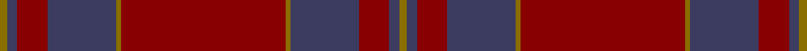

This is one **variant** — a specific cloth: this exact thread count and colourway, with its own
provenance below. It is one weaving of the [sett](/setts/y3dp4r12dp27y2r65y2dp27r12dp4y3/) (the scale-free proportion — the
same cloth at any scale or shade), whose colour order is pattern [GBRBGRGBRBG](/stripes/gbrbgrgbrbg/).

Part of the [Bell's](/tartans/b/be/bell-s/) tartan — the named design grouping this sett with its other cloths.

Sourced from register-of-tartans.  It is a [11 stripe tartan](/stripes/stripes11/).

Original link [https://www.tartanregister.gov.uk/tartanDetails.aspx?ref=246](https://www.tartanregister.gov.uk/tartanDetails.aspx?ref=246)

Dataset <small>— provenance for this record, inherited from the source manifest</small>

<dl class="dataset-prov">
<dt>source</dt><dd><a href="/sources/register-of-tartans/">Scottish Register of Tartans</a></dd>
<dt>data captured from</dt><dd><a href="https://github.com/thetartan/tartan-database/blob/master/data/register-of-tartans/data.csv">https://github.com/thetartan/tartan-database/blob/master/data/register-of-tartans/data.csv</a></dd>
<dt>data date</dt><dd>2000 <small>(this record)</small></dd>
<dt>licence</dt><dd><a href="https://www.tartanregister.gov.uk/copyright">Crown copyright</a></dd>
</dl>

Capture chain <small>— the hands this data passed through, oldest first; each capture carries its own licence</small>

<ol class="capture-chain">
<li><a href="https://www.tartanregister.gov.uk/">Scottish Register of Tartans</a> · <a href="https://www.tartanregister.gov.uk/copyright">Crown copyright</a> <small>the living register — still published by National Records of Scotland</small></li>
<li><a href="https://github.com/thetartan/tartan-database">thetartan/tartan-database</a> <small>2016-2017</small> · <a href="https://creativecommons.org/licenses/by-nc-nd/4.0/">CC BY-NC-ND 4.0</a> <small>Levko Kravets's frozen compilation — the capture we vendored, and where its CC licence text came from</small></li>
<li>this dictionary <small>captured 2026-06-10 · commit 5bf86c7566</small> <small>each re-capture is a git commit to data/sources</small></li>
</ol>

## Register references

External register numbers recorded for this tartan.

- Scottish Register of Tartans: [246](https://www.tartanregister.gov.uk/tartanDetails.aspx?ref=246)
- Scottish Tartans Authority (ITI): 4155

## Thread count
Y/6 DP8 R24 DP54 Y4 R130 Y4 DP54 R24 DP8 Y/6

One full sett is **632 threads**.

## Palette
<table><thead><tr><th>Colour</th><th>Shade</th><th>OKLCh</th></tr></thead><tbody><tr><td>LB</td><td><code style="background-color:#B5BBDE;">#B5BBDE</code> <small style="color:#888">#B5BBDE</small></td><td><small style="color:#888">oklch(79.9% 0.050 277.6)</small></td></tr><tr><td>DB</td><td><code style="background-color:#202060;">#202060</code> <small style="color:#888">#202060</small></td><td><small style="color:#888">oklch(28.9% 0.111 276.9)</small></td></tr><tr><td>DB</td><td><code style="background-color:#1C0070;">#1C0070</code> <small style="color:#888">#1C0070</small></td><td><small style="color:#888">oklch(26.3% 0.162 277.1)</small></td></tr><tr><td>R</td><td><code style="background-color:#880000;">#880000</code> <small style="color:#888">#880000</small></td><td><small style="color:#888">oklch(39.4% 0.162 29.2)</small></td></tr><tr><td>R</td><td><code style="background-color:#901C38;">#901C38</code> <small style="color:#888">#901C38</small></td><td><small style="color:#888">oklch(43.2% 0.150 13.1)</small></td></tr><tr><td>R</td><td><code style="background-color:#D60020;">#D60020</code> <small style="color:#888">#D60020</small></td><td><small style="color:#888">oklch(55.2% 0.224 25.5)</small></td></tr><tr><td>DP</td><td><code style="background-color:#3C3C60;">#3C3C60</code> <small style="color:#888">#3C3C60</small></td><td><small style="color:#888">oklch(37.3% 0.061 283.0)</small></td></tr><tr><td>Y</td><td><code style="background-color:#8B6E00;">#8B6E00</code> <small style="color:#888">#8B6E00</small></td><td><small style="color:#888">oklch(55.1% 0.113 90.4)</small></td></tr></tbody></table>

# Sample pattern

## Nearest tartan variants

The nearest existing variants by ΔTartan distance, with this cloth at the top so the swatches line up against it.

ΔTartan

Threads

Variant

Sett

—

632

<a href="/variants/s11/y3dp4r12dp27y2r65y2dp27r12dp4y3~x2~dp1502277-r1606028/">Bell's</a>

<a href="/ttd/edit/#slug=y6db8dr24db54y4dr130y4db54dr24db8y3&amp;base=y3dp4r12dp27y2r65y2dp27r12dp4y3~x2~dp1502277-r1606028" title="compare in the TTD">0.42</a>

629

<a href="/variants/s11/y6db8dr24db54y4dr130y4db54dr24db8y3/">Bell's (Corporate)</a>

<a href="/ttd/edit/#slug=r7dt2r3dg32r2dg2r2dt10r2lb2r31dt2r2dt1r6~x2~r1906028-dt1201300-dg1602166-lb3203246&amp;base=y3dp4r12dp27y2r65y2dp27r12dp4y3~x2~dp1502277-r1606028" title="compare in the TTD">3.86</a>

398

<a href="/variants/s15/r7dt2r3dg32r2dg2r2dt10r2lb2r31dt2r2dt1r6~x2~r1906028-dt1201300-dg1602166-lb3203246/">Drummond of Megginch - 1997 Kilt</a>

## Neighbour map

Every grey dot is one of 13656 variants placed by the first two principal components of the ΔTartan feature space (42% of its variance). Red is this tartan; blue dots are its nearest — click one to open its page. The map is a flat projection of a many-dimensional space — [how to read it](/posts/neighbourhood-maps/).

<svg viewBox="0 0 640 380" role="img" style="max-width:100%;height:auto;border:1px solid #e0e0e0;border-radius:4px;display:block" xmlns="http://www.w3.org/2000/svg"><image href="/nn/cloud.v1.png" width="640" height="380"/><a href="/variants/s11/y6db8dr24db54y4dr130y4db54dr24db8y3/"><circle cx="524.2" cy="163.3" r="4" fill="#3465a4"><title>Bell's (Corporate)</title></circle></a><a href="/variants/s15/r7dt2r3dg32r2dg2r2dt10r2lb2r31dt2r2dt1r6~x2~r1906028-dt1201300-dg1602166-lb3203246/"><circle cx="450.3" cy="133.0" r="4" fill="#3465a4"><title>Drummond of Megginch - 1997 Kilt</title></circle></a><circle cx="544.5" cy="176.7" r="5" fill="#c00000"/><text x="320" y="376" text-anchor="middle" font-size="11" fill="#999">ground</text><text x="11" y="190" text-anchor="middle" font-size="11" fill="#999" transform="rotate(-90 11 190)">complexity</text></svg>

ID: /variants/s11/y3dp4r12dp27y2r65y2dp27r12dp4y3~x2~dp1502277-r1606028/
