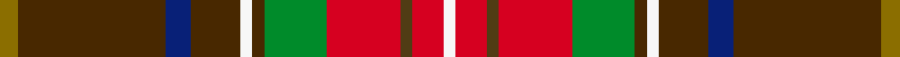

This is one **variant** — a specific cloth: this exact thread count and colourway, with its own
provenance below. It is one weaving of the [sett](/setts/y3dy24db4dy8w2dy2g10r12dyi2r5w2/) (the scale-free proportion — the
same cloth at any scale or shade), whose colour order is pattern [GGBGWGGRGRW](/stripes/ggbgwggrgrw/).

Part of the [Unidentified](/tartans/u/un/unidentified-75/) tartan — the named design grouping this sett with its other cloths.

Sourced from register-of-tartans.  It is a [11 stripe tartan](/stripes/stripes11/).

Original link [https://www.tartanregister.gov.uk/tartanDetails.aspx?ref=4269](https://www.tartanregister.gov.uk/tartanDetails.aspx?ref=4269)

Dataset <small>— provenance for this record, inherited from the source manifest</small>

<dl class="dataset-prov">
<dt>source</dt><dd><a href="/sources/register-of-tartans/">Scottish Register of Tartans</a></dd>
<dt>data captured from</dt><dd><a href="https://github.com/thetartan/tartan-database/blob/master/data/register-of-tartans/data.csv">https://github.com/thetartan/tartan-database/blob/master/data/register-of-tartans/data.csv</a></dd>
<dt>data date</dt><dd>2017-01-06 <small>(dataset default)</small></dd>
<dt>licence</dt><dd><a href="https://www.tartanregister.gov.uk/copyright">Crown copyright</a></dd>
</dl>

Capture chain <small>— the hands this data passed through, oldest first; each capture carries its own licence</small>

<ol class="capture-chain">
<li><a href="https://www.tartanregister.gov.uk/">Scottish Register of Tartans</a> · <a href="https://www.tartanregister.gov.uk/copyright">Crown copyright</a> <small>the living register — still published by National Records of Scotland</small></li>
<li><a href="https://github.com/thetartan/tartan-database">thetartan/tartan-database</a> <small>2016-2017</small> · <a href="https://creativecommons.org/licenses/by-nc-nd/4.0/">CC BY-NC-ND 4.0</a> <small>Levko Kravets's frozen compilation — the capture we vendored, and where its CC licence text came from</small></li>
<li>this dictionary <small>captured 2026-06-10 · commit 5bf86c7566</small> <small>each re-capture is a git commit to data/sources</small></li>
</ol>

## Register references

External register numbers recorded for this tartan.

- Scottish Register of Tartans: [4269](https://www.tartanregister.gov.uk/tartanDetails.aspx?ref=4269)
- Scottish Tartans World Register: 1862

## Thread count
Y/6 DY48 DB8 DY16 W4 DY4 G20 R24 DYi4 R10 W/4

One full sett is **286 threads**.

## Palette
<table><thead><tr><th>Colour</th><th>Shade</th><th>OKLCh</th></tr></thead><tbody><tr><td>DB</td><td><code style="background-color:#082077;">#082077</code> <small style="color:#888">#082077</small></td><td><small style="color:#888">oklch(30.0% 0.149 265.1)</small></td></tr><tr><td>G</td><td><code style="background-color:#008B2A;">#008B2A</code> <small style="color:#888">#008B2A</small></td><td><small style="color:#888">oklch(55.4% 0.170 145.9)</small></td></tr><tr><td>W</td><td><code style="background-color:#F7F7F7;">#F7F7F7</code> <small style="color:#888">#F7F7F7</small></td><td><small style="color:#888">oklch(97.6% 0.000 89.9)</small></td></tr><tr><td>R</td><td><code style="background-color:#D60020;">#D60020</code> <small style="color:#888">#D60020</small></td><td><small style="color:#888">oklch(55.2% 0.224 25.5)</small></td></tr><tr><td>DY</td><td><code style="background-color:#503C14;">#503C14</code> <small style="color:#888">#503C14</small></td><td><small style="color:#888">oklch(37.0% 0.062 81.8)</small></td></tr><tr><td>DY</td><td><code style="background-color:#482800;">#482800</code> <small style="color:#888">#482800</small></td><td><small style="color:#888">oklch(31.1% 0.070 65.5)</small></td></tr><tr><td>Y</td><td><code style="background-color:#8B6E00;">#8B6E00</code> <small style="color:#888">#8B6E00</small></td><td><small style="color:#888">oklch(55.1% 0.113 90.4)</small></td></tr></tbody></table>

# Sample pattern

## Nearest tartan variants

The nearest existing variants by ΔTartan distance, with this cloth at the top so the swatches line up against it.

ΔTartan

Threads

Variant

Sett

—

286

<a href="/variants/s11/y3dy24db4dy8w2dy2g10r12dyi2r5w2~x2~dy1203057-dyi1502083/">Unidentified (Possibly Muirhead)</a>

<a href="/ttd/edit/#slug=y3o24db4o8w2o2g10r12oi2r5w2~x2~o1604043-oi2102055&amp;base=y3dy24db4dy8w2dy2g10r12dyi2r5w2~x2~dy1203057-dyi1502083" title="compare in the TTD">0.64</a>

286

<a href="/variants/s11/y3o24db4o8w2o2g10r12oi2r5w2~x2~o1604043-oi2102055/">Unidentified 31</a>

<a href="/ttd/edit/#slug=o16db8n2o2db2o2r1g4dg4o4w2~x4&amp;base=y3dy24db4dy8w2dy2g10r12dyi2r5w2~x2~dy1203057-dyi1502083" title="compare in the TTD">2.29</a>

304

<a href="/variants/s11/o16db8n2o2db2o2r1g4dg4o4w2~x4/">Scottish H &amp; I Film Com (Corporate)</a>

<a href="/ttd/edit/#slug=y10o1g2y2b2dr1b2y2g2o1y10dr7w3dr13db5~x2&amp;base=y3dy24db4dy8w2dy2g10r12dyi2r5w2~x2~dy1203057-dyi1502083" title="compare in the TTD">2.37</a>

222

<a href="/variants/s15/y10o1g2y2b2dr1b2y2g2o1y10dr7w3dr13db5~x2/">Contrecoeur</a>

<a href="/ttd/edit/#slug=r14lb4dt6y1dt2w2dt2g12r6dt2r2w1~x4&amp;base=y3dy24db4dy8w2dy2g10r12dyi2r5w2~x2~dy1203057-dyi1502083" title="compare in the TTD">2.76</a>

372

<a href="/variants/s12/r14lb4dt6y1dt2w2dt2g12r6dt2r2w1~x4/">Stewart - Pr Ch Ed (Royal)</a>

<a href="/ttd/edit/#slug=y3r16n5dy22g2dy4w3~x2&amp;base=y3dy24db4dy8w2dy2g10r12dyi2r5w2~x2~dy1203057-dyi1502083" title="compare in the TTD">2.89</a>

208

<a href="/variants/s7/y3r16n5dy22g2dy4w3~x2/">Pubcrawlers, The</a>

<a href="/ttd/edit/#slug=dr10lb1dr2n1dr1n1lo1n4lr2r1lr2lo1~x8~lb3103284-lr3200000&amp;base=y3dy24db4dy8w2dy2g10r12dyi2r5w2~x2~dy1203057-dyi1502083" title="compare in the TTD">3.03</a>

344

<a href="/variants/s12/dr10lb1dr2n1dr1n1lo1n4lbi2r1lbi2lo1~x8~lb3103284-lbi3200000/">Rathmore</a>

<a href="/ttd/edit/#slug=o20dp2o2dp2o3dp8dg9g8r8dg1b2~x2~dp0904331-dg1104144&amp;base=y3dy24db4dy8w2dy2g10r12dyi2r5w2~x2~dy1203057-dyi1502083" title="compare in the TTD">3.12</a>

216

<a href="/variants/s11/o20dp2o2dp2o3dp8dg9g8r8dg1b2~x2~dp0904331-dg1104144/">Isle of Skye</a>

<a href="/ttd/edit/#slug=dg18ri4dg4r6dg28dp28r4lb3y4lb13r6~ri2806019-r2109032&amp;base=y3dy24db4dy8w2dy2g10r12dyi2r5w2~x2~dy1203057-dyi1502083" title="compare in the TTD">3.18</a>

212

<a href="/variants/s11/dg18ri4dg4r6dg28dp28r4lb3y4lb13r6~ri2806019-r2109032/">Unidentified (Woven sample)</a>

<a href="/ttd/edit/#slug=w3dt5db2dt9n10lb2n4lb2g10r33w2~x2~dt1204274-db1406275&amp;base=y3dy24db4dy8w2dy2g10r12dyi2r5w2~x2~dy1203057-dyi1502083" title="compare in the TTD">3.19</a>

318

<a href="/variants/s11/w3db5dbi2db9n10lb2n4lb2g10r33w2~x2~db1204274-dbi1406275/">Inverclyde (Corporate)</a>

<a href="/ttd/edit/#slug=y10dy1g2y2lr2dr1lr2y2g2dy1y10dr7w3dr13db5~x2&amp;base=y3dy24db4dy8w2dy2g10r12dyi2r5w2~x2~dy1203057-dyi1502083" title="compare in the TTD">3.32</a>

222

<a href="/variants/s15/y10dy1g2y2lr2dr1lr2y2g2dy1y10dr7w3dr13db5~x2/">Contrecoeur</a>

## Neighbour map

Every grey dot is one of 13621 variants placed by the first two principal components of the ΔTartan feature space (42% of its variance). Red is this tartan; blue dots are its nearest — click one to open its page. The map is a flat projection of a many-dimensional space — [how to read it](/posts/neighbourhood-maps/).

<svg viewBox="0 0 640 380" role="img" style="max-width:100%;height:auto;border:1px solid #e0e0e0;border-radius:4px;display:block" xmlns="http://www.w3.org/2000/svg"><image href="/nn/cloud.v1.png" width="640" height="380"/><a href="/variants/s11/y3o24db4o8w2o2g10r12oi2r5w2~x2~o1604043-oi2102055/"><circle cx="214.7" cy="137.9" r="4" fill="#3465a4"><title>Unidentified 31</title></circle></a><a href="/variants/s11/o16db8n2o2db2o2r1g4dg4o4w2~x4/"><circle cx="236.2" cy="124.9" r="4" fill="#3465a4"><title>Scottish H &amp; I Film Com (Corporate)</title></circle></a><a href="/variants/s15/y10o1g2y2b2dr1b2y2g2o1y10dr7w3dr13db5~x2/"><circle cx="168.0" cy="131.7" r="4" fill="#3465a4"><title>Contrecoeur</title></circle></a><a href="/variants/s12/r14lb4dt6y1dt2w2dt2g12r6dt2r2w1~x4/"><circle cx="177.1" cy="138.4" r="4" fill="#3465a4"><title>Stewart - Pr Ch Ed (Royal)</title></circle></a><a href="/variants/s7/y3r16n5dy22g2dy4w3~x2/"><circle cx="241.7" cy="171.4" r="4" fill="#3465a4"><title>Pubcrawlers, The</title></circle></a><a href="/variants/s12/dr10lb1dr2n1dr1n1lo1n4lbi2r1lbi2lo1~x8~lb3103284-lbi3200000/"><circle cx="233.3" cy="144.1" r="4" fill="#3465a4"><title>Rathmore</title></circle></a><a href="/variants/s11/o20dp2o2dp2o3dp8dg9g8r8dg1b2~x2~dp0904331-dg1104144/"><circle cx="199.8" cy="140.4" r="4" fill="#3465a4"><title>Isle of Skye</title></circle></a><a href="/variants/s11/dg18ri4dg4r6dg28dp28r4lb3y4lb13r6~ri2806019-r2109032/"><circle cx="175.4" cy="164.0" r="4" fill="#3465a4"><title>Unidentified (Woven sample)</title></circle></a><a href="/variants/s11/w3db5dbi2db9n10lb2n4lb2g10r33w2~x2~db1204274-dbi1406275/"><circle cx="179.6" cy="106.8" r="4" fill="#3465a4"><title>Inverclyde (Corporate)</title></circle></a><a href="/variants/s15/y10dy1g2y2lr2dr1lr2y2g2dy1y10dr7w3dr13db5~x2/"><circle cx="179.0" cy="141.1" r="4" fill="#3465a4"><title>Contrecoeur</title></circle></a><circle cx="195.1" cy="133.9" r="5" fill="#c00000"/><text x="320" y="376" text-anchor="middle" font-size="11" fill="#999">ground</text><text x="11" y="190" text-anchor="middle" font-size="11" fill="#999" transform="rotate(-90 11 190)">complexity</text></svg>

ID: /variants/s11/y3dy24db4dy8w2dy2g10r12dyi2r5w2~x2~dy1203057-dyi1502083/
