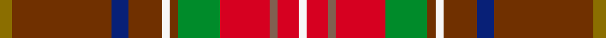

This page is one **sett** — a single exact thread-count. It belongs to the [tartan](/setts/y3o24db4o8w2o2g10r12oi2r5w2/)
(the same proportion at any scale), whose colour order is pattern [GRBRWRGRRRW](/stripes/grbrwrgrrrw/).

Sourced from weddslist.  It is a [11 stripe tartan](/stripes/stripes11/).

Original link [http://www.weddslist.com/cgi-bin/tartans/pg.pl?source=sts](http://www.weddslist.com/cgi-bin/tartans/pg.pl?source=sts)

Dataset <small>— provenance for this record, inherited from the source manifest</small>

<dl class="dataset-prov">
<dt>source</dt><dd><a href="/sources/weddslist/">Weddslist</a></dd>
<dt>data captured from</dt><dd><a href="https://github.com/thetartan/tartan-database/blob/master/data/weddslist/data.csv">https://github.com/thetartan/tartan-database/blob/master/data/weddslist/data.csv</a></dd>
<dt>data date</dt><dd>2016-11-17 <small>(dataset default)</small></dd>
<dt>licence</dt><dd><a href="https://creativecommons.org/licenses/by-nc-nd/4.0/">CC BY-NC-ND 4.0</a></dd>
</dl>

Capture chain <small>— the hands this data passed through, oldest first; each capture carries its own licence</small>

<ol class="capture-chain">
<li><a href="https://www.weddslist.com/tartans/">Weddslist</a> <small>the living privately compiled reference</small></li>
<li><a href="https://github.com/thetartan/tartan-database">thetartan/tartan-database</a> <small>2016-2017</small> · <a href="https://creativecommons.org/licenses/by-nc-nd/4.0/">CC BY-NC-ND 4.0</a> <small>Levko Kravets's frozen compilation — the capture we vendored, and where its CC licence text came from</small></li>
<li>this dictionary <small>captured 2026-06-10 · commit 5bf86c7566</small> <small>each re-capture is a git commit to data/sources</small></li>
</ol>

## Thread count
Y/6 O48 DB8 O16 W4 O4 G20 R24 Oi4 R10 W/4

One full sett is **286 threads**.

## Palette
<table><thead><tr><th>Colour</th><th>Shade</th><th>OKLCh</th></tr></thead><tbody><tr><td>DB</td><td><code style="background-color:#082077;">#082077</code> <small style="color:#888">#082077</small></td><td><small style="color:#888">oklch(30.0% 0.149 265.1)</small></td></tr><tr><td>G</td><td><code style="background-color:#008B2A;">#008B2A</code> <small style="color:#888">#008B2A</small></td><td><small style="color:#888">oklch(55.4% 0.170 145.9)</small></td></tr><tr><td>W</td><td><code style="background-color:#F7F7F7;">#F7F7F7</code> <small style="color:#888">#F7F7F7</small></td><td><small style="color:#888">oklch(97.6% 0.000 89.9)</small></td></tr><tr><td>O</td><td><code style="background-color:#806050;">#806050</code> <small style="color:#888">#806050</small></td><td><small style="color:#888">oklch(51.7% 0.049 47.8)</small></td></tr><tr><td>R</td><td><code style="background-color:#D60020;">#D60020</code> <small style="color:#888">#D60020</small></td><td><small style="color:#888">oklch(55.2% 0.224 25.5)</small></td></tr><tr><td>O</td><td><code style="background-color:#703000;">#703000</code> <small style="color:#888">#703000</small></td><td><small style="color:#888">oklch(39.1% 0.105 49.1)</small></td></tr><tr><td>Y</td><td><code style="background-color:#8B6E00;">#8B6E00</code> <small style="color:#888">#8B6E00</small></td><td><small style="color:#888">oklch(55.1% 0.113 90.4)</small></td></tr></tbody></table>

# Sample pattern

## Nearest tartan variants

The nearest existing variants by ΔTartan distance, with this cloth at the top so the swatches line up against it.

ΔTartan

Threads

Variant

Sett

—

286

<a href="/variants/s11/y3o24db4o8w2o2g10r12oi2r5w2~x2~o1604043-oi2102055/">Unidentified 31</a>

<a href="/ttd/edit/#slug=y3dy24db4dy8w2dy2g10r12dyi2r5w2~x2~dy1203057-dyi1502083&amp;base=y3o24db4o8w2o2g10r12oi2r5w2~x2~o1604043-oi2102055" title="compare in the TTD">0.64</a>

286

<a href="/variants/s11/y3dy24db4dy8w2dy2g10r12dyi2r5w2~x2~dy1203057-dyi1502083/">Unidentified (Possibly Muirhead)</a>

<a href="/ttd/edit/#slug=o16db8n2o2db2o2r1g4dg4o4w2~x4&amp;base=y3o24db4o8w2o2g10r12oi2r5w2~x2~o1604043-oi2102055" title="compare in the TTD">2.86</a>

304

<a href="/variants/s11/o16db8n2o2db2o2r1g4dg4o4w2~x4/">Scottish H &amp; I Film Com (Corporate)</a>

<a href="/ttd/edit/#slug=y10o1g2y2b2dr1b2y2g2o1y10dr7w3dr13db5~x2&amp;base=y3o24db4o8w2o2g10r12oi2r5w2~x2~o1604043-oi2102055" title="compare in the TTD">2.89</a>

222

<a href="/variants/s15/y10o1g2y2b2dr1b2y2g2o1y10dr7w3dr13db5~x2/">Contrecoeur</a>

<a href="/ttd/edit/#slug=r1dy1r9g6lg2gi3r2y1~x4~lg2803208-gi2203208&amp;base=y3o24db4o8w2o2g10r12oi2r5w2~x2~o1604043-oi2102055" title="compare in the TTD">2.90</a>

192

<a href="/variants/s8/r1dy1r9g6lg2t3r2y1~x4~lg2803208-t2203208/">Battle of Bannockburn, The</a>

<a href="/ttd/edit/#slug=r1do1r9g6lb2t3r2ly1~x4&amp;base=y3o24db4o8w2o2g10r12oi2r5w2~x2~o1604043-oi2102055" title="compare in the TTD">3.12</a>

192

<a href="/variants/s8/r1do1r9g6lb2t3r2ly1~x4/">Battle of Bannockburn, The</a>

<a href="/ttd/edit/#slug=y3r16n5dy22g2dy4w3~x2&amp;base=y3o24db4o8w2o2g10r12oi2r5w2~x2~o1604043-oi2102055" title="compare in the TTD">3.15</a>

208

<a href="/variants/s7/y3r16n5dy22g2dy4w3~x2/">Pubcrawlers, The</a>

<a href="/ttd/edit/#slug=r2ri6db5lg3g13ri20do2ri2~x2~r1906038-ri2109032&amp;base=y3o24db4o8w2o2g10r12oi2r5w2~x2~o1604043-oi2102055" title="compare in the TTD">3.18</a>

204

<a href="/variants/s8/r2ri6db5lg3g13ri20do2ri2~x2~r1906038-ri2109032/">Flowers of the Forest, The</a>

<a href="/ttd/edit/#slug=lb6dg2lb2dg5dr20o2dr2o25r2o2r4g10dr2~x2&amp;base=y3o24db4o8w2o2g10r12oi2r5w2~x2~o1604043-oi2102055" title="compare in the TTD">3.19</a>

320

<a href="/variants/s13/lb6dg2lb2dg5dr20o2dr2o25r2o2r4g10dr2~x2/">Strathtay</a>

<a href="/ttd/edit/#slug=ri26g5dg7r2do9lr1lo1dg4~x2~ri2109032-r1807033&amp;base=y3o24db4o8w2o2g10r12oi2r5w2~x2~o1604043-oi2102055" title="compare in the TTD">3.24</a>

160

<a href="/variants/s8/ri26g5dg7r2do9lr1lo1dg4~x2~ri2109032-r1807033/">Tartan Army Whisky</a>

<a href="/ttd/edit/#slug=r26g5dg7dr2do9lo1loi1dg4~x2~lo2706066-loi2905070&amp;base=y3o24db4o8w2o2g10r12oi2r5w2~x2~o1604043-oi2102055" title="compare in the TTD">3.24</a>

160

<a href="/variants/s8/r26g5dg7dr2do9lo1loi1dg4~x2~lo2706066-loi2905070/">Tartan Army Whisky</a>

## Neighbour map

Every grey dot is one of 13621 variants placed by the first two principal components of the ΔTartan feature space (42% of its variance). Red is this tartan; blue dots are its nearest — click one to open its page.

<svg viewBox="0 0 640 380" role="img" style="max-width:100%;height:auto;border:1px solid #e0e0e0;border-radius:4px;display:block" xmlns="http://www.w3.org/2000/svg"><image href="/nn/cloud.v1.png" width="640" height="380"/><a href="/variants/s11/y3dy24db4dy8w2dy2g10r12dyi2r5w2~x2~dy1203057-dyi1502083/"><circle cx="195.1" cy="134.1" r="4" fill="#3465a4"><title>Unidentified (Possibly Muirhead)</title></circle></a><a href="/variants/s11/o16db8n2o2db2o2r1g4dg4o4w2~x4/"><circle cx="236.2" cy="125.1" r="4" fill="#3465a4"><title>Scottish H &amp; I Film Com (Corporate)</title></circle></a><a href="/variants/s15/y10o1g2y2b2dr1b2y2g2o1y10dr7w3dr13db5~x2/"><circle cx="168.0" cy="131.8" r="4" fill="#3465a4"><title>Contrecoeur</title></circle></a><a href="/variants/s8/r1dy1r9g6lg2t3r2y1~x4~lg2803208-t2203208/"><circle cx="247.2" cy="186.3" r="4" fill="#3465a4"><title>Battle of Bannockburn, The</title></circle></a><a href="/variants/s8/r1do1r9g6lb2t3r2ly1~x4/"><circle cx="234.6" cy="182.2" r="4" fill="#3465a4"><title>Battle of Bannockburn, The</title></circle></a><a href="/variants/s7/y3r16n5dy22g2dy4w3~x2/"><circle cx="241.7" cy="171.5" r="4" fill="#3465a4"><title>Pubcrawlers, The</title></circle></a><a href="/variants/s8/r2ri6db5lg3g13ri20do2ri2~x2~r1906038-ri2109032/"><circle cx="260.3" cy="165.7" r="4" fill="#3465a4"><title>Flowers of the Forest, The</title></circle></a><a href="/variants/s13/lb6dg2lb2dg5dr20o2dr2o25r2o2r4g10dr2~x2/"><circle cx="185.4" cy="136.5" r="4" fill="#3465a4"><title>Strathtay</title></circle></a><a href="/variants/s8/ri26g5dg7r2do9lr1lo1dg4~x2~ri2109032-r1807033/"><circle cx="274.5" cy="112.4" r="4" fill="#3465a4"><title>Tartan Army Whisky</title></circle></a><a href="/variants/s8/r26g5dg7dr2do9lo1loi1dg4~x2~lo2706066-loi2905070/"><circle cx="266.7" cy="109.3" r="4" fill="#3465a4"><title>Tartan Army Whisky</title></circle></a><circle cx="214.7" cy="138.0" r="5" fill="#c00000"/><text x="320" y="376" text-anchor="middle" font-size="11" fill="#999">ground</text><text x="11" y="190" text-anchor="middle" font-size="11" fill="#999" transform="rotate(-90 11 190)">complexity</text></svg>

ID: /variants/s11/y3o24db4o8w2o2g10r12oi2r5w2~x2~o1604043-oi2102055/
