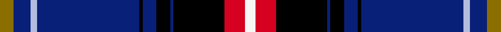

This page is one **sett** — a single exact thread-count. It belongs to the [tartan](/setts/y4db5lb2db30k1db4k4db1k15r6w3/)
(the same proportion at any scale), whose colour order is pattern [GBWBKBKBKRW](/stripes/gbwbkbkbkrw/).

Sourced from register-of-tartans.  It is a [11 stripe tartan](/stripes/stripes11/).

Original link https://www.tartanregister.gov.uk/tartanDetails.aspx?ref=5909

## Register references

External register numbers recorded for this tartan.

- Scottish Register of Tartans: [5909](https://www.tartanregister.gov.uk/tartanDetails.aspx?ref=5909)
- Scottish Tartans World Register: 3142

## Thread count
Y/8 DB10 LB4 DB60 K2 DB8 K8 DB2 K30 R12 W/6

One full sett is **286 threads**.

## Palette
<table><thead><tr><th>Colour</th><th>Shade</th><th>OKLCh</th></tr></thead><tbody><tr><td>LB</td><td><code style="background-color:#B5BBDE;">#B5BBDE</code> <small style="color:#888">#B5BBDE</small></td><td><small style="color:#888">oklch(79.9% 0.050 277.6)</small></td></tr><tr><td>DB</td><td><code style="background-color:#082077;">#082077</code> <small style="color:#888">#082077</small></td><td><small style="color:#888">oklch(30.0% 0.149 265.1)</small></td></tr><tr><td>K</td><td><code style="background-color:#000000;">#000000</code> <small style="color:#888">#000000</small></td><td><small style="color:#888">oklch(0.0% 0.000 0.0)</small></td></tr><tr><td>W</td><td><code style="background-color:#F7F7F7;">#F7F7F7</code> <small style="color:#888">#F7F7F7</small></td><td><small style="color:#888">oklch(97.6% 0.000 89.9)</small></td></tr><tr><td>R</td><td><code style="background-color:#D60020;">#D60020</code> <small style="color:#888">#D60020</small></td><td><small style="color:#888">oklch(55.2% 0.224 25.5)</small></td></tr><tr><td>Y</td><td><code style="background-color:#8B6E00;">#8B6E00</code> <small style="color:#888">#8B6E00</small></td><td><small style="color:#888">oklch(55.1% 0.113 90.4)</small></td></tr></tbody></table>

# Sample pattern

## Nearest variants

The nearest existing variants by ΔTartan distance, with this cloth at the top so the swatches line up against it.

ΔTartan

Threads

Variant

Sett

—

286

<a href="/variants/s11/y4db5lb2db30k1db4k4db1k15r6w3~x2/">Correctional Service Canada</a>

<a href="/ttd/edit/#slug=dr3g10k12db3k2db2k2db30dr4w1~x2&amp;base=y4db5lb2db30k1db4k4db1k15r6w3~x2" title="compare in the TTD">2.25</a>

268

<a href="/variants/s10/dr3g10k12db3k2db2k2db30dr4w1~x2/">McClafferty</a>

<a href="/ttd/edit/#slug=w3db1k14db2k1g6k1db30ly3~x2&amp;base=y4db5lb2db30k1db4k4db1k15r6w3~x2" title="compare in the TTD">2.81</a>

232

<a href="/variants/s9/w3db1k14db2k1g6k1db30ly3~x2/">Bro-Kerne</a>

## Neighbour map

Every grey dot is one of 13620 variants placed by the first two principal components of the ΔTartan feature space (42% of its variance). Red is this tartan; blue dots are its nearest — click one to open its page.

<svg viewBox="0 0 640 380" role="img" style="max-width:100%;height:auto;border:1px solid #e0e0e0;border-radius:4px;display:block" xmlns="http://www.w3.org/2000/svg"><image href="/nn/cloud.v1.png" width="640" height="380"/><a href="/variants/s10/dr3g10k12db3k2db2k2db30dr4w1~x2/"><circle cx="269.2" cy="99.0" r="4" fill="#3465a4"><title>McClafferty</title></circle></a><a href="/variants/s9/w3db1k14db2k1g6k1db30ly3~x2/"><circle cx="270.0" cy="86.5" r="4" fill="#3465a4"><title>Bro-Kerne</title></circle></a><circle cx="244.1" cy="71.6" r="5" fill="#c00000"/><text x="320" y="376" text-anchor="middle" font-size="11" fill="#999">ground</text><text x="11" y="190" text-anchor="middle" font-size="11" fill="#999" transform="rotate(-90 11 190)">complexity</text></svg>

ID: /variants/s11/y4db5lb2db30k1db4k4db1k15r6w3~x2/
