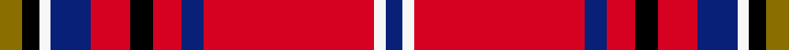

This page is one **sett** — a single exact thread-count. It belongs to the [tartan](/setts/y4k3w2db7r7k4r5db4r30w2db3/)
(the same proportion at any scale), whose colour order is pattern [BWRBRKRBWKG](/stripes/bwrbrkrbwkg/).

Sourced from tartans-authority.  It is a [11 stripe tartan](/stripes/stripes11/).

Original link https://www.tartanregister.gov.uk/tartanDetails.aspx?ref=6306

2 attestations — the source records this cloth was collapsed from (oldest owns this page)

<ul>
<li>pre 2004 — Hart (Texas) (Personal) (tartans-authority, <a href="https://www.tartanregister.gov.uk/tartanDetails.aspx?ref=6306">record</a>)  <em>Designed by Linda Clifford for the family of Ernest Neve Hart III, originally from St Mary Cray in Kent, England. No details of design rationale.</em></li>
<li>undated — Hart (Texas) (Personal) (register-of-tartans, <a href="https://www.tartanregister.gov.uk/tartanDetails.aspx?ref=5345">record</a>)  <em>Designed by Linda Clifford for the family of Ernest Neve Hart III, originally from St Mary Cray in Kent, England. No details of design rationale.</em></li>
</ul>

Dataset <small>— provenance for this record, inherited from the source manifest</small>

<dl class="dataset-prov">
<dt>source</dt><dd><a href="/sources/tartans-authority/">Scottish Tartans Authority</a></dd>
<dt>data captured from</dt><dd><a href="https://github.com/thetartan/tartan-database/blob/master/data/tartans-authority/data.csv">https://github.com/thetartan/tartan-database/blob/master/data/tartans-authority/data.csv</a></dd>
<dt>data date</dt><dd>pre 2004 <small>(this record)</small></dd>
<dt>licence</dt><dd><a href="https://creativecommons.org/licenses/by-nc-nd/4.0/">CC BY-NC-ND 4.0</a></dd>
</dl>

Capture chain <small>— the hands this data passed through, oldest first; each capture carries its own licence</small>

<ol class="capture-chain">
<li><a href="https://www.tartansauthority.com/">Scottish Tartans Authority</a> <small>the heritage body's archive — its tartan-ferret record browser is retired (links repaired to the SRT, above)</small></li>
<li><a href="https://github.com/thetartan/tartan-database">thetartan/tartan-database</a> <small>2016-2017</small> · <a href="https://creativecommons.org/licenses/by-nc-nd/4.0/">CC BY-NC-ND 4.0</a> <small>Levko Kravets's frozen compilation — the capture we vendored, and where its CC licence text came from</small></li>
<li>this dictionary <small>captured 2026-06-10 · commit 5bf86c7566</small> <small>each re-capture is a git commit to data/sources</small></li>
</ol>

## Register references

External register numbers recorded for this tartan.

- Scottish Register of Tartans: [5345](https://www.tartanregister.gov.uk/tartanDetails.aspx?ref=5345)
- Scottish Tartans Authority (ITI): 6306
- Scottish Tartans World Register: 3028

## Thread count
Y/8 K6 W4 DB14 R14 K8 R10 DB8 R60 W4 DB/6

One full sett is **270 threads**.

## Palette
<table><thead><tr><th>Colour</th><th>Shade</th><th>OKLCh</th></tr></thead><tbody><tr><td>DB</td><td><code style="background-color:#082077;">#082077</code> <small style="color:#888">#082077</small></td><td><small style="color:#888">oklch(30.0% 0.149 265.1)</small></td></tr><tr><td>K</td><td><code style="background-color:#000000;">#000000</code> <small style="color:#888">#000000</small></td><td><small style="color:#888">oklch(0.0% 0.000 0.0)</small></td></tr><tr><td>R</td><td><code style="background-color:#D60020;">#D60020</code> <small style="color:#888">#D60020</small></td><td><small style="color:#888">oklch(55.2% 0.224 25.5)</small></td></tr><tr><td>W</td><td><code style="background-color:#F7F7F7;">#F7F7F7</code> <small style="color:#888">#F7F7F7</small></td><td><small style="color:#888">oklch(97.6% 0.000 89.9)</small></td></tr><tr><td>Y</td><td><code style="background-color:#8B6E00;">#8B6E00</code> <small style="color:#888">#8B6E00</small></td><td><small style="color:#888">oklch(55.1% 0.113 90.4)</small></td></tr></tbody></table>

# Sample pattern

## Nearest tartan variants

The nearest existing variants by ΔTartan distance, with this cloth at the top so the swatches line up against it.

ΔTartan

Threads

Variant

Sett

—

270

<a href="/variants/s11/y4k3w2db7r7k4r5db4r30w2db3~x2/">Hart (Texas) (Personal)</a>

<a href="/ttd/edit/#slug=dg2r26db4r2k4r2dg8r4k1r1w2~x2&amp;base=y4k3w2db7r7k4r5db4r30w2db3~x2" title="compare in the TTD">2.37</a>

216

<a href="/variants/s11/dg2r26db4r2k4r2dg8r4k1r1w2~x2/">Stewart/Stuart of Rothesay (Sobieski)</a>

<a href="/ttd/edit/#slug=r6y1r24g6db2k1db2k1db12r1~x2&amp;base=y4k3w2db7r7k4r5db4r30w2db3~x2" title="compare in the TTD">2.42</a>

210

<a href="/variants/s10/r6y1r24g6db2k1db2k1db12r1~x2/">MacEdward</a>

<a href="/ttd/edit/#slug=r21db4k5y2k2y2k2r7g4r2db3y2~x4&amp;base=y4k3w2db7r7k4r5db4r30w2db3~x2" title="compare in the TTD">2.44</a>

356

<a href="/variants/s12/r21db4k5y2k2y2k2r7g4r2db3y2~x4/">Hepburn (Clan)</a>

<a href="/ttd/edit/#slug=r21db4k5y2k2y2k2r7g4r2db3y2~x2&amp;base=y4k3w2db7r7k4r5db4r30w2db3~x2" title="compare in the TTD">2.44</a>

178

<a href="/variants/s12/r21db4k5y2k2y2k2r7g4r2db3y2~x2/">Hepburn</a>

<a href="/ttd/edit/#slug=r23db2r1o2r1db2r4db10k2lo2~x2&amp;base=y4k3w2db7r7k4r5db4r30w2db3~x2" title="compare in the TTD">2.62</a>

146

<a href="/variants/s10/r23db2r1o2r1db2r4db10k2lo2~x2/">Chang-Miller (Personal)</a>

<a href="/ttd/edit/#slug=r68n5k9y3k3lb3k3dg20r9k3r5lb4&amp;base=y4k3w2db7r7k4r5db4r30w2db3~x2" title="compare in the TTD">2.63</a>

198

<a href="/variants/s12/r68n5k9y3k3lb3k3dg20r9k3r5lb4/">British Caledonian Airways #4</a>

<a href="/ttd/edit/#slug=y3r25k8r4db8w2db3w2db8r4g8r25y3~x2&amp;base=y4k3w2db7r7k4r5db4r30w2db3~x2" title="compare in the TTD">2.66</a>

400

<a href="/variants/s13/y3r25k8r4db8w2db3w2db8r4g8r25y3~x2/">Maynard</a>

<a href="/ttd/edit/#slug=g2r26db4r2k4r2g8r4k1r1w2~x2&amp;base=y4k3w2db7r7k4r5db4r30w2db3~x2" title="compare in the TTD">2.70</a>

216

<a href="/variants/s11/g2r26db4r2k4r2g8r4k1r1w2~x2/">Stewart of Rothesay</a>

<a href="/ttd/edit/#slug=k3w1r20db4r4g10r4db4r20k1w3~x2&amp;base=y4k3w2db7r7k4r5db4r30w2db3~x2" title="compare in the TTD">2.73</a>

284

<a href="/variants/s11/k3w1r20db4r4g10r4db4r20k1w3~x2/">Hoben (Personal)</a>

<a href="/ttd/edit/#slug=lb6k2r32lo2k6lo2r4k2lb3~x2&amp;base=y4k3w2db7r7k4r5db4r30w2db3~x2" title="compare in the TTD">2.74</a>

218

<a href="/variants/s9/lb6k2r32lo2k6lo2r4k2lb3~x2/">Lantern, The</a>

## Neighbour map

Every grey dot is one of 13620 variants placed by the first two principal components of the ΔTartan feature space (42% of its variance). Red is this tartan; blue dots are its nearest — click one to open its page.

<svg viewBox="0 0 640 380" role="img" style="max-width:100%;height:auto;border:1px solid #e0e0e0;border-radius:4px;display:block" xmlns="http://www.w3.org/2000/svg"><image href="/nn/cloud.v1.png" width="640" height="380"/><a href="/variants/s11/dg2r26db4r2k4r2dg8r4k1r1w2~x2/"><circle cx="328.5" cy="72.0" r="4" fill="#3465a4"><title>Stewart/Stuart of Rothesay (Sobieski)</title></circle></a><a href="/variants/s10/r6y1r24g6db2k1db2k1db12r1~x2/"><circle cx="305.5" cy="95.5" r="4" fill="#3465a4"><title>MacEdward</title></circle></a><a href="/variants/s12/r21db4k5y2k2y2k2r7g4r2db3y2~x4/"><circle cx="224.4" cy="119.0" r="4" fill="#3465a4"><title>Hepburn (Clan)</title></circle></a><a href="/variants/s12/r21db4k5y2k2y2k2r7g4r2db3y2~x2/"><circle cx="224.4" cy="119.0" r="4" fill="#3465a4"><title>Hepburn</title></circle></a><a href="/variants/s10/r23db2r1o2r1db2r4db10k2lo2~x2/"><circle cx="336.4" cy="89.9" r="4" fill="#3465a4"><title>Chang-Miller (Personal)</title></circle></a><a href="/variants/s12/r68n5k9y3k3lb3k3dg20r9k3r5lb4/"><circle cx="301.7" cy="50.1" r="4" fill="#3465a4"><title>British Caledonian Airways #4</title></circle></a><a href="/variants/s13/y3r25k8r4db8w2db3w2db8r4g8r25y3~x2/"><circle cx="222.0" cy="106.2" r="4" fill="#3465a4"><title>Maynard</title></circle></a><a href="/variants/s11/g2r26db4r2k4r2g8r4k1r1w2~x2/"><circle cx="325.8" cy="73.1" r="4" fill="#3465a4"><title>Stewart of Rothesay</title></circle></a><a href="/variants/s11/k3w1r20db4r4g10r4db4r20k1w3~x2/"><circle cx="319.0" cy="105.6" r="4" fill="#3465a4"><title>Hoben (Personal)</title></circle></a><a href="/variants/s9/lb6k2r32lo2k6lo2r4k2lb3~x2/"><circle cx="318.9" cy="105.0" r="4" fill="#3465a4"><title>Lantern, The</title></circle></a><circle cx="277.4" cy="101.0" r="5" fill="#c00000"/><text x="320" y="376" text-anchor="middle" font-size="11" fill="#999">ground</text><text x="11" y="190" text-anchor="middle" font-size="11" fill="#999" transform="rotate(-90 11 190)">complexity</text></svg>

ID: /variants/s11/y4k3w2db7r7k4r5db4r30w2db3~x2/
