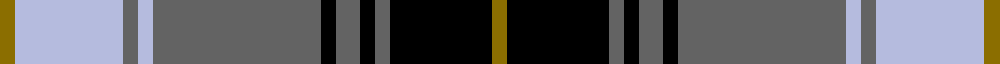

This is one **variant** — a specific cloth: this exact thread count and colourway, with its own
provenance below. It is one weaving of the [sett](/tartans/c/ch/chartered-institute-of-bankers-corp/) (the scale-free proportion — the
same cloth at any scale or shade), whose colour order is pattern [GKBKBKBWBWG](/stripes/gkbkbkbwbwg/).

Part of the [Chartered Institute of Bankers (Corp](/tartans/c/ch/chartered-institute-of-bankers-corp/) tartan — the named design grouping this sett with its other cloths.

Sourced from register-of-tartans.  It is a [11 stripe tartan](/stripes/stripes11/).

Original link [https://www.tartanregister.gov.uk/tartanDetails.aspx?ref=618](https://www.tartanregister.gov.uk/tartanDetails.aspx?ref=618)

2 attestations — the source records this cloth was collapsed from (oldest owns this page)

<ul>
<li>01/05/2002 — Chartered Institute of Bankers in Scotland (register-of-tartans, <a href="https://www.tartanregister.gov.uk/tartanDetails.aspx?ref=618">record</a>)  <em>The Chartered Institute of Bankers in Scotland was founded in Edinburgh in 1875 to set the professional standards in Banking.</em></li>
<li>pre 2004 — Chartered Institute of Bankers (Corp (tartans-authority, <a href="https://web.archive.org/web/*/http://www.tartansauthority.com/tartan-ferret/display/6180/*">record</a>)  <em>Designed by Kinloch Anderson of Edinburgh (Royal Warrant Holders) for the Chartered Institute of Bankers in Scotland. The CIOBS is the oldest banking institute in the world (est. 1875) and is Scotland's leading provider of banking professional qualifications to the banking and financial services sector.</em></li>
</ul>

Dataset <small>— provenance for this record, inherited from the source manifest</small>

<dl class="dataset-prov">
<dt>source</dt><dd><a href="/sources/register-of-tartans/">Scottish Register of Tartans</a></dd>
<dt>data captured from</dt><dd><a href="https://github.com/thetartan/tartan-database/blob/master/data/register-of-tartans/data.csv">https://github.com/thetartan/tartan-database/blob/master/data/register-of-tartans/data.csv</a></dd>
<dt>data date</dt><dd>01/05/2002 <small>(this record)</small></dd>
<dt>licence</dt><dd><a href="https://www.tartanregister.gov.uk/copyright">Crown copyright</a></dd>
</dl>

Capture chain <small>— the hands this data passed through, oldest first; each capture carries its own licence</small>

<ol class="capture-chain">
<li><a href="https://www.tartanregister.gov.uk/">Scottish Register of Tartans</a> · <a href="https://www.tartanregister.gov.uk/copyright">Crown copyright</a> <small>the living register — still published by National Records of Scotland</small></li>
<li><a href="https://github.com/thetartan/tartan-database">thetartan/tartan-database</a> <small>2016-2017</small> · <a href="https://creativecommons.org/licenses/by-nc-nd/4.0/">CC BY-NC-ND 4.0</a> <small>Levko Kravets's frozen compilation — the capture we vendored, and where its CC licence text came from</small></li>
<li>this dictionary <small>captured 2026-06-10 · commit 5bf86c7566</small> <small>each re-capture is a git commit to data/sources</small></li>
</ol>

## Register references

External register numbers recorded for this tartan.

- Scottish Register of Tartans: [618](https://www.tartanregister.gov.uk/tartanDetails.aspx?ref=618)
- Scottish Tartans Authority (ITI): 6180
- Scottish Tartans World Register: 2917

## Thread count
Y/5 LB36 N5 LB5 N56 K5 N8 K5 N5 K34 Y/5

One full sett is **328 threads**.

## Palette
<table><thead><tr><th>Colour</th><th>Shade</th><th>OKLCh</th></tr></thead><tbody><tr><td>K</td><td><code style="background-color:#000000;">#000000</code> <small style="color:#888">#000000</small></td><td><small style="color:#888">oklch(0.0% 0.000 0.0)</small></td></tr><tr><td>LB</td><td><code style="background-color:#B5BBDE;">#B5BBDE</code> <small style="color:#888">#B5BBDE</small></td><td><small style="color:#888">oklch(79.9% 0.050 277.6)</small></td></tr><tr><td>N</td><td><code style="background-color:#636363;">#636363</code> <small style="color:#888">#636363</small></td><td><small style="color:#888">oklch(50.0% 0.000 89.9)</small></td></tr><tr><td>Y</td><td><code style="background-color:#8B6E00;">#8B6E00</code> <small style="color:#888">#8B6E00</small></td><td><small style="color:#888">oklch(55.1% 0.113 90.4)</small></td></tr></tbody></table>

# Sample pattern

## Nearest tartan variants

The nearest existing variants by ΔTartan distance, with this cloth at the top so the swatches line up against it.

ΔTartan

Threads

Variant

Sett

—

328

<a href="/variants/s11/y5lb36n5lb5n56k5n8k5n5k34y5/">Chartered Institute of Bankers in Scotland</a>

<a href="/ttd/edit/#slug=t11r1k8r1t1r1n8r1t1~x4&amp;base=y5lb36n5lb5n56k5n8k5n5k34y5" title="compare in the TTD">1.85</a>

216

<a href="/variants/s9/t11r1k8r1t1r1n8r1t1~x4/">MacPherson Hunting</a>

<a href="/ttd/edit/#slug=r4w4k4w4k4w4k2n23w2~x2&amp;base=y5lb36n5lb5n56k5n8k5n5k34y5" title="compare in the TTD">2.08</a>

192

<a href="/variants/s9/r4w4k4w4k4w4k2n23w2~x2/">Virtuoso (Corporate)</a>

<a href="/ttd/edit/#slug=k6lb2n2lb3n2lb2n30k20w6k4~x2&amp;base=y5lb36n5lb5n56k5n8k5n5k34y5" title="compare in the TTD">2.09</a>

288

<a href="/variants/s10/k6lb2n2lb3n2lb2n30k20w6k4~x2/">Nunavut (District)</a>

<a href="/ttd/edit/#slug=k2lb6r3lb6r3k20n30r2~x2&amp;base=y5lb36n5lb5n56k5n8k5n5k34y5" title="compare in the TTD">2.16</a>

280

<a href="/variants/s8/k2lb6r3lb6r3k20n30r2~x2/">Hermitage Academy (Corporate)</a>

<a href="/ttd/edit/#slug=k6lb2n2lb3n2lb2n30k20w6k4~x2~n1900000&amp;base=y5lb36n5lb5n56k5n8k5n5k34y5" title="compare in the TTD">2.18</a>

288

<a href="/variants/s10/k6lb2n2lb3n2lb2n30k20w6k4~x2~n1900000/">Nunavut</a>

<a href="/ttd/edit/#slug=y1k4b2k10w1b2w10b1w4y1~x4&amp;base=y5lb36n5lb5n56k5n8k5n5k34y5" title="compare in the TTD">2.31</a>

280

<a href="/variants/s10/y1k4b2k10w1b2w10b1w4y1~x4/">Chieftain</a>

<a href="/ttd/edit/#slug=lb16g1lb1g1lb1k12g1lb1g1lb1g6dp2~x4&amp;base=y5lb36n5lb5n56k5n8k5n5k34y5" title="compare in the TTD">2.32</a>

280

<a href="/variants/s12/lb16g1lb1g1lb1k12g1lb1g1lb1g6dp2~x4/">Stephen-Mathieson (Name)</a>

<a href="/ttd/edit/#slug=lb12r6lb60n16k23n22lb6k6lb6n8r6n8~x2&amp;base=y5lb36n5lb5n56k5n8k5n5k34y5" title="compare in the TTD">2.35</a>

676

<a href="/variants/s12/lb12r6lb60n16k23n22lb6k6lb6n8r6n8~x2/">Balmoral Variant (Corporate)</a>

<a href="/ttd/edit/#slug=w16k4o1k2w1k6dg6k1dg6w1~x4&amp;base=y5lb36n5lb5n56k5n8k5n5k34y5" title="compare in the TTD">2.41</a>

284

<a href="/variants/s10/w16k4o1k2w1k6dg6k1dg6w1~x4/">Unidentified #49</a>

<a href="/ttd/edit/#slug=n32k3n3k3t5k8o21k4~x2~n1900000-o2500000&amp;base=y5lb36n5lb5n56k5n8k5n5k34y5" title="compare in the TTD">2.42</a>

244

<a href="/variants/s8/n32k3n3k3t5k8o21k4~x2~n1900000-o2500000/">Speyside Blue (Fashion)</a>

## Neighbour map

Every grey dot is one of 13657 variants placed by the first two principal components of the ΔTartan feature space (42% of its variance). Red is this tartan; blue dots are its nearest — click one to open its page. The map is a flat projection of a many-dimensional space — [how to read it](/posts/neighbourhood-maps/).

<svg viewBox="0 0 640 380" role="img" style="max-width:100%;height:auto;border:1px solid #e0e0e0;border-radius:4px;display:block" xmlns="http://www.w3.org/2000/svg"><image href="/nn/cloud.v1.png" width="640" height="380"/><a href="/variants/s9/t11r1k8r1t1r1n8r1t1~x4/"><circle cx="177.1" cy="159.5" r="4" fill="#3465a4"><title>MacPherson Hunting</title></circle></a><a href="/variants/s9/r4w4k4w4k4w4k2n23w2~x2/"><circle cx="193.8" cy="149.2" r="4" fill="#3465a4"><title>Virtuoso (Corporate)</title></circle></a><a href="/variants/s10/k6lb2n2lb3n2lb2n30k20w6k4~x2/"><circle cx="204.9" cy="124.0" r="4" fill="#3465a4"><title>Nunavut (District)</title></circle></a><a href="/variants/s8/k2lb6r3lb6r3k20n30r2~x2/"><circle cx="190.6" cy="141.6" r="4" fill="#3465a4"><title>Hermitage Academy (Corporate)</title></circle></a><a href="/variants/s10/k6lb2n2lb3n2lb2n30k20w6k4~x2~n1900000/"><circle cx="205.7" cy="124.2" r="4" fill="#3465a4"><title>Nunavut</title></circle></a><a href="/variants/s10/y1k4b2k10w1b2w10b1w4y1~x4/"><circle cx="159.8" cy="157.2" r="4" fill="#3465a4"><title>Chieftain</title></circle></a><a href="/variants/s12/lb16g1lb1g1lb1k12g1lb1g1lb1g6dp2~x4/"><circle cx="205.3" cy="112.5" r="4" fill="#3465a4"><title>Stephen-Mathieson (Name)</title></circle></a><a href="/variants/s12/lb12r6lb60n16k23n22lb6k6lb6n8r6n8~x2/"><circle cx="201.6" cy="153.7" r="4" fill="#3465a4"><title>Balmoral Variant (Corporate)</title></circle></a><a href="/variants/s10/w16k4o1k2w1k6dg6k1dg6w1~x4/"><circle cx="164.6" cy="133.7" r="4" fill="#3465a4"><title>Unidentified #49</title></circle></a><a href="/variants/s8/n32k3n3k3t5k8o21k4~x2~n1900000-o2500000/"><circle cx="215.4" cy="169.1" r="4" fill="#3465a4"><title>Speyside Blue (Fashion)</title></circle></a><circle cx="190.2" cy="142.2" r="5" fill="#c00000"/><text x="320" y="376" text-anchor="middle" font-size="11" fill="#999">ground</text><text x="11" y="190" text-anchor="middle" font-size="11" fill="#999" transform="rotate(-90 11 190)">complexity</text></svg>

ID: /variants/s11/y5lb36n5lb5n56k5n8k5n5k34y5/
