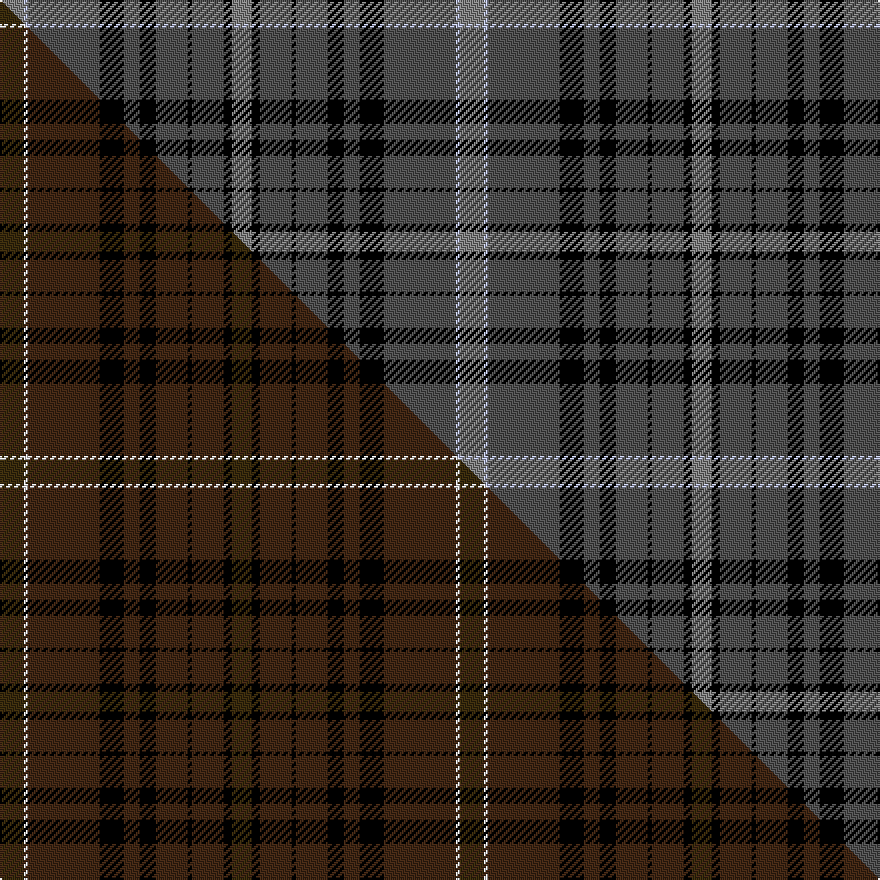

This is one **variant** — a specific cloth: this exact thread count and colourway, with its own
provenance below. It is one weaving of the [sett](/setts/y6lb1n18k6n4k4n8k1n8k2y5/) (the scale-free proportion — the
same cloth at any scale or shade), whose colour order is pattern [GKBKBKBKBWG](/stripes/gkbkbkbkbwg/).

Part of the [Bute Heather](/tartans/b/bu/bute-heather-3/) tartan — the named design grouping this sett with its other cloths.

Sourced from register-of-tartans.  It is a [11 stripe tartan](/stripes/stripes11/).

Original link [https://www.tartanregister.gov.uk/tartanDetails.aspx?ref=5952](https://www.tartanregister.gov.uk/tartanDetails.aspx?ref=5952)

Dataset <small>— provenance for this record, inherited from the source manifest</small>

<dl class="dataset-prov">
<dt>source</dt><dd><a href="/sources/register-of-tartans/">Scottish Register of Tartans</a></dd>
<dt>data captured from</dt><dd><a href="https://github.com/thetartan/tartan-database/blob/master/data/register-of-tartans/data.csv">https://github.com/thetartan/tartan-database/blob/master/data/register-of-tartans/data.csv</a></dd>
<dt>data date</dt><dd>01/08/2007 <small>(this record)</small></dd>
<dt>licence</dt><dd><a href="https://www.tartanregister.gov.uk/copyright">Crown copyright</a></dd>
</dl>

Capture chain <small>— the hands this data passed through, oldest first; each capture carries its own licence</small>

<ol class="capture-chain">
<li><a href="https://www.tartanregister.gov.uk/">Scottish Register of Tartans</a> · <a href="https://www.tartanregister.gov.uk/copyright">Crown copyright</a> <small>the living register — still published by National Records of Scotland</small></li>
<li><a href="https://github.com/thetartan/tartan-database">thetartan/tartan-database</a> <small>2016-2017</small> · <a href="https://creativecommons.org/licenses/by-nc-nd/4.0/">CC BY-NC-ND 4.0</a> <small>Levko Kravets's frozen compilation — the capture we vendored, and where its CC licence text came from</small></li>
<li>this dictionary <small>captured 2026-06-10 · commit 5bf86c7566</small> <small>each re-capture is a git commit to data/sources</small></li>
</ol>

## Register references

External register numbers recorded for this tartan.

- Scottish Register of Tartans: [5952](https://www.tartanregister.gov.uk/tartanDetails.aspx?ref=5952)
- Scottish Tartans Authority (ITI): 6884
- Scottish Tartans World Register: 3230

## Thread count
Y/12 LB2 N36 K12 N8 K8 N16 K2 N16 K4 Y/10

One full sett is **230 threads**.

## Palette
<table><thead><tr><th>Colour</th><th>Shade</th><th>OKLCh</th></tr></thead><tbody><tr><td>K</td><td><code style="background-color:#000000;">#000000</code> <small style="color:#888">#000000</small></td><td><small style="color:#888">oklch(0.0% 0.000 0.0)</small></td></tr><tr><td>Y</td><td><code style="background-color:#808080;">#808080</code> <small style="color:#888">#808080</small></td><td><small style="color:#888">oklch(60.0% 0.000 89.9)</small></td></tr><tr><td>N</td><td><code style="background-color:#505050;">#505050</code> <small style="color:#888">#505050</small></td><td><small style="color:#888">oklch(43.1% 0.000 89.9)</small></td></tr><tr><td>LB</td><td><code style="background-color:#B5BBDE;">#B5BBDE</code> <small style="color:#888">#B5BBDE</small></td><td><small style="color:#888">oklch(79.9% 0.050 277.6)</small></td></tr></tbody></table>

# Sample pattern

## Compared to the master

This cloth is one sett of its design; the master sett (the exemplar the design is anchored on) is below for comparison.

Its **ΔTartan distance** from the master is **5.91** — the same measure the nearest-tartans table ranks by (0 is identical; a re-scale of the same cloth is near 0, a recolour or a different proportion further).

<figure class="master-compare" style="margin:0">

this sett
master sett ★

<figcaption style="color:#888;font-size:smaller">One weave of this sett against the <a href="/setts/dy6w1do18k6do4k4do8k1do8k2dy5/">master sett ★</a>, split on the diagonal: a shared proportion runs seamlessly across it with only the shades shifting; a different proportion breaks on it.</figcaption>
</figure>

## Nearest tartan variants

The nearest existing variants by ΔTartan distance, with this cloth at the top so the swatches line up against it.

ΔTartan

Threads

Variant

Sett

—

230

<a href="/variants/s11/y6lb1n18k6n4k4n8k1n8k2y5~x2~y2400000-n1700000/">Bute Heather, Grey</a>

<a href="/ttd/edit/#slug=n12lb3do36k12do8k8do16k2do16k4n10~do1400000&amp;base=y6lb1n18k6n4k4n8k1n8k2y5~x2~y2400000-n1700000" title="compare in the TTD">0.13</a>

232

<a href="/variants/s11/n12lb3do36k12do8k8do16k2do16k4n10~do1400000/">Bute Heather, Midnight</a>

<a href="/ttd/edit/#slug=n12g3dt36k12dt8k8dt16k2dt18k4n10~dt1600000&amp;base=y6lb1n18k6n4k4n8k1n8k2y5~x2~y2400000-n1700000" title="compare in the TTD">0.39</a>

236

<a href="/variants/s11/n12g3dt36k12dt8k8dt16k2dt18k4n10~dt1600000/">Bute Heather, Hunting (Fashion)</a>

<a href="/ttd/edit/#slug=lb13lr2n38k13n8k8n17k2n17k4o11~n1900000-o2500000&amp;base=y6lb1n18k6n4k4n8k1n8k2y5~x2~y2400000-n1700000" title="compare in the TTD">1.38</a>

242

<a href="/variants/s11/lb13lr2n38k13n8k8n17k2n17k4o11~n1900000-o2500000/">Bute Heather, Grey (Fashion)</a>

<a href="/ttd/edit/#slug=n12r3ni36k10ni8k8ni16k2ni16k4n10~n1800000-ni1900000&amp;base=y6lb1n18k6n4k4n8k1n8k2y5~x2~y2400000-n1700000" title="compare in the TTD">1.92</a>

228

<a href="/variants/s11/n12r3ni36k10ni8k8ni16k2ni16k4n10~n1800000-ni1900000/">Bute Heather, Midnight (Fashion)</a>

<a href="/ttd/edit/#slug=w3k1n15k6n5k3n8k2n5y3w2y4k1w3~x2&amp;base=y6lb1n18k6n4k4n8k1n8k2y5~x2~y2400000-n1700000" title="compare in the TTD">2.65</a>

232

<a href="/variants/s14/w3k1n15k6n5k3n8k2n5y3w2y4k1w3~x2/">Avalon - Washington House</a>

<a href="/ttd/edit/#slug=dr22g11k2g4k2g6k16dr42lb6~x2&amp;base=y6lb1n18k6n4k4n8k1n8k2y5~x2~y2400000-n1700000" title="compare in the TTD">3.11</a>

388

<a href="/variants/s9/dr22g11k2g4k2g6k16dr42lb6~x2/">Stewart of Bute Hunting</a>

<a href="/ttd/edit/#slug=k4n4k4n18k9r4k9o1n18db2k3~x2~n1900000-o2500000&amp;base=y6lb1n18k6n4k4n8k1n8k2y5~x2~y2400000-n1700000" title="compare in the TTD">3.13</a>

290

<a href="/variants/s11/k4n4k4n18k9r4k9o1n18db2k3~x2~n1900000-o2500000/">Moggach (Strathspey)</a>

<a href="/ttd/edit/#slug=db5ly1n19k6n4k4n12w1n12k2db2~x2&amp;base=y6lb1n18k6n4k4n8k1n8k2y5~x2~y2400000-n1700000" title="compare in the TTD">3.13</a>

258

<a href="/variants/s11/db5ly1n19k6n4k4n12w1n12k2db2~x2/">Apollo 12 (Commemorative)</a>

<a href="/ttd/edit/#slug=db18n16o11n20k7n7k11n7k7n35k52n71o7k7o12~n1900000-o2500000&amp;base=y6lb1n18k6n4k4n8k1n8k2y5~x2~y2400000-n1700000" title="compare in the TTD">3.14</a>

546

<a href="/variants/s15/db18n16o11n20k7n7k11n7k7n35k52n71o7k7o12~n1900000-o2500000/">CBS (Corporate)</a>

<a href="/ttd/edit/#slug=t4dr12t4k14t36dr3t36k14t4dr12t4dr12k14t36ly3~x2&amp;base=y6lb1n18k6n4k4n8k1n8k2y5~x2~y2400000-n1700000" title="compare in the TTD">3.15</a>

818

<a href="/variants/s15/t4dr12t4k14t36dr3t36k14t4dr12t4dr12k14t36ly3~x2/">Cornwall</a>

## Neighbour map

Every grey dot is one of 13621 variants placed by the first two principal components of the ΔTartan feature space (42% of its variance). Red is this tartan; blue dots are its nearest — click one to open its page.

<svg viewBox="0 0 640 380" role="img" style="max-width:100%;height:auto;border:1px solid #e0e0e0;border-radius:4px;display:block" xmlns="http://www.w3.org/2000/svg"><image href="/nn/cloud.v1.png" width="640" height="380"/><a href="/variants/s11/n12lb3do36k12do8k8do16k2do16k4n10~do1400000/"><circle cx="334.3" cy="168.7" r="4" fill="#3465a4"><title>Bute Heather, Midnight</title></circle></a><a href="/variants/s11/n12g3dt36k12dt8k8dt16k2dt18k4n10~dt1600000/"><circle cx="343.1" cy="171.5" r="4" fill="#3465a4"><title>Bute Heather, Hunting (Fashion)</title></circle></a><a href="/variants/s11/lb13lr2n38k13n8k8n17k2n17k4o11~n1900000-o2500000/"><circle cx="270.3" cy="134.8" r="4" fill="#3465a4"><title>Bute Heather, Grey (Fashion)</title></circle></a><a href="/variants/s11/n12r3ni36k10ni8k8ni16k2ni16k4n10~n1800000-ni1900000/"><circle cx="342.4" cy="169.1" r="4" fill="#3465a4"><title>Bute Heather, Midnight (Fashion)</title></circle></a><a href="/variants/s14/w3k1n15k6n5k3n8k2n5y3w2y4k1w3~x2/"><circle cx="223.1" cy="145.4" r="4" fill="#3465a4"><title>Avalon - Washington House</title></circle></a><a href="/variants/s9/dr22g11k2g4k2g6k16dr42lb6~x2/"><circle cx="304.2" cy="136.3" r="4" fill="#3465a4"><title>Stewart of Bute Hunting</title></circle></a><a href="/variants/s11/k4n4k4n18k9r4k9o1n18db2k3~x2~n1900000-o2500000/"><circle cx="245.0" cy="129.5" r="4" fill="#3465a4"><title>Moggach (Strathspey)</title></circle></a><a href="/variants/s11/db5ly1n19k6n4k4n12w1n12k2db2~x2/"><circle cx="352.5" cy="131.0" r="4" fill="#3465a4"><title>Apollo 12 (Commemorative)</title></circle></a><a href="/variants/s15/db18n16o11n20k7n7k11n7k7n35k52n71o7k7o12~n1900000-o2500000/"><circle cx="247.3" cy="147.4" r="4" fill="#3465a4"><title>CBS (Corporate)</title></circle></a><a href="/variants/s15/t4dr12t4k14t36dr3t36k14t4dr12t4dr12k14t36ly3~x2/"><circle cx="269.1" cy="153.3" r="4" fill="#3465a4"><title>Cornwall</title></circle></a><circle cx="314.0" cy="158.7" r="5" fill="#c00000"/><text x="320" y="376" text-anchor="middle" font-size="11" fill="#999">ground</text><text x="11" y="190" text-anchor="middle" font-size="11" fill="#999" transform="rotate(-90 11 190)">complexity</text></svg>

ID: /variants/s11/y6lb1n18k6n4k4n8k1n8k2y5~x2~y2400000-n1700000/
