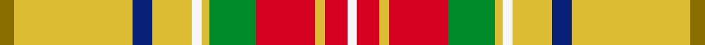

This page is one **sett** — a single exact thread-count. It belongs to the [tartan](/setts/y6ly48db8ly16w4ly3g19r24ly4r9w4/)
(the same proportion at any scale), whose colour order is pattern [GYBYWYGRYRW](/stripes/gybywygryrw/).

Sourced from register-of-tartans.  It is a [11 stripe tartan](/stripes/stripes11/).

Original link https://www.tartanregister.gov.uk/tartanDetails.aspx?ref=3040

Dataset <small>— provenance for this record, inherited from the source manifest</small>

<dl class="dataset-prov">
<dt>source</dt><dd><a href="/sources/register-of-tartans/">Scottish Register of Tartans</a></dd>
<dt>data captured from</dt><dd><a href="https://github.com/thetartan/tartan-database/blob/master/data/register-of-tartans/data.csv">https://github.com/thetartan/tartan-database/blob/master/data/register-of-tartans/data.csv</a></dd>
<dt>data date</dt><dd>1854 <small>(this record)</small></dd>
<dt>licence</dt><dd><a href="https://www.tartanregister.gov.uk/copyright">Crown copyright</a></dd>
</dl>

Capture chain <small>— the hands this data passed through, oldest first; each capture carries its own licence</small>

<ol class="capture-chain">
<li><a href="https://www.tartanregister.gov.uk/">Scottish Register of Tartans</a> · <a href="https://www.tartanregister.gov.uk/copyright">Crown copyright</a> <small>the living register — still published by National Records of Scotland</small></li>
<li><a href="https://github.com/thetartan/tartan-database">thetartan/tartan-database</a> <small>2016-2017</small> · <a href="https://creativecommons.org/licenses/by-nc-nd/4.0/">CC BY-NC-ND 4.0</a> <small>Levko Kravets's frozen compilation — the capture we vendored, and where its CC licence text came from</small></li>
<li>this dictionary <small>captured 2026-06-10 · commit 5bf86c7566</small> <small>each re-capture is a git commit to data/sources</small></li>
</ol>

## Register references

External register numbers recorded for this tartan.

- Scottish Register of Tartans: [3040](https://www.tartanregister.gov.uk/tartanDetails.aspx?ref=3040)
- Scottish Tartans Authority (ITI): 6001

## Thread count
Y/6 LY48 DB8 LY16 W4 LY3 G19 R24 LY4 R9 W/4

One full sett is **280 threads**.

## Palette
<table><thead><tr><th>Colour</th><th>Shade</th><th>OKLCh</th></tr></thead><tbody><tr><td>DB</td><td><code style="background-color:#082077;">#082077</code> <small style="color:#888">#082077</small></td><td><small style="color:#888">oklch(30.0% 0.149 265.1)</small></td></tr><tr><td>G</td><td><code style="background-color:#008B2A;">#008B2A</code> <small style="color:#888">#008B2A</small></td><td><small style="color:#888">oklch(55.4% 0.170 145.9)</small></td></tr><tr><td>W</td><td><code style="background-color:#F7F7F7;">#F7F7F7</code> <small style="color:#888">#F7F7F7</small></td><td><small style="color:#888">oklch(97.6% 0.000 89.9)</small></td></tr><tr><td>LY</td><td><code style="background-color:#DCBC32;">#DCBC32</code> <small style="color:#888">#DCBC32</small></td><td><small style="color:#888">oklch(80.0% 0.150 95.2)</small></td></tr><tr><td>R</td><td><code style="background-color:#D60020;">#D60020</code> <small style="color:#888">#D60020</small></td><td><small style="color:#888">oklch(55.2% 0.224 25.5)</small></td></tr><tr><td>Y</td><td><code style="background-color:#8B6E00;">#8B6E00</code> <small style="color:#888">#8B6E00</small></td><td><small style="color:#888">oklch(55.1% 0.113 90.4)</small></td></tr></tbody></table>

# Sample pattern

## Nearest tartan variants

The nearest existing variants by ΔTartan distance, with this cloth at the top so the swatches line up against it.

ΔTartan

Threads

Variant

Sett

—

280

<a href="/variants/s11/y6ly48db8ly16w4ly3g19r24ly4r9w4/">Muirhead (Original)</a>

<a href="/ttd/edit/#slug=g28lo18db4lo18ri3r2ri3r2ri3r2ri3~x2~ri2109032-r2109013&amp;base=y6ly48db8ly16w4ly3g19r24ly4r9w4" title="compare in the TTD">2.63</a>

282

<a href="/variants/s11/g28lo18db4lo18ri3r2ri3r2ri3r2ri3~x2~ri2109032-r2109013/">Commonwealth Games - 2014</a>

<a href="/ttd/edit/#slug=dr5r2y24lb2y2lb2y6lb8dr6lb8ly4~x2&amp;base=y6ly48db8ly16w4ly3g19r24ly4r9w4" title="compare in the TTD">3.31</a>

258

<a href="/variants/s11/dr5r2y24lb2y2lb2y6lb8dr6lb8ly4~x2/">Tasmanian</a>

<a href="/ttd/edit/#slug=y42db2w2db2y5lo12w32r4~x2&amp;base=y6ly48db8ly16w4ly3g19r24ly4r9w4" title="compare in the TTD">3.31</a>

312

<a href="/variants/s8/y42db2w2db2y5lo12w32r4~x2/">Comrie, Gold (Dance)</a>

<a href="/ttd/edit/#slug=ly4r2ly21dt11w2o21lyi4~x2~ly3106095-lyi3407090&amp;base=y6ly48db8ly16w4ly3g19r24ly4r9w4" title="compare in the TTD">3.38</a>

244

<a href="/variants/s7/ly4r2ly21dt11w2o21lyi4~x2~ly3106095-lyi3407090/">Barbour - Muted</a>

<a href="/ttd/edit/#slug=w10dt3g30r4lb12r30lb6r6lb6r6lb6r30g30db4~dt1204274-db1404245&amp;base=y6ly48db8ly16w4ly3g19r24ly4r9w4" title="compare in the TTD">3.41</a>

352

<a href="/variants/s14/w10db3g30r4lb12r30lb6r6lb6r6lb6r30g30dbi4~db1204274-dbi1404245/">MacGuire Irish Family Tartan</a>

<a href="/ttd/edit/#slug=r1ly1g6ly15do2ly1do6w1~x4&amp;base=y6ly48db8ly16w4ly3g19r24ly4r9w4" title="compare in the TTD">3.46</a>

256

<a href="/variants/s8/r1ly1g6ly15do2ly1do6w1~x4/">Connacht #2</a>

<a href="/ttd/edit/#slug=r3ri4g3dp3ri11g30ri3dp7g3r2ri4w2~x2~r2208029-ri2209032&amp;base=y6ly48db8ly16w4ly3g19r24ly4r9w4" title="compare in the TTD">3.58</a>

290

<a href="/variants/s12/r3ri4g3dp3ri11g30ri3dp7g3r2ri4w2~x2~r2208029-ri2209032/">MacKinnon #7</a>

<a href="/ttd/edit/#slug=g4n4g2ly36n14ly2lb4g7r5ly3~x2&amp;base=y6ly48db8ly16w4ly3g19r24ly4r9w4" title="compare in the TTD">3.58</a>

310

<a href="/variants/s10/g4n4g2ly36n14ly2lb4g7r5ly3~x2/">Rikaco Eve (Fashion)</a>

<a href="/ttd/edit/#slug=lb16dg5lo20n3dg3n3lo4g14lo2n2r1~x2&amp;base=y6ly48db8ly16w4ly3g19r24ly4r9w4" title="compare in the TTD">3.59</a>

258

<a href="/variants/s11/lb16dg5lo20n3dg3n3lo4g14lo2n2r1~x2/">Bouguet, Adrian Dress (Personal)</a>

<a href="/ttd/edit/#slug=g6y5w1g2w1g5w1g2w1r15db2w1~x2&amp;base=y6ly48db8ly16w4ly3g19r24ly4r9w4" title="compare in the TTD">3.64</a>

154

<a href="/variants/s12/g6y5w1g2w1g5w1g2w1r15db2w1~x2/">Dunblane</a>

## Neighbour map

Every grey dot is one of 13620 variants placed by the first two principal components of the ΔTartan feature space (42% of its variance). Red is this tartan; blue dots are its nearest — click one to open its page.

<svg viewBox="0 0 640 380" role="img" style="max-width:100%;height:auto;border:1px solid #e0e0e0;border-radius:4px;display:block" xmlns="http://www.w3.org/2000/svg"><image href="/nn/cloud.v1.png" width="640" height="380"/><a href="/variants/s11/g28lo18db4lo18ri3r2ri3r2ri3r2ri3~x2~ri2109032-r2109013/"><circle cx="236.4" cy="147.7" r="4" fill="#3465a4"><title>Commonwealth Games - 2014</title></circle></a><a href="/variants/s11/dr5r2y24lb2y2lb2y6lb8dr6lb8ly4~x2/"><circle cx="254.5" cy="168.5" r="4" fill="#3465a4"><title>Tasmanian</title></circle></a><a href="/variants/s8/y42db2w2db2y5lo12w32r4~x2/"><circle cx="268.1" cy="138.4" r="4" fill="#3465a4"><title>Comrie, Gold (Dance)</title></circle></a><a href="/variants/s7/ly4r2ly21dt11w2o21lyi4~x2~ly3106095-lyi3407090/"><circle cx="196.7" cy="189.7" r="4" fill="#3465a4"><title>Barbour - Muted</title></circle></a><a href="/variants/s14/w10db3g30r4lb12r30lb6r6lb6r6lb6r30g30dbi4~db1204274-dbi1404245/"><circle cx="180.8" cy="155.2" r="4" fill="#3465a4"><title>MacGuire Irish Family Tartan</title></circle></a><a href="/variants/s8/r1ly1g6ly15do2ly1do6w1~x4/"><circle cx="273.6" cy="157.3" r="4" fill="#3465a4"><title>Connacht #2</title></circle></a><a href="/variants/s12/r3ri4g3dp3ri11g30ri3dp7g3r2ri4w2~x2~r2208029-ri2209032/"><circle cx="264.8" cy="132.3" r="4" fill="#3465a4"><title>MacKinnon #7</title></circle></a><a href="/variants/s10/g4n4g2ly36n14ly2lb4g7r5ly3~x2/"><circle cx="315.5" cy="150.1" r="4" fill="#3465a4"><title>Rikaco Eve (Fashion)</title></circle></a><a href="/variants/s11/lb16dg5lo20n3dg3n3lo4g14lo2n2r1~x2/"><circle cx="183.9" cy="141.9" r="4" fill="#3465a4"><title>Bouguet, Adrian Dress (Personal)</title></circle></a><a href="/variants/s12/g6y5w1g2w1g5w1g2w1r15db2w1~x2/"><circle cx="204.7" cy="144.5" r="4" fill="#3465a4"><title>Dunblane</title></circle></a><circle cx="236.5" cy="138.3" r="5" fill="#c00000"/><text x="320" y="376" text-anchor="middle" font-size="11" fill="#999">ground</text><text x="11" y="190" text-anchor="middle" font-size="11" fill="#999" transform="rotate(-90 11 190)">complexity</text></svg>

ID: /variants/s11/y6ly48db8ly16w4ly3g19r24ly4r9w4/
