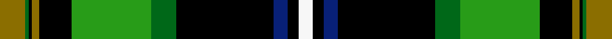

This is one **variant** — a specific cloth: this exact thread count and colourway, with its own
provenance below. It is one weaving of the [sett](/setts/y7dg1k1y2k9g22dg7k27db4k3w4/) (the scale-free proportion — the
same cloth at any scale or shade), whose colour order is pattern [GGKGKGGKBKW](/stripes/ggkgkggkbkw/).

Part of the [Gilhooley](/tartans/g/gi/gilhooley/) tartan — the named design grouping this sett with its other cloths.

Sourced from register-of-tartans.  It is a [11 stripe tartan](/stripes/stripes11/).

Original link [https://www.tartanregister.gov.uk/tartanDetails.aspx?ref=4893](https://www.tartanregister.gov.uk/tartanDetails.aspx?ref=4893)

Dataset <small>— provenance for this record, inherited from the source manifest</small>

<dl class="dataset-prov">
<dt>source</dt><dd><a href="/sources/register-of-tartans/">Scottish Register of Tartans</a></dd>
<dt>data captured from</dt><dd><a href="https://github.com/thetartan/tartan-database/blob/master/data/register-of-tartans/data.csv">https://github.com/thetartan/tartan-database/blob/master/data/register-of-tartans/data.csv</a></dd>
<dt>data date</dt><dd>2017-01-06 <small>(dataset default)</small></dd>
<dt>licence</dt><dd><a href="https://www.tartanregister.gov.uk/copyright">Crown copyright</a></dd>
</dl>

Capture chain <small>— the hands this data passed through, oldest first; each capture carries its own licence</small>

<ol class="capture-chain">
<li><a href="https://www.tartanregister.gov.uk/">Scottish Register of Tartans</a> · <a href="https://www.tartanregister.gov.uk/copyright">Crown copyright</a> <small>the living register — still published by National Records of Scotland</small></li>
<li><a href="https://github.com/thetartan/tartan-database">thetartan/tartan-database</a> <small>2016-2017</small> · <a href="https://creativecommons.org/licenses/by-nc-nd/4.0/">CC BY-NC-ND 4.0</a> <small>Levko Kravets's frozen compilation — the capture we vendored, and where its CC licence text came from</small></li>
<li>this dictionary <small>captured 2026-06-10 · commit 5bf86c7566</small> <small>each re-capture is a git commit to data/sources</small></li>
</ol>

## Register references

External register numbers recorded for this tartan.

- Scottish Register of Tartans: [4893](https://www.tartanregister.gov.uk/tartanDetails.aspx?ref=4893)
- Scottish Tartans Authority (ITI): 6700
- Scottish Tartans World Register: 3041

## Thread count
Y/14 DG2 K2 Y4 K18 G44 DG14 K54 DB8 K6 W/8

One full sett is **326 threads**.

## Palette
<table><thead><tr><th>Colour</th><th>Shade</th><th>OKLCh</th></tr></thead><tbody><tr><td>DB</td><td><code style="background-color:#082077;">#082077</code> <small style="color:#888">#082077</small></td><td><small style="color:#888">oklch(30.0% 0.149 265.1)</small></td></tr><tr><td>G</td><td><code style="background-color:#289C18;">#289C18</code> <small style="color:#888">#289C18</small></td><td><small style="color:#888">oklch(60.6% 0.191 141.6)</small></td></tr><tr><td>DG</td><td><code style="background-color:#006818;">#006818</code> <small style="color:#888">#006818</small></td><td><small style="color:#888">oklch(45.0% 0.142 145.0)</small></td></tr><tr><td>K</td><td><code style="background-color:#000000;">#000000</code> <small style="color:#888">#000000</small></td><td><small style="color:#888">oklch(0.0% 0.000 0.0)</small></td></tr><tr><td>W</td><td><code style="background-color:#F7F7F7;">#F7F7F7</code> <small style="color:#888">#F7F7F7</small></td><td><small style="color:#888">oklch(97.6% 0.000 89.9)</small></td></tr><tr><td>Y</td><td><code style="background-color:#8B6E00;">#8B6E00</code> <small style="color:#888">#8B6E00</small></td><td><small style="color:#888">oklch(55.1% 0.113 90.4)</small></td></tr></tbody></table>

# Sample pattern

## Nearest tartan variants

The nearest existing variants by ΔTartan distance, with this cloth at the top so the swatches line up against it.

ΔTartan

Threads

Variant

Sett

—

326

<a href="/variants/s11/y7dg1k1y2k9g22dg7k27db4k3w4~x2~dg1806142-g2408144/">Gilhooley (Personal)</a>

<a href="/ttd/edit/#slug=y7dg1k1y2k9g22dg7k27t4k3w4~x2~dg1806142-g2408144&amp;base=y7dg1k1y2k9g22dg7k27db4k3w4~x2~dg1806142-g2408144" title="compare in the TTD">0.03</a>

326

<a href="/variants/s11/y7dg1k1y2k9g22dg7k27t4k3w4~x2~dg1806142-g2408144/">Gilhooley (Name)</a>

<a href="/ttd/edit/#slug=lb11k2lb2k2dy2k11dg30r2dg3k1w5~x2&amp;base=y7dg1k1y2k9g22dg7k27db4k3w4~x2~dg1806142-g2408144" title="compare in the TTD">2.39</a>

252

<a href="/variants/s11/lb11k2lb2k2dy2k11dg30r2dg3k1w5~x2/">Labrador</a>

<a href="/ttd/edit/#slug=k14r2k2r2k2g18r2g18w1db12lb1r8~x2&amp;base=y7dg1k1y2k9g22dg7k27db4k3w4~x2~dg1806142-g2408144" title="compare in the TTD">2.40</a>

284

<a href="/variants/s12/k14r2k2r2k2g18r2g18w1db12lb1r8~x2/">Princess Diana</a>

<a href="/ttd/edit/#slug=lb11k2lb2k2ly2k11dg30r2dg3k1w5~x2&amp;base=y7dg1k1y2k9g22dg7k27db4k3w4~x2~dg1806142-g2408144" title="compare in the TTD">2.41</a>

252

<a href="/variants/s11/lb11k2lb2k2ly2k11dg30r2dg3k1w5~x2/">Labrador (District)</a>

<a href="/ttd/edit/#slug=y1k6g32k12r12b9k6w1~x2&amp;base=y7dg1k1y2k9g22dg7k27db4k3w4~x2~dg1806142-g2408144" title="compare in the TTD">2.47</a>

312

<a href="/variants/s8/y1k6g32k12r12b9k6w1~x2/">McGeachie (Personal)</a>

<a href="/ttd/edit/#slug=dy29g17k1w3k1y2k10lb8dy4lb8k10y2k1w3dy29~x2&amp;base=y7dg1k1y2k9g22dg7k27db4k3w4~x2~dg1806142-g2408144" title="compare in the TTD">2.51</a>

396

<a href="/variants/s15/dy29g17k1w3k1y2k10lb8dy4lb8k10y2k1w3dy29~x2/">Massie/Massey</a>

<a href="/ttd/edit/#slug=dy3g22dg13k15w3k16g1r3~x2&amp;base=y7dg1k1y2k9g22dg7k27db4k3w4~x2~dg1806142-g2408144" title="compare in the TTD">2.56</a>

292

<a href="/variants/s8/dy3g22dg13k15w3k16g1r3~x2/">Lawson, William</a>

<a href="/ttd/edit/#slug=g32r3do12t3ly3t3k48lb2k4~x2~lb3300000&amp;base=y7dg1k1y2k9g22dg7k27db4k3w4~x2~dg1806142-g2408144" title="compare in the TTD">2.57</a>

368

<a href="/variants/s9/g32r3do12t3ly3t3k48lb2k4~x2~lb3300000/">Webster</a>

<a href="/ttd/edit/#slug=g32r3do12t3ly3t3k48lb2k4~x2&amp;base=y7dg1k1y2k9g22dg7k27db4k3w4~x2~dg1806142-g2408144" title="compare in the TTD">2.58</a>

368

<a href="/variants/s9/g32r3do12t3ly3t3k48lb2k4~x2/">Webster (Name)</a>

<a href="/ttd/edit/#slug=g4dr2g20db8k8db4lb1lo2k1~x2&amp;base=y7dg1k1y2k9g22dg7k27db4k3w4~x2~dg1806142-g2408144" title="compare in the TTD">2.59</a>

190

<a href="/variants/s9/g4dr2g20db8k8db4lb1lo2k1~x2/">Dodd of Branford</a>

## Neighbour map

Every grey dot is one of 13621 variants placed by the first two principal components of the ΔTartan feature space (42% of its variance). Red is this tartan; blue dots are its nearest — click one to open its page. The map is a flat projection of a many-dimensional space — [how to read it](/posts/neighbourhood-maps/).

<svg viewBox="0 0 640 380" role="img" style="max-width:100%;height:auto;border:1px solid #e0e0e0;border-radius:4px;display:block" xmlns="http://www.w3.org/2000/svg"><image href="/nn/cloud.v1.png" width="640" height="380"/><a href="/variants/s11/y7dg1k1y2k9g22dg7k27t4k3w4~x2~dg1806142-g2408144/"><circle cx="164.5" cy="87.3" r="4" fill="#3465a4"><title>Gilhooley (Name)</title></circle></a><a href="/variants/s11/lb11k2lb2k2dy2k11dg30r2dg3k1w5~x2/"><circle cx="188.7" cy="68.3" r="4" fill="#3465a4"><title>Labrador</title></circle></a><a href="/variants/s12/k14r2k2r2k2g18r2g18w1db12lb1r8~x2/"><circle cx="145.5" cy="105.4" r="4" fill="#3465a4"><title>Princess Diana</title></circle></a><a href="/variants/s11/lb11k2lb2k2ly2k11dg30r2dg3k1w5~x2/"><circle cx="187.1" cy="68.2" r="4" fill="#3465a4"><title>Labrador (District)</title></circle></a><a href="/variants/s8/y1k6g32k12r12b9k6w1~x2/"><circle cx="159.2" cy="101.8" r="4" fill="#3465a4"><title>McGeachie (Personal)</title></circle></a><a href="/variants/s15/dy29g17k1w3k1y2k10lb8dy4lb8k10y2k1w3dy29~x2/"><circle cx="186.2" cy="71.9" r="4" fill="#3465a4"><title>Massie/Massey</title></circle></a><a href="/variants/s8/dy3g22dg13k15w3k16g1r3~x2/"><circle cx="141.5" cy="131.9" r="4" fill="#3465a4"><title>Lawson, William</title></circle></a><a href="/variants/s9/g32r3do12t3ly3t3k48lb2k4~x2~lb3300000/"><circle cx="182.3" cy="72.0" r="4" fill="#3465a4"><title>Webster</title></circle></a><a href="/variants/s9/g32r3do12t3ly3t3k48lb2k4~x2/"><circle cx="182.6" cy="72.1" r="4" fill="#3465a4"><title>Webster (Name)</title></circle></a><a href="/variants/s9/g4dr2g20db8k8db4lb1lo2k1~x2/"><circle cx="192.2" cy="115.8" r="4" fill="#3465a4"><title>Dodd of Branford</title></circle></a><circle cx="165.3" cy="87.0" r="5" fill="#c00000"/><text x="320" y="376" text-anchor="middle" font-size="11" fill="#999">ground</text><text x="11" y="190" text-anchor="middle" font-size="11" fill="#999" transform="rotate(-90 11 190)">complexity</text></svg>

ID: /variants/s11/y7dg1k1y2k9g22dg7k27db4k3w4~x2~dg1806142-g2408144/
