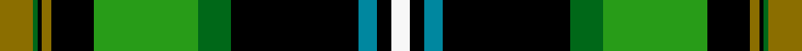

This page is one **sett** — a single exact thread-count. It belongs to the [tartan](/setts/y7dg1k1y2k9g22dg7k27t4k3w4/)
(the same proportion at any scale), whose colour order is pattern [GGKGKGGKBKW](/stripes/ggkgkggkbkw/).

Part of the [Gilhooley](/tartans/gilhooley/) tartan — the named design grouping this sett with its other cloths.

Sourced from tartans-authority.  It is a [11 stripe tartan](/stripes/stripes11/).

Original link http://www.tartansauthority.com/tartan-ferret/display/6700/

## Register references

External register numbers recorded for this tartan.

- Scottish Tartans Authority (ITI): 6700

## Thread count
Y/14 DG2 K2 Y4 K18 G44 DG14 K54 T8 K6 W/8

One full sett is **326 threads**.

## Palette
<table><thead><tr><th>Colour</th><th>Shade</th><th>OKLCh</th></tr></thead><tbody><tr><td>B</td><td><code style="background-color:#00879F;">#00879F</code> <small style="color:#888">#00879F</small></td><td><small style="color:#888">oklch(57.4% 0.102 216.1)</small></td></tr><tr><td>G</td><td><code style="background-color:#289C18;">#289C18</code> <small style="color:#888">#289C18</small></td><td><small style="color:#888">oklch(60.6% 0.191 141.6)</small></td></tr><tr><td>Ga</td><td><code style="background-color:#006818;">#006818</code> <small style="color:#888">#006818</small></td><td><small style="color:#888">oklch(45.0% 0.142 145.0)</small></td></tr><tr><td>K</td><td><code style="background-color:#000000;">#000000</code> <small style="color:#888">#000000</small></td><td><small style="color:#888">oklch(0.0% 0.000 0.0)</small></td></tr><tr><td>W</td><td><code style="background-color:#F7F7F7;">#F7F7F7</code> <small style="color:#888">#F7F7F7</small></td><td><small style="color:#888">oklch(97.6% 0.000 89.9)</small></td></tr><tr><td>Y</td><td><code style="background-color:#8B6E00;">#8B6E00</code> <small style="color:#888">#8B6E00</small></td><td><small style="color:#888">oklch(55.1% 0.113 90.4)</small></td></tr></tbody></table>

# Sample pattern

## Compared to the master

This cloth is one sett of its design; the master sett (the exemplar the design is anchored on) is below for comparison.

Its **ΔTartan distance** from the master is **0.12** — the same measure the nearest-tartans table ranks by (0 is identical; a re-scale of the same cloth is near 0, a recolour or a different proportion further).

<figure style="margin:0"><figcaption style="color:#888;font-size:smaller">this sett</figcaption></figure>
<figure style="margin:0"><figcaption style="color:#888;font-size:smaller"><a href="/setts/y7dg1k1y2k9g22dg7k27db4k3w4/">master sett →</a></figcaption></figure>

## Nearest variants

The nearest existing variants by ΔTartan distance, with this cloth at the top so the swatches line up against it.

ΔTartan

Threads

Variant

Sett

—

326

<a href="/variants/s11/y7dg1k1y2k9g22dg7k27t4k3w4~x2~dg1806142-g2408144/">Gilhooley (Name)</a>

<a href="/ttd/edit/#slug=y7dg1k1y2k9g22dg7k27db4k3w4~x2~dg1806142-g2408144&amp;base=y7dg1k1y2k9g22dg7k27t4k3w4~x2~dg1806142-g2408144" title="compare in the TTD">0.00</a>

326

<a href="/variants/s11/y7dg1k1y2k9g22dg7k27db4k3w4~x2~dg1806142-g2408144/">Gilhooley (Personal)</a>

<a href="/ttd/edit/#slug=dp6k2ly6k60g60r6k25y4k2w6&amp;base=y7dg1k1y2k9g22dg7k27t4k3w4~x2~dg1806142-g2408144" title="compare in the TTD">2.98</a>

342

<a href="/variants/s10/dp6k2ly6k60g60r6k25y4k2w6/">US Army Civil Affairs</a>

## Neighbour map

Every grey dot is one of 13620 variants placed by the first two principal components of the ΔTartan feature space (42% of its variance). Red is this tartan; blue dots are its nearest — click one to open its page.

<svg viewBox="0 0 640 380" role="img" style="max-width:100%;height:auto;border:1px solid #e0e0e0;border-radius:4px;display:block" xmlns="http://www.w3.org/2000/svg"><image href="/nn/cloud.v1.png" width="640" height="380"/><a href="/variants/s11/y7dg1k1y2k9g22dg7k27db4k3w4~x2~dg1806142-g2408144/"><circle cx="165.5" cy="87.0" r="4" fill="#3465a4"><title>Gilhooley (Personal)</title></circle></a><a href="/variants/s10/dp6k2ly6k60g60r6k25y4k2w6/"><circle cx="200.9" cy="56.7" r="4" fill="#3465a4"><title>US Army Civil Affairs</title></circle></a><circle cx="164.6" cy="87.3" r="5" fill="#c00000"/><text x="320" y="376" text-anchor="middle" font-size="11" fill="#999">ground</text><text x="11" y="190" text-anchor="middle" font-size="11" fill="#999" transform="rotate(-90 11 190)">complexity</text></svg>

ID: /variants/s11/y7dg1k1y2k9g22dg7k27t4k3w4~x2~dg1806142-g2408144/
