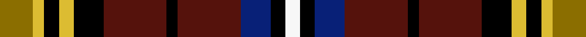

This is one **variant** — a specific cloth: this exact thread count and colourway, with its own
provenance below. It is one weaving of the [sett](/setts/y9ly3k4ly4k8dr17k3dr17db8k4w4/) (the scale-free proportion — the
same cloth at any scale or shade), whose colour order is pattern [GYKYKBKBBKW](/stripes/gykykbkbbkw/).

Part of the [Laois County Crest](/tartans/l/la/laois-county-crest/) tartan — the named design grouping this sett with its other cloths.

Sourced from tartans-authority.  It is a [11 stripe tartan](/stripes/stripes11/).

Original link [https://www.tartanregister.gov.uk/tartanDetails.aspx?ref=7454](https://www.tartanregister.gov.uk/tartanDetails.aspx?ref=7454)

Dataset <small>— provenance for this record, inherited from the source manifest</small>

<dl class="dataset-prov">
<dt>source</dt><dd><a href="/sources/tartans-authority/">Scottish Tartans Authority</a></dd>
<dt>data captured from</dt><dd><a href="https://github.com/thetartan/tartan-database/blob/master/data/tartans-authority/data.csv">https://github.com/thetartan/tartan-database/blob/master/data/tartans-authority/data.csv</a></dd>
<dt>data date</dt><dd>2004 <small>(this record)</small></dd>
<dt>licence</dt><dd><a href="https://creativecommons.org/licenses/by-nc-nd/4.0/">CC BY-NC-ND 4.0</a></dd>
</dl>

Capture chain <small>— the hands this data passed through, oldest first; each capture carries its own licence</small>

<ol class="capture-chain">
<li><a href="https://www.tartansauthority.com/">Scottish Tartans Authority</a> <small>the heritage body's archive — its tartan-ferret record browser is retired (links repaired to the SRT, above)</small></li>
<li><a href="https://github.com/thetartan/tartan-database">thetartan/tartan-database</a> <small>2016-2017</small> · <a href="https://creativecommons.org/licenses/by-nc-nd/4.0/">CC BY-NC-ND 4.0</a> <small>Levko Kravets's frozen compilation — the capture we vendored, and where its CC licence text came from</small></li>
<li>this dictionary <small>captured 2026-06-10 · commit 5bf86c7566</small> <small>each re-capture is a git commit to data/sources</small></li>
</ol>

## Register references

External register numbers recorded for this tartan.

- Scottish Tartans Authority (ITI): 7454

## Thread count
Y/18 LY6 K8 LY8 K16 DR34 K6 DR34 DB16 K8 W/8

One full sett is **298 threads**.

## Palette
<table><thead><tr><th>Colour</th><th>Shade</th><th>OKLCh</th></tr></thead><tbody><tr><td>DB</td><td><code style="background-color:#082077;">#082077</code> <small style="color:#888">#082077</small></td><td><small style="color:#888">oklch(30.0% 0.149 265.1)</small></td></tr><tr><td>DR</td><td><code style="background-color:#55120C;">#55120C</code> <small style="color:#888">#55120C</small></td><td><small style="color:#888">oklch(30.0% 0.099 29.3)</small></td></tr><tr><td>LY</td><td><code style="background-color:#DCBC32;">#DCBC32</code> <small style="color:#888">#DCBC32</small></td><td><small style="color:#888">oklch(80.0% 0.150 95.2)</small></td></tr><tr><td>K</td><td><code style="background-color:#000000;">#000000</code> <small style="color:#888">#000000</small></td><td><small style="color:#888">oklch(0.0% 0.000 0.0)</small></td></tr><tr><td>W</td><td><code style="background-color:#F7F7F7;">#F7F7F7</code> <small style="color:#888">#F7F7F7</small></td><td><small style="color:#888">oklch(97.6% 0.000 89.9)</small></td></tr><tr><td>Y</td><td><code style="background-color:#8B6E00;">#8B6E00</code> <small style="color:#888">#8B6E00</small></td><td><small style="color:#888">oklch(55.1% 0.113 90.4)</small></td></tr></tbody></table>

# Sample pattern

## Nearest tartan variants

The nearest existing variants by ΔTartan distance, with this cloth at the top so the swatches line up against it.

ΔTartan

Threads

Variant

Sett

—

298

<a href="/variants/s11/y9ly3k4ly4k8dr17k3dr17db8k4w4~x2/">Laois County Crest (Fashion)</a>

<a href="/ttd/edit/#slug=y9dy3k4dy4k8dr17k3dr17db8k4w4~x2&amp;base=y9ly3k4ly4k8dr17k3dr17db8k4w4~x2" title="compare in the TTD">0.90</a>

298

<a href="/variants/s11/y9dy3k4dy4k8dr17k3dr17db8k4w4~x2/">Laois County, Crest Range</a>

<a href="/ttd/edit/#slug=dr16g16dr8k8lo3k3db3k3lo3dr14w3~x2&amp;base=y9ly3k4ly4k8dr17k3dr17db8k4w4~x2" title="compare in the TTD">1.71</a>

282

<a href="/variants/s11/dr16g16dr8k8lo3k3db3k3lo3dr14w3~x2/">Mars Family Tartan</a>

<a href="/ttd/edit/#slug=dr16g16dr8k8y3k3db3k3y3dr14w3~x2&amp;base=y9ly3k4ly4k8dr17k3dr17db8k4w4~x2" title="compare in the TTD">2.00</a>

282

<a href="/variants/s11/dr16g16dr8k8y3k3db3k3y3dr14w3~x2/">Mars (Personal)</a>

<a href="/ttd/edit/#slug=k1y1k1g6k6r6db1r1db1r6k6g6k1lb1~x4&amp;base=y9ly3k4ly4k8dr17k3dr17db8k4w4~x2" title="compare in the TTD">2.36</a>

344

<a href="/variants/s14/k1y1k1g6k6r6db1r1db1r6k6g6k1lb1~x4/">Rossi (Personal)</a>

<a href="/ttd/edit/#slug=r14g3r14g13y2k14db6k2db2k2db6r9w2k2r2~x2&amp;base=y9ly3k4ly4k8dr17k3dr17db8k4w4~x2" title="compare in the TTD">2.54</a>

340

<a href="/variants/s15/r14g3r14g13y2k14db6k2db2k2db6r9w2k2r2~x2/">MacPherson #8</a>

<a href="/ttd/edit/#slug=y4k2dg7g7r5k2r15k2w4~x2&amp;base=y9ly3k4ly4k8dr17k3dr17db8k4w4~x2" title="compare in the TTD">2.56</a>

176

<a href="/variants/s9/y4k2dg7g7r5k2r15k2w4~x2/">Thirkill</a>

<a href="/ttd/edit/#slug=k5do1g3do1g3do1k5ri1r5ri1~x4~ri2109032-r1807033&amp;base=y9ly3k4ly4k8dr17k3dr17db8k4w4~x2" title="compare in the TTD">2.56</a>

184

<a href="/variants/s10/k5do1g3do1g3do1k5ri1r5ri1~x4~ri2109032-r1807033/">Murdoch (Dalgliesh)</a>

<a href="/ttd/edit/#slug=r6db1r6g8y1k6db4k1db2k1db4r4w1k1r1~x2&amp;base=y9ly3k4ly4k8dr17k3dr17db8k4w4~x2" title="compare in the TTD">2.56</a>

174

<a href="/variants/s15/r6db1r6g8y1k6db4k1db2k1db4r4w1k1r1~x2/">MacPherson Clan Tartan</a>

<a href="/ttd/edit/#slug=dy24k4w7dy7ly4n28dy7k29dy35r7dy7w4dy4k17&amp;base=y9ly3k4ly4k8dr17k3dr17db8k4w4~x2" title="compare in the TTD">2.66</a>

327

<a href="/variants/s14/dy24k4w7dy7ly4n28dy7k29dy35r7dy7w4dy4k17/">Mauchline</a>

<a href="/ttd/edit/#slug=t8k25g13m5ly5dr5m8~x2&amp;base=y9ly3k4ly4k8dr17k3dr17db8k4w4~x2" title="compare in the TTD">2.68</a>

244

<a href="/variants/s7/t8k25g13m5ly5dr5m8~x2/">Bro-Menez Are (Corporate)</a>

## Neighbour map

Every grey dot is one of 13656 variants placed by the first two principal components of the ΔTartan feature space (42% of its variance). Red is this tartan; blue dots are its nearest — click one to open its page. The map is a flat projection of a many-dimensional space — [how to read it](/posts/neighbourhood-maps/).

<svg viewBox="0 0 640 380" role="img" style="max-width:100%;height:auto;border:1px solid #e0e0e0;border-radius:4px;display:block" xmlns="http://www.w3.org/2000/svg"><image href="/nn/cloud.v1.png" width="640" height="380"/><a href="/variants/s11/y9dy3k4dy4k8dr17k3dr17db8k4w4~x2/"><circle cx="110.5" cy="180.0" r="4" fill="#3465a4"><title>Laois County, Crest Range</title></circle></a><a href="/variants/s11/dr16g16dr8k8lo3k3db3k3lo3dr14w3~x2/"><circle cx="127.9" cy="173.8" r="4" fill="#3465a4"><title>Mars Family Tartan</title></circle></a><a href="/variants/s11/dr16g16dr8k8y3k3db3k3y3dr14w3~x2/"><circle cx="134.8" cy="175.5" r="4" fill="#3465a4"><title>Mars (Personal)</title></circle></a><a href="/variants/s14/k1y1k1g6k6r6db1r1db1r6k6g6k1lb1~x4/"><circle cx="64.7" cy="149.9" r="4" fill="#3465a4"><title>Rossi (Personal)</title></circle></a><a href="/variants/s15/r14g3r14g13y2k14db6k2db2k2db6r9w2k2r2~x2/"><circle cx="97.0" cy="136.2" r="4" fill="#3465a4"><title>MacPherson #8</title></circle></a><a href="/variants/s9/y4k2dg7g7r5k2r15k2w4~x2/"><circle cx="97.7" cy="162.2" r="4" fill="#3465a4"><title>Thirkill</title></circle></a><a href="/variants/s10/k5do1g3do1g3do1k5ri1r5ri1~x4~ri2109032-r1807033/"><circle cx="90.2" cy="196.2" r="4" fill="#3465a4"><title>Murdoch (Dalgliesh)</title></circle></a><a href="/variants/s15/r6db1r6g8y1k6db4k1db2k1db4r4w1k1r1~x2/"><circle cx="73.7" cy="139.1" r="4" fill="#3465a4"><title>MacPherson Clan Tartan</title></circle></a><a href="/variants/s14/dy24k4w7dy7ly4n28dy7k29dy35r7dy7w4dy4k17/"><circle cx="139.6" cy="138.2" r="4" fill="#3465a4"><title>Mauchline</title></circle></a><a href="/variants/s7/t8k25g13m5ly5dr5m8~x2/"><circle cx="54.4" cy="194.8" r="4" fill="#3465a4"><title>Bro-Menez Are (Corporate)</title></circle></a><circle cx="92.1" cy="175.2" r="5" fill="#c00000"/><text x="320" y="376" text-anchor="middle" font-size="11" fill="#999">ground</text><text x="11" y="190" text-anchor="middle" font-size="11" fill="#999" transform="rotate(-90 11 190)">complexity</text></svg>

ID: /variants/s11/y9ly3k4ly4k8dr17k3dr17db8k4w4~x2/
