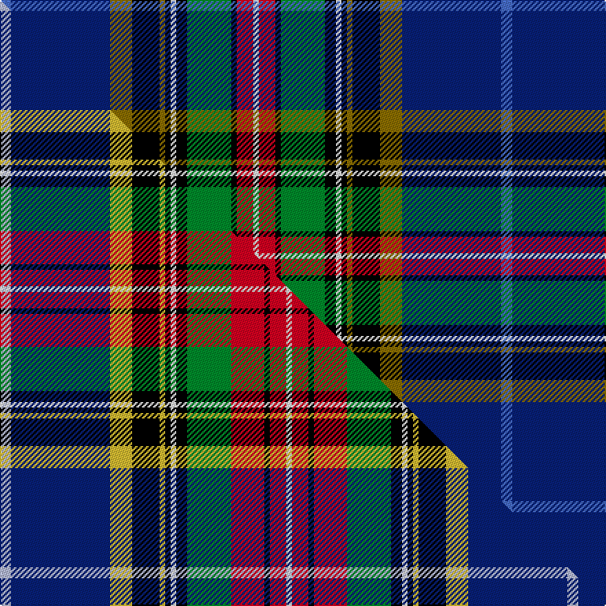

This is one **variant** — a specific cloth: this exact thread count and colourway, with its own
provenance below. It is one weaving of the [sett](/setts/b2db18y4k5y1k1w1k2g8k1r3w1/) (the scale-free proportion — the
same cloth at any scale or shade), whose colour order is pattern [BBGKGKWKGKRW](/stripes/bbgkgkwkgkrw/).

Part of the [Bethune](/tartans/b/be/bethune-2/) tartan — the named design grouping this sett with its other cloths.

Sourced from weddslist.  It is a [12 stripe tartan](/stripes/stripes12/).

Original link [http://www.weddslist.com/cgi-bin/tartans/pg.pl?source=sts](http://www.weddslist.com/cgi-bin/tartans/pg.pl?source=sts)

Dataset <small>— provenance for this record, inherited from the source manifest</small>

<dl class="dataset-prov">
<dt>source</dt><dd><a href="/sources/weddslist/">Weddslist</a></dd>
<dt>data captured from</dt><dd><a href="https://github.com/thetartan/tartan-database/blob/master/data/weddslist/data.csv">https://github.com/thetartan/tartan-database/blob/master/data/weddslist/data.csv</a></dd>
<dt>data date</dt><dd>2016-11-17 <small>(dataset default)</small></dd>
<dt>licence</dt><dd><a href="https://creativecommons.org/licenses/by-nc-nd/4.0/">CC BY-NC-ND 4.0</a></dd>
</dl>

Capture chain <small>— the hands this data passed through, oldest first; each capture carries its own licence</small>

<ol class="capture-chain">
<li><a href="https://www.weddslist.com/tartans/">Weddslist</a> <small>the living privately compiled reference</small></li>
<li><a href="https://github.com/thetartan/tartan-database">thetartan/tartan-database</a> <small>2016-2017</small> · <a href="https://creativecommons.org/licenses/by-nc-nd/4.0/">CC BY-NC-ND 4.0</a> <small>Levko Kravets's frozen compilation — the capture we vendored, and where its CC licence text came from</small></li>
<li>this dictionary <small>captured 2026-06-10 · commit 5bf86c7566</small> <small>each re-capture is a git commit to data/sources</small></li>
</ol>

## Thread count
B/8 DB72 Y16 K20 Y4 K4 W4 K8 G32 K4 R12 W/4

One full sett is **364 threads**.

## Palette
<table><thead><tr><th>Colour</th><th>Shade</th><th>OKLCh</th></tr></thead><tbody><tr><td>B</td><td><code style="background-color:#466CC8;">#466CC8</code> <small style="color:#888">#466CC8</small></td><td><small style="color:#888">oklch(55.1% 0.149 265.0)</small></td></tr><tr><td>DB</td><td><code style="background-color:#082077;">#082077</code> <small style="color:#888">#082077</small></td><td><small style="color:#888">oklch(30.0% 0.149 265.1)</small></td></tr><tr><td>G</td><td><code style="background-color:#008B2A;">#008B2A</code> <small style="color:#888">#008B2A</small></td><td><small style="color:#888">oklch(55.4% 0.170 145.9)</small></td></tr><tr><td>K</td><td><code style="background-color:#000000;">#000000</code> <small style="color:#888">#000000</small></td><td><small style="color:#888">oklch(0.0% 0.000 0.0)</small></td></tr><tr><td>W</td><td><code style="background-color:#F7F7F7;">#F7F7F7</code> <small style="color:#888">#F7F7F7</small></td><td><small style="color:#888">oklch(97.6% 0.000 89.9)</small></td></tr><tr><td>R</td><td><code style="background-color:#D60020;">#D60020</code> <small style="color:#888">#D60020</small></td><td><small style="color:#888">oklch(55.2% 0.224 25.5)</small></td></tr><tr><td>Y</td><td><code style="background-color:#8B6E00;">#8B6E00</code> <small style="color:#888">#8B6E00</small></td><td><small style="color:#888">oklch(55.1% 0.113 90.4)</small></td></tr></tbody></table>

# Sample pattern

## Compared to the master

This cloth is one sett of its design; the master sett (the exemplar the design is anchored on) is below for comparison.

Its **ΔTartan distance** from the master is **1.00** — the same measure the nearest-tartans table ranks by (0 is identical; a re-scale of the same cloth is near 0, a recolour or a different proportion further).

<figure class="master-compare" style="margin:0">

this sett
master sett ★

<figcaption style="color:#888;font-size:smaller">One weave of this sett against the <a href="/setts/lb2db18ly4k5ly1k1w1k2g8r6k1r3w1/">master sett ★</a>, split on the diagonal: a shared proportion runs seamlessly across it with only the shades shifting; a different proportion breaks on it.</figcaption>
</figure>

## Nearest tartan variants

The nearest existing variants by ΔTartan distance, with this cloth at the top so the swatches line up against it.

ΔTartan

Threads

Variant

Sett

—

364

<a href="/variants/s12/b2db18y4k5y1k1w1k2g8k1r3w1~x4/">Bethune</a>

<a href="/ttd/edit/#slug=lb2db18ly4k5ly1k1w1k2g8r6k1r3w1~x4&amp;base=b2db18y4k5y1k1w1k2g8k1r3w1~x4" title="compare in the TTD">1.00</a>

412

<a href="/variants/s13/lb2db18ly4k5ly1k1w1k2g8r6k1r3w1~x4/">Bethune (Personal)</a>

<a href="/ttd/edit/#slug=g4r1ri1dg2r1ri1r1ri1k12g18db23w2k3~x2~r2109032-ri2806019&amp;base=b2db18y4k5y1k1w1k2g8k1r3w1~x4" title="compare in the TTD">1.90</a>

266

<a href="/variants/s13/g4r1ri1dg2r1ri1r1ri1k12g18db23w2k3~x2~r2109032-ri2806019/">St. Andrews Grand (Fashion)</a>

<a href="/ttd/edit/#slug=k1dr4k1w3k1g7k2db16r2ly1~x2&amp;base=b2db18y4k5y1k1w1k2g8k1r3w1~x4" title="compare in the TTD">2.01</a>

148

<a href="/variants/s10/k1dr4k1w3k1g7k2db16r2ly1~x2/">Twempy</a>

<a href="/ttd/edit/#slug=dg32lb3lp3lb3dg2k20db17r3y4~x2&amp;base=b2db18y4k5y1k1w1k2g8k1r3w1~x4" title="compare in the TTD">2.24</a>

276

<a href="/variants/s9/dg32lb3lp3lb3dg2k20db17r3y4~x2/">Colorado (District)</a>

<a href="/ttd/edit/#slug=w3db5lb2db9dp10k2dp5k2dg8g29w2~x2&amp;base=b2db18y4k5y1k1w1k2g8k1r3w1~x4" title="compare in the TTD">2.29</a>

298

<a href="/variants/s11/w3db5lb2db9dp10k2dp5k2dg8g29w2~x2/">Carnegie of Skibo (Corporate)</a>

<a href="/ttd/edit/#slug=w3db5lt2db9dp10k2dp5k5dg9g31w2~x2&amp;base=b2db18y4k5y1k1w1k2g8k1r3w1~x4" title="compare in the TTD">2.31</a>

322

<a href="/variants/s11/w3db5lt2db9dp10k2dp5k5dg9g31w2~x2/">Carnegie of Skibo Corporate Tartan</a>

<a href="/ttd/edit/#slug=dg32lb3p3lb3dg2k20db17r3y4~x2&amp;base=b2db18y4k5y1k1w1k2g8k1r3w1~x4" title="compare in the TTD">2.39</a>

276

<a href="/variants/s9/dg32lb3p3lb3dg2k20db17r3y4~x2/">Colorado American District Tartan</a>

<a href="/ttd/edit/#slug=k2dp4o4dp3g20dp5k4dp3k7dp3k3db35w2~x2&amp;base=b2db18y4k5y1k1w1k2g8k1r3w1~x4" title="compare in the TTD">2.42</a>

372

<a href="/variants/s13/k2dp4o4dp3g20dp5k4dp3k7dp3k3db35w2~x2/">Spirit of Bannockburn (Fashion)</a>

<a href="/ttd/edit/#slug=db7k1r3k1db24k1w3k3dg3k3dg3g19k2w4~x2&amp;base=b2db18y4k5y1k1w1k2g8k1r3w1~x4" title="compare in the TTD">2.46</a>

286

<a href="/variants/s14/db7k1r3k1db24k1w3k3dg3k3dg3g19k2w4~x2/">Strathclyde, University of</a>

<a href="/ttd/edit/#slug=db24g2db12k2w2k3dp2k3t4k3dp2k3w2k2r12g2t24~x2&amp;base=b2db18y4k5y1k1w1k2g8k1r3w1~x4" title="compare in the TTD">2.50</a>

320

<a href="/variants/s17/db24g2db12k2w2k3dp2k3t4k3dp2k3w2k2r12g2t24~x2/">Selkirk, New (District)</a>

## Neighbour map

Every grey dot is one of 13621 variants placed by the first two principal components of the ΔTartan feature space (42% of its variance). Red is this tartan; blue dots are its nearest — click one to open its page.

<svg viewBox="0 0 640 380" role="img" style="max-width:100%;height:auto;border:1px solid #e0e0e0;border-radius:4px;display:block" xmlns="http://www.w3.org/2000/svg"><image href="/nn/cloud.v1.png" width="640" height="380"/><a href="/variants/s13/lb2db18ly4k5ly1k1w1k2g8r6k1r3w1~x4/"><circle cx="76.2" cy="75.8" r="4" fill="#3465a4"><title>Bethune (Personal)</title></circle></a><a href="/variants/s13/g4r1ri1dg2r1ri1r1ri1k12g18db23w2k3~x2~r2109032-ri2806019/"><circle cx="112.3" cy="61.3" r="4" fill="#3465a4"><title>St. Andrews Grand (Fashion)</title></circle></a><a href="/variants/s10/k1dr4k1w3k1g7k2db16r2ly1~x2/"><circle cx="127.9" cy="90.7" r="4" fill="#3465a4"><title>Twempy</title></circle></a><a href="/variants/s9/dg32lb3lp3lb3dg2k20db17r3y4~x2/"><circle cx="135.9" cy="110.7" r="4" fill="#3465a4"><title>Colorado (District)</title></circle></a><a href="/variants/s11/w3db5lb2db9dp10k2dp5k2dg8g29w2~x2/"><circle cx="110.7" cy="106.7" r="4" fill="#3465a4"><title>Carnegie of Skibo (Corporate)</title></circle></a><a href="/variants/s11/w3db5lt2db9dp10k2dp5k5dg9g31w2~x2/"><circle cx="104.8" cy="105.0" r="4" fill="#3465a4"><title>Carnegie of Skibo Corporate Tartan</title></circle></a><a href="/variants/s9/dg32lb3p3lb3dg2k20db17r3y4~x2/"><circle cx="141.5" cy="112.1" r="4" fill="#3465a4"><title>Colorado American District Tartan</title></circle></a><a href="/variants/s13/k2dp4o4dp3g20dp5k4dp3k7dp3k3db35w2~x2/"><circle cx="153.8" cy="96.0" r="4" fill="#3465a4"><title>Spirit of Bannockburn (Fashion)</title></circle></a><a href="/variants/s14/db7k1r3k1db24k1w3k3dg3k3dg3g19k2w4~x2/"><circle cx="143.3" cy="73.1" r="4" fill="#3465a4"><title>Strathclyde, University of</title></circle></a><a href="/variants/s17/db24g2db12k2w2k3dp2k3t4k3dp2k3w2k2r12g2t24~x2/"><circle cx="87.2" cy="83.1" r="4" fill="#3465a4"><title>Selkirk, New (District)</title></circle></a><circle cx="114.2" cy="79.3" r="5" fill="#c00000"/><text x="320" y="376" text-anchor="middle" font-size="11" fill="#999">ground</text><text x="11" y="190" text-anchor="middle" font-size="11" fill="#999" transform="rotate(-90 11 190)">complexity</text></svg>

ID: /variants/s12/b2db18y4k5y1k1w1k2g8k1r3w1~x4/
