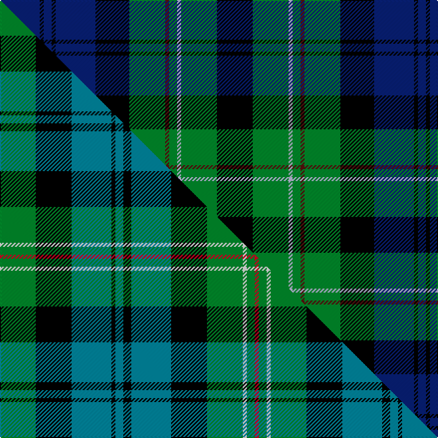

This page is one **sett** — a single exact thread-count. It belongs to the [tartan](/setts/db20k2db4k2db20k17g18dr2g4lb2g18k18/)
(the same proportion at any scale), whose colour order is pattern [BKBKBKGBGWGK](/stripes/bkbkbkgbgwgk/).

Part of the [Spar Ltd](/tartans/spar-ltd/) tartan — the named design grouping this sett with its other cloths.

Sourced from house-of-tartan.  It is a [12 stripe tartan](/stripes/stripes12/).

Original link http://www.house-of-tartan.scotland.net/house/TartanViewjs.asp?colr=Def&tnam=2353

## Provenance

Earliest known date: December 1996 Spar is a UK based grocery chain and this tartan was designed for their 1997 conference in Scotland. The tartan was launched at a dinner at Blair Castle in Perthshire on 6th May 1997.

## Thread count
DB/40 K4 DB8 K4 DB40 K34 G36 DR4 G8 LB4 G36 K/36

One full sett is **432 threads**.

## Palette
<table><thead><tr><th>Colour</th><th>Shade</th><th>OKLCh</th></tr></thead><tbody><tr><td>DB</td><td><code style="background-color:#082077;">#082077</code> <small style="color:#888">#082077</small></td><td><small style="color:#888">oklch(30.0% 0.149 265.1)</small></td></tr><tr><td>DR</td><td><code style="background-color:#55120C;">#55120C</code> <small style="color:#888">#55120C</small></td><td><small style="color:#888">oklch(30.0% 0.099 29.3)</small></td></tr><tr><td>G</td><td><code style="background-color:#008B2A;">#008B2A</code> <small style="color:#888">#008B2A</small></td><td><small style="color:#888">oklch(55.4% 0.170 145.9)</small></td></tr><tr><td>K</td><td><code style="background-color:#000000;">#000000</code> <small style="color:#888">#000000</small></td><td><small style="color:#888">oklch(0.0% 0.000 0.0)</small></td></tr><tr><td>LB</td><td><code style="background-color:#B5BBDE;">#B5BBDE</code> <small style="color:#888">#B5BBDE</small></td><td><small style="color:#888">oklch(79.9% 0.050 277.6)</small></td></tr></tbody></table>

# Sample pattern

## Compared to the master

This cloth is one sett of its design; the master sett (the exemplar the design is anchored on) is below for comparison.

Its **ΔTartan distance** from the master is **0.46** — the same measure the nearest-tartans table ranks by (0 is identical; a re-scale of the same cloth is near 0, a recolour or a different proportion further).

<figure class="master-compare" style="margin:0">

this sett
master sett ★

<figcaption style="color:#888;font-size:smaller">One weave of this sett against the <a href="/setts/g9k9t10k1t2k2t10k9g9w1g2r1/">master sett ★</a>, split on the diagonal: a shared proportion runs seamlessly across it with only the shades shifting; a different proportion breaks on it.</figcaption>
</figure>

## Nearest tartan variants

The nearest existing variants by ΔTartan distance, with this cloth at the top so the swatches line up against it.

ΔTartan

Threads

Variant

Sett

—

432

<a href="/variants/s12/db20k2db4k2db20k17g18dr2g4lb2g18k18~x2/">Spar (UK) Ltd Corporate Tartan</a>

<a href="/ttd/edit/#slug=k2db10k9g9w1g2r1g9k9db10k1db2~x4&amp;base=db20k2db4k2db20k17g18dr2g4lb2g18k18~x2" title="compare in the TTD">0.36</a>

504

<a href="/variants/s12/k2db10k9g9w1g2r1g9k9db10k1db2~x4/">Spar (UK) Ltd</a>

<a href="/ttd/edit/#slug=g9k9t10k1t2k2t10k9g9w1g2r1~x4&amp;base=db20k2db4k2db20k17g18dr2g4lb2g18k18~x2" title="compare in the TTD">0.46</a>

480

<a href="/variants/s12/g9k9t10k1t2k2t10k9g9w1g2r1~x4/">Spar (UK) Ltd</a>

<a href="/ttd/edit/#slug=db10k2db2k2db2k8g8k1w2k1g8k8db9r2~x2&amp;base=db20k2db4k2db20k17g18dr2g4lb2g18k18~x2" title="compare in the TTD">1.11</a>

236

<a href="/variants/s14/db10k2db2k2db2k8g8k1w2k1g8k8db9r2~x2/">MacKenzie</a>

<a href="/ttd/edit/#slug=db11k1db1w1db1k8g8y1g8k8db8w1db1~x2&amp;base=db20k2db4k2db20k17g18dr2g4lb2g18k18~x2" title="compare in the TTD">1.18</a>

208

<a href="/variants/s13/db11k1db1w1db1k8g8y1g8k8db8w1db1~x2/">Logan Rogers Hunting</a>

<a href="/ttd/edit/#slug=db11k1db1w1db1k8g8ly1g8k8db8w1db1~x2&amp;base=db20k2db4k2db20k17g18dr2g4lb2g18k18~x2" title="compare in the TTD">1.23</a>

208

<a href="/variants/s13/db11k1db1w1db1k8g8ly1g8k8db8w1db1~x2/">Logan Rogers Hunting (Personal)</a>

<a href="/ttd/edit/#slug=db23k2dr2k2dr2k16g17k2g17k15db17k2r2~x2&amp;base=db20k2db4k2db20k17g18dr2g4lb2g18k18~x2" title="compare in the TTD">1.28</a>

426

<a href="/variants/s13/db23k2dr2k2dr2k16g17k2g17k15db17k2r2~x2/">The Red Hackle</a>

<a href="/ttd/edit/#slug=y3k1g10k7db10g2db2g2db10k7g10k1lb3~x2&amp;base=db20k2db4k2db20k17g18dr2g4lb2g18k18~x2" title="compare in the TTD">1.30</a>

260

<a href="/variants/s13/y3k1g10k7db10g2db2g2db10k7g10k1lb3~x2/">Doon Valley Crafters</a>

<a href="/ttd/edit/#slug=r2db10k10g10w1k4w1g10k10db10r1~x4&amp;base=db20k2db4k2db20k17g18dr2g4lb2g18k18~x2" title="compare in the TTD">1.32</a>

540

<a href="/variants/s11/r2db10k10g10w1k4w1g10k10db10r1~x4/">Rose</a>

<a href="/ttd/edit/#slug=db10k1db1k1db1k6g6k1y2k1g6k6db6r3~x2&amp;base=db20k2db4k2db20k17g18dr2g4lb2g18k18~x2" title="compare in the TTD">1.35</a>

178

<a href="/variants/s14/db10k1db1k1db1k6g6k1y2k1g6k6db6r3~x2/">MacLeod of Skye</a>

<a href="/ttd/edit/#slug=db17dr2k16g17k2g17k16dr2db17lr2~x2&amp;base=db20k2db4k2db20k17g18dr2g4lb2g18k18~x2" title="compare in the TTD">1.41</a>

394

<a href="/variants/s10/db17dr2k16g17k2g17k16dr2db17lr2~x2/">Mitchell</a>

## Neighbour map

Every grey dot is one of 13620 variants placed by the first two principal components of the ΔTartan feature space (42% of its variance). Red is this tartan; blue dots are its nearest — click one to open its page.

<svg viewBox="0 0 640 380" role="img" style="max-width:100%;height:auto;border:1px solid #e0e0e0;border-radius:4px;display:block" xmlns="http://www.w3.org/2000/svg"><image href="/nn/cloud.v1.png" width="640" height="380"/><a href="/variants/s12/k2db10k9g9w1g2r1g9k9db10k1db2~x4/"><circle cx="115.0" cy="167.6" r="4" fill="#3465a4"><title>Spar (UK) Ltd</title></circle></a><a href="/variants/s12/g9k9t10k1t2k2t10k9g9w1g2r1~x4/"><circle cx="106.6" cy="168.8" r="4" fill="#3465a4"><title>Spar (UK) Ltd</title></circle></a><a href="/variants/s14/db10k2db2k2db2k8g8k1w2k1g8k8db9r2~x2/"><circle cx="109.3" cy="158.6" r="4" fill="#3465a4"><title>MacKenzie</title></circle></a><a href="/variants/s13/db11k1db1w1db1k8g8y1g8k8db8w1db1~x2/"><circle cx="133.5" cy="148.5" r="4" fill="#3465a4"><title>Logan Rogers Hunting</title></circle></a><a href="/variants/s13/db11k1db1w1db1k8g8ly1g8k8db8w1db1~x2/"><circle cx="132.5" cy="148.6" r="4" fill="#3465a4"><title>Logan Rogers Hunting (Personal)</title></circle></a><a href="/variants/s13/db23k2dr2k2dr2k16g17k2g17k15db17k2r2~x2/"><circle cx="127.4" cy="146.9" r="4" fill="#3465a4"><title>The Red Hackle</title></circle></a><a href="/variants/s13/y3k1g10k7db10g2db2g2db10k7g10k1lb3~x2/"><circle cx="106.3" cy="168.5" r="4" fill="#3465a4"><title>Doon Valley Crafters</title></circle></a><a href="/variants/s11/r2db10k10g10w1k4w1g10k10db10r1~x4/"><circle cx="103.7" cy="176.0" r="4" fill="#3465a4"><title>Rose</title></circle></a><a href="/variants/s14/db10k1db1k1db1k6g6k1y2k1g6k6db6r3~x2/"><circle cx="114.1" cy="155.6" r="4" fill="#3465a4"><title>MacLeod of Skye</title></circle></a><a href="/variants/s10/db17dr2k16g17k2g17k16dr2db17lr2~x2/"><circle cx="99.8" cy="188.0" r="4" fill="#3465a4"><title>Mitchell</title></circle></a><circle cx="124.3" cy="167.3" r="5" fill="#c00000"/><text x="320" y="376" text-anchor="middle" font-size="11" fill="#999">ground</text><text x="11" y="190" text-anchor="middle" font-size="11" fill="#999" transform="rotate(-90 11 190)">complexity</text></svg>

ID: /variants/s12/db20k2db4k2db20k17g18dr2g4lb2g18k18~x2/
