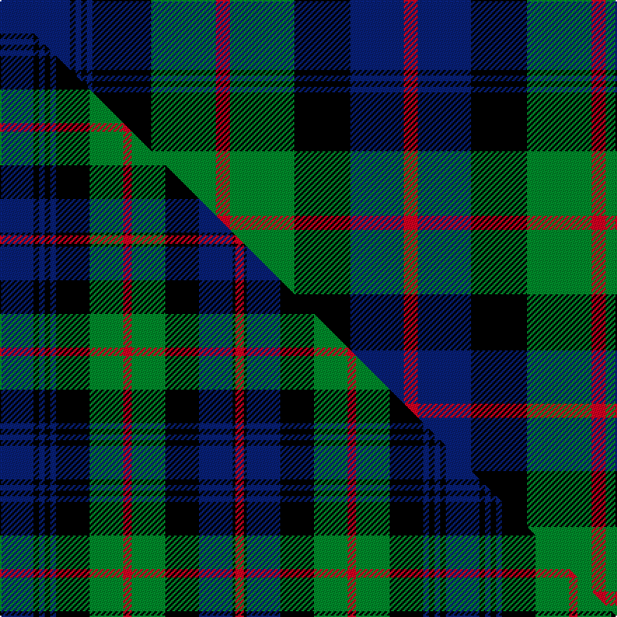

This page is one **sett** — a single exact thread-count. It belongs to the [tartan](/setts/db25k2db2k2db2k21g23r5g23k20db19r5/)
(the same proportion at any scale), whose colour order is pattern [BKBKBKGRGKBR](/stripes/bkbkbkgrgkbr/).

Part of the [Murray of Atholl](/tartans/murray-of-atholl/) tartan — the named design grouping this sett with its other cloths.

Sourced from register-of-tartans.  It is a [12 stripe tartan](/stripes/stripes12/).

Original link https://www.tartanregister.gov.uk/tartanDetails.aspx?ref=3062

2 attestations — the source records this cloth was collapsed from (oldest owns this page)

<ul>
<li>undated — Murray of Atholl #2 (register-of-tartans, <a href="https://www.tartanregister.gov.uk/tartanDetails.aspx?ref=3062">record</a>)  <em>This tartan is worn by The Transvaal Scottish of South Africa, In 1902 the Duke of Atholl gave permission for them to wear the Murray Tartan, their pipers wear Murray of Tullibardine tartan. This sample comes from the MacGregor-Hastie collection which forms the basis of the cloth archive of the Scottish Tartans Society. Some of the samples, including this one, were unmarked. One can assume that the sample dates between 1930 and 1950.</em></li>
<li>undated — Murray of Atholl (weddslist, <a href="http://www.weddslist.com/cgi-bin/tartans/pg.pl?source=sts">record</a>) </li>
</ul>

Dataset <small>— provenance for this record, inherited from the source manifest</small>

<dl class="dataset-prov">
<dt>source</dt><dd><a href="/sources/register-of-tartans/">Scottish Register of Tartans</a></dd>
<dt>data captured from</dt><dd><a href="https://github.com/thetartan/tartan-database/blob/master/data/register-of-tartans/data.csv">https://github.com/thetartan/tartan-database/blob/master/data/register-of-tartans/data.csv</a></dd>
<dt>data date</dt><dd>2017-01-06 <small>(dataset default)</small></dd>
<dt>licence</dt><dd><a href="https://www.tartanregister.gov.uk/copyright">Crown copyright</a></dd>
</dl>

Capture chain <small>— the hands this data passed through, oldest first; each capture carries its own licence</small>

<ol class="capture-chain">
<li><a href="https://www.tartanregister.gov.uk/">Scottish Register of Tartans</a> · <a href="https://www.tartanregister.gov.uk/copyright">Crown copyright</a> <small>the living register — still published by National Records of Scotland</small></li>
<li><a href="https://github.com/thetartan/tartan-database">thetartan/tartan-database</a> <small>2016-2017</small> · <a href="https://creativecommons.org/licenses/by-nc-nd/4.0/">CC BY-NC-ND 4.0</a> <small>Levko Kravets's frozen compilation — the capture we vendored, and where its CC licence text came from</small></li>
<li>this dictionary <small>captured 2026-06-10 · commit 5bf86c7566</small> <small>each re-capture is a git commit to data/sources</small></li>
</ol>

## Register references

External register numbers recorded for this tartan.

- Scottish Register of Tartans: [3062](https://www.tartanregister.gov.uk/tartanDetails.aspx?ref=3062)
- Scottish Tartans World Register: 265

## Thread count
DB/50 K4 DB4 K4 DB4 K42 G46 R10 G46 K40 DB38 R/10

One full sett is **536 threads**.

## Palette
<table><thead><tr><th>Colour</th><th>Shade</th><th>OKLCh</th></tr></thead><tbody><tr><td>DB</td><td><code style="background-color:#082077;">#082077</code> <small style="color:#888">#082077</small></td><td><small style="color:#888">oklch(30.0% 0.149 265.1)</small></td></tr><tr><td>G</td><td><code style="background-color:#008B2A;">#008B2A</code> <small style="color:#888">#008B2A</small></td><td><small style="color:#888">oklch(55.4% 0.170 145.9)</small></td></tr><tr><td>K</td><td><code style="background-color:#000000;">#000000</code> <small style="color:#888">#000000</small></td><td><small style="color:#888">oklch(0.0% 0.000 0.0)</small></td></tr><tr><td>R</td><td><code style="background-color:#D60020;">#D60020</code> <small style="color:#888">#D60020</small></td><td><small style="color:#888">oklch(55.2% 0.224 25.5)</small></td></tr></tbody></table>

# Sample pattern

## Compared to the master

This cloth is one sett of its design; the master sett (the exemplar the design is anchored on) is below for comparison.

Its **ΔTartan distance** from the master is **1.25** — the same measure the nearest-tartans table ranks by (0 is identical; a re-scale of the same cloth is near 0, a recolour or a different proportion further).

<figure class="master-compare" style="margin:0">

this sett
master sett ★

<figcaption style="color:#888;font-size:smaller">One weave of this sett against the <a href="/setts/db12k2db2k2db2k12g12r3g12k12db12k1r3/">master sett ★</a>, split on the diagonal: a shared proportion runs seamlessly across it with only the shades shifting; a different proportion breaks on it.</figcaption>
</figure>

## Nearest tartan variants

The nearest existing variants by ΔTartan distance, with this cloth at the top so the swatches line up against it.

ΔTartan

Threads

Variant

Sett

—

536

<a href="/variants/s12/db25k2db2k2db2k21g23r5g23k20db19r5~x2/">Murray of Atholl #2</a>

<a href="/ttd/edit/#slug=g2db12r1k12g12k2g12k12r1db12g1~x4&amp;base=db25k2db2k2db2k21g23r5g23k20db19r5~x2" title="compare in the TTD">1.00</a>

620

<a href="/variants/s11/g2db12r1k12g12k2g12k12r1db12g1~x4/">Ferguson</a>

<a href="/ttd/edit/#slug=db12k2db2k2db2k12g12r3g12k12db12k1r3~x2&amp;base=db25k2db2k2db2k21g23r5g23k20db19r5~x2" title="compare in the TTD">1.25</a>

318

<a href="/variants/s13/db12k2db2k2db2k12g12r3g12k12db12k1r3~x2/">Murray of Atholl #3</a>

<a href="/ttd/edit/#slug=db12k2db2k2db2k12g12r3g12k12db12k1r3&amp;base=db25k2db2k2db2k21g23r5g23k20db19r5~x2" title="compare in the TTD">1.25</a>

159

<a href="/variants/s13/db12k2db2k2db2k12g12r3g12k12db12k1r3/">Murray of Atholl</a>

<a href="/ttd/edit/#slug=db8r1db2r3db12r1k12g12r3g2r1g8&amp;base=db25k2db2k2db2k21g23r5g23k20db19r5~x2" title="compare in the TTD">1.26</a>

114

<a href="/variants/s12/db8r1db2r3db12r1k12g12r3g2r1g8/">MacDonald</a>

<a href="/ttd/edit/#slug=db8r1db2r3db12r1k12g12r3g2r1g8~x2&amp;base=db25k2db2k2db2k21g23r5g23k20db19r5~x2" title="compare in the TTD">1.26</a>

228

<a href="/variants/s12/db8r1db2r3db12r1k12g12r3g2r1g8~x2/">MacDonald</a>

<a href="/ttd/edit/#slug=t25k4t4k4t4k26g25r6g25k26t25k2r6~x2&amp;base=db25k2db2k2db2k21g23r5g23k20db19r5~x2" title="compare in the TTD">1.29</a>

666

<a href="/variants/s13/t25k4t4k4t4k26g25r6g25k26t25k2r6~x2/">Atholl (District)</a>

<a href="/ttd/edit/#slug=t25k4t4k4t4k26g25r9g25k26t25k2r9~x2&amp;base=db25k2db2k2db2k21g23r5g23k20db19r5~x2" title="compare in the TTD">1.31</a>

684

<a href="/variants/s13/t25k4t4k4t4k26g25r9g25k26t25k2r9~x2/">Atholl</a>

<a href="/ttd/edit/#slug=r22db5k10g12k2g12k10db3k2db3k2db16~x2&amp;base=db25k2db2k2db2k21g23r5g23k20db19r5~x2" title="compare in the TTD">1.54</a>

320

<a href="/variants/s12/r22db5k10g12k2g12k10db3k2db3k2db16~x2/">Young Presidents Org. (Corporate)</a>

<a href="/ttd/edit/#slug=db9k9g9k1w1k2w1k1g9k9db9k1g2~x4&amp;base=db25k2db2k2db2k21g23r5g23k20db19r5~x2" title="compare in the TTD">1.61</a>

460

<a href="/variants/s13/db9k9g9k1w1k2w1k1g9k9db9k1g2~x4/">Stephenson Hunting</a>

<a href="/ttd/edit/#slug=db9k1db1k1db1k7g8y2g8k7db8k1r2~x2&amp;base=db25k2db2k2db2k21g23r5g23k20db19r5~x2" title="compare in the TTD">1.66</a>

202

<a href="/variants/s13/db9k1db1k1db1k7g8y2g8k7db8k1r2~x2/">MacLeod of Gesto</a>

## Neighbour map

Every grey dot is one of 13620 variants placed by the first two principal components of the ΔTartan feature space (42% of its variance). Red is this tartan; blue dots are its nearest — click one to open its page.

<svg viewBox="0 0 640 380" role="img" style="max-width:100%;height:auto;border:1px solid #e0e0e0;border-radius:4px;display:block" xmlns="http://www.w3.org/2000/svg"><image href="/nn/cloud.v1.png" width="640" height="380"/><a href="/variants/s11/g2db12r1k12g12k2g12k12r1db12g1~x4/"><circle cx="141.2" cy="176.1" r="4" fill="#3465a4"><title>Ferguson</title></circle></a><a href="/variants/s13/db12k2db2k2db2k12g12r3g12k12db12k1r3~x2/"><circle cx="128.3" cy="167.8" r="4" fill="#3465a4"><title>Murray of Atholl #3</title></circle></a><a href="/variants/s13/db12k2db2k2db2k12g12r3g12k12db12k1r3/"><circle cx="128.3" cy="167.8" r="4" fill="#3465a4"><title>Murray of Atholl</title></circle></a><a href="/variants/s12/db8r1db2r3db12r1k12g12r3g2r1g8/"><circle cx="135.7" cy="164.2" r="4" fill="#3465a4"><title>MacDonald</title></circle></a><a href="/variants/s12/db8r1db2r3db12r1k12g12r3g2r1g8~x2/"><circle cx="135.7" cy="164.2" r="4" fill="#3465a4"><title>MacDonald</title></circle></a><a href="/variants/s13/t25k4t4k4t4k26g25r6g25k26t25k2r6~x2/"><circle cx="124.6" cy="163.6" r="4" fill="#3465a4"><title>Atholl (District)</title></circle></a><a href="/variants/s13/t25k4t4k4t4k26g25r9g25k26t25k2r9~x2/"><circle cx="113.7" cy="167.4" r="4" fill="#3465a4"><title>Atholl</title></circle></a><a href="/variants/s12/r22db5k10g12k2g12k10db3k2db3k2db16~x2/"><circle cx="96.6" cy="170.8" r="4" fill="#3465a4"><title>Young Presidents Org. (Corporate)</title></circle></a><a href="/variants/s13/db9k9g9k1w1k2w1k1g9k9db9k1g2~x4/"><circle cx="133.4" cy="172.9" r="4" fill="#3465a4"><title>Stephenson Hunting</title></circle></a><a href="/variants/s13/db9k1db1k1db1k7g8y2g8k7db8k1r2~x2/"><circle cx="107.5" cy="163.5" r="4" fill="#3465a4"><title>MacLeod of Gesto</title></circle></a><circle cx="132.3" cy="168.7" r="5" fill="#c00000"/><text x="320" y="376" text-anchor="middle" font-size="11" fill="#999">ground</text><text x="11" y="190" text-anchor="middle" font-size="11" fill="#999" transform="rotate(-90 11 190)">complexity</text></svg>

ID: /variants/s12/db25k2db2k2db2k21g23r5g23k20db19r5~x2/
