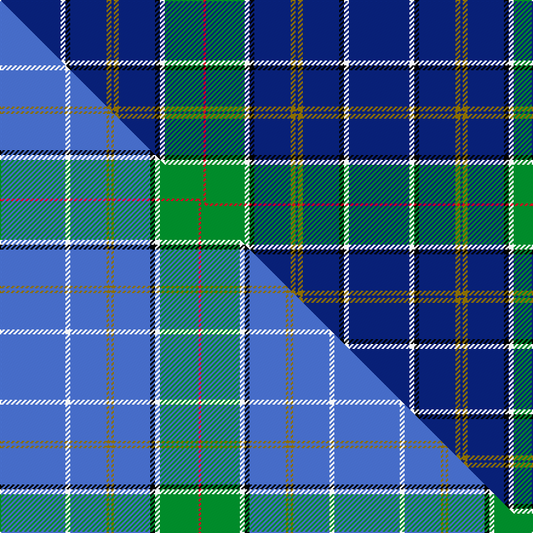

This page is one **sett** — a single exact thread-count. It belongs to the [tartan](/setts/db25w2k2db15y2db1y2db15k2w2g16r1/)
(the same proportion at any scale), whose colour order is pattern [BWKBGBGBKWGR](/stripes/bwkbgbgbkwgr/).

Part of the [Quigley of Knockcroghery](/tartans/quigley-of-knockcroghery/) tartan — the named design grouping this sett with its other cloths.

Sourced from register-of-tartans.  It is a [12 stripe tartan](/stripes/stripes12/).

Original link [https://www.tartanregister.gov.uk/tartanDetails.aspx?ref=10515](https://www.tartanregister.gov.uk/tartanDetails.aspx?ref=10515)

Dataset <small>— provenance for this record, inherited from the source manifest</small>

<dl class="dataset-prov">
<dt>source</dt><dd><a href="/sources/register-of-tartans/">Scottish Register of Tartans</a></dd>
<dt>data captured from</dt><dd><a href="https://github.com/thetartan/tartan-database/blob/master/data/register-of-tartans/data.csv">https://github.com/thetartan/tartan-database/blob/master/data/register-of-tartans/data.csv</a></dd>
<dt>data date</dt><dd>02/11/2011 <small>(this record)</small></dd>
<dt>licence</dt><dd><a href="https://www.tartanregister.gov.uk/copyright">Crown copyright</a></dd>
</dl>

Capture chain <small>— the hands this data passed through, oldest first; each capture carries its own licence</small>

<ol class="capture-chain">
<li><a href="https://www.tartanregister.gov.uk/">Scottish Register of Tartans</a> · <a href="https://www.tartanregister.gov.uk/copyright">Crown copyright</a> <small>the living register — still published by National Records of Scotland</small></li>
<li><a href="https://github.com/thetartan/tartan-database">thetartan/tartan-database</a> <small>2016-2017</small> · <a href="https://creativecommons.org/licenses/by-nc-nd/4.0/">CC BY-NC-ND 4.0</a> <small>Levko Kravets's frozen compilation — the capture we vendored, and where its CC licence text came from</small></li>
<li>this dictionary <small>captured 2026-06-10 · commit 5bf86c7566</small> <small>each re-capture is a git commit to data/sources</small></li>
</ol>

## Register references

External register numbers recorded for this tartan.

- Scottish Register of Tartans: [10515](https://www.tartanregister.gov.uk/tartanDetails.aspx?ref=10515)

## Thread count
DB/50 W4 K4 DB30 Y4 DB2 Y4 DB30 K4 W4 G32 R/2

One full sett is **288 threads**.

## Palette
<table><thead><tr><th>Colour</th><th>Shade</th><th>OKLCh</th></tr></thead><tbody><tr><td>DB</td><td><code style="background-color:#082077;">#082077</code> <small style="color:#888">#082077</small></td><td><small style="color:#888">oklch(30.0% 0.149 265.1)</small></td></tr><tr><td>G</td><td><code style="background-color:#008B2A;">#008B2A</code> <small style="color:#888">#008B2A</small></td><td><small style="color:#888">oklch(55.4% 0.170 145.9)</small></td></tr><tr><td>K</td><td><code style="background-color:#000000;">#000000</code> <small style="color:#888">#000000</small></td><td><small style="color:#888">oklch(0.0% 0.000 0.0)</small></td></tr><tr><td>R</td><td><code style="background-color:#D60020;">#D60020</code> <small style="color:#888">#D60020</small></td><td><small style="color:#888">oklch(55.2% 0.224 25.5)</small></td></tr><tr><td>W</td><td><code style="background-color:#F7F7F7;">#F7F7F7</code> <small style="color:#888">#F7F7F7</small></td><td><small style="color:#888">oklch(97.6% 0.000 89.9)</small></td></tr><tr><td>Y</td><td><code style="background-color:#8B6E00;">#8B6E00</code> <small style="color:#888">#8B6E00</small></td><td><small style="color:#888">oklch(55.1% 0.113 90.4)</small></td></tr></tbody></table>

# Sample pattern

## Compared to the master

This cloth is one sett of its design; the master sett (the exemplar the design is anchored on) is below for comparison.

Its **ΔTartan distance** from the master is **0.51** — the same measure the nearest-tartans table ranks by (0 is identical; a re-scale of the same cloth is near 0, a recolour or a different proportion further).

<figure class="master-compare" style="margin:0">

this sett
master sett ★

<figcaption style="color:#888;font-size:smaller">One weave of this sett against the <a href="/setts/b27w2b15y1b1y1b15k2w2g16r1/">master sett ★</a>, split on the diagonal: a shared proportion runs seamlessly across it with only the shades shifting; a different proportion breaks on it.</figcaption>
</figure>

## Nearest tartan variants

The nearest existing variants by ΔTartan distance, with this cloth at the top so the swatches line up against it.

ΔTartan

Threads

Variant

Sett

—

288

<a href="/variants/s12/db25w2k2db15y2db1y2db15k2w2g16r1~x2/">Quigley of Knockcroghery (Modern)</a>

<a href="/ttd/edit/#slug=db25w2k2db15ly2db1ly2db15k2w2dg16r1~x2&amp;base=db25w2k2db15y2db1y2db15k2w2g16r1~x2" title="compare in the TTD">0.12</a>

288

<a href="/variants/s12/db25w2k2db15ly2db1ly2db15k2w2dg16r1~x2/">Quigley of Knockcroghery (Pers)</a>

<a href="/ttd/edit/#slug=b27w2b15y1b1y1b15k2w2g16r1~x2&amp;base=db25w2k2db15y2db1y2db15k2w2g16r1~x2" title="compare in the TTD">0.51</a>

276

<a href="/variants/s11/b27w2b15y1b1y1b15k2w2g16r1~x2/">Quigley of Knockcroghery (Hunting) (Personal)</a>

<a href="/ttd/edit/#slug=r4db60g35db4ly4db4dy12db18k3w2~ly3206085-dy1804072&amp;base=db25w2k2db15y2db1y2db15k2w2g16r1~x2" title="compare in the TTD">2.06</a>

286

<a href="/variants/s10/r4db60g35db4ly4db4dy12db18k3w2~ly3206085-dy1804072/">Fogarty (Tipperary)</a>

<a href="/ttd/edit/#slug=w4k2w2k28dt4k2dt2r1k13r1g13r2~x2~k0504259-dt1602222&amp;base=db25w2k2db15y2db1y2db15k2w2g16r1~x2" title="compare in the TTD">2.09</a>

284

<a href="/variants/s12/w4k2w2k28dt4k2dt2r1k13r1g13r2~x2~k0504259-dt1602222/">Niagara Region</a>

<a href="/ttd/edit/#slug=r3g1db2g4db30k2db4k2db30g27y3k3w3~x2&amp;base=db25w2k2db15y2db1y2db15k2w2g16r1~x2" title="compare in the TTD">2.26</a>

444

<a href="/variants/s13/r3g1db2g4db30k2db4k2db30g27y3k3w3~x2/">Joss</a>

<a href="/ttd/edit/#slug=t21k3t15k4n6k3t2dr3t1dy2t1dp3t18k2t2k2~x2&amp;base=db25w2k2db15y2db1y2db15k2w2g16r1~x2" title="compare in the TTD">2.47</a>

306

<a href="/variants/s16/t21k3t15k4n6k3t2dr3t1dy2t1dp3t18k2t2k2~x2/">Pounds</a>

<a href="/ttd/edit/#slug=r4db11lg4w3lg4ly6db3k3db4k1db30w3~x2&amp;base=db25w2k2db15y2db1y2db15k2w2g16r1~x2" title="compare in the TTD">2.52</a>

290

<a href="/variants/s12/r4db11lg4w3lg4ly6db3k3db4k1db30w3~x2/">Murison, Ina</a>

<a href="/ttd/edit/#slug=w4db32k1y2k1db10y18db10k1dr2~x2&amp;base=db25w2k2db15y2db1y2db15k2w2g16r1~x2" title="compare in the TTD">2.53</a>

312

<a href="/variants/s10/w4db32k1y2k1db10y18db10k1dr2~x2/">European Union (Fashion)</a>

<a href="/ttd/edit/#slug=db49ly3dy13db12r4db5k7g26db4r2~x2&amp;base=db25w2k2db15y2db1y2db15k2w2g16r1~x2" title="compare in the TTD">2.57</a>

398

<a href="/variants/s10/db49ly3dy13db12r4db5k7g26db4r2~x2/">State Seal of Arkansas (Fashion)</a>

<a href="/ttd/edit/#slug=r4db11lb4w3lb4y6db3k3db4k1db30w3~x2&amp;base=db25w2k2db15y2db1y2db15k2w2g16r1~x2" title="compare in the TTD">2.59</a>

290

<a href="/variants/s12/r4db11lb4w3lb4y6db3k3db4k1db30w3~x2/">Murison (2014)</a>

## Neighbour map

Every grey dot is one of 13621 variants placed by the first two principal components of the ΔTartan feature space (42% of its variance). Red is this tartan; blue dots are its nearest — click one to open its page.

<svg viewBox="0 0 640 380" role="img" style="max-width:100%;height:auto;border:1px solid #e0e0e0;border-radius:4px;display:block" xmlns="http://www.w3.org/2000/svg"><image href="/nn/cloud.v1.png" width="640" height="380"/><a href="/variants/s12/db25w2k2db15ly2db1ly2db15k2w2dg16r1~x2/"><circle cx="336.1" cy="92.9" r="4" fill="#3465a4"><title>Quigley of Knockcroghery (Pers)</title></circle></a><a href="/variants/s11/b27w2b15y1b1y1b15k2w2g16r1~x2/"><circle cx="398.1" cy="102.5" r="4" fill="#3465a4"><title>Quigley of Knockcroghery (Hunting) (Personal)</title></circle></a><a href="/variants/s10/r4db60g35db4ly4db4dy12db18k3w2~ly3206085-dy1804072/"><circle cx="292.3" cy="75.8" r="4" fill="#3465a4"><title>Fogarty (Tipperary)</title></circle></a><a href="/variants/s12/w4k2w2k28dt4k2dt2r1k13r1g13r2~x2~k0504259-dt1602222/"><circle cx="285.4" cy="78.6" r="4" fill="#3465a4"><title>Niagara Region</title></circle></a><a href="/variants/s13/r3g1db2g4db30k2db4k2db30g27y3k3w3~x2/"><circle cx="289.3" cy="72.3" r="4" fill="#3465a4"><title>Joss</title></circle></a><a href="/variants/s16/t21k3t15k4n6k3t2dr3t1dy2t1dp3t18k2t2k2~x2/"><circle cx="326.7" cy="86.8" r="4" fill="#3465a4"><title>Pounds</title></circle></a><a href="/variants/s12/r4db11lg4w3lg4ly6db3k3db4k1db30w3~x2/"><circle cx="282.3" cy="69.4" r="4" fill="#3465a4"><title>Murison, Ina</title></circle></a><a href="/variants/s10/w4db32k1y2k1db10y18db10k1dr2~x2/"><circle cx="353.2" cy="94.0" r="4" fill="#3465a4"><title>European Union (Fashion)</title></circle></a><a href="/variants/s10/db49ly3dy13db12r4db5k7g26db4r2~x2/"><circle cx="276.0" cy="103.0" r="4" fill="#3465a4"><title>State Seal of Arkansas (Fashion)</title></circle></a><a href="/variants/s12/r4db11lb4w3lb4y6db3k3db4k1db30w3~x2/"><circle cx="292.2" cy="70.7" r="4" fill="#3465a4"><title>Murison (2014)</title></circle></a><circle cx="325.1" cy="90.4" r="5" fill="#c00000"/><text x="320" y="376" text-anchor="middle" font-size="11" fill="#999">ground</text><text x="11" y="190" text-anchor="middle" font-size="11" fill="#999" transform="rotate(-90 11 190)">complexity</text></svg>

ID: /variants/s12/db25w2k2db15y2db1y2db15k2w2g16r1~x2/
