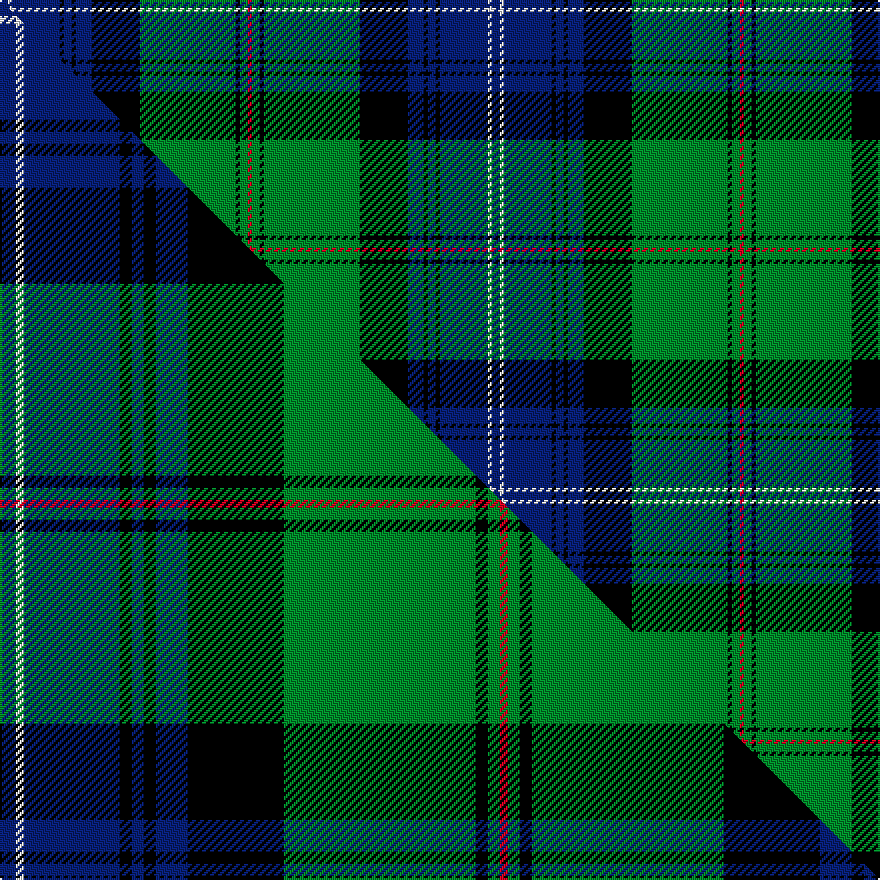

This page is one **sett** — a single exact thread-count. It belongs to the [tartan](/setts/db2w1db12k1db2k1db4k12g24k1g2r1/)
(the same proportion at any scale), whose colour order is pattern [BWBKBKBKGKGR](/stripes/bwbkbkbkgkgr/).

Part of the [Urquhart](/tartans/urquhart-3/) tartan — the named design grouping this sett with its other cloths.

Sourced from weddslist.  It is a [12 stripe tartan](/stripes/stripes12/).

Original link http://www.weddslist.com/cgi-bin/tartans/pg.pl?source=rb

## Thread count
DB/4 W2 DB24 K2 DB4 K2 DB8 K24 G48 K2 G4 R/2

One full sett is **246 threads**.

## Palette
<table><thead><tr><th>Colour</th><th>Shade</th><th>OKLCh</th></tr></thead><tbody><tr><td>DB</td><td><code style="background-color:#082077;">#082077</code> <small style="color:#888">#082077</small></td><td><small style="color:#888">oklch(30.0% 0.149 265.1)</small></td></tr><tr><td>G</td><td><code style="background-color:#008B2A;">#008B2A</code> <small style="color:#888">#008B2A</small></td><td><small style="color:#888">oklch(55.4% 0.170 145.9)</small></td></tr><tr><td>K</td><td><code style="background-color:#000000;">#000000</code> <small style="color:#888">#000000</small></td><td><small style="color:#888">oklch(0.0% 0.000 0.0)</small></td></tr><tr><td>W</td><td><code style="background-color:#F7F7F7;">#F7F7F7</code> <small style="color:#888">#F7F7F7</small></td><td><small style="color:#888">oklch(97.6% 0.000 89.9)</small></td></tr><tr><td>R</td><td><code style="background-color:#D60020;">#D60020</code> <small style="color:#888">#D60020</small></td><td><small style="color:#888">oklch(55.2% 0.224 25.5)</small></td></tr></tbody></table>

# Sample pattern

## Compared to the master

This cloth is one sett of its design; the master sett (the exemplar the design is anchored on) is below for comparison.

Its **ΔTartan distance** from the master is **0.13** — the same measure the nearest-tartans table ranks by (0 is identical; a re-scale of the same cloth is near 0, a recolour or a different proportion further).

<figure class="master-compare" style="margin:0">

this sett
master sett ★

<figcaption style="color:#888;font-size:smaller">One weave of this sett against the <a href="/setts/db4w2db24k3db3k3db8k24g48k3g3r2/">master sett ★</a>, split on the diagonal: a shared proportion runs seamlessly across it with only the shades shifting; a different proportion breaks on it.</figcaption>
</figure>

## Nearest tartan variants

The nearest existing variants by ΔTartan distance, with this cloth at the top so the swatches line up against it.

ΔTartan

Threads

Variant

Sett

—

246

<a href="/variants/s12/db2w1db12k1db2k1db4k12g24k1g2r1~x2/">Urquhart</a>

<a href="/ttd/edit/#slug=db4w2db24k3db3k3db8k24g48k3g3r2~x2&amp;base=db2w1db12k1db2k1db4k12g24k1g2r1~x2" title="compare in the TTD">0.06</a>

496

<a href="/variants/s12/db4w2db24k3db3k3db8k24g48k3g3r2~x2/">Urquhart (White Line)</a>

<a href="/ttd/edit/#slug=db4w2db24k3db3k3db8k24g48k3g3r2&amp;base=db2w1db12k1db2k1db4k12g24k1g2r1~x2" title="compare in the TTD">0.06</a>

248

<a href="/variants/s12/db4w2db24k3db3k3db8k24g48k3g3r2/">Urquhart, White Line</a>

<a href="/ttd/edit/#slug=g6w2g24k12db3k2db2k2db12r1db1r3~x2&amp;base=db2w1db12k1db2k1db4k12g24k1g2r1~x2" title="compare in the TTD">1.58</a>

262

<a href="/variants/s12/g6w2g24k12db3k2db2k2db12r1db1r3~x2/">Sutherland (Clan)</a>

<a href="/ttd/edit/#slug=g6w2g24k12db3k2db2k2db12r1db1r3&amp;base=db2w1db12k1db2k1db4k12g24k1g2r1~x2" title="compare in the TTD">1.58</a>

131

<a href="/variants/s12/g6w2g24k12db3k2db2k2db12r1db1r3/">Sutherland</a>

<a href="/ttd/edit/#slug=g4y2g24dr2k12db3k2db2k2db12w1db1w3~x2&amp;base=db2w1db12k1db2k1db4k12g24k1g2r1~x2" title="compare in the TTD">1.81</a>

266

<a href="/variants/s13/g4y2g24dr2k12db3k2db2k2db12w1db1w3~x2/">Baron of Greencastle (Personal)</a>

<a href="/ttd/edit/#slug=g3db1g1db12k2db2k2db3k12dg24w3~x2~g2408144-dg1806142&amp;base=db2w1db12k1db2k1db4k12g24k1g2r1~x2" title="compare in the TTD">2.71</a>

248

<a href="/variants/s11/g3db1g1db12k2db2k2db3k12dg24w3~x2~g2408144-dg1806142/">Selby</a>

<a href="/ttd/edit/#slug=g3db1g1db12k2db2k2db3k12dg24w3~x2~g2408144-dg1804144&amp;base=db2w1db12k1db2k1db4k12g24k1g2r1~x2" title="compare in the TTD">2.71</a>

248

<a href="/variants/s11/g3db1g1db12k2db2k2db3k12dg24w3~x2~g2408144-dg1804144/">Selby (Name)</a>

<a href="/ttd/edit/#slug=db4y2g24y2k12db3k2db2k2db14dr1db1dr3~x2&amp;base=db2w1db12k1db2k1db4k12g24k1g2r1~x2" title="compare in the TTD">2.88</a>

274

<a href="/variants/s13/db4y2g24y2k12db3k2db2k2db14dr1db1dr3~x2/">Baron of Greencastle Htg (Personal)</a>

## Neighbour map

Every grey dot is one of 13620 variants placed by the first two principal components of the ΔTartan feature space (42% of its variance). Red is this tartan; blue dots are its nearest — click one to open its page.

<svg viewBox="0 0 640 380" role="img" style="max-width:100%;height:auto;border:1px solid #e0e0e0;border-radius:4px;display:block" xmlns="http://www.w3.org/2000/svg"><image href="/nn/cloud.v1.png" width="640" height="380"/><a href="/variants/s12/db4w2db24k3db3k3db8k24g48k3g3r2~x2/"><circle cx="193.9" cy="93.6" r="4" fill="#3465a4"><title>Urquhart (White Line)</title></circle></a><a href="/variants/s12/db4w2db24k3db3k3db8k24g48k3g3r2/"><circle cx="193.9" cy="93.6" r="4" fill="#3465a4"><title>Urquhart, White Line</title></circle></a><a href="/variants/s12/g6w2g24k12db3k2db2k2db12r1db1r3~x2/"><circle cx="188.0" cy="102.6" r="4" fill="#3465a4"><title>Sutherland (Clan)</title></circle></a><a href="/variants/s12/g6w2g24k12db3k2db2k2db12r1db1r3/"><circle cx="188.0" cy="102.6" r="4" fill="#3465a4"><title>Sutherland</title></circle></a><a href="/variants/s13/g4y2g24dr2k12db3k2db2k2db12w1db1w3~x2/"><circle cx="154.5" cy="83.2" r="4" fill="#3465a4"><title>Baron of Greencastle (Personal)</title></circle></a><a href="/variants/s11/g3db1g1db12k2db2k2db3k12dg24w3~x2~g2408144-dg1806142/"><circle cx="172.2" cy="108.3" r="4" fill="#3465a4"><title>Selby</title></circle></a><a href="/variants/s11/g3db1g1db12k2db2k2db3k12dg24w3~x2~g2408144-dg1804144/"><circle cx="175.9" cy="108.0" r="4" fill="#3465a4"><title>Selby (Name)</title></circle></a><a href="/variants/s13/db4y2g24y2k12db3k2db2k2db14dr1db1dr3~x2/"><circle cx="165.3" cy="101.1" r="4" fill="#3465a4"><title>Baron of Greencastle Htg (Personal)</title></circle></a><circle cx="200.5" cy="93.1" r="5" fill="#c00000"/><text x="320" y="376" text-anchor="middle" font-size="11" fill="#999">ground</text><text x="11" y="190" text-anchor="middle" font-size="11" fill="#999" transform="rotate(-90 11 190)">complexity</text></svg>

ID: /variants/s12/db2w1db12k1db2k1db4k12g24k1g2r1~x2/
