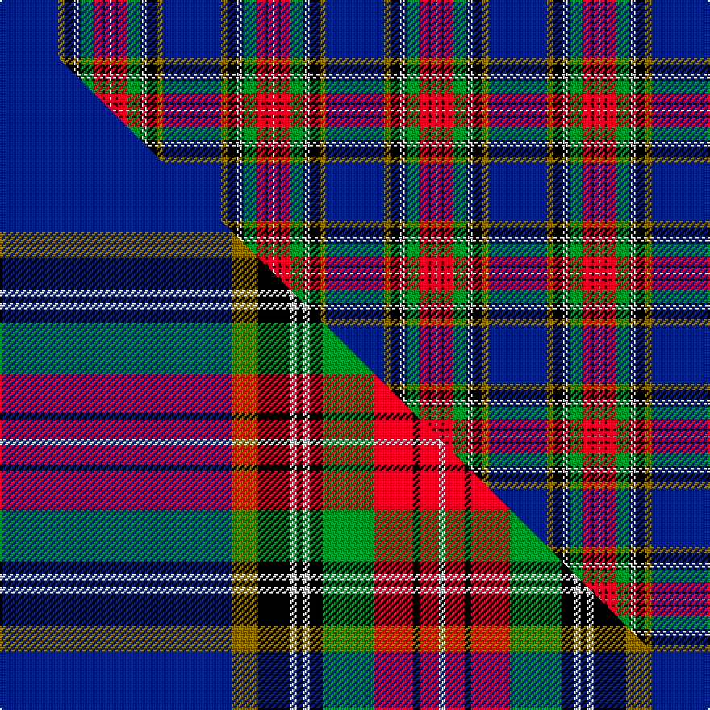

This page is one **sett** — a single exact thread-count. It belongs to the [tartan](/setts/db36y4k6w1k1w1k1g8r6k1r3w1/)
(the same proportion at any scale), whose colour order is pattern [BGKWKWKGRKRW](/stripes/bgkwkwkgrkrw/).

Part of the [MacBeth](/tartans/macbeth/) tartan — the named design grouping this sett with its other cloths.

Sourced from weddslist.  It is a [12 stripe tartan](/stripes/stripes12/).

Original link http://www.weddslist.com/cgi-bin/tartans/pg.pl?source=rb

2 attestations — the source records this cloth was collapsed from (oldest owns this page)

<ul>
<li>undated — MacBeth (weddslist, <a href="http://www.weddslist.com/cgi-bin/tartans/pg.pl?source=rb">record</a>) </li>
<li>undated — MacBeth (weddslist, <a href="http://www.weddslist.com/cgi-bin/tartans/pg.pl?source=x">record</a>) </li>
</ul>

## Thread count
DB/36 Y4 K6 W1 K1 W1 K1 G8 R6 K1 R3 W/1

One full sett is **101 threads**.

## Palette
<table><thead><tr><th>Colour</th><th>Shade</th><th>OKLCh</th></tr></thead><tbody><tr><td>DB</td><td><code style="background-color:#082077;">#082077</code> <small style="color:#888">#082077</small></td><td><small style="color:#888">oklch(30.0% 0.149 265.1)</small></td></tr><tr><td>G</td><td><code style="background-color:#008B2A;">#008B2A</code> <small style="color:#888">#008B2A</small></td><td><small style="color:#888">oklch(55.4% 0.170 145.9)</small></td></tr><tr><td>K</td><td><code style="background-color:#000000;">#000000</code> <small style="color:#888">#000000</small></td><td><small style="color:#888">oklch(0.0% 0.000 0.0)</small></td></tr><tr><td>W</td><td><code style="background-color:#F7F7F7;">#F7F7F7</code> <small style="color:#888">#F7F7F7</small></td><td><small style="color:#888">oklch(97.6% 0.000 89.9)</small></td></tr><tr><td>R</td><td><code style="background-color:#D60020;">#D60020</code> <small style="color:#888">#D60020</small></td><td><small style="color:#888">oklch(55.2% 0.224 25.5)</small></td></tr><tr><td>Y</td><td><code style="background-color:#8B6E00;">#8B6E00</code> <small style="color:#888">#8B6E00</small></td><td><small style="color:#888">oklch(55.1% 0.113 90.4)</small></td></tr></tbody></table>

# Sample pattern

## Compared to the master

This cloth is one sett of its design; the master sett (the exemplar the design is anchored on) is below for comparison.

Its **ΔTartan distance** from the master is **0.01** — the same measure the nearest-tartans table ranks by (0 is identical; a re-scale of the same cloth is near 0, a recolour or a different proportion further).

<figure class="master-compare" style="margin:0">

this sett
master sett ★

<figcaption style="color:#888;font-size:smaller">One weave of this sett against the <a href="/setts/db36y4k5w1k1w1k2g8r6k1r3w1/">master sett ★</a>, split on the diagonal: a shared proportion runs seamlessly across it with only the shades shifting; a different proportion breaks on it.</figcaption>
</figure>

## Nearest variants

The nearest existing variants by ΔTartan distance, with this cloth at the top so the swatches line up against it.

ΔTartan

Threads

Variant

Sett

—

101

<a href="/variants/s12/db36y4k6w1k1w1k1g8r6k1r3w1/">MacBeth</a>

<a href="/ttd/edit/#slug=db36y4k6w1k1w1k1g8r6k1r3w1~x2&amp;base=db36y4k6w1k1w1k1g8r6k1r3w1" title="compare in the TTD">0.00</a>

202

<a href="/variants/s12/db36y4k6w1k1w1k1g8r6k1r3w1~x2/">MacBeth</a>

<a href="/ttd/edit/#slug=db36y4k5w1k1w1k2g8r6k1r3w1~x4&amp;base=db36y4k6w1k1w1k1g8r6k1r3w1" title="compare in the TTD">0.04</a>

404

<a href="/variants/s12/db36y4k5w1k1w1k2g8r6k1r3w1~x4/">MacBeth</a>

<a href="/ttd/edit/#slug=db36y4k6y1k1w1k1g8r6k1r3w1~x2&amp;base=db36y4k6w1k1w1k1g8r6k1r3w1" title="compare in the TTD">0.30</a>

202

<a href="/variants/s12/db36y4k6y1k1w1k1g8r6k1r3w1~x2/">MacBeth, MacLulich</a>

<a href="/ttd/edit/#slug=db40y4k3w2k3w2k3g10r6k2r4w2~x2&amp;base=db36y4k6w1k1w1k1g8r6k1r3w1" title="compare in the TTD">0.47</a>

240

<a href="/variants/s12/db40y4k3w2k3w2k3g10r6k2r4w2~x2/">MacBeth #2</a>

<a href="/ttd/edit/#slug=db90k10y2k4w2k4t14r12k2r5w4&amp;base=db36y4k6w1k1w1k1g8r6k1r3w1" title="compare in the TTD">1.14</a>

204

<a href="/variants/s11/db90k10y2k4w2k4t14r12k2r5w4/">Lanyard Blue (Fashion)</a>

<a href="/ttd/edit/#slug=db20k3y1w1g3r3k1r2w1~x2&amp;base=db36y4k6w1k1w1k1g8r6k1r3w1" title="compare in the TTD">1.67</a>

98

<a href="/variants/s9/db20k3y1w1g3r3k1r2w1~x2/">Stewart Blue MINI Tartan</a>

<a href="/ttd/edit/#slug=k6r2k6r12w2db36y1g3~x2&amp;base=db36y4k6w1k1w1k1g8r6k1r3w1" title="compare in the TTD">1.88</a>

254

<a href="/variants/s8/k6r2k6r12w2db36y1g3~x2/">Fremont Presbyterian Church (P)</a>

<a href="/ttd/edit/#slug=g24w2k4w2k8r2db51k2lb8w1~x2&amp;base=db36y4k6w1k1w1k1g8r6k1r3w1" title="compare in the TTD">2.22</a>

366

<a href="/variants/s10/g24w2k4w2k8r2db51k2lb8w1~x2/">Victoria (Australia)</a>

<a href="/ttd/edit/#slug=g24w2k4w2k8r2db51k2lb8w1~x2~r2806019&amp;base=db36y4k6w1k1w1k1g8r6k1r3w1" title="compare in the TTD">2.22</a>

366

<a href="/variants/s10/g24w2k4w2k8r2db51k2lb8w1~x2~r2806019/">Victoria State (Australia)</a>

<a href="/ttd/edit/#slug=w4k1dy4k1ly3k1dy4db48w3dr25db4dr3w3~x2&amp;base=db36y4k6w1k1w1k1g8r6k1r3w1" title="compare in the TTD">2.65</a>

402

<a href="/variants/s13/w4k1dy4k1ly3k1dy4db48w3dr25db4dr3w3~x2/">State Seal of Colorado (Fashion)</a>

## Neighbour map

Every grey dot is one of 13620 variants placed by the first two principal components of the ΔTartan feature space (42% of its variance). Red is this tartan; blue dots are its nearest — click one to open its page.

<svg viewBox="0 0 640 380" role="img" style="max-width:100%;height:auto;border:1px solid #e0e0e0;border-radius:4px;display:block" xmlns="http://www.w3.org/2000/svg"><image href="/nn/cloud.v1.png" width="640" height="380"/><a href="/variants/s12/db36y4k6w1k1w1k1g8r6k1r3w1~x2/"><circle cx="246.6" cy="40.6" r="4" fill="#3465a4"><title>MacBeth</title></circle></a><a href="/variants/s12/db36y4k5w1k1w1k2g8r6k1r3w1~x4/"><circle cx="246.4" cy="40.8" r="4" fill="#3465a4"><title>MacBeth</title></circle></a><a href="/variants/s12/db36y4k6y1k1w1k1g8r6k1r3w1~x2/"><circle cx="250.8" cy="41.8" r="4" fill="#3465a4"><title>MacBeth, MacLulich</title></circle></a><a href="/variants/s12/db40y4k3w2k3w2k3g10r6k2r4w2~x2/"><circle cx="200.3" cy="65.9" r="4" fill="#3465a4"><title>MacBeth #2</title></circle></a><a href="/variants/s11/db90k10y2k4w2k4t14r12k2r5w4/"><circle cx="322.3" cy="29.7" r="4" fill="#3465a4"><title>Lanyard Blue (Fashion)</title></circle></a><a href="/variants/s9/db20k3y1w1g3r3k1r2w1~x2/"><circle cx="260.5" cy="78.4" r="4" fill="#3465a4"><title>Stewart Blue MINI Tartan</title></circle></a><a href="/variants/s8/k6r2k6r12w2db36y1g3~x2/"><circle cx="258.0" cy="70.1" r="4" fill="#3465a4"><title>Fremont Presbyterian Church (P)</title></circle></a><a href="/variants/s10/g24w2k4w2k8r2db51k2lb8w1~x2/"><circle cx="234.1" cy="47.2" r="4" fill="#3465a4"><title>Victoria (Australia)</title></circle></a><a href="/variants/s10/g24w2k4w2k8r2db51k2lb8w1~x2~r2806019/"><circle cx="233.6" cy="47.3" r="4" fill="#3465a4"><title>Victoria State (Australia)</title></circle></a><a href="/variants/s13/w4k1dy4k1ly3k1dy4db48w3dr25db4dr3w3~x2/"><circle cx="265.6" cy="32.5" r="4" fill="#3465a4"><title>State Seal of Colorado (Fashion)</title></circle></a><circle cx="246.6" cy="40.6" r="5" fill="#c00000"/><text x="320" y="376" text-anchor="middle" font-size="11" fill="#999">ground</text><text x="11" y="190" text-anchor="middle" font-size="11" fill="#999" transform="rotate(-90 11 190)">complexity</text></svg>

ID: /variants/s12/db36y4k6w1k1w1k1g8r6k1r3w1/
