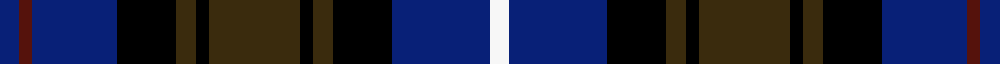

This is one **variant** — a specific cloth: this exact thread count and colourway, with its own
provenance below. It is one weaving of the [sett](/tartans/m/mc/mcwilliams-dress-2/) (the scale-free proportion — the
same cloth at any scale or shade), whose colour order is pattern [BBBKGKGKGKBW](/stripes/bbbkgkgkgkbw/).

Part of the [McWilliams Dress](/tartans/m/mc/mcwilliams-dress-2/) tartan — the named design grouping this sett with its other cloths.

Sourced from register-of-tartans.  It is a [12 stripe tartan](/stripes/stripes12/).

Original link [https://www.tartanregister.gov.uk/tartanDetails.aspx?ref=11155](https://www.tartanregister.gov.uk/tartanDetails.aspx?ref=11155)

Dataset <small>— provenance for this record, inherited from the source manifest</small>

<dl class="dataset-prov">
<dt>source</dt><dd><a href="/sources/register-of-tartans/">Scottish Register of Tartans</a></dd>
<dt>data captured from</dt><dd><a href="https://github.com/thetartan/tartan-database/blob/master/data/register-of-tartans/data.csv">https://github.com/thetartan/tartan-database/blob/master/data/register-of-tartans/data.csv</a></dd>
<dt>data date</dt><dd>11/10/2014 <small>(this record)</small></dd>
<dt>licence</dt><dd><a href="https://www.tartanregister.gov.uk/copyright">Crown copyright</a></dd>
</dl>

Capture chain <small>— the hands this data passed through, oldest first; each capture carries its own licence</small>

<ol class="capture-chain">
<li><a href="https://www.tartanregister.gov.uk/">Scottish Register of Tartans</a> · <a href="https://www.tartanregister.gov.uk/copyright">Crown copyright</a> <small>the living register — still published by National Records of Scotland</small></li>
<li><a href="https://github.com/thetartan/tartan-database">thetartan/tartan-database</a> <small>2016-2017</small> · <a href="https://creativecommons.org/licenses/by-nc-nd/4.0/">CC BY-NC-ND 4.0</a> <small>Levko Kravets's frozen compilation — the capture we vendored, and where its CC licence text came from</small></li>
<li>this dictionary <small>captured 2026-06-10 · commit 5bf86c7566</small> <small>each re-capture is a git commit to data/sources</small></li>
</ol>

## Register references

External register numbers recorded for this tartan.

- Scottish Register of Tartans: [11155](https://www.tartanregister.gov.uk/tartanDetails.aspx?ref=11155)

## Thread count
DB/6 DR4 DB26 K18 DY6 K4 DY28 K4 DY6 K18 DB30 W/6

One full sett is **300 threads**.

## Palette
<table><thead><tr><th>Colour</th><th>Shade</th><th>OKLCh</th></tr></thead><tbody><tr><td>DB</td><td><code style="background-color:#082077;">#082077</code> <small style="color:#888">#082077</small></td><td><small style="color:#888">oklch(30.0% 0.149 265.1)</small></td></tr><tr><td>DR</td><td><code style="background-color:#55120C;">#55120C</code> <small style="color:#888">#55120C</small></td><td><small style="color:#888">oklch(30.0% 0.099 29.3)</small></td></tr><tr><td>K</td><td><code style="background-color:#000000;">#000000</code> <small style="color:#888">#000000</small></td><td><small style="color:#888">oklch(0.0% 0.000 0.0)</small></td></tr><tr><td>W</td><td><code style="background-color:#F7F7F7;">#F7F7F7</code> <small style="color:#888">#F7F7F7</small></td><td><small style="color:#888">oklch(97.6% 0.000 89.9)</small></td></tr><tr><td>DY</td><td><code style="background-color:#3A2B0D;">#3A2B0D</code> <small style="color:#888">#3A2B0D</small></td><td><small style="color:#888">oklch(30.0% 0.049 82.0)</small></td></tr></tbody></table>

# Sample pattern

## Nearest tartan variants

The nearest existing variants by ΔTartan distance, with this cloth at the top so the swatches line up against it.

ΔTartan

Threads

Variant

Sett

—

300

<a href="/variants/s12/db3dr2db13k9dy3k2dy14k2dy3k9db15w3~x2/">McWilliams Dress (2014)</a>

<a href="/ttd/edit/#slug=k8dg8k1w2k1dg8k8db8k1r2k1db8~x8&amp;base=db3dr2db13k9dy3k2dy14k2dy3k9db15w3~x2" title="compare in the TTD">1.50</a>

768

<a href="/variants/s12/k8dg8k1w2k1dg8k8db8k1r2k1db8~x8/">Mackenzie of Woodstock</a>

<a href="/ttd/edit/#slug=db16k4db4k4db6k14dg17k2r3k2dg17k14db18w4~x2&amp;base=db3dr2db13k9dy3k2dy14k2dy3k9db15w3~x2" title="compare in the TTD">1.55</a>

460

<a href="/variants/s14/db16k4db4k4db6k14dg17k2r3k2dg17k14db18w4~x2/">Humphries (Personal)</a>

<a href="/ttd/edit/#slug=db17k3db3k3db3k17dg17k2w3k2dg17k17db17k2r3~x2&amp;base=db3dr2db13k9dy3k2dy14k2dy3k9db15w3~x2" title="compare in the TTD">1.63</a>

464

<a href="/variants/s15/db17k3db3k3db3k17dg17k2w3k2dg17k17db17k2r3~x2/">Cumbernauld District Tartan</a>

<a href="/ttd/edit/#slug=db12k2r2k2r2k12dg11y2dg11k12db11k2r2~x2&amp;base=db3dr2db13k9dy3k2dy14k2dy3k9db15w3~x2" title="compare in the TTD">1.66</a>

304

<a href="/variants/s13/db12k2r2k2r2k12dg11y2dg11k12db11k2r2~x2/">Black Watch Plaid of Pipers</a>

<a href="/ttd/edit/#slug=r4k2db16k17dg16k2y4~x2&amp;base=db3dr2db13k9dy3k2dy14k2dy3k9db15w3~x2" title="compare in the TTD">1.70</a>

228

<a href="/variants/s7/r4k2db16k17dg16k2y4~x2/">Wilson's No.230</a>

<a href="/ttd/edit/#slug=db10r7db31k25dg23k8db7k8y5~x2&amp;base=db3dr2db13k9dy3k2dy14k2dy3k9db15w3~x2" title="compare in the TTD">1.72</a>

466

<a href="/variants/s9/db10r7db31k25dg23k8db7k8y5~x2/">MacCallum of Berwick</a>

<a href="/ttd/edit/#slug=dt4lo3dt24k18dg24t3dg4lo3dg24k18dt24t3~x2~dt1204274-t2503227&amp;base=db3dr2db13k9dy3k2dy14k2dy3k9db15w3~x2" title="compare in the TTD">1.86</a>

594

<a href="/variants/s12/db4lo3db24k18dg24t3dg4lo3dg24k18db24t3~x2~db1204274-t2503227/">Scottish Women's Rural Institutes, The</a>

<a href="/ttd/edit/#slug=dbi13lb2dbi13k3db13k21dy3k18dbi9k2dbi2~x2~dbi1605267-db1003265&amp;base=db3dr2db13k9dy3k2dy14k2dy3k9db15w3~x2" title="compare in the TTD">1.89</a>

366

<a href="/variants/s11/dbi13lb2dbi13k3db13k21dy3k18dbi9k2dbi2~x2~dbi1605267-db1003265/">Haus of RvR</a>

<a href="/ttd/edit/#slug=r2k1db8k8dg8ly2dg8k8db1k1db1k1db4r1~x4&amp;base=db3dr2db13k9dy3k2dy14k2dy3k9db15w3~x2" title="compare in the TTD">1.89</a>

420

<a href="/variants/s14/r2k1db8k8dg8ly2dg8k8db1k1db1k1db4r1~x4/">Farquharson of Baldovie</a>

<a href="/ttd/edit/#slug=dg2k1db9k9dg9k1w1k2w1k1dg9k9db9k1r2~x4&amp;base=db3dr2db13k9dy3k2dy14k2dy3k9db15w3~x2" title="compare in the TTD">1.91</a>

512

<a href="/variants/s15/dg2k1db9k9dg9k1w1k2w1k1dg9k9db9k1r2~x4/">Stephenson Htg (Name)</a>

## Neighbour map

Every grey dot is one of 13656 variants placed by the first two principal components of the ΔTartan feature space (42% of its variance). Red is this tartan; blue dots are its nearest — click one to open its page. The map is a flat projection of a many-dimensional space — [how to read it](/posts/neighbourhood-maps/).

<svg viewBox="0 0 640 380" role="img" style="max-width:100%;height:auto;border:1px solid #e0e0e0;border-radius:4px;display:block" xmlns="http://www.w3.org/2000/svg"><image href="/nn/cloud.v1.png" width="640" height="380"/><a href="/variants/s12/k8dg8k1w2k1dg8k8db8k1r2k1db8~x8/"><circle cx="124.7" cy="177.6" r="4" fill="#3465a4"><title>Mackenzie of Woodstock</title></circle></a><a href="/variants/s14/db16k4db4k4db6k14dg17k2r3k2dg17k14db18w4~x2/"><circle cx="131.7" cy="171.8" r="4" fill="#3465a4"><title>Humphries (Personal)</title></circle></a><a href="/variants/s15/db17k3db3k3db3k17dg17k2w3k2dg17k17db17k2r3~x2/"><circle cx="150.0" cy="160.5" r="4" fill="#3465a4"><title>Cumbernauld District Tartan</title></circle></a><a href="/variants/s13/db12k2r2k2r2k12dg11y2dg11k12db11k2r2~x2/"><circle cx="129.9" cy="186.3" r="4" fill="#3465a4"><title>Black Watch Plaid of Pipers</title></circle></a><a href="/variants/s7/r4k2db16k17dg16k2y4~x2/"><circle cx="155.5" cy="182.3" r="4" fill="#3465a4"><title>Wilson's No.230</title></circle></a><a href="/variants/s9/db10r7db31k25dg23k8db7k8y5~x2/"><circle cx="151.3" cy="209.4" r="4" fill="#3465a4"><title>MacCallum of Berwick</title></circle></a><a href="/variants/s12/db4lo3db24k18dg24t3dg4lo3dg24k18db24t3~x2~db1204274-t2503227/"><circle cx="154.2" cy="187.4" r="4" fill="#3465a4"><title>Scottish Women's Rural Institutes, The</title></circle></a><a href="/variants/s11/dbi13lb2dbi13k3db13k21dy3k18dbi9k2dbi2~x2~dbi1605267-db1003265/"><circle cx="202.9" cy="171.6" r="4" fill="#3465a4"><title>Haus of RvR</title></circle></a><a href="/variants/s14/r2k1db8k8dg8ly2dg8k8db1k1db1k1db4r1~x4/"><circle cx="129.3" cy="163.3" r="4" fill="#3465a4"><title>Farquharson of Baldovie</title></circle></a><a href="/variants/s15/dg2k1db9k9dg9k1w1k2w1k1dg9k9db9k1r2~x4/"><circle cx="143.0" cy="154.2" r="4" fill="#3465a4"><title>Stephenson Htg (Name)</title></circle></a><circle cx="157.5" cy="179.9" r="5" fill="#c00000"/><text x="320" y="376" text-anchor="middle" font-size="11" fill="#999">ground</text><text x="11" y="190" text-anchor="middle" font-size="11" fill="#999" transform="rotate(-90 11 190)">complexity</text></svg>

ID: /variants/s12/db3dr2db13k9dy3k2dy14k2dy3k9db15w3~x2/
