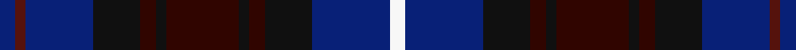

This page is one **sett** — a single exact thread-count. It belongs to the [tartan](/setts/db3dr2db13k9ki3k2ki14k2ki3k9db15w3/)
(the same proportion at any scale), whose colour order is pattern [BBBKKKKKKKBW](/stripes/bbbkkkkkkkbw/).

Sourced from tartans-authority.  It is a [12 stripe tartan](/stripes/stripes12/).

Original link http://www.tartansauthority.com/tartan-ferret/display/11155/

## Register references

External register numbers recorded for this tartan.

- Scottish Register of Tartans: [11155](https://www.tartanregister.gov.uk/tartanDetails?ref=11155)
- Scottish Tartans Authority (ITI): 11155

## Thread count
DB/6 DR4 DB26 K18 Ki6 K4 Ki28 K4 Ki6 K18 DB30 W/6

One full sett is **300 threads**.

## Palette
<table><thead><tr><th>Colour</th><th>Shade</th><th>OKLCh</th></tr></thead><tbody><tr><td>DB</td><td><code style="background-color:#082077;">#082077</code> <small style="color:#888">#082077</small></td><td><small style="color:#888">oklch(30.0% 0.149 265.1)</small></td></tr><tr><td>DR</td><td><code style="background-color:#300500;">#300500</code> <small style="color:#888">#300500</small></td><td><small style="color:#888">oklch(20.3% 0.072 34.5)</small></td></tr><tr><td>DRa</td><td><code style="background-color:#55120C;">#55120C</code> <small style="color:#888">#55120C</small></td><td><small style="color:#888">oklch(30.0% 0.099 29.3)</small></td></tr><tr><td>K</td><td><code style="background-color:#101010;">#101010</code> <small style="color:#888">#101010</small></td><td><small style="color:#888">oklch(17.3% 0.000 89.9)</small></td></tr><tr><td>W</td><td><code style="background-color:#F7F7F7;">#F7F7F7</code> <small style="color:#888">#F7F7F7</small></td><td><small style="color:#888">oklch(97.6% 0.000 89.9)</small></td></tr></tbody></table>

# Sample pattern

ID: /variants/s12/db3dr2db13k9ki3k2ki14k2ki3k9db15w3~x2~k0700000-ki0803038/
