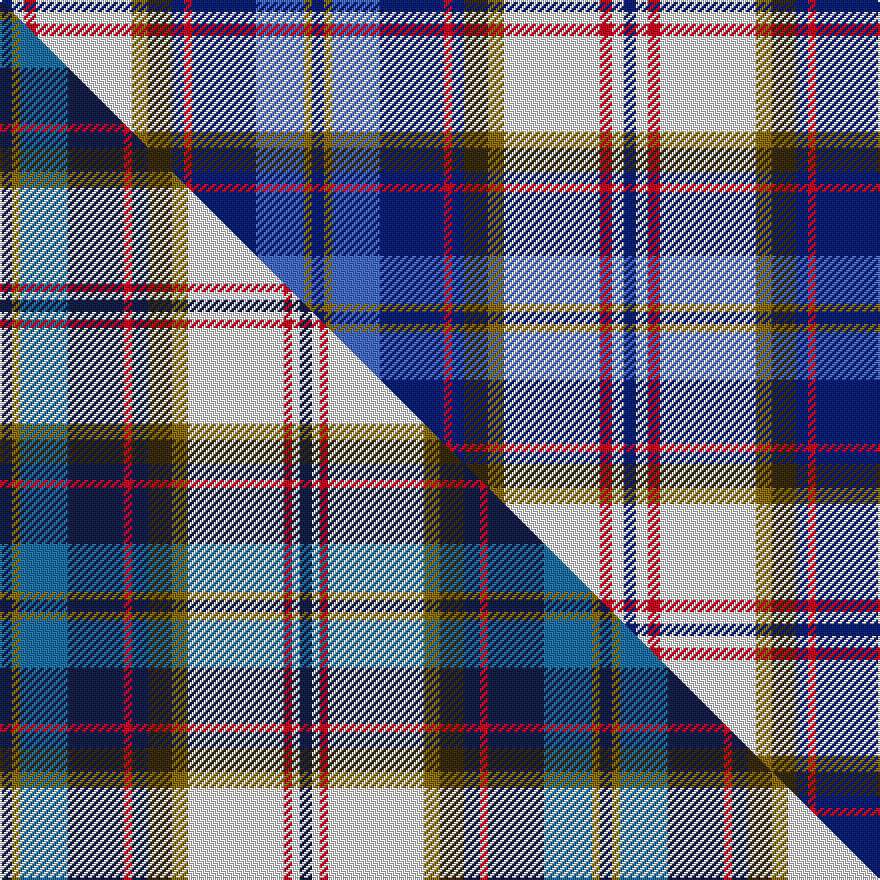

This is one **variant** — a specific cloth: this exact thread count and colourway, with its own
provenance below. It is one weaving of the [sett](/tartans/l/la/lashbrooke-of-barrowfield/) (the scale-free proportion — the
same cloth at any scale or shade), whose colour order is pattern [BGBBRBGGWRWB](/stripes/bgbbrbggwrwb/).

Part of the [Lashbrooke of Barrowfield](/tartans/l/la/lashbrooke-of-barrowfield/) tartan — the named design grouping this sett with its other cloths.

Sourced from tartans-authority.  It is a [12 stripe tartan](/stripes/stripes12/).

Original link <code>http://www.tartansauthority.com/tartan-ferret/display/10947/</code> — retired · [Internet Archive copy](https://web.archive.org/web/*/http://www.tartansauthority.com/tartan-ferret/display/10947/*)

Dataset <small>— provenance for this record, inherited from the source manifest</small>

<dl class="dataset-prov">
<dt>source</dt><dd><a href="/sources/tartans-authority/">Scottish Tartans Authority</a></dd>
<dt>data captured from</dt><dd><a href="https://github.com/thetartan/tartan-database/blob/master/data/tartans-authority/data.csv">https://github.com/thetartan/tartan-database/blob/master/data/tartans-authority/data.csv</a></dd>
<dt>data date</dt><dd>2013 <small>(this record)</small></dd>
<dt>licence</dt><dd><a href="https://creativecommons.org/licenses/by-nc-nd/4.0/">CC BY-NC-ND 4.0</a></dd>
</dl>

Capture chain <small>— the hands this data passed through, oldest first; each capture carries its own licence</small>

<ol class="capture-chain">
<li><a href="https://www.tartansauthority.com/">Scottish Tartans Authority</a> <small>the heritage body’s archive — its tartan-ferret record browser is retired; dead record links are shown unlinked, with an Internet Archive copy (ITI numbers are not SRT references)</small></li>
<li><a href="https://github.com/thetartan/tartan-database">thetartan/tartan-database</a> <small>2016-2017</small> · <a href="https://creativecommons.org/licenses/by-nc-nd/4.0/">CC BY-NC-ND 4.0</a> <small>Levko Kravets's frozen compilation — the capture we vendored, and where its CC licence text came from</small></li>
<li>this dictionary <small>captured 2026-06-10 · commit 5bf86c7566</small> <small>each re-capture is a git commit to data/sources</small></li>
</ol>

## Register references

External register numbers recorded for this tartan.

- Scottish Register of Tartans: [10947](https://www.tartanregister.gov.uk/tartanDetails?ref=10947)
- Scottish Tartans Authority (ITI): 10947

## Thread count
DB/6 W6 R6 W48 Y8 DY12 DB6 R4 DB32 B24 Y4 DB/6

One full sett is **312 threads**.

## Palette
<table><thead><tr><th>Colour</th><th>Shade</th><th>OKLCh</th></tr></thead><tbody><tr><td>B</td><td><code style="background-color:#466CC8;">#466CC8</code> <small style="color:#888">#466CC8</small></td><td><small style="color:#888">oklch(55.1% 0.149 265.0)</small></td></tr><tr><td>DB</td><td><code style="background-color:#082077;">#082077</code> <small style="color:#888">#082077</small></td><td><small style="color:#888">oklch(30.0% 0.149 265.1)</small></td></tr><tr><td>R</td><td><code style="background-color:#D60020;">#D60020</code> <small style="color:#888">#D60020</small></td><td><small style="color:#888">oklch(55.2% 0.224 25.5)</small></td></tr><tr><td>DY</td><td><code style="background-color:#3A2B0D;">#3A2B0D</code> <small style="color:#888">#3A2B0D</small></td><td><small style="color:#888">oklch(30.0% 0.049 82.0)</small></td></tr><tr><td>W</td><td><code style="background-color:#F7F7F7;">#F7F7F7</code> <small style="color:#888">#F7F7F7</small></td><td><small style="color:#888">oklch(97.6% 0.000 89.9)</small></td></tr><tr><td>Y</td><td><code style="background-color:#8B6E00;">#8B6E00</code> <small style="color:#888">#8B6E00</small></td><td><small style="color:#888">oklch(55.1% 0.113 90.4)</small></td></tr></tbody></table>

# Sample pattern

## Compared to the master

This cloth is one sett of its design; the master sett (the exemplar the design is anchored on) is below for comparison.

Its **ΔTartan distance** from the master is **0.16** — the same measure the nearest-tartans table ranks by (0 is identical; a re-scale of the same cloth is near 0, a recolour or a different proportion further).

<figure class="master-compare" style="margin:0">

this sett
master sett ★

<figcaption style="color:#888;font-size:smaller">One weave of this sett against the <a href="/setts/db3y2t12db14r2db4dy6y4w24r2w2db3/">master sett ★</a>, split on the diagonal: a shared proportion runs seamlessly across it with only the shades shifting; a different proportion breaks on it.</figcaption>
</figure>

## Nearest tartan variants

The nearest existing variants by ΔTartan distance, with this cloth at the top so the swatches line up against it.

ΔTartan

Threads

Variant

Sett

—

312

<a href="/variants/s12/db3w3r3w24y4dy6db3r2db16b12y2db3~x2/">Lashbrooke of Barrowfield</a>

<a href="/ttd/edit/#slug=db3y2b12db14r2db4dy6y4w24r2w2db3~x2~db1003265-b2105244&amp;base=db3w3r3w24y4dy6db3r2db16b12y2db3~x2" title="compare in the TTD">0.16</a>

300

<a href="/variants/s12/db3y2t12db14r2db4dy6y4w24r2w2db3~x2~db1003265-t2105244/">Lashbrooke of Barrowfield (Personal)</a>

<a href="/ttd/edit/#slug=r2db12dg2b11dg4db5b2w24g2~x2&amp;base=db3w3r3w24y4dy6db3r2db16b12y2db3~x2" title="compare in the TTD">1.77</a>

248

<a href="/variants/s9/r2db12dg2b11dg4db5b2w24g2~x2/">Fraser Gathering, dress</a>

<a href="/ttd/edit/#slug=r1w1db8lb12y1lb1db2w3db6lb1y1lb1db1w1r1~x6~db1004274&amp;base=db3w3r3w24y4dy6db3r2db16b12y2db3~x2" title="compare in the TTD">1.80</a>

480

<a href="/variants/s15/r1w1db8lb12y1lb1db2w3db6lb1y1lb1db1w1r1~x6~db1004274/">Buchanan, John &amp; Isabella (Commemor)</a>

<a href="/ttd/edit/#slug=lb27db2lb2db16g5r5y2db2dy14db2~x2&amp;base=db3w3r3w24y4dy6db3r2db16b12y2db3~x2" title="compare in the TTD">2.12</a>

250

<a href="/variants/s10/lb27db2lb2db16g5r5y2db2dy14db2~x2/">Lyon, Jeffrey M (Hunting) (Personal)</a>

<a href="/ttd/edit/#slug=db1lb9w3y3db9y1g1r1~x4&amp;base=db3w3r3w24y4dy6db3r2db16b12y2db3~x2" title="compare in the TTD">2.29</a>

216

<a href="/variants/s8/db1lb9w3y3db9y1g1r1~x4/">Curd (2013)</a>

<a href="/ttd/edit/#slug=db2w20r1y2dg8b4dg2b2dg2db20w2~x2&amp;base=db3w3r3w24y4dy6db3r2db16b12y2db3~x2" title="compare in the TTD">2.35</a>

252

<a href="/variants/s11/db2w20r1y2dg8b4dg2b2dg2db20w2~x2/">Nova Scotia, dress</a>

<a href="/ttd/edit/#slug=lo4db2r7db15r3db3r3db7w28dy7w6dy2~x2~r2109032&amp;base=db3w3r3w24y4dy6db3r2db16b12y2db3~x2" title="compare in the TTD">2.48</a>

336

<a href="/variants/s12/lo4db2r7db15r3db3r3db7w28dy7w6dy2~x2~r2109032/">Walker, Dress (Personal)</a>

<a href="/ttd/edit/#slug=lo4db2r7db15r3db3r3db7w28dy7w6dy2~x2&amp;base=db3w3r3w24y4dy6db3r2db16b12y2db3~x2" title="compare in the TTD">2.48</a>

336

<a href="/variants/s12/lo4db2r7db15r3db3r3db7w28dy7w6dy2~x2/">Walker, Dress (Name)</a>

<a href="/ttd/edit/#slug=r3lb25db6dbi3r2t5dbi18w3~x2~db1004274-dbi1106275&amp;base=db3w3r3w24y4dy6db3r2db16b12y2db3~x2" title="compare in the TTD">2.61</a>

248

<a href="/variants/s8/r3lb25db6dbi3r2t5dbi18w3~x2~db1004274-dbi1106275/">Fulbright Foundation</a>

<a href="/ttd/edit/#slug=r4g1w5g1r2g1w5db4t20db8y2db8y4~x2&amp;base=db3w3r3w24y4dy6db3r2db16b12y2db3~x2" title="compare in the TTD">2.66</a>

244

<a href="/variants/s13/r4g1w5g1r2g1w5db4t20db8y2db8y4~x2/">Pille Family (Belgium) (Personal)</a>

## Neighbour map

Every grey dot is one of 13656 variants placed by the first two principal components of the ΔTartan feature space (42% of its variance). Red is this tartan; blue dots are its nearest — click one to open its page. The map is a flat projection of a many-dimensional space — [how to read it](/posts/neighbourhood-maps/).

<svg viewBox="0 0 640 380" role="img" style="max-width:100%;height:auto;border:1px solid #e0e0e0;border-radius:4px;display:block" xmlns="http://www.w3.org/2000/svg"><image href="/nn/cloud.v1.png" width="640" height="380"/><a href="/variants/s12/db3y2t12db14r2db4dy6y4w24r2w2db3~x2~db1003265-t2105244/"><circle cx="111.3" cy="134.8" r="4" fill="#3465a4"><title>Lashbrooke of Barrowfield (Personal)</title></circle></a><a href="/variants/s9/r2db12dg2b11dg4db5b2w24g2~x2/"><circle cx="134.4" cy="147.4" r="4" fill="#3465a4"><title>Fraser Gathering, dress</title></circle></a><a href="/variants/s15/r1w1db8lb12y1lb1db2w3db6lb1y1lb1db1w1r1~x6~db1004274/"><circle cx="128.0" cy="112.4" r="4" fill="#3465a4"><title>Buchanan, John &amp; Isabella (Commemor)</title></circle></a><a href="/variants/s10/lb27db2lb2db16g5r5y2db2dy14db2~x2/"><circle cx="159.7" cy="137.1" r="4" fill="#3465a4"><title>Lyon, Jeffrey M (Hunting) (Personal)</title></circle></a><a href="/variants/s8/db1lb9w3y3db9y1g1r1~x4/"><circle cx="133.1" cy="168.4" r="4" fill="#3465a4"><title>Curd (2013)</title></circle></a><a href="/variants/s11/db2w20r1y2dg8b4dg2b2dg2db20w2~x2/"><circle cx="143.0" cy="107.8" r="4" fill="#3465a4"><title>Nova Scotia, dress</title></circle></a><a href="/variants/s12/lo4db2r7db15r3db3r3db7w28dy7w6dy2~x2~r2109032/"><circle cx="160.2" cy="138.8" r="4" fill="#3465a4"><title>Walker, Dress (Personal)</title></circle></a><a href="/variants/s12/lo4db2r7db15r3db3r3db7w28dy7w6dy2~x2/"><circle cx="160.4" cy="138.7" r="4" fill="#3465a4"><title>Walker, Dress (Name)</title></circle></a><a href="/variants/s8/r3lb25db6dbi3r2t5dbi18w3~x2~db1004274-dbi1106275/"><circle cx="161.5" cy="152.1" r="4" fill="#3465a4"><title>Fulbright Foundation</title></circle></a><a href="/variants/s13/r4g1w5g1r2g1w5db4t20db8y2db8y4~x2/"><circle cx="130.6" cy="123.1" r="4" fill="#3465a4"><title>Pille Family (Belgium) (Personal)</title></circle></a><circle cx="112.4" cy="136.6" r="5" fill="#c00000"/><text x="320" y="376" text-anchor="middle" font-size="11" fill="#999">ground</text><text x="11" y="190" text-anchor="middle" font-size="11" fill="#999" transform="rotate(-90 11 190)">complexity</text></svg>

ID: /variants/s12/db3w3r3w24y4dy6db3r2db16b12y2db3~x2/
