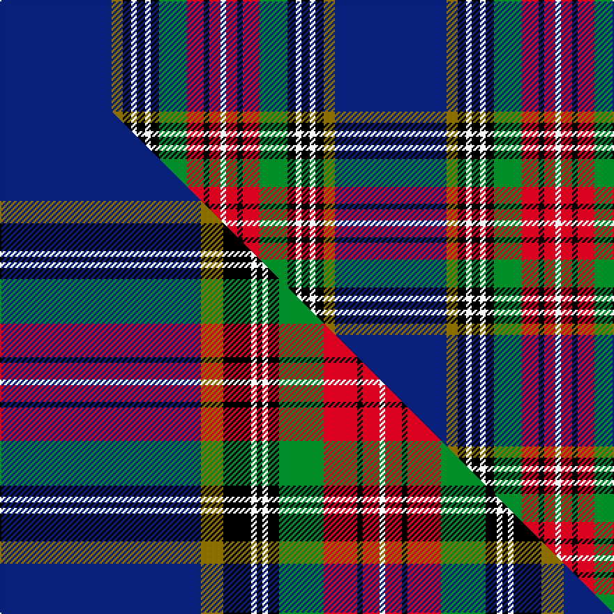

This page is one **sett** — a single exact thread-count. It belongs to the [tartan](/setts/db40y4k3w2k3w2k3g10r6k2r4w2/)
(the same proportion at any scale), whose colour order is pattern [BGKWKWKGRKRW](/stripes/bgkwkwkgrkrw/).

Part of the [MacBeth](/tartans/macbeth/) tartan — the named design grouping this sett with its other cloths.

Sourced from register-of-tartans.  It is a [12 stripe tartan](/stripes/stripes12/).

Original link [https://www.tartanregister.gov.uk/tartanDetails.aspx?ref=2298](https://www.tartanregister.gov.uk/tartanDetails.aspx?ref=2298)

## Provenance

Earliest known date: pre 2003 The sett is based on the Royal Stewart. The tartan is widely available today but no details of its origin can be found.

3 attestations — the source records this cloth was collapsed from (oldest owns this page)

<ul>
<li>undated — MacBeth #2 (register-of-tartans, <a href="https://www.tartanregister.gov.uk/tartanDetails.aspx?ref=2298">record</a>)  <em>The sett is based on the Royal Stewart. The tartan is widely available today but no details of its origin can be found. Scottish Tartans Society archive.</em></li>
<li>undated — MacBeth (weddslist, <a href="http://www.weddslist.com/cgi-bin/tartans/pg.pl?source=sts">record</a>) </li>
<li>undated — MacBeth Clan Tartan (house-of-tartan, <a href="http://www.house-of-tartan.scotland.net/house/TartanViewjs.asp?colr=Def&tnam=679">record</a>) </li>
</ul>

Dataset <small>— provenance for this record, inherited from the source manifest</small>

<dl class="dataset-prov">
<dt>source</dt><dd><a href="/sources/register-of-tartans/">Scottish Register of Tartans</a></dd>
<dt>data captured from</dt><dd><a href="https://github.com/thetartan/tartan-database/blob/master/data/register-of-tartans/data.csv">https://github.com/thetartan/tartan-database/blob/master/data/register-of-tartans/data.csv</a></dd>
<dt>data date</dt><dd>2017-01-06 <small>(dataset default)</small></dd>
<dt>licence</dt><dd><a href="https://www.tartanregister.gov.uk/copyright">Crown copyright</a></dd>
</dl>

Capture chain <small>— the hands this data passed through, oldest first; each capture carries its own licence</small>

<ol class="capture-chain">
<li><a href="https://www.tartanregister.gov.uk/">Scottish Register of Tartans</a> · <a href="https://www.tartanregister.gov.uk/copyright">Crown copyright</a> <small>the living register — still published by National Records of Scotland</small></li>
<li><a href="https://github.com/thetartan/tartan-database">thetartan/tartan-database</a> <small>2016-2017</small> · <a href="https://creativecommons.org/licenses/by-nc-nd/4.0/">CC BY-NC-ND 4.0</a> <small>Levko Kravets's frozen compilation — the capture we vendored, and where its CC licence text came from</small></li>
<li>this dictionary <small>captured 2026-06-10 · commit 5bf86c7566</small> <small>each re-capture is a git commit to data/sources</small></li>
</ol>

## Register references

External register numbers recorded for this tartan.

- Scottish Register of Tartans: [2298](https://www.tartanregister.gov.uk/tartanDetails.aspx?ref=2298)
- Scottish Tartans World Register: 679

## Thread count
DB/80 Y8 K6 W4 K6 W4 K6 G20 R12 K4 R8 W/4

One full sett is **240 threads**.

## Palette
<table><thead><tr><th>Colour</th><th>Shade</th><th>OKLCh</th></tr></thead><tbody><tr><td>DB</td><td><code style="background-color:#082077;">#082077</code> <small style="color:#888">#082077</small></td><td><small style="color:#888">oklch(30.0% 0.149 265.1)</small></td></tr><tr><td>G</td><td><code style="background-color:#008B2A;">#008B2A</code> <small style="color:#888">#008B2A</small></td><td><small style="color:#888">oklch(55.4% 0.170 145.9)</small></td></tr><tr><td>K</td><td><code style="background-color:#000000;">#000000</code> <small style="color:#888">#000000</small></td><td><small style="color:#888">oklch(0.0% 0.000 0.0)</small></td></tr><tr><td>W</td><td><code style="background-color:#F7F7F7;">#F7F7F7</code> <small style="color:#888">#F7F7F7</small></td><td><small style="color:#888">oklch(97.6% 0.000 89.9)</small></td></tr><tr><td>R</td><td><code style="background-color:#D60020;">#D60020</code> <small style="color:#888">#D60020</small></td><td><small style="color:#888">oklch(55.2% 0.224 25.5)</small></td></tr><tr><td>Y</td><td><code style="background-color:#8B6E00;">#8B6E00</code> <small style="color:#888">#8B6E00</small></td><td><small style="color:#888">oklch(55.1% 0.113 90.4)</small></td></tr></tbody></table>

# Sample pattern

## Compared to the master

This cloth is one sett of its design; the master sett (the exemplar the design is anchored on) is below for comparison.

Its **ΔTartan distance** from the master is **0.45** — the same measure the nearest-tartans table ranks by (0 is identical; a re-scale of the same cloth is near 0, a recolour or a different proportion further).

<figure class="master-compare" style="margin:0">

this sett
master sett ★

<figcaption style="color:#888;font-size:smaller">One weave of this sett against the <a href="/setts/db36y4k5w1k1w1k2g8r6k1r3w1/">master sett ★</a>, split on the diagonal: a shared proportion runs seamlessly across it with only the shades shifting; a different proportion breaks on it.</figcaption>
</figure>

## Nearest tartan variants

The nearest existing variants by ΔTartan distance, with this cloth at the top so the swatches line up against it.

ΔTartan

Threads

Variant

Sett

—

240

<a href="/variants/s12/db40y4k3w2k3w2k3g10r6k2r4w2~x2/">MacBeth #2</a>

<a href="/ttd/edit/#slug=db36y4k5w1k1w1k2g8r6k1r3w1~x4&amp;base=db40y4k3w2k3w2k3g10r6k2r4w2~x2" title="compare in the TTD">0.45</a>

404

<a href="/variants/s12/db36y4k5w1k1w1k2g8r6k1r3w1~x4/">MacBeth</a>

<a href="/ttd/edit/#slug=db36y4k6w1k1w1k1g8r6k1r3w1&amp;base=db40y4k3w2k3w2k3g10r6k2r4w2~x2" title="compare in the TTD">0.46</a>

101

<a href="/variants/s12/db36y4k6w1k1w1k1g8r6k1r3w1/">MacBeth</a>

<a href="/ttd/edit/#slug=db36y4k6w1k1w1k1g8r6k1r3w1~x2&amp;base=db40y4k3w2k3w2k3g10r6k2r4w2~x2" title="compare in the TTD">0.46</a>

202

<a href="/variants/s12/db36y4k6w1k1w1k1g8r6k1r3w1~x2/">MacBeth</a>

<a href="/ttd/edit/#slug=db36y4k6y1k1w1k1g8r6k1r3w1~x2&amp;base=db40y4k3w2k3w2k3g10r6k2r4w2~x2" title="compare in the TTD">0.76</a>

202

<a href="/variants/s12/db36y4k6y1k1w1k1g8r6k1r3w1~x2/">MacBeth, MacLulich</a>

<a href="/ttd/edit/#slug=db20k3y1w1g3r3k1r2w1~x2&amp;base=db40y4k3w2k3w2k3g10r6k2r4w2~x2" title="compare in the TTD">1.34</a>

98

<a href="/variants/s9/db20k3y1w1g3r3k1r2w1~x2/">Stewart Blue MINI Tartan</a>

<a href="/ttd/edit/#slug=lr2db3k3g8dr6db2ly2k3lr2k6db32ly2~x2&amp;base=db40y4k3w2k3w2k3g10r6k2r4w2~x2" title="compare in the TTD">1.70</a>

276

<a href="/variants/s12/lr2db3k3g8dr6db2ly2k3lr2k6db32ly2~x2/">Talisman (Fashion)</a>

<a href="/ttd/edit/#slug=w8db50k4r8k6r12g17dp7k4&amp;base=db40y4k3w2k3w2k3g10r6k2r4w2~x2" title="compare in the TTD">1.97</a>

220

<a href="/variants/s9/w8db50k4r8k6r12g17dp7k4/">Edinburgh</a>

<a href="/ttd/edit/#slug=k1dr4k1w3k1g7k2db16r2ly1~x2&amp;base=db40y4k3w2k3w2k3g10r6k2r4w2~x2" title="compare in the TTD">2.00</a>

148

<a href="/variants/s10/k1dr4k1w3k1g7k2db16r2ly1~x2/">Twempy</a>

<a href="/ttd/edit/#slug=w3db22k2r3k2r5g7b2k2~x2&amp;base=db40y4k3w2k3w2k3g10r6k2r4w2~x2" title="compare in the TTD">2.00</a>

182

<a href="/variants/s9/w3db22k2r3k2r5g7b2k2~x2/">Edinburgh</a>

<a href="/ttd/edit/#slug=db38w2db2k10g2y2g22k3r3k3r3~x2&amp;base=db40y4k3w2k3w2k3g10r6k2r4w2~x2" title="compare in the TTD">2.06</a>

278

<a href="/variants/s11/db38w2db2k10g2y2g22k3r3k3r3~x2/">Hunnisett, /Edinchip</a>

## Neighbour map

Every grey dot is one of 13621 variants placed by the first two principal components of the ΔTartan feature space (42% of its variance). Red is this tartan; blue dots are its nearest — click one to open its page.

<svg viewBox="0 0 640 380" role="img" style="max-width:100%;height:auto;border:1px solid #e0e0e0;border-radius:4px;display:block" xmlns="http://www.w3.org/2000/svg"><image href="/nn/cloud.v1.png" width="640" height="380"/><a href="/variants/s12/db36y4k5w1k1w1k2g8r6k1r3w1~x4/"><circle cx="246.2" cy="40.8" r="4" fill="#3465a4"><title>MacBeth</title></circle></a><a href="/variants/s12/db36y4k6w1k1w1k1g8r6k1r3w1/"><circle cx="246.4" cy="40.5" r="4" fill="#3465a4"><title>MacBeth</title></circle></a><a href="/variants/s12/db36y4k6w1k1w1k1g8r6k1r3w1~x2/"><circle cx="246.4" cy="40.5" r="4" fill="#3465a4"><title>MacBeth</title></circle></a><a href="/variants/s12/db36y4k6y1k1w1k1g8r6k1r3w1~x2/"><circle cx="250.6" cy="41.7" r="4" fill="#3465a4"><title>MacBeth, MacLulich</title></circle></a><a href="/variants/s9/db20k3y1w1g3r3k1r2w1~x2/"><circle cx="260.4" cy="78.5" r="4" fill="#3465a4"><title>Stewart Blue MINI Tartan</title></circle></a><a href="/variants/s12/lr2db3k3g8dr6db2ly2k3lr2k6db32ly2~x2/"><circle cx="217.6" cy="87.5" r="4" fill="#3465a4"><title>Talisman (Fashion)</title></circle></a><a href="/variants/s9/w8db50k4r8k6r12g17dp7k4/"><circle cx="141.2" cy="120.3" r="4" fill="#3465a4"><title>Edinburgh</title></circle></a><a href="/variants/s10/k1dr4k1w3k1g7k2db16r2ly1~x2/"><circle cx="127.8" cy="90.9" r="4" fill="#3465a4"><title>Twempy</title></circle></a><a href="/variants/s9/w3db22k2r3k2r5g7b2k2~x2/"><circle cx="156.1" cy="119.5" r="4" fill="#3465a4"><title>Edinburgh</title></circle></a><a href="/variants/s11/db38w2db2k10g2y2g22k3r3k3r3~x2/"><circle cx="185.5" cy="85.2" r="4" fill="#3465a4"><title>Hunnisett, /Edinchip</title></circle></a><circle cx="200.1" cy="66.0" r="5" fill="#c00000"/><text x="320" y="376" text-anchor="middle" font-size="11" fill="#999">ground</text><text x="11" y="190" text-anchor="middle" font-size="11" fill="#999" transform="rotate(-90 11 190)">complexity</text></svg>

ID: /variants/s12/db40y4k3w2k3w2k3g10r6k2r4w2~x2/
