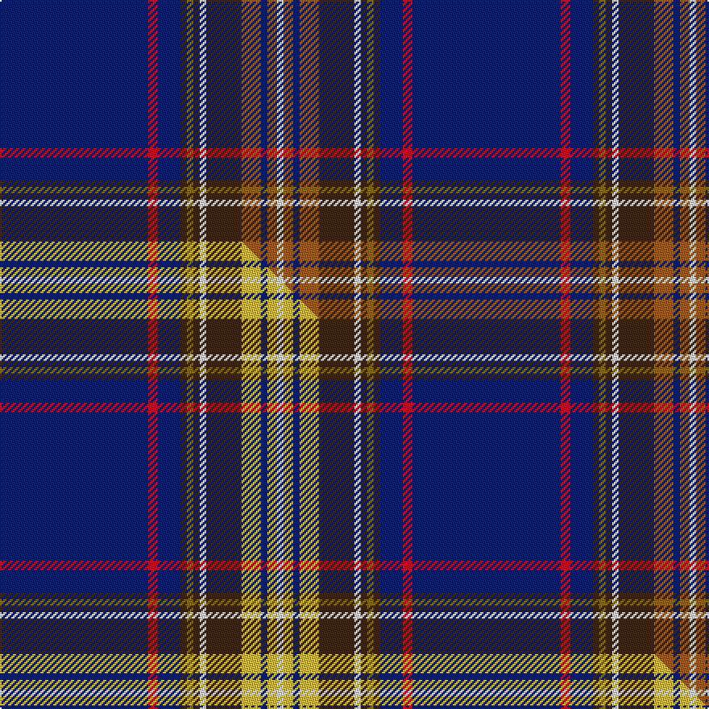

This page is one **sett** — a single exact thread-count. It belongs to the [tartan](/setts/db46r3db7do2y2do2w2do11o6db2o3w2/)
(the same proportion at any scale), whose colour order is pattern [BRBBGBWBRBRW](/stripes/brbbgbwbrbrw/).

Part of the [Lady Diana](/tartans/lady-diana/) tartan — the named design grouping this sett with its other cloths.

Sourced from weddslist.  It is a [12 stripe tartan](/stripes/stripes12/).

Original link http://www.weddslist.com/cgi-bin/tartans/pg.pl?source=sts

Dataset <small>— provenance for this record, inherited from the source manifest</small>

<dl class="dataset-prov">
<dt>source</dt><dd><a href="/sources/weddslist/">Weddslist</a></dd>
<dt>data captured from</dt><dd><a href="https://github.com/thetartan/tartan-database/blob/master/data/weddslist/data.csv">https://github.com/thetartan/tartan-database/blob/master/data/weddslist/data.csv</a></dd>
<dt>data date</dt><dd>2016-11-17 <small>(dataset default)</small></dd>
<dt>licence</dt><dd><a href="https://creativecommons.org/licenses/by-nc-nd/4.0/">CC BY-NC-ND 4.0</a></dd>
</dl>

Capture chain <small>— the hands this data passed through, oldest first; each capture carries its own licence</small>

<ol class="capture-chain">
<li><a href="https://www.weddslist.com/tartans/">Weddslist</a> <small>the living privately compiled reference</small></li>
<li><a href="https://github.com/thetartan/tartan-database">thetartan/tartan-database</a> <small>2016-2017</small> · <a href="https://creativecommons.org/licenses/by-nc-nd/4.0/">CC BY-NC-ND 4.0</a> <small>Levko Kravets's frozen compilation — the capture we vendored, and where its CC licence text came from</small></li>
<li>this dictionary <small>captured 2026-06-10 · commit 5bf86c7566</small> <small>each re-capture is a git commit to data/sources</small></li>
</ol>

## Thread count
DB/92 R6 DB14 DO4 Y4 DO4 W4 DO22 O12 DB4 O6 W/4

One full sett is **256 threads**.

## Palette
<table><thead><tr><th>Colour</th><th>Shade</th><th>OKLCh</th></tr></thead><tbody><tr><td>DB</td><td><code style="background-color:#082077;">#082077</code> <small style="color:#888">#082077</small></td><td><small style="color:#888">oklch(30.0% 0.149 265.1)</small></td></tr><tr><td>DO</td><td><code style="background-color:#412714;">#412714</code> <small style="color:#888">#412714</small></td><td><small style="color:#888">oklch(30.1% 0.050 55.7)</small></td></tr><tr><td>W</td><td><code style="background-color:#F7F7F7;">#F7F7F7</code> <small style="color:#888">#F7F7F7</small></td><td><small style="color:#888">oklch(97.6% 0.000 89.9)</small></td></tr><tr><td>O</td><td><code style="background-color:#A65C11;">#A65C11</code> <small style="color:#888">#A65C11</small></td><td><small style="color:#888">oklch(55.0% 0.125 58.3)</small></td></tr><tr><td>R</td><td><code style="background-color:#D60020;">#D60020</code> <small style="color:#888">#D60020</small></td><td><small style="color:#888">oklch(55.2% 0.224 25.5)</small></td></tr><tr><td>Y</td><td><code style="background-color:#8B6E00;">#8B6E00</code> <small style="color:#888">#8B6E00</small></td><td><small style="color:#888">oklch(55.1% 0.113 90.4)</small></td></tr></tbody></table>

# Sample pattern

## Compared to the master

This cloth is one sett of its design; the master sett (the exemplar the design is anchored on) is below for comparison.

Its **ΔTartan distance** from the master is **0.60** — the same measure the nearest-tartans table ranks by (0 is identical; a re-scale of the same cloth is near 0, a recolour or a different proportion further).

<figure class="master-compare" style="margin:0">

this sett
master sett ★

<figcaption style="color:#888;font-size:smaller">One weave of this sett against the <a href="/setts/db46r3db7do2y2do2w2do11ly6db2ly3w2/">master sett ★</a>, split on the diagonal: a shared proportion runs seamlessly across it with only the shades shifting; a different proportion breaks on it.</figcaption>
</figure>

## Nearest tartan variants

The nearest existing variants by ΔTartan distance, with this cloth at the top so the swatches line up against it.

ΔTartan

Threads

Variant

Sett

—

256

<a href="/variants/s12/db46r3db7do2y2do2w2do11o6db2o3w2~x2/">Lady Diana, Plaid</a>

<a href="/ttd/edit/#slug=db46r3db7do2y2do2w2do11ly6db2ly3w2~x2&amp;base=db46r3db7do2y2do2w2do11o6db2o3w2~x2" title="compare in the TTD">0.60</a>

256

<a href="/variants/s12/db46r3db7do2y2do2w2do11ly6db2ly3w2~x2/">Lady Diana Plaid</a>

<a href="/ttd/edit/#slug=db54y9db16y2dp3w3dp3r27db13y3g5w2&amp;base=db46r3db7do2y2do2w2do11o6db2o3w2~x2" title="compare in the TTD">2.39</a>

224

<a href="/variants/s12/db54y9db16y2dp3w3dp3r27db13y3g5w2/">Queens University, of Ontario</a>

<a href="/ttd/edit/#slug=ni40r2ni7db5o2db3w2db10n6ni2n4w2~x2~ni1604274-db0805267&amp;base=db46r3db7do2y2do2w2do11o6db2o3w2~x2" title="compare in the TTD">2.42</a>

256

<a href="/variants/s12/dbi40r2dbi7db5o2db3w2db10n6dbi2n4w2~x2~dbi1604274-db0805267/">Plymouth/Armada 400, Armada</a>

<a href="/ttd/edit/#slug=n2dt1b2dt2r1b12dt2r1dr10dt28b1dt3b2dt3w1~x2~dt1102249-b2308259&amp;base=db46r3db7do2y2do2w2do11o6db2o3w2~x2" title="compare in the TTD">2.45</a>

278

<a href="/variants/s15/n2dt1t2dt2r1t12dt2r1dr10dt28t1dt3t2dt3w1~x2~dt1102249-t2308259/">Northfield Academy</a>

<a href="/ttd/edit/#slug=r3w2db2lo1db39lo1db1ly2db1y15db1~x2&amp;base=db46r3db7do2y2do2w2do11o6db2o3w2~x2" title="compare in the TTD">2.61</a>

264

<a href="/variants/s11/r3w2db2lo1db39lo1db1ly2db1y15db1~x2/">Bartlett from El Paso, Texas</a>

<a href="/ttd/edit/#slug=db40g10lo1g5r5w1r2w1r5g5lo1g10db40y2~x2~db1406275&amp;base=db46r3db7do2y2do2w2do11o6db2o3w2~x2" title="compare in the TTD">2.62</a>

428

<a href="/variants/s14/db40g10lo1g5r5w1r2w1r5g5lo1g10db40y2~x2~db1406275/">St. Andrew Quebec City</a>

<a href="/ttd/edit/#slug=r2w1r5g5lo1g10db40y2~x2&amp;base=db46r3db7do2y2do2w2do11o6db2o3w2~x2" title="compare in the TTD">3.18</a>

256

<a href="/variants/s8/r2w1r5g5lo1g10db40y2~x2/">St. Andrew Quebec City (Corporate)</a>

<a href="/ttd/edit/#slug=lb8k10db69w6db6r8b19lb3~lb3300000-k0705267-db1404245-b2105244&amp;base=db46r3db7do2y2do2w2do11o6db2o3w2~x2" title="compare in the TTD">3.18</a>

247

<a href="/variants/s8/lb8db10dbi69w6dbi6r8t19lb3~lb3300000-db0705267-dbi1404245-t2105244/">Virginia International Tattoo Hixon</a>

<a href="/ttd/edit/#slug=w2db2w1db40r3ly1r10dg10r1~x2&amp;base=db46r3db7do2y2do2w2do11o6db2o3w2~x2" title="compare in the TTD">3.20</a>

274

<a href="/variants/s9/w2db2w1db40r3ly1r10dg10r1~x2/">Russian Scottish (District)</a>

<a href="/ttd/edit/#slug=db2w2dp16lg2dp2r5db37dp6lg2db2~x2&amp;base=db46r3db7do2y2do2w2do11o6db2o3w2~x2" title="compare in the TTD">3.25</a>

296

<a href="/variants/s10/db2w2dp16lg2dp2r5db37dp6lg2db2~x2/">Pride of Fife</a>

## Neighbour map

Every grey dot is one of 13620 variants placed by the first two principal components of the ΔTartan feature space (42% of its variance). Red is this tartan; blue dots are its nearest — click one to open its page.

<svg viewBox="0 0 640 380" role="img" style="max-width:100%;height:auto;border:1px solid #e0e0e0;border-radius:4px;display:block" xmlns="http://www.w3.org/2000/svg"><image href="/nn/cloud.v1.png" width="640" height="380"/><a href="/variants/s12/db46r3db7do2y2do2w2do11ly6db2ly3w2~x2/"><circle cx="339.5" cy="77.4" r="4" fill="#3465a4"><title>Lady Diana Plaid</title></circle></a><a href="/variants/s12/db54y9db16y2dp3w3dp3r27db13y3g5w2/"><circle cx="321.2" cy="90.6" r="4" fill="#3465a4"><title>Queens University, of Ontario</title></circle></a><a href="/variants/s12/dbi40r2dbi7db5o2db3w2db10n6dbi2n4w2~x2~dbi1604274-db0805267/"><circle cx="352.0" cy="110.5" r="4" fill="#3465a4"><title>Plymouth/Armada 400, Armada</title></circle></a><a href="/variants/s15/n2dt1t2dt2r1t12dt2r1dr10dt28t1dt3t2dt3w1~x2~dt1102249-t2308259/"><circle cx="337.9" cy="85.1" r="4" fill="#3465a4"><title>Northfield Academy</title></circle></a><a href="/variants/s11/r3w2db2lo1db39lo1db1ly2db1y15db1~x2/"><circle cx="387.3" cy="55.8" r="4" fill="#3465a4"><title>Bartlett from El Paso, Texas</title></circle></a><a href="/variants/s14/db40g10lo1g5r5w1r2w1r5g5lo1g10db40y2~x2~db1406275/"><circle cx="373.5" cy="67.8" r="4" fill="#3465a4"><title>St. Andrew Quebec City</title></circle></a><a href="/variants/s8/r2w1r5g5lo1g10db40y2~x2/"><circle cx="360.8" cy="82.3" r="4" fill="#3465a4"><title>St. Andrew Quebec City (Corporate)</title></circle></a><a href="/variants/s8/lb8db10dbi69w6dbi6r8t19lb3~lb3300000-db0705267-dbi1404245-t2105244/"><circle cx="319.6" cy="120.8" r="4" fill="#3465a4"><title>Virginia International Tattoo Hixon</title></circle></a><a href="/variants/s9/w2db2w1db40r3ly1r10dg10r1~x2/"><circle cx="370.4" cy="84.4" r="4" fill="#3465a4"><title>Russian Scottish (District)</title></circle></a><a href="/variants/s10/db2w2dp16lg2dp2r5db37dp6lg2db2~x2/"><circle cx="347.6" cy="129.1" r="4" fill="#3465a4"><title>Pride of Fife</title></circle></a><circle cx="365.9" cy="84.8" r="5" fill="#c00000"/><text x="320" y="376" text-anchor="middle" font-size="11" fill="#999">ground</text><text x="11" y="190" text-anchor="middle" font-size="11" fill="#999" transform="rotate(-90 11 190)">complexity</text></svg>

ID: /variants/s12/db46r3db7do2y2do2w2do11o6db2o3w2~x2/
