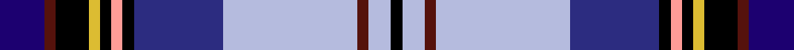

This page is one **sett** — a single exact thread-count. It belongs to the [tartan](/setts/db4dr1k3ly1k1lr1k1dbi8lb12dr1lb2k1/)
(the same proportion at any scale), whose colour order is pattern [BBKYKYKBWBWK](/stripes/bbkykykbwbwk/).

Sourced from register-of-tartans.  It is a [12 stripe tartan](/stripes/stripes12/).

Original link https://www.tartanregister.gov.uk/tartanDetails.aspx?ref=4836

## Register references

External register numbers recorded for this tartan.

- Scottish Register of Tartans: [4836](https://www.tartanregister.gov.uk/tartanDetails.aspx?ref=4836)
- Scottish Tartans Authority (ITI): 3442

## Thread count
DB/16 DR4 K12 LY4 K4 LR4 K4 DBi32 LB48 DR4 LB8 K/4

One full sett is **268 threads**.

## Palette
<table><thead><tr><th>Colour</th><th>Shade</th><th>OKLCh</th></tr></thead><tbody><tr><td>LB</td><td><code style="background-color:#B5BBDE;">#B5BBDE</code> <small style="color:#888">#B5BBDE</small></td><td><small style="color:#888">oklch(79.9% 0.050 277.6)</small></td></tr><tr><td>DB</td><td><code style="background-color:#2C2C80;">#2C2C80</code> <small style="color:#888">#2C2C80</small></td><td><small style="color:#888">oklch(35.0% 0.138 276.6)</small></td></tr><tr><td>DB</td><td><code style="background-color:#1C0070;">#1C0070</code> <small style="color:#888">#1C0070</small></td><td><small style="color:#888">oklch(26.3% 0.162 277.1)</small></td></tr><tr><td>DR</td><td><code style="background-color:#55120C;">#55120C</code> <small style="color:#888">#55120C</small></td><td><small style="color:#888">oklch(30.0% 0.099 29.3)</small></td></tr><tr><td>LY</td><td><code style="background-color:#DCBC32;">#DCBC32</code> <small style="color:#888">#DCBC32</small></td><td><small style="color:#888">oklch(80.0% 0.150 95.2)</small></td></tr><tr><td>K</td><td><code style="background-color:#000000;">#000000</code> <small style="color:#888">#000000</small></td><td><small style="color:#888">oklch(0.0% 0.000 0.0)</small></td></tr><tr><td>LR</td><td><code style="background-color:#FF9C97;">#FF9C97</code> <small style="color:#888">#FF9C97</small></td><td><small style="color:#888">oklch(79.3% 0.119 23.2)</small></td></tr></tbody></table>

# Sample pattern

ID: /variants/s12/db4dr1k3ly1k1lr1k1dbi8lb12dr1lb2k1~x4~db1106275-dbi1406275/
