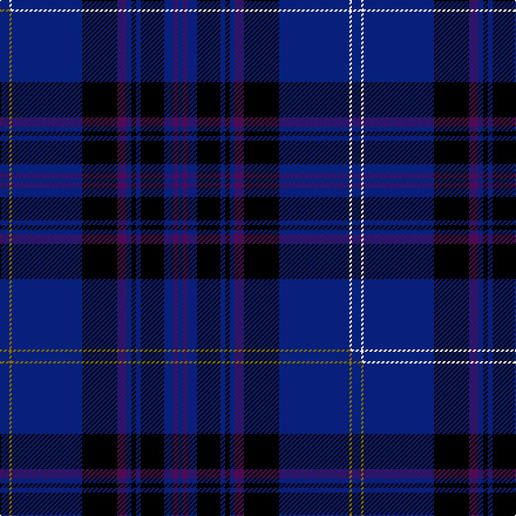

This is one **variant** — a specific cloth: this exact thread count and colourway, with its own
provenance below. It is one weaving of the [sett](/setts/db4w1db30k15dp4db2k2db2k10db4dp2db2/) (the scale-free proportion — the
same cloth at any scale or shade), whose colour order is pattern [BBBKBKBBKBWB](/stripes/bbbkbkbbkbwb/).

Part of the [Scotland's Own](/tartans/s/sc/scotland-s-own/) tartan — the named design grouping this sett with its other cloths.

Sourced from weddslist.  It is a [12 stripe tartan](/stripes/stripes12/).

Original link [http://www.weddslist.com/cgi-bin/tartans/pg.pl?source=sts](http://www.weddslist.com/cgi-bin/tartans/pg.pl?source=sts)

Dataset <small>— provenance for this record, inherited from the source manifest</small>

<dl class="dataset-prov">
<dt>source</dt><dd><a href="/sources/weddslist/">Weddslist</a></dd>
<dt>data captured from</dt><dd><a href="https://github.com/thetartan/tartan-database/blob/master/data/weddslist/data.csv">https://github.com/thetartan/tartan-database/blob/master/data/weddslist/data.csv</a></dd>
<dt>data date</dt><dd>2016-11-17 <small>(dataset default)</small></dd>
<dt>licence</dt><dd><a href="https://creativecommons.org/licenses/by-nc-nd/4.0/">CC BY-NC-ND 4.0</a></dd>
</dl>

Capture chain <small>— the hands this data passed through, oldest first; each capture carries its own licence</small>

<ol class="capture-chain">
<li><a href="https://www.weddslist.com/tartans/">Weddslist</a> <small>the living privately compiled reference</small></li>
<li><a href="https://github.com/thetartan/tartan-database">thetartan/tartan-database</a> <small>2016-2017</small> · <a href="https://creativecommons.org/licenses/by-nc-nd/4.0/">CC BY-NC-ND 4.0</a> <small>Levko Kravets's frozen compilation — the capture we vendored, and where its CC licence text came from</small></li>
<li>this dictionary <small>captured 2026-06-10 · commit 5bf86c7566</small> <small>each re-capture is a git commit to data/sources</small></li>
</ol>

## Thread count
DB/8 W2 DB60 K30 DP8 DB4 K4 DB4 K20 DB8 DP4 DB/4

One full sett is **300 threads**.

## Palette
<table><thead><tr><th>Colour</th><th>Shade</th><th>OKLCh</th></tr></thead><tbody><tr><td>DB</td><td><code style="background-color:#082077;">#082077</code> <small style="color:#888">#082077</small></td><td><small style="color:#888">oklch(30.0% 0.149 265.1)</small></td></tr><tr><td>K</td><td><code style="background-color:#000000;">#000000</code> <small style="color:#888">#000000</small></td><td><small style="color:#888">oklch(0.0% 0.000 0.0)</small></td></tr><tr><td>W</td><td><code style="background-color:#F7F7F7;">#F7F7F7</code> <small style="color:#888">#F7F7F7</small></td><td><small style="color:#888">oklch(97.6% 0.000 89.9)</small></td></tr><tr><td>DP</td><td><code style="background-color:#4B0B4F;">#4B0B4F</code> <small style="color:#888">#4B0B4F</small></td><td><small style="color:#888">oklch(30.1% 0.125 325.4)</small></td></tr></tbody></table>

# Sample pattern

## Compared to the master

This cloth is one sett of its design; the master sett (the exemplar the design is anchored on) is below for comparison.

Its **ΔTartan distance** from the master is **0.30** — the same measure the nearest-tartans table ranks by (0 is identical; a re-scale of the same cloth is near 0, a recolour or a different proportion further).

<figure class="master-compare" style="margin:0">

this sett
master sett ★

<figcaption style="color:#888;font-size:smaller">One weave of this sett against the <a href="/setts/db4y1db30k15dp4db2k2db2k10db4dp2db2/">master sett ★</a>, split on the diagonal: a shared proportion runs seamlessly across it with only the shades shifting; a different proportion breaks on it.</figcaption>
</figure>

## Nearest tartan variants

The nearest existing variants by ΔTartan distance, with this cloth at the top so the swatches line up against it.

ΔTartan

Threads

Variant

Sett

—

300

<a href="/variants/s12/db4w1db30k15dp4db2k2db2k10db4dp2db2~x2/">Scotland's Own</a>

<a href="/ttd/edit/#slug=db4y1db30k15dp4db2k2db2k10db4dp2db2~x2&amp;base=db4w1db30k15dp4db2k2db2k10db4dp2db2~x2" title="compare in the TTD">0.30</a>

300

<a href="/variants/s12/db4y1db30k15dp4db2k2db2k10db4dp2db2~x2/">Scotland's Own</a>

<a href="/ttd/edit/#slug=db28k1w1db2k1r2k1db2w1k1db15k16db3k16~x2&amp;base=db4w1db30k15dp4db2k2db2k10db4dp2db2~x2" title="compare in the TTD">2.01</a>

272

<a href="/variants/s14/db28k1w1db2k1r2k1db2w1k1db15k16db3k16~x2/">Bristow Helicopters</a>

<a href="/ttd/edit/#slug=k4n1dp5n1k20db37n4db4~x2&amp;base=db4w1db30k15dp4db2k2db2k10db4dp2db2~x2" title="compare in the TTD">2.19</a>

288

<a href="/variants/s8/k4n1dp5n1k20db37n4db4~x2/">Finnie (Personal)</a>

<a href="/ttd/edit/#slug=db50k12n2k2w2k2n12db7k7w2~x2&amp;base=db4w1db30k15dp4db2k2db2k10db4dp2db2~x2" title="compare in the TTD">2.68</a>

288

<a href="/variants/s10/db50k12n2k2w2k2n12db7k7w2~x2/">Skye (Fashion)</a>

<a href="/ttd/edit/#slug=db45k10n2k2y2k2n10db5k1db5y1~x2&amp;base=db4w1db30k15dp4db2k2db2k10db4dp2db2~x2" title="compare in the TTD">2.85</a>

248

<a href="/variants/s11/db45k10n2k2y2k2n10db5k1db5y1~x2/">Skye District Tartan</a>

<a href="/ttd/edit/#slug=k28r1k2r1k8db24g2db3~x2&amp;base=db4w1db30k15dp4db2k2db2k10db4dp2db2~x2" title="compare in the TTD">2.90</a>

214

<a href="/variants/s8/k28r1k2r1k8db24g2db3~x2/">Home or Hume (Vestiarium Scoticum)</a>

<a href="/ttd/edit/#slug=db9k1n4k1db18b5k1b1k1b5db4~x2~db0805267-n1604274&amp;base=db4w1db30k15dp4db2k2db2k10db4dp2db2~x2" title="compare in the TTD">2.95</a>

174

<a href="/variants/s11/db9k1dbi4k1db18b5k1b1k1b5db4~x2~db0805267-dbi1604274/">Indigo Blue Works</a>

<a href="/ttd/edit/#slug=r4db4k2db31k10y3db5k11db6k3~x2&amp;base=db4w1db30k15dp4db2k2db2k10db4dp2db2~x2" title="compare in the TTD">2.99</a>

302

<a href="/variants/s10/r4db4k2db31k10y3db5k11db6k3~x2/">MacArthur Fox Green (Personal)</a>

<a href="/ttd/edit/#slug=w4db52k12db12k12db12k12dg24db8k1~x2&amp;base=db4w1db30k15dp4db2k2db2k10db4dp2db2~x2" title="compare in the TTD">3.07</a>

586

<a href="/variants/s10/w4db52k12db12k12db12k12dg24db8k1~x2/">Dollar Academy, The</a>

<a href="/ttd/edit/#slug=k8dr26k22db110w4k5w4&amp;base=db4w1db30k15dp4db2k2db2k10db4dp2db2~x2" title="compare in the TTD">3.10</a>

346

<a href="/variants/s7/k8dr26k22db110w4k5w4/">University of Edinburgh</a>

## Neighbour map

Every grey dot is one of 13656 variants placed by the first two principal components of the ΔTartan feature space (42% of its variance). Red is this tartan; blue dots are its nearest — click one to open its page. The map is a flat projection of a many-dimensional space — [how to read it](/posts/neighbourhood-maps/).

<svg viewBox="0 0 640 380" role="img" style="max-width:100%;height:auto;border:1px solid #e0e0e0;border-radius:4px;display:block" xmlns="http://www.w3.org/2000/svg"><image href="/nn/cloud.v1.png" width="640" height="380"/><a href="/variants/s12/db4y1db30k15dp4db2k2db2k10db4dp2db2~x2/"><circle cx="355.9" cy="93.4" r="4" fill="#3465a4"><title>Scotland's Own</title></circle></a><a href="/variants/s14/db28k1w1db2k1r2k1db2w1k1db15k16db3k16~x2/"><circle cx="336.9" cy="92.4" r="4" fill="#3465a4"><title>Bristow Helicopters</title></circle></a><a href="/variants/s8/k4n1dp5n1k20db37n4db4~x2/"><circle cx="368.4" cy="123.3" r="4" fill="#3465a4"><title>Finnie (Personal)</title></circle></a><a href="/variants/s10/db50k12n2k2w2k2n12db7k7w2~x2/"><circle cx="335.2" cy="106.0" r="4" fill="#3465a4"><title>Skye (Fashion)</title></circle></a><a href="/variants/s11/db45k10n2k2y2k2n10db5k1db5y1~x2/"><circle cx="430.5" cy="82.5" r="4" fill="#3465a4"><title>Skye District Tartan</title></circle></a><a href="/variants/s8/k28r1k2r1k8db24g2db3~x2/"><circle cx="349.0" cy="121.9" r="4" fill="#3465a4"><title>Home or Hume (Vestiarium Scoticum)</title></circle></a><a href="/variants/s11/db9k1dbi4k1db18b5k1b1k1b5db4~x2~db0805267-dbi1604274/"><circle cx="371.5" cy="148.0" r="4" fill="#3465a4"><title>Indigo Blue Works</title></circle></a><a href="/variants/s10/r4db4k2db31k10y3db5k11db6k3~x2/"><circle cx="325.7" cy="145.3" r="4" fill="#3465a4"><title>MacArthur Fox Green (Personal)</title></circle></a><a href="/variants/s10/w4db52k12db12k12db12k12dg24db8k1~x2/"><circle cx="342.7" cy="119.9" r="4" fill="#3465a4"><title>Dollar Academy, The</title></circle></a><a href="/variants/s7/k8dr26k22db110w4k5w4/"><circle cx="372.8" cy="118.9" r="4" fill="#3465a4"><title>University of Edinburgh</title></circle></a><circle cx="365.7" cy="111.1" r="5" fill="#c00000"/><text x="320" y="376" text-anchor="middle" font-size="11" fill="#999">ground</text><text x="11" y="190" text-anchor="middle" font-size="11" fill="#999" transform="rotate(-90 11 190)">complexity</text></svg>

ID: /variants/s12/db4w1db30k15dp4db2k2db2k10db4dp2db2~x2/
