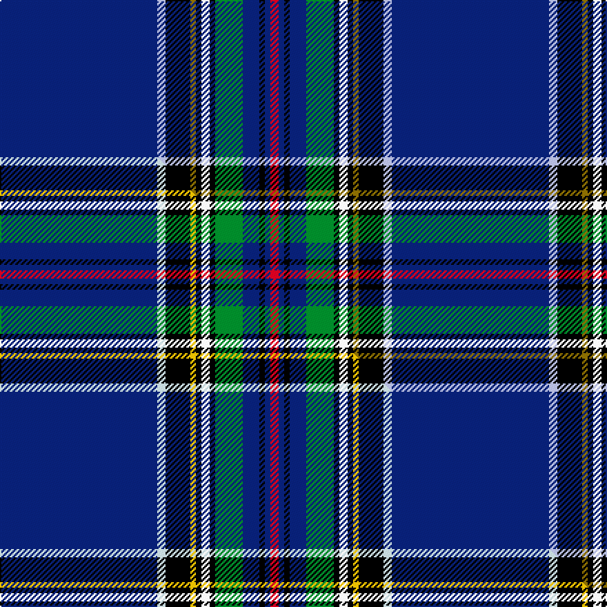

This page is one **sett** — a single exact thread-count. It belongs to the [tartan](/setts/db57lb3k9y2k2w3k2g10db6k2db2r3/)
(the same proportion at any scale), whose colour order is pattern [BWKGKWKGBKBR](/stripes/bwkgkwkgbkbr/).

Part of the [O'Shaughnessy Memorial](/tartans/o-shaughnessy-memorial/) tartan — the named design grouping this sett with its other cloths.

Sourced from tartans-authority.  It is a [12 stripe tartan](/stripes/stripes12/).

Original link http://www.tartansauthority.com/tartan-ferret/display/7051/

## Register references

External register numbers recorded for this tartan.

- Scottish Tartans Authority (ITI): 7051

## Thread count
DB/114 LB6 K18 Y4 K4 W6 K4 G20 DB12 K4 DB4 R/6

One full sett is **284 threads**.

## Palette
<table><thead><tr><th>Colour</th><th>Shade</th><th>OKLCh</th></tr></thead><tbody><tr><td>DB</td><td><code style="background-color:#082077;">#082077</code> <small style="color:#888">#082077</small></td><td><small style="color:#888">oklch(30.0% 0.149 265.1)</small></td></tr><tr><td>G</td><td><code style="background-color:#008B2A;">#008B2A</code> <small style="color:#888">#008B2A</small></td><td><small style="color:#888">oklch(55.4% 0.170 145.9)</small></td></tr><tr><td>K</td><td><code style="background-color:#000000;">#000000</code> <small style="color:#888">#000000</small></td><td><small style="color:#888">oklch(0.0% 0.000 0.0)</small></td></tr><tr><td>LB</td><td><code style="background-color:#B5BBDE;">#B5BBDE</code> <small style="color:#888">#B5BBDE</small></td><td><small style="color:#888">oklch(79.9% 0.050 277.6)</small></td></tr><tr><td>W</td><td><code style="background-color:#F7F7F7;">#F7F7F7</code> <small style="color:#888">#F7F7F7</small></td><td><small style="color:#888">oklch(97.6% 0.000 89.9)</small></td></tr><tr><td>R</td><td><code style="background-color:#D60020;">#D60020</code> <small style="color:#888">#D60020</small></td><td><small style="color:#888">oklch(55.2% 0.224 25.5)</small></td></tr><tr><td>Y</td><td><code style="background-color:#8B6E00;">#8B6E00</code> <small style="color:#888">#8B6E00</small></td><td><small style="color:#888">oklch(55.1% 0.113 90.4)</small></td></tr></tbody></table>

# Sample pattern

## Compared to the master

This cloth is one sett of its design; the master sett (the exemplar the design is anchored on) is below for comparison.

Its **ΔTartan distance** from the master is **0.02** — the same measure the nearest-tartans table ranks by (0 is identical; a re-scale of the same cloth is near 0, a recolour or a different proportion further).

<figure class="master-compare" style="margin:0">

this sett
master sett ★

<figcaption style="color:#888;font-size:smaller">One weave of this sett against the <a href="/setts/db57lb3k9ly2k2w3k2g10db6k2db2r3/">master sett ★</a>, split on the diagonal: a shared proportion runs seamlessly across it with only the shades shifting; a different proportion breaks on it.</figcaption>
</figure>

## Nearest tartan variants

The nearest existing variants by ΔTartan distance, with this cloth at the top so the swatches line up against it.

ΔTartan

Threads

Variant

Sett

—

284

<a href="/variants/s12/db57lb3k9y2k2w3k2g10db6k2db2r3~x2/">O'Shaughnessy Memorial (Corporate)</a>

<a href="/ttd/edit/#slug=db57lb3k9ly2k2w3k2g10db6k2db2r3~x2~lb3501240-ly3307090&amp;base=db57lb3k9y2k2w3k2g10db6k2db2r3~x2" title="compare in the TTD">0.02</a>

284

<a href="/variants/s12/db57lb3k9ly2k2w3k2g10db6k2db2r3~x2~lb3501240-ly3307090/">O'Shaughnessy Memorial</a>

<a href="/ttd/edit/#slug=b84dr3k16ly4k4w4k4dg20b8k4b8w4&amp;base=db57lb3k9y2k2w3k2g10db6k2db2r3~x2" title="compare in the TTD">0.86</a>

238

<a href="/variants/s12/b84dr3k16ly4k4w4k4dg20b8k4b8w4/">Wcwm 1105</a>

<a href="/ttd/edit/#slug=db68o5k9o3k3lb3k3n20db9k3db5lb4&amp;base=db57lb3k9y2k2w3k2g10db6k2db2r3~x2" title="compare in the TTD">1.75</a>

198

<a href="/variants/s12/db68o5k9o3k3lb3k3n20db9k3db5lb4/">British Caledonian Airways #1</a>

<a href="/ttd/edit/#slug=db18w2db2r3db21k28dy1k1g2~x2&amp;base=db57lb3k9y2k2w3k2g10db6k2db2r3~x2" title="compare in the TTD">1.92</a>

272

<a href="/variants/s9/db18w2db2r3db21k28dy1k1g2~x2/">St Andrew's College</a>

<a href="/ttd/edit/#slug=db109lb12r4w4db5dy4g5k4r4lb18&amp;base=db57lb3k9y2k2w3k2g10db6k2db2r3~x2" title="compare in the TTD">2.19</a>

211

<a href="/variants/s10/db109lb12r4w4db5dy4g5k4r4lb18/">Yorston (2014)</a>

<a href="/ttd/edit/#slug=db109lb12r4w4db5y4g5k4r4lb18&amp;base=db57lb3k9y2k2w3k2g10db6k2db2r3~x2" title="compare in the TTD">2.23</a>

211

<a href="/variants/s10/db109lb12r4w4db5y4g5k4r4lb18/">Yorston (2014)</a>

<a href="/ttd/edit/#slug=dy2g3k2dr1k9db3lb1db42dr1db2g3w2~x2&amp;base=db57lb3k9y2k2w3k2g10db6k2db2r3~x2" title="compare in the TTD">2.33</a>

276

<a href="/variants/s12/dy2g3k2dr1k9db3lb1db42dr1db2g3w2~x2/">Sedge, Douglas (Personal)</a>

<a href="/ttd/edit/#slug=db60w3dp8y2k2w2k2g14db4dy10w2~x2&amp;base=db57lb3k9y2k2w3k2g10db6k2db2r3~x2" title="compare in the TTD">2.52</a>

312

<a href="/variants/s11/db60w3dp8y2k2w2k2g14db4dy10w2~x2/">O'Shaughnessy (Estimated threadcount)</a>

<a href="/ttd/edit/#slug=db62r1db2r1db4k14g4w2g6k4~x2&amp;base=db57lb3k9y2k2w3k2g10db6k2db2r3~x2" title="compare in the TTD">2.67</a>

268

<a href="/variants/s10/db62r1db2r1db4k14g4w2g6k4~x2/">Parr</a>

<a href="/ttd/edit/#slug=db36lb2db4lb3db4lb4w1r2g2w1k2g3k2db3k2r3w1~x2&amp;base=db57lb3k9y2k2w3k2g10db6k2db2r3~x2" title="compare in the TTD">2.88</a>

226

<a href="/variants/s17/db36lb2db4lb3db4lb4w1r2g2w1k2g3k2db3k2r3w1~x2/">Reeves (2015)</a>

## Neighbour map

Every grey dot is one of 13620 variants placed by the first two principal components of the ΔTartan feature space (42% of its variance). Red is this tartan; blue dots are its nearest — click one to open its page.

<svg viewBox="0 0 640 380" role="img" style="max-width:100%;height:auto;border:1px solid #e0e0e0;border-radius:4px;display:block" xmlns="http://www.w3.org/2000/svg"><image href="/nn/cloud.v1.png" width="640" height="380"/><a href="/variants/s12/db57lb3k9ly2k2w3k2g10db6k2db2r3~x2~lb3501240-ly3307090/"><circle cx="311.1" cy="32.7" r="4" fill="#3465a4"><title>O'Shaughnessy Memorial</title></circle></a><a href="/variants/s12/b84dr3k16ly4k4w4k4dg20b8k4b8w4/"><circle cx="298.5" cy="53.1" r="4" fill="#3465a4"><title>Wcwm 1105</title></circle></a><a href="/variants/s12/db68o5k9o3k3lb3k3n20db9k3db5lb4/"><circle cx="333.4" cy="81.8" r="4" fill="#3465a4"><title>British Caledonian Airways #1</title></circle></a><a href="/variants/s9/db18w2db2r3db21k28dy1k1g2~x2/"><circle cx="275.0" cy="91.1" r="4" fill="#3465a4"><title>St Andrew's College</title></circle></a><a href="/variants/s10/db109lb12r4w4db5dy4g5k4r4lb18/"><circle cx="342.2" cy="37.5" r="4" fill="#3465a4"><title>Yorston (2014)</title></circle></a><a href="/variants/s10/db109lb12r4w4db5y4g5k4r4lb18/"><circle cx="341.4" cy="37.3" r="4" fill="#3465a4"><title>Yorston (2014)</title></circle></a><a href="/variants/s12/dy2g3k2dr1k9db3lb1db42dr1db2g3w2~x2/"><circle cx="358.8" cy="20.6" r="4" fill="#3465a4"><title>Sedge, Douglas (Personal)</title></circle></a><a href="/variants/s11/db60w3dp8y2k2w2k2g14db4dy10w2~x2/"><circle cx="288.1" cy="47.2" r="4" fill="#3465a4"><title>O'Shaughnessy (Estimated threadcount)</title></circle></a><a href="/variants/s10/db62r1db2r1db4k14g4w2g6k4~x2/"><circle cx="417.1" cy="52.2" r="4" fill="#3465a4"><title>Parr</title></circle></a><a href="/variants/s17/db36lb2db4lb3db4lb4w1r2g2w1k2g3k2db3k2r3w1~x2/"><circle cx="308.6" cy="20.0" r="4" fill="#3465a4"><title>Reeves (2015)</title></circle></a><circle cx="316.3" cy="33.8" r="5" fill="#c00000"/><text x="320" y="376" text-anchor="middle" font-size="11" fill="#999">ground</text><text x="11" y="190" text-anchor="middle" font-size="11" fill="#999" transform="rotate(-90 11 190)">complexity</text></svg>

ID: /variants/s12/db57lb3k9y2k2w3k2g10db6k2db2r3~x2/
