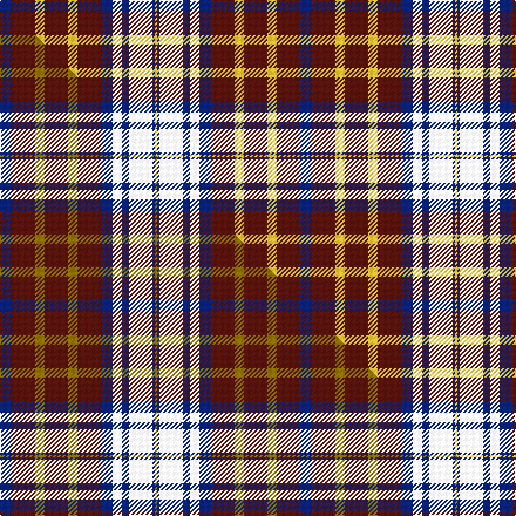

This is one **variant** — a specific cloth: this exact thread count and colourway, with its own
provenance below. It is one weaving of the [sett](/setts/db5dr10ly4dr10ly4dr10db5w4db3w10db1ly1/) (the scale-free proportion — the
same cloth at any scale or shade), whose colour order is pattern [BBYBYBBWBWBY](/stripes/bbybybbwbwby/).

Part of the [Glover, Thomas Blake](/tartans/glover-thomas-blake/) tartan — the named design grouping this sett with its other cloths.

Sourced from tartans-authority.  It is a [12 stripe tartan](/stripes/stripes12/).

Original link [https://www.tartanregister.gov.uk/tartanDetails.aspx?ref=2416](https://www.tartanregister.gov.uk/tartanDetails.aspx?ref=2416)

Dataset <small>— provenance for this record, inherited from the source manifest</small>

<dl class="dataset-prov">
<dt>source</dt><dd><a href="/sources/tartans-authority/">Scottish Tartans Authority</a></dd>
<dt>data captured from</dt><dd><a href="https://github.com/thetartan/tartan-database/blob/master/data/tartans-authority/data.csv">https://github.com/thetartan/tartan-database/blob/master/data/tartans-authority/data.csv</a></dd>
<dt>data date</dt><dd>1996 <small>(this record)</small></dd>
<dt>licence</dt><dd><a href="https://creativecommons.org/licenses/by-nc-nd/4.0/">CC BY-NC-ND 4.0</a></dd>
</dl>

Capture chain <small>— the hands this data passed through, oldest first; each capture carries its own licence</small>

<ol class="capture-chain">
<li><a href="https://www.tartansauthority.com/">Scottish Tartans Authority</a> <small>the heritage body's archive — its tartan-ferret record browser is retired (links repaired to the SRT, above)</small></li>
<li><a href="https://github.com/thetartan/tartan-database">thetartan/tartan-database</a> <small>2016-2017</small> · <a href="https://creativecommons.org/licenses/by-nc-nd/4.0/">CC BY-NC-ND 4.0</a> <small>Levko Kravets's frozen compilation — the capture we vendored, and where its CC licence text came from</small></li>
<li>this dictionary <small>captured 2026-06-10 · commit 5bf86c7566</small> <small>each re-capture is a git commit to data/sources</small></li>
</ol>

## Register references

External register numbers recorded for this tartan.

- Scottish Tartans Authority (ITI): 2416

## Thread count
DB/10 DR20 LY8 DR20 LY8 DR20 DB10 W8 DB6 W20 DB2 LY/2

One full sett is **256 threads**.

## Palette
<table><thead><tr><th>Colour</th><th>Shade</th><th>OKLCh</th></tr></thead><tbody><tr><td>DB</td><td><code style="background-color:#082077;">#082077</code> <small style="color:#888">#082077</small></td><td><small style="color:#888">oklch(30.0% 0.149 265.1)</small></td></tr><tr><td>DR</td><td><code style="background-color:#55120C;">#55120C</code> <small style="color:#888">#55120C</small></td><td><small style="color:#888">oklch(30.0% 0.099 29.3)</small></td></tr><tr><td>LY</td><td><code style="background-color:#DCBC32;">#DCBC32</code> <small style="color:#888">#DCBC32</small></td><td><small style="color:#888">oklch(80.0% 0.150 95.2)</small></td></tr><tr><td>W</td><td><code style="background-color:#F7F7F7;">#F7F7F7</code> <small style="color:#888">#F7F7F7</small></td><td><small style="color:#888">oklch(97.6% 0.000 89.9)</small></td></tr></tbody></table>

# Sample pattern

## Compared to the master

This cloth is one sett of its design; the master sett (the exemplar the design is anchored on) is below for comparison.

Its **ΔTartan distance** from the master is **0.07** — the same measure the nearest-tartans table ranks by (0 is identical; a re-scale of the same cloth is near 0, a recolour or a different proportion further).

<figure class="master-compare" style="margin:0">

this sett
master sett ★

<figcaption style="color:#888;font-size:smaller">One weave of this sett against the <a href="/setts/db5dr10y4dr10y4dr10db5w4db3w10db1y1/">master sett ★</a>, split on the diagonal: a shared proportion runs seamlessly across it with only the shades shifting; a different proportion breaks on it.</figcaption>
</figure>

## Nearest tartan variants

The nearest existing variants by ΔTartan distance, with this cloth at the top so the swatches line up against it.

ΔTartan

Threads

Variant

Sett

—

256

<a href="/variants/s12/db5dr10ly4dr10ly4dr10db5w4db3w10db1ly1~x2/">Glover, Thomas Blake (Corporate)</a>

<a href="/ttd/edit/#slug=db5dr10y4dr10y4dr10db5w4db3w10db1y1~x2&amp;base=db5dr10ly4dr10ly4dr10db5w4db3w10db1ly1~x2" title="compare in the TTD">0.07</a>

256

<a href="/variants/s12/db5dr10y4dr10y4dr10db5w4db3w10db1y1~x2/">Glover, Thomas Blake</a>

<a href="/ttd/edit/#slug=ly2db10dr3ly2w3ly2db3dr3db3w3ly2~x4&amp;base=db5dr10ly4dr10ly4dr10db5w4db3w10db1ly1~x2" title="compare in the TTD">3.06</a>

272

<a href="/variants/s11/ly2db10dr3ly2w3ly2db3dr3db3w3ly2~x4/">Unidentified #55</a>

<a href="/ttd/edit/#slug=dr6w4dr6w11db1w3db3w1db11ly6db4ly6~x4&amp;base=db5dr10ly4dr10ly4dr10db5w4db3w10db1ly1~x2" title="compare in the TTD">3.25</a>

448

<a href="/variants/s12/dr6w4dr6w11db1w3db3w1db11ly6db4ly6~x4/">Lysaght Dress</a>

<a href="/ttd/edit/#slug=dr12w2dr2w2dr2w10b12w3b12w10dr12w2dr2~x2&amp;base=db5dr10ly4dr10ly4dr10db5w4db3w10db1ly1~x2" title="compare in the TTD">3.82</a>

304

<a href="/variants/s13/dr12w2dr2w2dr2w10b12w3b12w10dr12w2dr2~x2/">Red, White, Blue Watch (Dance)</a>

<a href="/ttd/edit/#slug=dr6n4dr6n11db1n3db3n1db11ly6db4ly6~x4&amp;base=db5dr10ly4dr10ly4dr10db5w4db3w10db1ly1~x2" title="compare in the TTD">3.85</a>

448

<a href="/variants/s12/dr6n4dr6n11db1n3db3n1db11ly6db4ly6~x4/">Lysaght</a>

<a href="/ttd/edit/#slug=n9do1n1do1n1do7w7do2~x4&amp;base=db5dr10ly4dr10ly4dr10db5w4db3w10db1ly1~x2" title="compare in the TTD">3.97</a>

188

<a href="/variants/s8/n9do1n1do1n1do7w7do2~x4/">Grey Watch, Dress</a>

<a href="/ttd/edit/#slug=ly7db4ly2db4ly23n19db19n4~x2&amp;base=db5dr10ly4dr10ly4dr10db5w4db3w10db1ly1~x2" title="compare in the TTD">3.98</a>

306

<a href="/variants/s8/ly7db4ly2db4ly23n19db19n4~x2/">Chindecella Gorse (Personal)</a>

<a href="/ttd/edit/#slug=lb25dp4lb4dp4lb4dp23lr23w4lr23dp23lb23dp4lb4~x2~lb3401300-lr3000000&amp;base=db5dr10ly4dr10ly4dr10db5w4db3w10db1ly1~x2" title="compare in the TTD">3.99</a>

614

<a href="/variants/s13/lb25dp4lb4dp4lb4dp23lr23w4lr23dp23lb23dp4lb4~x2~lb3401300-lr3000000/">Poulter Pink Corporate Tartan</a>

<a href="/ttd/edit/#slug=n12dt2n2dt2n2dt10w12dt3~x2~n1900000-dt0900000&amp;base=db5dr10ly4dr10ly4dr10db5w4db3w10db1ly1~x2" title="compare in the TTD">3.99</a>

150

<a href="/variants/s8/n12dt2n2dt2n2dt10w12dt3~x2~n1900000-dt0900000/">Grey Watch Dress (Fashion)</a>

## Neighbour map

Every grey dot is one of 13621 variants placed by the first two principal components of the ΔTartan feature space (42% of its variance). Red is this tartan; blue dots are its nearest — click one to open its page.

<svg viewBox="0 0 640 380" role="img" style="max-width:100%;height:auto;border:1px solid #e0e0e0;border-radius:4px;display:block" xmlns="http://www.w3.org/2000/svg"><image href="/nn/cloud.v1.png" width="640" height="380"/><a href="/variants/s12/db5dr10y4dr10y4dr10db5w4db3w10db1y1~x2/"><circle cx="195.8" cy="214.2" r="4" fill="#3465a4"><title>Glover, Thomas Blake</title></circle></a><a href="/variants/s11/ly2db10dr3ly2w3ly2db3dr3db3w3ly2~x4/"><circle cx="191.0" cy="250.9" r="4" fill="#3465a4"><title>Unidentified #55</title></circle></a><a href="/variants/s12/dr6w4dr6w11db1w3db3w1db11ly6db4ly6~x4/"><circle cx="153.5" cy="229.9" r="4" fill="#3465a4"><title>Lysaght Dress</title></circle></a><a href="/variants/s13/dr12w2dr2w2dr2w10b12w3b12w10dr12w2dr2~x2/"><circle cx="206.0" cy="247.5" r="4" fill="#3465a4"><title>Red, White, Blue Watch (Dance)</title></circle></a><a href="/variants/s12/dr6n4dr6n11db1n3db3n1db11ly6db4ly6~x4/"><circle cx="194.9" cy="241.1" r="4" fill="#3465a4"><title>Lysaght</title></circle></a><a href="/variants/s8/n9do1n1do1n1do7w7do2~x4/"><circle cx="261.5" cy="241.6" r="4" fill="#3465a4"><title>Grey Watch, Dress</title></circle></a><a href="/variants/s8/ly7db4ly2db4ly23n19db19n4~x2/"><circle cx="266.0" cy="244.7" r="4" fill="#3465a4"><title>Chindecella Gorse (Personal)</title></circle></a><a href="/variants/s13/lb25dp4lb4dp4lb4dp23lr23w4lr23dp23lb23dp4lb4~x2~lb3401300-lr3000000/"><circle cx="208.7" cy="237.9" r="4" fill="#3465a4"><title>Poulter Pink Corporate Tartan</title></circle></a><a href="/variants/s8/n12dt2n2dt2n2dt10w12dt3~x2~n1900000-dt0900000/"><circle cx="227.3" cy="260.8" r="4" fill="#3465a4"><title>Grey Watch Dress (Fashion)</title></circle></a><circle cx="210.1" cy="226.6" r="5" fill="#c00000"/><text x="320" y="376" text-anchor="middle" font-size="11" fill="#999">ground</text><text x="11" y="190" text-anchor="middle" font-size="11" fill="#999" transform="rotate(-90 11 190)">complexity</text></svg>

ID: /variants/s12/db5dr10ly4dr10ly4dr10db5w4db3w10db1ly1~x2/
