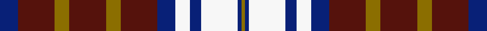

This page is one **sett** — a single exact thread-count. It belongs to the [tartan](/setts/db5dr10y4dr10y4dr10db5w4db3w10db1y1/)
(the same proportion at any scale), whose colour order is pattern [BBGBGBBWBWBG](/stripes/bbgbgbbwbwbg/).

Part of the [Glover, Thomas Blake](/tartans/glover-thomas-blake/) tartan — the named design grouping this sett with its other cloths.

Sourced from register-of-tartans.  It is a [12 stripe tartan](/stripes/stripes12/).

Original link https://www.tartanregister.gov.uk/tartanDetails.aspx?ref=1441

## Register references

External register numbers recorded for this tartan.

- Scottish Register of Tartans: [1441](https://www.tartanregister.gov.uk/tartanDetails.aspx?ref=1441)
- Scottish Tartans Authority (ITI): 2416
- Scottish Tartans World Register: 2416

## Thread count
DB/10 DR20 Y8 DR20 Y8 DR20 DB10 W8 DB6 W20 DB2 Y/2

One full sett is **256 threads**.

## Palette
<table><thead><tr><th>Colour</th><th>Shade</th><th>OKLCh</th></tr></thead><tbody><tr><td>DB</td><td><code style="background-color:#082077;">#082077</code> <small style="color:#888">#082077</small></td><td><small style="color:#888">oklch(30.0% 0.149 265.1)</small></td></tr><tr><td>DR</td><td><code style="background-color:#55120C;">#55120C</code> <small style="color:#888">#55120C</small></td><td><small style="color:#888">oklch(30.0% 0.099 29.3)</small></td></tr><tr><td>DY</td><td><code style="background-color:#8B6E00;">#8B6E00</code> <small style="color:#888">#8B6E00</small></td><td><small style="color:#888">oklch(55.1% 0.113 90.4)</small></td></tr><tr><td>LR</td><td><code style="background-color:#F7F7F7;">#F7F7F7</code> <small style="color:#888">#F7F7F7</small></td><td><small style="color:#888">oklch(97.6% 0.000 89.9)</small></td></tr><tr><td>T</td><td><code style="background-color:#A65C11;">#A65C11</code> <small style="color:#888">#A65C11</small></td><td><small style="color:#888">oklch(55.0% 0.125 58.3)</small></td></tr></tbody></table>

# Sample pattern

## Nearest variants

The nearest existing variants by ΔTartan distance, with this cloth at the top so the swatches line up against it.

ΔTartan

Threads

Variant

Sett

—

256

<a href="/variants/s12/db5dr10y4dr10y4dr10db5w4db3w10db1y1~x2/">Glover, Thomas Blake</a>

<a href="/ttd/edit/#slug=db5dr10ly4dr10ly4dr10db5w4db3w10db1ly1~x2&amp;base=db5dr10y4dr10y4dr10db5w4db3w10db1y1~x2" title="compare in the TTD">0.00</a>

256

<a href="/variants/s12/db5dr10ly4dr10ly4dr10db5w4db3w10db1ly1~x2/">Glover, Thomas Blake (Corporate)</a>

## Neighbour map

Every grey dot is one of 13620 variants placed by the first two principal components of the ΔTartan feature space (42% of its variance). Red is this tartan; blue dots are its nearest — click one to open its page.

<svg viewBox="0 0 640 380" role="img" style="max-width:100%;height:auto;border:1px solid #e0e0e0;border-radius:4px;display:block" xmlns="http://www.w3.org/2000/svg"><image href="/nn/cloud.v1.png" width="640" height="380"/><a href="/variants/s12/db5dr10ly4dr10ly4dr10db5w4db3w10db1ly1~x2/"><circle cx="210.0" cy="226.0" r="4" fill="#3465a4"><title>Glover, Thomas Blake (Corporate)</title></circle></a><circle cx="195.7" cy="213.7" r="5" fill="#c00000"/><text x="320" y="376" text-anchor="middle" font-size="11" fill="#999">ground</text><text x="11" y="190" text-anchor="middle" font-size="11" fill="#999" transform="rotate(-90 11 190)">complexity</text></svg>

ID: /variants/s12/db5dr10y4dr10y4dr10db5w4db3w10db1y1~x2/
