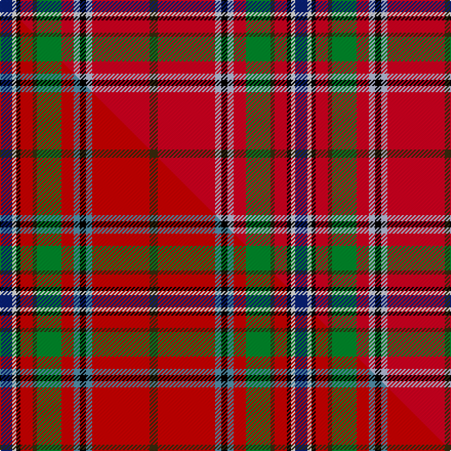

This is one **variant** — a specific cloth: this exact thread count and colourway, with its own
provenance below. It is one weaving of the [sett](/setts/db6w2k2r6dy2g12r6lb3k3lb3r28dy4/) (the scale-free proportion — the
same cloth at any scale or shade), whose colour order is pattern [BWKRGGRWKWRG](/stripes/bwkrggrwkwrg/).

Part of the [Wren](/tartans/wren/) tartan — the named design grouping this sett with its other cloths.

Sourced from tartans-authority.  It is a [12 stripe tartan](/stripes/stripes12/).

Original link [https://www.tartanregister.gov.uk/tartanDetails.aspx?ref=3815](https://www.tartanregister.gov.uk/tartanDetails.aspx?ref=3815)

Dataset <small>— provenance for this record, inherited from the source manifest</small>

<dl class="dataset-prov">
<dt>source</dt><dd><a href="/sources/tartans-authority/">Scottish Tartans Authority</a></dd>
<dt>data captured from</dt><dd><a href="https://github.com/thetartan/tartan-database/blob/master/data/tartans-authority/data.csv">https://github.com/thetartan/tartan-database/blob/master/data/tartans-authority/data.csv</a></dd>
<dt>data date</dt><dd>2002 <small>(this record)</small></dd>
<dt>licence</dt><dd><a href="https://creativecommons.org/licenses/by-nc-nd/4.0/">CC BY-NC-ND 4.0</a></dd>
</dl>

Capture chain <small>— the hands this data passed through, oldest first; each capture carries its own licence</small>

<ol class="capture-chain">
<li><a href="https://www.tartansauthority.com/">Scottish Tartans Authority</a> <small>the heritage body's archive — its tartan-ferret record browser is retired (links repaired to the SRT, above)</small></li>
<li><a href="https://github.com/thetartan/tartan-database">thetartan/tartan-database</a> <small>2016-2017</small> · <a href="https://creativecommons.org/licenses/by-nc-nd/4.0/">CC BY-NC-ND 4.0</a> <small>Levko Kravets's frozen compilation — the capture we vendored, and where its CC licence text came from</small></li>
<li>this dictionary <small>captured 2026-06-10 · commit 5bf86c7566</small> <small>each re-capture is a git commit to data/sources</small></li>
</ol>

## Register references

External register numbers recorded for this tartan.

- Scottish Tartans Authority (ITI): 3815

## Thread count
DB/12 W4 K4 R12 DY4 G24 R12 LB6 K6 LB6 R56 DY/8

One full sett is **288 threads**.

## Palette
<table><thead><tr><th>Colour</th><th>Shade</th><th>OKLCh</th></tr></thead><tbody><tr><td>LB</td><td><code style="background-color:#B5BBDE;">#B5BBDE</code> <small style="color:#888">#B5BBDE</small></td><td><small style="color:#888">oklch(79.9% 0.050 277.6)</small></td></tr><tr><td>DB</td><td><code style="background-color:#082077;">#082077</code> <small style="color:#888">#082077</small></td><td><small style="color:#888">oklch(30.0% 0.149 265.1)</small></td></tr><tr><td>G</td><td><code style="background-color:#008B2A;">#008B2A</code> <small style="color:#888">#008B2A</small></td><td><small style="color:#888">oklch(55.4% 0.170 145.9)</small></td></tr><tr><td>K</td><td><code style="background-color:#000000;">#000000</code> <small style="color:#888">#000000</small></td><td><small style="color:#888">oklch(0.0% 0.000 0.0)</small></td></tr><tr><td>R</td><td><code style="background-color:#D60020;">#D60020</code> <small style="color:#888">#D60020</small></td><td><small style="color:#888">oklch(55.2% 0.224 25.5)</small></td></tr><tr><td>W</td><td><code style="background-color:#F7F7F7;">#F7F7F7</code> <small style="color:#888">#F7F7F7</small></td><td><small style="color:#888">oklch(97.6% 0.000 89.9)</small></td></tr><tr><td>DY</td><td><code style="background-color:#3A2B0D;">#3A2B0D</code> <small style="color:#888">#3A2B0D</small></td><td><small style="color:#888">oklch(30.0% 0.049 82.0)</small></td></tr></tbody></table>

# Sample pattern

## Compared to the master

This cloth is one sett of its design; the master sett (the exemplar the design is anchored on) is below for comparison.

Its **ΔTartan distance** from the master is **0.06** — the same measure the nearest-tartans table ranks by (0 is identical; a re-scale of the same cloth is near 0, a recolour or a different proportion further).

<figure class="master-compare" style="margin:0">

this sett
master sett ★

<figcaption style="color:#888;font-size:smaller">One weave of this sett against the <a href="/setts/db6w2k2r6dy2g12r6t3k3t3r28dy4/">master sett ★</a>, split on the diagonal: a shared proportion runs seamlessly across it with only the shades shifting; a different proportion breaks on it.</figcaption>
</figure>

## Nearest tartan variants

The nearest existing variants by ΔTartan distance, with this cloth at the top so the swatches line up against it.

ΔTartan

Threads

Variant

Sett

—

288

<a href="/variants/s12/db6w2k2r6dy2g12r6lb3k3lb3r28dy4~x2/">Wren (Name)</a>

<a href="/ttd/edit/#slug=db6w2k2r6dy2g12r6t3k3t3r28dy4~x2~r2109032-t2503227&amp;base=db6w2k2r6dy2g12r6lb3k3lb3r28dy4~x2" title="compare in the TTD">0.07</a>

288

<a href="/variants/s12/db6w2k2r6dy2g12r6t3k3t3r28dy4~x2~r2109032-t2503227/">Wren</a>

<a href="/ttd/edit/#slug=r3db1r1db2r12lb1r1k4w1g6r1~x4&amp;base=db6w2k2r6dy2g12r6lb3k3lb3r28dy4~x2" title="compare in the TTD">2.21</a>

248

<a href="/variants/s11/r3db1r1db2r12lb1r1k4w1g6r1~x4/">McLinden, Thomas (Personal)</a>

<a href="/ttd/edit/#slug=w2k1t2lb1dg4r1dg4r3k3r12lb1r2k1~x4&amp;base=db6w2k2r6dy2g12r6lb3k3lb3r28dy4~x2" title="compare in the TTD">2.33</a>

284

<a href="/variants/s13/w2k1t2lb1dg4r1dg4r3k3r12lb1r2k1~x4/">Peacock (Personal)</a>

<a href="/ttd/edit/#slug=k2lb6w1r14k1r14w1k6dg10ly1dg2ly2~x2~dg1403152-ly2705081&amp;base=db6w2k2r6dy2g12r6lb3k3lb3r28dy4~x2" title="compare in the TTD">2.37</a>

232

<a href="/variants/s12/k2lb6w1r14k1r14w1k6dg10ly1dg2ly2~x2~dg1403152-ly2705081/">Ogg of Tarragann</a>

<a href="/ttd/edit/#slug=r8ly2r24k6dy3g2dy3g2dy3k3w3k2~x2&amp;base=db6w2k2r6dy2g12r6lb3k3lb3r28dy4~x2" title="compare in the TTD">2.53</a>

224

<a href="/variants/s12/r8ly2r24k6dy3g2dy3g2dy3k3w3k2~x2/">Burns 250th Anniversary (Commem.)</a>

<a href="/ttd/edit/#slug=k2lb6w1r14k1r14w1k6g10ly1g2ly2~x2&amp;base=db6w2k2r6dy2g12r6lb3k3lb3r28dy4~x2" title="compare in the TTD">2.58</a>

232

<a href="/variants/s12/k2lb6w1r14k1r14w1k6g10ly1g2ly2~x2/">Ogg of Tarragann (Personal)</a>

<a href="/ttd/edit/#slug=y3r25k8r4db8w2db3w2db8r4g8r25y3~x2&amp;base=db6w2k2r6dy2g12r6lb3k3lb3r28dy4~x2" title="compare in the TTD">2.59</a>

400

<a href="/variants/s13/y3r25k8r4db8w2db3w2db8r4g8r25y3~x2/">Maynard</a>

<a href="/ttd/edit/#slug=ly4g4db8r8g8r27k3w1r27lb6g8db8g4ly4~x2&amp;base=db6w2k2r6dy2g12r6lb3k3lb3r28dy4~x2" title="compare in the TTD">2.61</a>

464

<a href="/variants/s14/ly4g4db8r8g8r27k3w1r27lb6g8db8g4ly4~x2/">West Virginia</a>

<a href="/ttd/edit/#slug=r12lb2r12g8y1k6lb4k1lb1k1lb4r12w1k1r1~x2&amp;base=db6w2k2r6dy2g12r6lb3k3lb3r28dy4~x2" title="compare in the TTD">2.67</a>

242

<a href="/variants/s15/r12lb2r12g8y1k6lb4k1lb1k1lb4r12w1k1r1~x2/">MacPherson</a>

<a href="/ttd/edit/#slug=lb4k2db3r33g9y3r5db10r6g2k2~x2&amp;base=db6w2k2r6dy2g12r6lb3k3lb3r28dy4~x2" title="compare in the TTD">2.67</a>

304

<a href="/variants/s11/lb4k2db3r33g9y3r5db10r6g2k2~x2/">MacArthur-Fox Dress</a>

## Neighbour map

Every grey dot is one of 13621 variants placed by the first two principal components of the ΔTartan feature space (42% of its variance). Red is this tartan; blue dots are its nearest — click one to open its page.

<svg viewBox="0 0 640 380" role="img" style="max-width:100%;height:auto;border:1px solid #e0e0e0;border-radius:4px;display:block" xmlns="http://www.w3.org/2000/svg"><image href="/nn/cloud.v1.png" width="640" height="380"/><a href="/variants/s12/db6w2k2r6dy2g12r6t3k3t3r28dy4~x2~r2109032-t2503227/"><circle cx="207.3" cy="63.2" r="4" fill="#3465a4"><title>Wren</title></circle></a><a href="/variants/s11/r3db1r1db2r12lb1r1k4w1g6r1~x4/"><circle cx="213.8" cy="106.1" r="4" fill="#3465a4"><title>McLinden, Thomas (Personal)</title></circle></a><a href="/variants/s13/w2k1t2lb1dg4r1dg4r3k3r12lb1r2k1~x4/"><circle cx="166.5" cy="104.6" r="4" fill="#3465a4"><title>Peacock (Personal)</title></circle></a><a href="/variants/s12/k2lb6w1r14k1r14w1k6dg10ly1dg2ly2~x2~dg1403152-ly2705081/"><circle cx="162.4" cy="106.5" r="4" fill="#3465a4"><title>Ogg of Tarragann</title></circle></a><a href="/variants/s12/r8ly2r24k6dy3g2dy3g2dy3k3w3k2~x2/"><circle cx="199.5" cy="93.7" r="4" fill="#3465a4"><title>Burns 250th Anniversary (Commem.)</title></circle></a><a href="/variants/s12/k2lb6w1r14k1r14w1k6g10ly1g2ly2~x2/"><circle cx="157.2" cy="107.2" r="4" fill="#3465a4"><title>Ogg of Tarragann (Personal)</title></circle></a><a href="/variants/s13/y3r25k8r4db8w2db3w2db8r4g8r25y3~x2/"><circle cx="221.9" cy="106.3" r="4" fill="#3465a4"><title>Maynard</title></circle></a><a href="/variants/s14/ly4g4db8r8g8r27k3w1r27lb6g8db8g4ly4~x2/"><circle cx="205.1" cy="72.6" r="4" fill="#3465a4"><title>West Virginia</title></circle></a><a href="/variants/s15/r12lb2r12g8y1k6lb4k1lb1k1lb4r12w1k1r1~x2/"><circle cx="202.7" cy="100.4" r="4" fill="#3465a4"><title>MacPherson</title></circle></a><a href="/variants/s11/lb4k2db3r33g9y3r5db10r6g2k2~x2/"><circle cx="255.0" cy="93.1" r="4" fill="#3465a4"><title>MacArthur-Fox Dress</title></circle></a><circle cx="187.5" cy="85.4" r="5" fill="#c00000"/><text x="320" y="376" text-anchor="middle" font-size="11" fill="#999">ground</text><text x="11" y="190" text-anchor="middle" font-size="11" fill="#999" transform="rotate(-90 11 190)">complexity</text></svg>

ID: /variants/s12/db6w2k2r6dy2g12r6lb3k3lb3r28dy4~x2/
