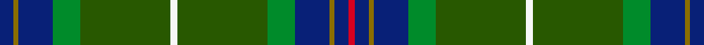

This is one **variant** — a specific cloth: this exact thread count and colourway, with its own
provenance below. It is one weaving of the [sett](/setts/db6y2db15g12dg39w3dg39g12db15y2db6r3/) (the scale-free proportion — the
same cloth at any scale or shade), whose colour order is pattern [BGBGGWGGBGBR](/stripes/bgbggwggbgbr/).

Part of the [Wagland](/tartans/w/wa/wagland-2/) tartan — the named design grouping this sett with its other cloths.

Sourced from register-of-tartans.  It is a [12 stripe tartan](/stripes/stripes12/).

Original link [https://www.tartanregister.gov.uk/tartanDetails.aspx?ref=4475](https://www.tartanregister.gov.uk/tartanDetails.aspx?ref=4475)

Dataset <small>— provenance for this record, inherited from the source manifest</small>

<dl class="dataset-prov">
<dt>source</dt><dd><a href="/sources/register-of-tartans/">Scottish Register of Tartans</a></dd>
<dt>data captured from</dt><dd><a href="https://github.com/thetartan/tartan-database/blob/master/data/register-of-tartans/data.csv">https://github.com/thetartan/tartan-database/blob/master/data/register-of-tartans/data.csv</a></dd>
<dt>data date</dt><dd>01/11/1996 <small>(this record)</small></dd>
<dt>licence</dt><dd><a href="https://www.tartanregister.gov.uk/copyright">Crown copyright</a></dd>
</dl>

Capture chain <small>— the hands this data passed through, oldest first; each capture carries its own licence</small>

<ol class="capture-chain">
<li><a href="https://www.tartanregister.gov.uk/">Scottish Register of Tartans</a> · <a href="https://www.tartanregister.gov.uk/copyright">Crown copyright</a> <small>the living register — still published by National Records of Scotland</small></li>
<li><a href="https://github.com/thetartan/tartan-database">thetartan/tartan-database</a> <small>2016-2017</small> · <a href="https://creativecommons.org/licenses/by-nc-nd/4.0/">CC BY-NC-ND 4.0</a> <small>Levko Kravets's frozen compilation — the capture we vendored, and where its CC licence text came from</small></li>
<li>this dictionary <small>captured 2026-06-10 · commit 5bf86c7566</small> <small>each re-capture is a git commit to data/sources</small></li>
</ol>

## Register references

External register numbers recorded for this tartan.

- Scottish Register of Tartans: [4475](https://www.tartanregister.gov.uk/tartanDetails.aspx?ref=4475)
- Scottish Tartans Authority (ITI): 2470
- Scottish Tartans World Register: 2470

## Thread count
DB/12 Y4 DB30 G24 DG78 W6 DG78 G24 DB30 Y4 DB12 R/6

One full sett is **598 threads**.

## Palette
<table><thead><tr><th>Colour</th><th>Shade</th><th>OKLCh</th></tr></thead><tbody><tr><td>DB</td><td><code style="background-color:#082077;">#082077</code> <small style="color:#888">#082077</small></td><td><small style="color:#888">oklch(30.0% 0.149 265.1)</small></td></tr><tr><td>DG</td><td><code style="background-color:#003820;">#003820</code> <small style="color:#888">#003820</small></td><td><small style="color:#888">oklch(30.0% 0.070 158.3)</small></td></tr><tr><td>DG</td><td><code style="background-color:#285800;">#285800</code> <small style="color:#888">#285800</small></td><td><small style="color:#888">oklch(41.0% 0.122 135.8)</small></td></tr><tr><td>G</td><td><code style="background-color:#008B2A;">#008B2A</code> <small style="color:#888">#008B2A</small></td><td><small style="color:#888">oklch(55.4% 0.170 145.9)</small></td></tr><tr><td>W</td><td><code style="background-color:#F7F7F7;">#F7F7F7</code> <small style="color:#888">#F7F7F7</small></td><td><small style="color:#888">oklch(97.6% 0.000 89.9)</small></td></tr><tr><td>R</td><td><code style="background-color:#D60020;">#D60020</code> <small style="color:#888">#D60020</small></td><td><small style="color:#888">oklch(55.2% 0.224 25.5)</small></td></tr><tr><td>Y</td><td><code style="background-color:#8B6E00;">#8B6E00</code> <small style="color:#888">#8B6E00</small></td><td><small style="color:#888">oklch(55.1% 0.113 90.4)</small></td></tr></tbody></table>

# Sample pattern

## Nearest tartan variants

The nearest existing variants by ΔTartan distance, with this cloth at the top so the swatches line up against it.

ΔTartan

Threads

Variant

Sett

—

598

<a href="/variants/s12/db6y2db15g12dg39w3dg39g12db15y2db6r3~x2~dg1605139/">Wagland</a>

<a href="/ttd/edit/#slug=db3dg22r5dg5n5w1n1dg1g8db6n1db5dg2~x2&amp;base=db6y2db15g12dg39w3dg39g12db15y2db6r3~x2~dg1605139" title="compare in the TTD">2.41</a>

250

<a href="/variants/s13/db3dg22r5dg5n5w1n1dg1g8db6n1db5dg2~x2/">Mill o Forest Primary School (Corp)</a>

<a href="/ttd/edit/#slug=r2dg12g3dg2g2dg2g16lb4dg12w1g8dg14y2~x2&amp;base=db6y2db15g12dg39w3dg39g12db15y2db6r3~x2~dg1605139" title="compare in the TTD">2.64</a>

312

<a href="/variants/s13/r2dg12g3dg2g2dg2g16lb4dg12w1g8dg14y2~x2/">Field Gun Association</a>

<a href="/ttd/edit/#slug=r2dt6g15db6dt4db4dt28db4dt4db6g6y2~x2&amp;base=db6y2db15g12dg39w3dg39g12db15y2db6r3~x2~dg1605139" title="compare in the TTD">2.91</a>

340

<a href="/variants/s12/r2dt6g15db6dt4db4dt28db4dt4db6g6y2~x2/">Los Angeles Police Bagpipe Band</a>

<a href="/ttd/edit/#slug=n5w2g30db6g4db3g4db24g4dy5r3~x2&amp;base=db6y2db15g12dg39w3dg39g12db15y2db6r3~x2~dg1605139" title="compare in the TTD">3.09</a>

344

<a href="/variants/s11/n5w2g30db6g4db3g4db24g4dy5r3~x2/">Wells (1970) (Name)</a>

<a href="/ttd/edit/#slug=r3db6y2db15g12dg39w3~x2&amp;base=db6y2db15g12dg39w3dg39g12db15y2db6r3~x2~dg1605139" title="compare in the TTD">3.21</a>

308

<a href="/variants/s7/r3db6y2db15g12dg39w3~x2/">Wagland (Name)</a>

<a href="/ttd/edit/#slug=dt37g27w2dt4r6dt4w2g27dt37y2~x2&amp;base=db6y2db15g12dg39w3dg39g12db15y2db6r3~x2~dg1605139" title="compare in the TTD">3.23</a>

514

<a href="/variants/s10/dt37g27w2dt4r6dt4w2g27dt37y2~x2/">Highlands of Durham</a>

<a href="/ttd/edit/#slug=dy6w1dy24db6g2db1g2db1g12r1~x2&amp;base=db6y2db15g12dg39w3dg39g12db15y2db6r3~x2~dg1605139" title="compare in the TTD">3.27</a>

210

<a href="/variants/s10/dy6w1dy24db6g2db1g2db1g12r1~x2/">Chisholm Hunting Clan Tartan</a>

<a href="/ttd/edit/#slug=n2db9y1db4y2db2y4n1y15g1y3g3y2g4y1g7ly1r2~x2&amp;base=db6y2db15g12dg39w3dg39g12db15y2db6r3~x2~dg1605139" title="compare in the TTD">3.28</a>

248

<a href="/variants/s18/n2db9y1db4y2db2y4n1y15g1y3g3y2g4y1g7ly1r2~x2/">Norwegian Night (Fashion)</a>

<a href="/ttd/edit/#slug=r2db12dg2g11dg4db5g2dg24w2~x2&amp;base=db6y2db15g12dg39w3dg39g12db15y2db6r3~x2~dg1605139" title="compare in the TTD">3.33</a>

248

<a href="/variants/s9/r2db12dg2g11dg4db5g2dg24w2~x2/">Fraser Gathering, Green (1997)</a>

<a href="/ttd/edit/#slug=g15r1g8dr3dp1dr3w1dr3dp1dr3dp12r1g7y1~x2&amp;base=db6y2db15g12dg39w3dg39g12db15y2db6r3~x2~dg1605139" title="compare in the TTD">3.34</a>

208

<a href="/variants/s14/g15r1g8dr3dp1dr3w1dr3dp1dr3dp12r1g7y1~x2/">Recycled Lamb, The</a>

## Neighbour map

Every grey dot is one of 13621 variants placed by the first two principal components of the ΔTartan feature space (42% of its variance). Red is this tartan; blue dots are its nearest — click one to open its page. The map is a flat projection of a many-dimensional space — [how to read it](/posts/neighbourhood-maps/).

<svg viewBox="0 0 640 380" role="img" style="max-width:100%;height:auto;border:1px solid #e0e0e0;border-radius:4px;display:block" xmlns="http://www.w3.org/2000/svg"><image href="/nn/cloud.v1.png" width="640" height="380"/><a href="/variants/s13/db3dg22r5dg5n5w1n1dg1g8db6n1db5dg2~x2/"><circle cx="261.1" cy="128.3" r="4" fill="#3465a4"><title>Mill o Forest Primary School (Corp)</title></circle></a><a href="/variants/s13/r2dg12g3dg2g2dg2g16lb4dg12w1g8dg14y2~x2/"><circle cx="283.9" cy="155.6" r="4" fill="#3465a4"><title>Field Gun Association</title></circle></a><a href="/variants/s12/r2dt6g15db6dt4db4dt28db4dt4db6g6y2~x2/"><circle cx="303.1" cy="177.2" r="4" fill="#3465a4"><title>Los Angeles Police Bagpipe Band</title></circle></a><a href="/variants/s11/n5w2g30db6g4db3g4db24g4dy5r3~x2/"><circle cx="245.8" cy="138.8" r="4" fill="#3465a4"><title>Wells (1970) (Name)</title></circle></a><a href="/variants/s7/r3db6y2db15g12dg39w3~x2/"><circle cx="276.4" cy="153.8" r="4" fill="#3465a4"><title>Wagland (Name)</title></circle></a><a href="/variants/s10/dt37g27w2dt4r6dt4w2g27dt37y2~x2/"><circle cx="339.6" cy="164.0" r="4" fill="#3465a4"><title>Highlands of Durham</title></circle></a><a href="/variants/s10/dy6w1dy24db6g2db1g2db1g12r1~x2/"><circle cx="343.2" cy="132.8" r="4" fill="#3465a4"><title>Chisholm Hunting Clan Tartan</title></circle></a><a href="/variants/s18/n2db9y1db4y2db2y4n1y15g1y3g3y2g4y1g7ly1r2~x2/"><circle cx="242.7" cy="142.0" r="4" fill="#3465a4"><title>Norwegian Night (Fashion)</title></circle></a><a href="/variants/s9/r2db12dg2g11dg4db5g2dg24w2~x2/"><circle cx="265.0" cy="183.0" r="4" fill="#3465a4"><title>Fraser Gathering, Green (1997)</title></circle></a><a href="/variants/s14/g15r1g8dr3dp1dr3w1dr3dp1dr3dp12r1g7y1~x2/"><circle cx="247.1" cy="131.5" r="4" fill="#3465a4"><title>Recycled Lamb, The</title></circle></a><circle cx="296.6" cy="148.7" r="5" fill="#c00000"/><text x="320" y="376" text-anchor="middle" font-size="11" fill="#999">ground</text><text x="11" y="190" text-anchor="middle" font-size="11" fill="#999" transform="rotate(-90 11 190)">complexity</text></svg>

ID: /variants/s12/db6y2db15g12dg39w3dg39g12db15y2db6r3~x2~dg1605139/
