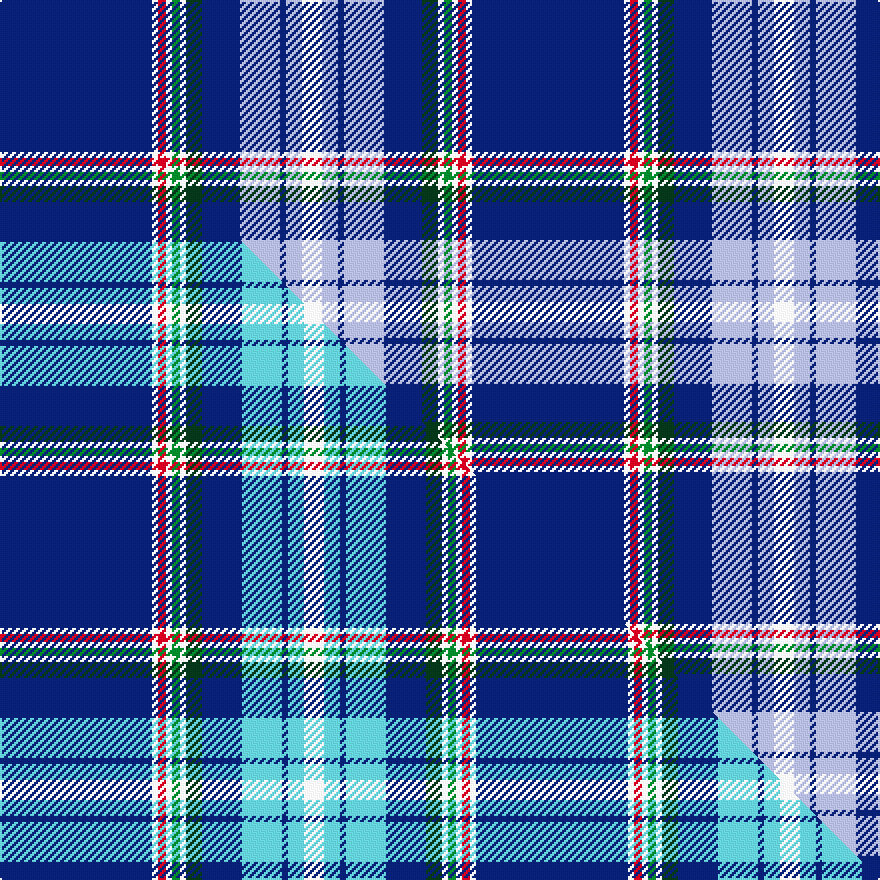

This is one **variant** — a specific cloth: this exact thread count and colourway, with its own
provenance below. It is one weaving of the [sett](/tartans/s/su/summerwood/) (the scale-free proportion — the
same cloth at any scale or shade), whose colour order is pattern [BWRWGWGBWBWW](/stripes/bwrwgwgbwbww/).

Part of the [Summerwood](/tartans/s/su/summerwood/) tartan — the named design grouping this sett with its other cloths.

Sourced from tartans-authority.  It is a [12 stripe tartan](/stripes/stripes12/).

Original link <code>http://www.tartansauthority.com/tartan-ferret/display/7148/</code> — retired · [Internet Archive copy](https://web.archive.org/web/*/http://www.tartansauthority.com/tartan-ferret/display/7148/*)

Dataset <small>— provenance for this record, inherited from the source manifest</small>

<dl class="dataset-prov">
<dt>source</dt><dd><a href="/sources/tartans-authority/">Scottish Tartans Authority</a></dd>
<dt>data captured from</dt><dd><a href="https://github.com/thetartan/tartan-database/blob/master/data/tartans-authority/data.csv">https://github.com/thetartan/tartan-database/blob/master/data/tartans-authority/data.csv</a></dd>
<dt>data date</dt><dd>pre 2007 <small>(this record)</small></dd>
<dt>licence</dt><dd><a href="https://creativecommons.org/licenses/by-nc-nd/4.0/">CC BY-NC-ND 4.0</a></dd>
</dl>

Capture chain <small>— the hands this data passed through, oldest first; each capture carries its own licence</small>

<ol class="capture-chain">
<li><a href="https://www.tartansauthority.com/">Scottish Tartans Authority</a> <small>the heritage body’s archive — its tartan-ferret record browser is retired; dead record links are shown unlinked, with an Internet Archive copy (ITI numbers are not SRT references)</small></li>
<li><a href="https://github.com/thetartan/tartan-database">thetartan/tartan-database</a> <small>2016-2017</small> · <a href="https://creativecommons.org/licenses/by-nc-nd/4.0/">CC BY-NC-ND 4.0</a> <small>Levko Kravets's frozen compilation — the capture we vendored, and where its CC licence text came from</small></li>
<li>this dictionary <small>captured 2026-06-10 · commit 5bf86c7566</small> <small>each re-capture is a git commit to data/sources</small></li>
</ol>

## Register references

External register numbers recorded for this tartan.

- Scottish Tartans Authority (ITI): 7148

## Thread count
DB/76 W3 R4 W3 G4 W3 DG8 DB19 LB20 DB3 LB8 W/10

One full sett is **236 threads**.

## Palette
<table><thead><tr><th>Colour</th><th>Shade</th><th>OKLCh</th></tr></thead><tbody><tr><td>LB</td><td><code style="background-color:#B5BBDE;">#B5BBDE</code> <small style="color:#888">#B5BBDE</small></td><td><small style="color:#888">oklch(79.9% 0.050 277.6)</small></td></tr><tr><td>DB</td><td><code style="background-color:#082077;">#082077</code> <small style="color:#888">#082077</small></td><td><small style="color:#888">oklch(30.0% 0.149 265.1)</small></td></tr><tr><td>DG</td><td><code style="background-color:#053819;">#053819</code> <small style="color:#888">#053819</small></td><td><small style="color:#888">oklch(30.0% 0.075 151.3)</small></td></tr><tr><td>G</td><td><code style="background-color:#008B2A;">#008B2A</code> <small style="color:#888">#008B2A</small></td><td><small style="color:#888">oklch(55.4% 0.170 145.9)</small></td></tr><tr><td>W</td><td><code style="background-color:#F7F7F7;">#F7F7F7</code> <small style="color:#888">#F7F7F7</small></td><td><small style="color:#888">oklch(97.6% 0.000 89.9)</small></td></tr><tr><td>R</td><td><code style="background-color:#D60020;">#D60020</code> <small style="color:#888">#D60020</small></td><td><small style="color:#888">oklch(55.2% 0.224 25.5)</small></td></tr></tbody></table>

# Sample pattern

## Compared to the master

This cloth is one sett of its design; the master sett (the exemplar the design is anchored on) is below for comparison.

Its **ΔTartan distance** from the master is **0.05** — the same measure the nearest-tartans table ranks by (0 is identical; a re-scale of the same cloth is near 0, a recolour or a different proportion further).

<figure class="master-compare" style="margin:0">

this sett
master sett ★

<figcaption style="color:#888;font-size:smaller">One weave of this sett against the <a href="/setts/db76w3r4w3g4w3dg8db20lt20db3lt8w10/">master sett ★</a>, split on the diagonal: a shared proportion runs seamlessly across it with only the shades shifting; a different proportion breaks on it.</figcaption>
</figure>

## Nearest tartan variants

The nearest existing variants by ΔTartan distance, with this cloth at the top so the swatches line up against it.

ΔTartan

Threads

Variant

Sett

—

236

<a href="/variants/s12/db76w3r4w3g4w3dg8db19lb20db3lb8w10/">Summerwood (School)</a>

<a href="/ttd/edit/#slug=db76w3r4w3g4w3dg8db20lt20db3lt8w10&amp;base=db76w3r4w3g4w3dg8db19lb20db3lb8w10" title="compare in the TTD">0.05</a>

238

<a href="/variants/s12/db76w3r4w3g4w3dg8db20lt20db3lt8w10/">Summerwood</a>

<a href="/ttd/edit/#slug=db40lb3db3lb3db3lb4dg8g8n8w2~x2&amp;base=db76w3r4w3g4w3dg8db19lb20db3lb8w10" title="compare in the TTD">2.17</a>

244

<a href="/variants/s10/db40lb3db3lb3db3lb4dg8g8n8w2~x2/">Greenshields, Simon (Personal)</a>

<a href="/ttd/edit/#slug=db46r3db7do2y2do2w2do11ly6db2ly3w2~x2&amp;base=db76w3r4w3g4w3dg8db19lb20db3lb8w10" title="compare in the TTD">2.42</a>

256

<a href="/variants/s12/db46r3db7do2y2do2w2do11ly6db2ly3w2~x2/">Lady Diana Plaid Trade or Fancy Tartan</a>

<a href="/ttd/edit/#slug=dp5g1db30lb2db4lb3db3lb4db2lb5db2t9db1w2~x2~db2508270-t6518249&amp;base=db76w3r4w3g4w3dg8db19lb20db3lb8w10" title="compare in the TTD">2.52</a>

278

<a href="/variants/s14/dp5g1db30lb2db4lb3db3lb4db2lb5db2t9db1w2~x2~db2508270-t6518249/">Crombie, Harry (Personal)</a>

<a href="/ttd/edit/#slug=db48w4g3y2w2y2g3w2r8w4db5b3g2b3db5w4r4&amp;base=db76w3r4w3g4w3dg8db19lb20db3lb8w10" title="compare in the TTD">2.67</a>

156

<a href="/variants/s17/db48w4g3y2w2y2g3w2r8w4db5b3g2b3db5w4r4/">Cavalry, 7th..</a>

<a href="/ttd/edit/#slug=r3w2db2ly1db39ly1db1g2db1lyi15db1~x2~ly6614084-lyi7811105&amp;base=db76w3r4w3g4w3dg8db19lb20db3lb8w10" title="compare in the TTD">2.71</a>

264

<a href="/variants/s11/r3w2db2ly1db39ly1db1g2db1lyi15db1~x2~ly6614084-lyi7811105/">Bartlett of El Paso (Name)</a>

<a href="/ttd/edit/#slug=y2db26lb3db3r1db3lb7db6lb15w1lb2~x2&amp;base=db76w3r4w3g4w3dg8db19lb20db3lb8w10" title="compare in the TTD">2.80</a>

268

<a href="/variants/s11/y2db26lb3db3r1db3lb7db6lb15w1lb2~x2/">Vilaro-Thomas (Personal)</a>

<a href="/ttd/edit/#slug=db48w4g3y2w2y2g3w2r8w4db5lp3g2lp3db5w4r4&amp;base=db76w3r4w3g4w3dg8db19lb20db3lb8w10" title="compare in the TTD">2.84</a>

156

<a href="/variants/s17/db48w4g3y2w2y2g3w2r8w4db5lp3g2lp3db5w4r4/">Cavalry 7th.. Regimental Tartan</a>

<a href="/ttd/edit/#slug=dbi4dp8dbi3dp2dbi64lb24r4db3lb4db3w8r4~dbi2508270-db2316264&amp;base=db76w3r4w3g4w3dg8db19lb20db3lb8w10" title="compare in the TTD">2.91</a>

254

<a href="/variants/s12/dbi4dp8dbi3dp2dbi64lb24r4db3lb4db3w8r4~dbi2508270-db2316264/">Royal Navy</a>

<a href="/ttd/edit/#slug=db37dr4w9db2w2ly9db4w2db2dy2~x2&amp;base=db76w3r4w3g4w3dg8db19lb20db3lb8w10" title="compare in the TTD">3.05</a>

214

<a href="/variants/s10/db37dr4w9db2w2ly9db4w2db2dy2~x2/">Stuart/Stewart navy</a>

## Neighbour map

Every grey dot is one of 13662 variants placed by the first two principal components of the ΔTartan feature space (42% of its variance). Red is this tartan; blue dots are its nearest — click one to open its page. The map is a flat projection of a many-dimensional space — [how to read it](/posts/neighbourhood-maps/).

<svg viewBox="0 0 640 380" role="img" style="max-width:100%;height:auto;border:1px solid #e0e0e0;border-radius:4px;display:block" xmlns="http://www.w3.org/2000/svg"><image href="/nn/cloud.v1.png" width="640" height="380"/><a href="/variants/s12/db76w3r4w3g4w3dg8db20lt20db3lt8w10/"><circle cx="312.4" cy="83.4" r="4" fill="#3465a4"><title>Summerwood</title></circle></a><a href="/variants/s10/db40lb3db3lb3db3lb4dg8g8n8w2~x2/"><circle cx="310.4" cy="124.9" r="4" fill="#3465a4"><title>Greenshields, Simon (Personal)</title></circle></a><a href="/variants/s12/db46r3db7do2y2do2w2do11ly6db2ly3w2~x2/"><circle cx="339.3" cy="77.5" r="4" fill="#3465a4"><title>Lady Diana Plaid Trade or Fancy Tartan</title></circle></a><a href="/variants/s14/dp5g1db30lb2db4lb3db3lb4db2lb5db2t9db1w2~x2~db2508270-t6518249/"><circle cx="316.4" cy="87.3" r="4" fill="#3465a4"><title>Crombie, Harry (Personal)</title></circle></a><a href="/variants/s17/db48w4g3y2w2y2g3w2r8w4db5b3g2b3db5w4r4/"><circle cx="273.4" cy="55.8" r="4" fill="#3465a4"><title>Cavalry, 7th..</title></circle></a><a href="/variants/s11/r3w2db2ly1db39ly1db1g2db1lyi15db1~x2~ly6614084-lyi7811105/"><circle cx="369.0" cy="52.1" r="4" fill="#3465a4"><title>Bartlett of El Paso (Name)</title></circle></a><a href="/variants/s11/y2db26lb3db3r1db3lb7db6lb15w1lb2~x2/"><circle cx="317.8" cy="113.6" r="4" fill="#3465a4"><title>Vilaro-Thomas (Personal)</title></circle></a><a href="/variants/s17/db48w4g3y2w2y2g3w2r8w4db5lp3g2lp3db5w4r4/"><circle cx="270.4" cy="54.1" r="4" fill="#3465a4"><title>Cavalry 7th.. Regimental Tartan</title></circle></a><a href="/variants/s12/dbi4dp8dbi3dp2dbi64lb24r4db3lb4db3w8r4~dbi2508270-db2316264/"><circle cx="281.4" cy="64.4" r="4" fill="#3465a4"><title>Royal Navy</title></circle></a><a href="/variants/s10/db37dr4w9db2w2ly9db4w2db2dy2~x2/"><circle cx="335.1" cy="123.0" r="4" fill="#3465a4"><title>Stuart/Stewart navy</title></circle></a><circle cx="313.4" cy="81.7" r="5" fill="#c00000"/><text x="320" y="376" text-anchor="middle" font-size="11" fill="#999">ground</text><text x="11" y="190" text-anchor="middle" font-size="11" fill="#999" transform="rotate(-90 11 190)">complexity</text></svg>

ID: /variants/s12/db76w3r4w3g4w3dg8db19lb20db3lb8w10/
