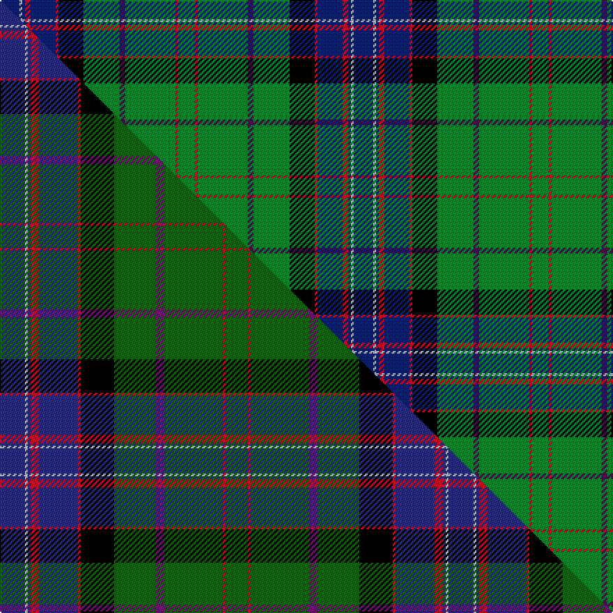

This page is one **sett** — a single exact thread-count. It belongs to the [tartan](/setts/db7lb1db1r2db9r1k9g13dp2g18r1g6/)
(the same proportion at any scale), whose colour order is pattern [BWBRBRKGBGRG](/stripes/bwbrbrkgbgrg/).

Part of the [West Highland Way](/tartans/west-highland-way/) tartan — the named design grouping this sett with its other cloths.

Sourced from tartans-authority.  It is a [12 stripe tartan](/stripes/stripes12/).

Original link [https://www.tartanregister.gov.uk/tartanDetails.aspx?ref=6837](https://www.tartanregister.gov.uk/tartanDetails.aspx?ref=6837)

Dataset <small>— provenance for this record, inherited from the source manifest</small>

<dl class="dataset-prov">
<dt>source</dt><dd><a href="/sources/tartans-authority/">Scottish Tartans Authority</a></dd>
<dt>data captured from</dt><dd><a href="https://github.com/thetartan/tartan-database/blob/master/data/tartans-authority/data.csv">https://github.com/thetartan/tartan-database/blob/master/data/tartans-authority/data.csv</a></dd>
<dt>data date</dt><dd>2005 September <small>(this record)</small></dd>
<dt>licence</dt><dd><a href="https://creativecommons.org/licenses/by-nc-nd/4.0/">CC BY-NC-ND 4.0</a></dd>
</dl>

Capture chain <small>— the hands this data passed through, oldest first; each capture carries its own licence</small>

<ol class="capture-chain">
<li><a href="https://www.tartansauthority.com/">Scottish Tartans Authority</a> <small>the heritage body's archive — its tartan-ferret record browser is retired (links repaired to the SRT, above)</small></li>
<li><a href="https://github.com/thetartan/tartan-database">thetartan/tartan-database</a> <small>2016-2017</small> · <a href="https://creativecommons.org/licenses/by-nc-nd/4.0/">CC BY-NC-ND 4.0</a> <small>Levko Kravets's frozen compilation — the capture we vendored, and where its CC licence text came from</small></li>
<li>this dictionary <small>captured 2026-06-10 · commit 5bf86c7566</small> <small>each re-capture is a git commit to data/sources</small></li>
</ol>

## Register references

External register numbers recorded for this tartan.

- Scottish Tartans Authority (ITI): 6837

## Thread count
DB/14 LB2 DB2 R4 DB18 R2 K18 G26 DP4 G36 R2 G/12

One full sett is **254 threads**.

## Palette
<table><thead><tr><th>Colour</th><th>Shade</th><th>OKLCh</th></tr></thead><tbody><tr><td>DB</td><td><code style="background-color:#082077;">#082077</code> <small style="color:#888">#082077</small></td><td><small style="color:#888">oklch(30.0% 0.149 265.1)</small></td></tr><tr><td>G</td><td><code style="background-color:#008B2A;">#008B2A</code> <small style="color:#888">#008B2A</small></td><td><small style="color:#888">oklch(55.4% 0.170 145.9)</small></td></tr><tr><td>K</td><td><code style="background-color:#000000;">#000000</code> <small style="color:#888">#000000</small></td><td><small style="color:#888">oklch(0.0% 0.000 0.0)</small></td></tr><tr><td>LB</td><td><code style="background-color:#B5BBDE;">#B5BBDE</code> <small style="color:#888">#B5BBDE</small></td><td><small style="color:#888">oklch(79.9% 0.050 277.6)</small></td></tr><tr><td>DP</td><td><code style="background-color:#4B0B4F;">#4B0B4F</code> <small style="color:#888">#4B0B4F</small></td><td><small style="color:#888">oklch(30.1% 0.125 325.4)</small></td></tr><tr><td>R</td><td><code style="background-color:#D60020;">#D60020</code> <small style="color:#888">#D60020</small></td><td><small style="color:#888">oklch(55.2% 0.224 25.5)</small></td></tr></tbody></table>

# Sample pattern

## Compared to the master

This cloth is one sett of its design; the master sett (the exemplar the design is anchored on) is below for comparison.

Its **ΔTartan distance** from the master is **0.44** — the same measure the nearest-tartans table ranks by (0 is identical; a re-scale of the same cloth is near 0, a recolour or a different proportion further).

<figure class="master-compare" style="margin:0">

this sett
master sett ★

<figcaption style="color:#888;font-size:smaller">One weave of this sett against the <a href="/setts/db9lb1db1r3db14r1k12dg15dp3dg21r1dg8/">master sett ★</a>, split on the diagonal: a shared proportion runs seamlessly across it with only the shades shifting; a different proportion breaks on it.</figcaption>
</figure>

## Nearest tartan variants

The nearest existing variants by ΔTartan distance, with this cloth at the top so the swatches line up against it.

ΔTartan

Threads

Variant

Sett

—

254

<a href="/variants/s12/db7lb1db1r2db9r1k9g13dp2g18r1g6~x2/">West Highland Way (Corporate)</a>

<a href="/ttd/edit/#slug=db9lb1db1r3db14r1k12dg15dp3dg21r1dg8~x2~db1406275-dg1806142-dp1607327&amp;base=db7lb1db1r2db9r1k9g13dp2g18r1g6~x2" title="compare in the TTD">0.44</a>

322

<a href="/variants/s12/db9lb1db1r3db14r1k12dg15dp3dg21r1dg8~x2~db1406275-dg1806142-dp1607327/">West Highland Way</a>

<a href="/ttd/edit/#slug=g20k1n1k1g20k10n2k2r2db20w1~x2&amp;base=db7lb1db1r2db9r1k9g13dp2g18r1g6~x2" title="compare in the TTD">1.52</a>

278

<a href="/variants/s11/g20k1n1k1g20k10n2k2r2db20w1~x2/">Storrie (Name)</a>

<a href="/ttd/edit/#slug=db17dp4db2k11g33y4g33k11db2dp4db17lb6~x2&amp;base=db7lb1db1r2db9r1k9g13dp2g18r1g6~x2" title="compare in the TTD">1.86</a>

530

<a href="/variants/s12/db17dp4db2k11g33y4g33k11db2dp4db17lb6~x2/">East Lothian (Fashion) Fashion Tartan</a>

<a href="/ttd/edit/#slug=g4dr2g20db8k8db4lb1lo2k1~x2&amp;base=db7lb1db1r2db9r1k9g13dp2g18r1g6~x2" title="compare in the TTD">1.94</a>

190

<a href="/variants/s9/g4dr2g20db8k8db4lb1lo2k1~x2/">Dodd of Branford</a>

<a href="/ttd/edit/#slug=ly3g3dr2g16k2db24k2g16dr2g3lb3~x2&amp;base=db7lb1db1r2db9r1k9g13dp2g18r1g6~x2" title="compare in the TTD">2.01</a>

292

<a href="/variants/s11/ly3g3dr2g16k2db24k2g16dr2g3lb3~x2/">Loch Tay (District)</a>

<a href="/ttd/edit/#slug=y3g3r2g16k2db24k2g16r2g3lb3~x2&amp;base=db7lb1db1r2db9r1k9g13dp2g18r1g6~x2" title="compare in the TTD">2.02</a>

292

<a href="/variants/s11/y3g3r2g16k2db24k2g16r2g3lb3~x2/">Loch Tay</a>

<a href="/ttd/edit/#slug=k2w1g2dy6g2db4g2k2g15r2g2k1~x4&amp;base=db7lb1db1r2db9r1k9g13dp2g18r1g6~x2" title="compare in the TTD">2.08</a>

316

<a href="/variants/s12/k2w1g2dy6g2db4g2k2g15r2g2k1~x4/">MacClure Htg (Name)</a>

<a href="/ttd/edit/#slug=k2lr1g2dy6g2db4g2k2g15r2g2k1~x4&amp;base=db7lb1db1r2db9r1k9g13dp2g18r1g6~x2" title="compare in the TTD">2.12</a>

316

<a href="/variants/s12/k2lr1g2dy6g2db4g2k2g15r2g2k1~x4/">MacClure Hunting Clan/Family Tartan</a>

<a href="/ttd/edit/#slug=dg4dr1dg12k1ly4k1dg3t5w2~x2&amp;base=db7lb1db1r2db9r1k9g13dp2g18r1g6~x2" title="compare in the TTD">2.23</a>

120

<a href="/variants/s9/dg4dr1dg12k1ly4k1dg3t5w2~x2/">Lees-McRae College</a>

<a href="/ttd/edit/#slug=k7t20lb2r6lb2k20y3g20t27r3t6~x2&amp;base=db7lb1db1r2db9r1k9g13dp2g18r1g6~x2" title="compare in the TTD">2.44</a>

438

<a href="/variants/s11/k7t20lb2r6lb2k20y3g20t27r3t6~x2/">Stinson (Name)</a>

## Neighbour map

Every grey dot is one of 13621 variants placed by the first two principal components of the ΔTartan feature space (42% of its variance). Red is this tartan; blue dots are its nearest — click one to open its page.

<svg viewBox="0 0 640 380" role="img" style="max-width:100%;height:auto;border:1px solid #e0e0e0;border-radius:4px;display:block" xmlns="http://www.w3.org/2000/svg"><image href="/nn/cloud.v1.png" width="640" height="380"/><a href="/variants/s12/db9lb1db1r3db14r1k12dg15dp3dg21r1dg8~x2~db1406275-dg1806142-dp1607327/"><circle cx="200.1" cy="89.4" r="4" fill="#3465a4"><title>West Highland Way</title></circle></a><a href="/variants/s11/g20k1n1k1g20k10n2k2r2db20w1~x2/"><circle cx="205.8" cy="100.5" r="4" fill="#3465a4"><title>Storrie (Name)</title></circle></a><a href="/variants/s12/db17dp4db2k11g33y4g33k11db2dp4db17lb6~x2/"><circle cx="164.8" cy="124.3" r="4" fill="#3465a4"><title>East Lothian (Fashion) Fashion Tartan</title></circle></a><a href="/variants/s9/g4dr2g20db8k8db4lb1lo2k1~x2/"><circle cx="192.2" cy="115.9" r="4" fill="#3465a4"><title>Dodd of Branford</title></circle></a><a href="/variants/s11/ly3g3dr2g16k2db24k2g16dr2g3lb3~x2/"><circle cx="207.6" cy="128.8" r="4" fill="#3465a4"><title>Loch Tay (District)</title></circle></a><a href="/variants/s11/y3g3r2g16k2db24k2g16r2g3lb3~x2/"><circle cx="210.5" cy="128.5" r="4" fill="#3465a4"><title>Loch Tay</title></circle></a><a href="/variants/s12/k2w1g2dy6g2db4g2k2g15r2g2k1~x4/"><circle cx="219.4" cy="107.7" r="4" fill="#3465a4"><title>MacClure Htg (Name)</title></circle></a><a href="/variants/s12/k2lr1g2dy6g2db4g2k2g15r2g2k1~x4/"><circle cx="223.4" cy="108.7" r="4" fill="#3465a4"><title>MacClure Hunting Clan/Family Tartan</title></circle></a><a href="/variants/s9/dg4dr1dg12k1ly4k1dg3t5w2~x2/"><circle cx="220.3" cy="142.8" r="4" fill="#3465a4"><title>Lees-McRae College</title></circle></a><a href="/variants/s11/k7t20lb2r6lb2k20y3g20t27r3t6~x2/"><circle cx="148.1" cy="136.4" r="4" fill="#3465a4"><title>Stinson (Name)</title></circle></a><circle cx="206.3" cy="115.7" r="5" fill="#c00000"/><text x="320" y="376" text-anchor="middle" font-size="11" fill="#999">ground</text><text x="11" y="190" text-anchor="middle" font-size="11" fill="#999" transform="rotate(-90 11 190)">complexity</text></svg>

ID: /variants/s12/db7lb1db1r2db9r1k9g13dp2g18r1g6~x2/
