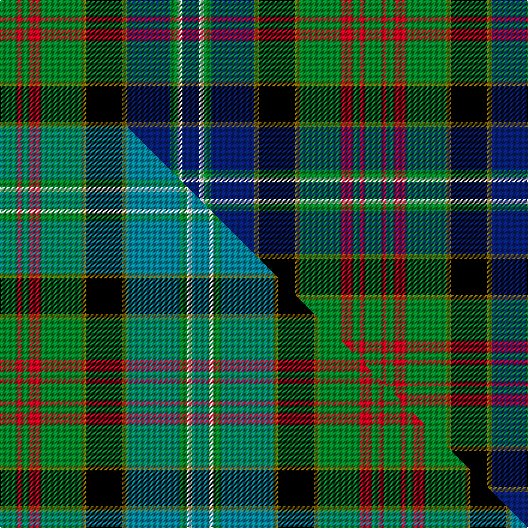

This page is one **sett** — a single exact thread-count. It belongs to the [tartan](/setts/db7w2g3db18y2k15y2g17r5g3r2g7/)
(the same proportion at any scale), whose colour order is pattern [BWGBGKGGRGRG](/stripes/bwgbgkggrgrg/).

Part of the [Paisley](/tartans/paisley/) tartan — the named design grouping this sett with its other cloths.

Sourced from weddslist.  It is a [12 stripe tartan](/stripes/stripes12/).

Original link http://www.weddslist.com/cgi-bin/tartans/pg.pl?source=sts

## Provenance

Earliest known date: 1952 This design won a first prize at Kelso Highland Show for designer, Allan Drennan, in 1952. He regarded it as having 'a motif of the Clan Donald'. It is also worn by members of the Paisley & Allied Families Society and the '100 Pipers' pipe band (in ancient colours).

2 attestations — the source records this cloth was collapsed from (oldest owns this page)

<ul>
<li>undated — Paisley (weddslist, <a href="http://www.weddslist.com/cgi-bin/tartans/pg.pl?source=sts">record</a>) </li>
<li>undated — Paisley District Tartan (house-of-tartan, <a href="http://www.house-of-tartan.scotland.net/house/TartanViewjs.asp?colr=Def&tnam=640">record</a>) </li>
</ul>

## Thread count
G/14 R4 G6 R10 G34 Y4 K30 Y4 DB36 G6 W4 DB/14

One full sett is **304 threads**.

## Palette
<table><thead><tr><th>Colour</th><th>Shade</th><th>OKLCh</th></tr></thead><tbody><tr><td>DB</td><td><code style="background-color:#082077;">#082077</code> <small style="color:#888">#082077</small></td><td><small style="color:#888">oklch(30.0% 0.149 265.1)</small></td></tr><tr><td>G</td><td><code style="background-color:#008B2A;">#008B2A</code> <small style="color:#888">#008B2A</small></td><td><small style="color:#888">oklch(55.4% 0.170 145.9)</small></td></tr><tr><td>K</td><td><code style="background-color:#000000;">#000000</code> <small style="color:#888">#000000</small></td><td><small style="color:#888">oklch(0.0% 0.000 0.0)</small></td></tr><tr><td>W</td><td><code style="background-color:#F7F7F7;">#F7F7F7</code> <small style="color:#888">#F7F7F7</small></td><td><small style="color:#888">oklch(97.6% 0.000 89.9)</small></td></tr><tr><td>R</td><td><code style="background-color:#D60020;">#D60020</code> <small style="color:#888">#D60020</small></td><td><small style="color:#888">oklch(55.2% 0.224 25.5)</small></td></tr><tr><td>Y</td><td><code style="background-color:#8B6E00;">#8B6E00</code> <small style="color:#888">#8B6E00</small></td><td><small style="color:#888">oklch(55.1% 0.113 90.4)</small></td></tr></tbody></table>

# Sample pattern

## Compared to the master

This cloth is one sett of its design; the master sett (the exemplar the design is anchored on) is below for comparison.

Its **ΔTartan distance** from the master is **1.03** — the same measure the nearest-tartans table ranks by (0 is identical; a re-scale of the same cloth is near 0, a recolour or a different proportion further).

<figure class="master-compare" style="margin:0">

this sett
master sett ★

<figcaption style="color:#888;font-size:smaller">One weave of this sett against the <a href="/setts/g7r2g3r5g17y2k15y2t22g3w2t7/">master sett ★</a>, split on the diagonal: a shared proportion runs seamlessly across it with only the shades shifting; a different proportion breaks on it.</figcaption>
</figure>

## Nearest variants

The nearest existing variants by ΔTartan distance, with this cloth at the top so the swatches line up against it.

ΔTartan

Threads

Variant

Sett

—

304

<a href="/variants/s12/db7w2g3db18y2k15y2g17r5g3r2g7~x2/">Paisley</a>

<a href="/ttd/edit/#slug=db7w3g3db18ly3k15ly3g17dr6g3dr2g7~x2&amp;base=db7w2g3db18y2k15y2g17r5g3r2g7~x2" title="compare in the TTD">0.06</a>

320

<a href="/variants/s12/db7w3g3db18ly3k15ly3g17dr6g3dr2g7~x2/">Drennan</a>

<a href="/ttd/edit/#slug=g7r2g3r5g17y2k15y2t22g3w2t7~x2&amp;base=db7w2g3db18y2k15y2g17r5g3r2g7~x2" title="compare in the TTD">0.14</a>

320

<a href="/variants/s12/g7r2g3r5g17y2k15y2t22g3w2t7~x2/">Paisley</a>

<a href="/ttd/edit/#slug=g12r2g2r5g16db3n2k2n3db6k20y3~x2&amp;base=db7w2g3db18y2k15y2g17r5g3r2g7~x2" title="compare in the TTD">2.48</a>

274

<a href="/variants/s12/g12r2g2r5g16db3n2k2n3db6k20y3~x2/">Kelsey, William (Personal)</a>

<a href="/ttd/edit/#slug=g12r2g2r5g16db3n2k2n3db6k20ly3~x2&amp;base=db7w2g3db18y2k15y2g17r5g3r2g7~x2" title="compare in the TTD">2.48</a>

274

<a href="/variants/s12/g12r2g2r5g16db3n2k2n3db6k20ly3~x2/">Kelsey, William (Personal)</a>

2.52

—

<a href="/variants/s10/k3db20dbi8db4g20k2g2r2g3ly3~x2~db1204274-dbi1406275/">Schmidt (2014)</a>

2.52

—

<a href="/variants/s10/k3db20dbi8db4g20k2g2r2g3y3~x2~db0705267-dbi1204274/">Schmidt (2014)</a>

<a href="/ttd/edit/#slug=db8r1db2r3db12r1k12w1g12r3g2r1g8~x2&amp;base=db7w2g3db18y2k15y2g17r5g3r2g7~x2" title="compare in the TTD">2.68</a>

232

<a href="/variants/s13/db8r1db2r3db12r1k12w1g12r3g2r1g8~x2/">MacDonald of Clanranald</a>

<a href="/ttd/edit/#slug=db8r1db2r3db12r1k12w1g12r3g2r1g8&amp;base=db7w2g3db18y2k15y2g17r5g3r2g7~x2" title="compare in the TTD">2.68</a>

116

<a href="/variants/s13/db8r1db2r3db12r1k12w1g12r3g2r1g8/">MacDonald of Clanranald</a>

## Neighbour map

Every grey dot is one of 13620 variants placed by the first two principal components of the ΔTartan feature space (42% of its variance). Red is this tartan; blue dots are its nearest — click one to open its page.

<svg viewBox="0 0 640 380" role="img" style="max-width:100%;height:auto;border:1px solid #e0e0e0;border-radius:4px;display:block" xmlns="http://www.w3.org/2000/svg"><image href="/nn/cloud.v1.png" width="640" height="380"/><a href="/variants/s12/db7w3g3db18ly3k15ly3g17dr6g3dr2g7~x2/"><circle cx="81.2" cy="157.0" r="4" fill="#3465a4"><title>Drennan</title></circle></a><a href="/variants/s12/g7r2g3r5g17y2k15y2t22g3w2t7~x2/"><circle cx="108.2" cy="141.2" r="4" fill="#3465a4"><title>Paisley</title></circle></a><a href="/variants/s12/g12r2g2r5g16db3n2k2n3db6k20y3~x2/"><circle cx="112.1" cy="134.1" r="4" fill="#3465a4"><title>Kelsey, William (Personal)</title></circle></a><a href="/variants/s12/g12r2g2r5g16db3n2k2n3db6k20ly3~x2/"><circle cx="111.9" cy="135.4" r="4" fill="#3465a4"><title>Kelsey, William (Personal)</title></circle></a><a href="/variants/s10/k3db20dbi8db4g20k2g2r2g3ly3~x2~db1204274-dbi1406275/"><circle cx="146.3" cy="144.1" r="4" fill="#3465a4"><title>Schmidt (2014)</title></circle></a><a href="/variants/s10/k3db20dbi8db4g20k2g2r2g3y3~x2~db0705267-dbi1204274/"><circle cx="140.0" cy="142.5" r="4" fill="#3465a4"><title>Schmidt (2014)</title></circle></a><a href="/variants/s13/db8r1db2r3db12r1k12w1g12r3g2r1g8~x2/"><circle cx="113.3" cy="142.4" r="4" fill="#3465a4"><title>MacDonald of Clanranald</title></circle></a><a href="/variants/s13/db8r1db2r3db12r1k12w1g12r3g2r1g8/"><circle cx="113.3" cy="142.4" r="4" fill="#3465a4"><title>MacDonald of Clanranald</title></circle></a><circle cx="95.1" cy="146.5" r="5" fill="#c00000"/><text x="320" y="376" text-anchor="middle" font-size="11" fill="#999">ground</text><text x="11" y="190" text-anchor="middle" font-size="11" fill="#999" transform="rotate(-90 11 190)">complexity</text></svg>

ID: /variants/s12/db7w2g3db18y2k15y2g17r5g3r2g7~x2/
