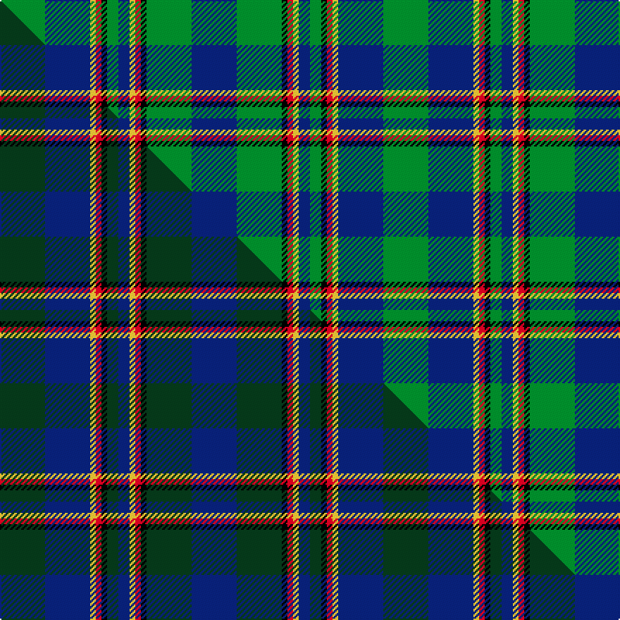

This page is one **sett** — a single exact thread-count. It belongs to the [tartan](/setts/db8g8k1r1ly1db2g2k1r1ly1db8g8/)
(the same proportion at any scale), whose colour order is pattern [BGKRYBGKRYBG](/stripes/bgkrybgkrybg/).

Part of the [Chieftain's](/tartans/chieftain-s/) tartan — the named design grouping this sett with its other cloths.

Sourced from tartans-authority.  It is a [12 stripe tartan](/stripes/stripes12/).

Original link http://www.tartansauthority.com/tartan-ferret/display/7240/

## Register references

External register numbers recorded for this tartan.

- Scottish Tartans Authority (ITI): 7240

## Thread count
G/32 DB32 LY4 R4 K4 G8 DB8 LY4 R4 K4 G32 DB/32

One full sett is **272 threads**.

## Palette
<table><thead><tr><th>Colour</th><th>Shade</th><th>OKLCh</th></tr></thead><tbody><tr><td>DB</td><td><code style="background-color:#082077;">#082077</code> <small style="color:#888">#082077</small></td><td><small style="color:#888">oklch(30.0% 0.149 265.1)</small></td></tr><tr><td>G</td><td><code style="background-color:#008B2A;">#008B2A</code> <small style="color:#888">#008B2A</small></td><td><small style="color:#888">oklch(55.4% 0.170 145.9)</small></td></tr><tr><td>K</td><td><code style="background-color:#000000;">#000000</code> <small style="color:#888">#000000</small></td><td><small style="color:#888">oklch(0.0% 0.000 0.0)</small></td></tr><tr><td>LY</td><td><code style="background-color:#DCBC32;">#DCBC32</code> <small style="color:#888">#DCBC32</small></td><td><small style="color:#888">oklch(80.0% 0.150 95.2)</small></td></tr><tr><td>R</td><td><code style="background-color:#D60020;">#D60020</code> <small style="color:#888">#D60020</small></td><td><small style="color:#888">oklch(55.2% 0.224 25.5)</small></td></tr></tbody></table>

# Sample pattern

## Compared to the master

This cloth is one sett of its design; the master sett (the exemplar the design is anchored on) is below for comparison.

Its **ΔTartan distance** from the master is **1.75** — the same measure the nearest-tartans table ranks by (0 is identical; a re-scale of the same cloth is near 0, a recolour or a different proportion further).

<figure class="master-compare" style="margin:0">

this sett
master sett ★

<figcaption style="color:#888;font-size:smaller">One weave of this sett against the <a href="/setts/dg8db8ly1r1k1dg2db2ly1r1k1dg8db8/">master sett ★</a>, split on the diagonal: a shared proportion runs seamlessly across it with only the shades shifting; a different proportion breaks on it.</figcaption>
</figure>

## Nearest tartan variants

The nearest existing variants by ΔTartan distance, with this cloth at the top so the swatches line up against it.

ΔTartan

Threads

Variant

Sett

—

272

<a href="/variants/s12/db8g8k1r1ly1db2g2k1r1ly1db8g8~x4/">Chieftain's (Corporate)</a>

<a href="/ttd/edit/#slug=g5db24g7k10g24y2db2y2r2~x2&amp;base=db8g8k1r1ly1db2g2k1r1ly1db8g8~x4" title="compare in the TTD">2.89</a>

298

<a href="/variants/s9/g5db24g7k10g24y2db2y2r2~x2/">Maitland</a>

<a href="/ttd/edit/#slug=g5db24g7k10g24dy2db2dy2r2~x2&amp;base=db8g8k1r1ly1db2g2k1r1ly1db8g8~x4" title="compare in the TTD">2.89</a>

298

<a href="/variants/s9/g5db24g7k10g24dy2db2dy2r2~x2/">Maitland Chief</a>

## Neighbour map

Every grey dot is one of 13620 variants placed by the first two principal components of the ΔTartan feature space (42% of its variance). Red is this tartan; blue dots are its nearest — click one to open its page.

<svg viewBox="0 0 640 380" role="img" style="max-width:100%;height:auto;border:1px solid #e0e0e0;border-radius:4px;display:block" xmlns="http://www.w3.org/2000/svg"><image href="/nn/cloud.v1.png" width="640" height="380"/><a href="/variants/s9/g5db24g7k10g24y2db2y2r2~x2/"><circle cx="204.5" cy="154.5" r="4" fill="#3465a4"><title>Maitland</title></circle></a><a href="/variants/s9/g5db24g7k10g24dy2db2dy2r2~x2/"><circle cx="205.9" cy="154.8" r="4" fill="#3465a4"><title>Maitland Chief</title></circle></a><circle cx="182.6" cy="164.1" r="5" fill="#c00000"/><text x="320" y="376" text-anchor="middle" font-size="11" fill="#999">ground</text><text x="11" y="190" text-anchor="middle" font-size="11" fill="#999" transform="rotate(-90 11 190)">complexity</text></svg>

ID: /variants/s12/db8g8k1r1ly1db2g2k1r1ly1db8g8~x4/
