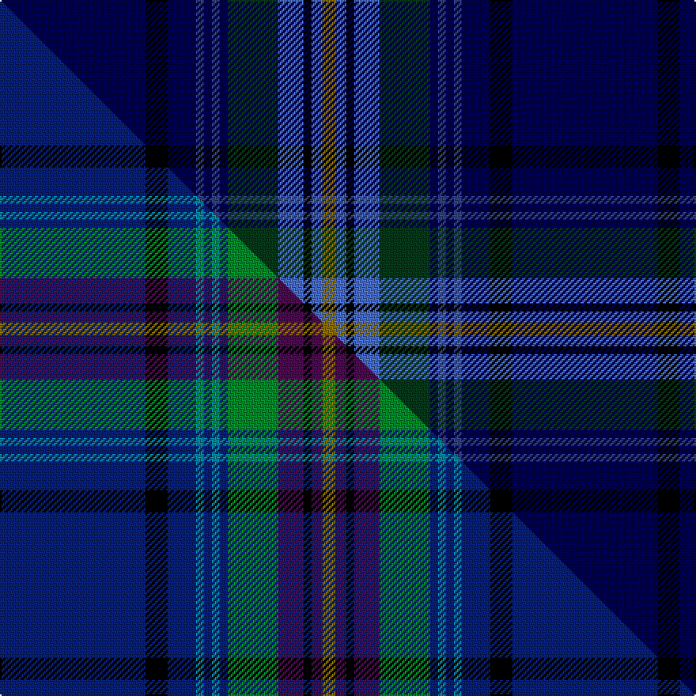

This page is one **sett** — a single exact thread-count. It belongs to the [tartan](/setts/db92k14db18dbi5db5dbi5db5dg32b16k5b7y8/)
(the same proportion at any scale), whose colour order is pattern [BKBBBBBGBKBG](/stripes/bkbbbbbgbkbg/).

Part of the [Bavidge](/tartans/bavidge/) tartan — the named design grouping this sett with its other cloths.

Sourced from weddslist.  It is a [12 stripe tartan](/stripes/stripes12/).

Original link http://www.weddslist.com/cgi-bin/tartans/pg.pl?source=sts

## Thread count
DB/92 K14 DB18 DBi5 DB5 DBi5 DB5 DG32 B16 K5 B7 Y/8

One full sett is **324 threads**.

## Palette
<table><thead><tr><th>Colour</th><th>Shade</th><th>OKLCh</th></tr></thead><tbody><tr><td>DB</td><td><code style="background-color:#304080;">#304080</code> <small style="color:#888">#304080</small></td><td><small style="color:#888">oklch(39.4% 0.109 270.2)</small></td></tr><tr><td>DB</td><td><code style="background-color:#000050;">#000050</code> <small style="color:#888">#000050</small></td><td><small style="color:#888">oklch(19.5% 0.135 264.1)</small></td></tr><tr><td>DG</td><td><code style="background-color:#053819;">#053819</code> <small style="color:#888">#053819</small></td><td><small style="color:#888">oklch(30.0% 0.075 151.3)</small></td></tr><tr><td>B</td><td><code style="background-color:#466CC8;">#466CC8</code> <small style="color:#888">#466CC8</small></td><td><small style="color:#888">oklch(55.1% 0.149 265.0)</small></td></tr><tr><td>K</td><td><code style="background-color:#000000;">#000000</code> <small style="color:#888">#000000</small></td><td><small style="color:#888">oklch(0.0% 0.000 0.0)</small></td></tr><tr><td>Y</td><td><code style="background-color:#8B6E00;">#8B6E00</code> <small style="color:#888">#8B6E00</small></td><td><small style="color:#888">oklch(55.1% 0.113 90.4)</small></td></tr></tbody></table>

# Sample pattern

## Compared to the master

This cloth is one sett of its design; the master sett (the exemplar the design is anchored on) is below for comparison.

Its **ΔTartan distance** from the master is **0.68** — the same measure the nearest-tartans table ranks by (0 is identical; a re-scale of the same cloth is near 0, a recolour or a different proportion further).

<figure class="master-compare" style="margin:0">

this sett
master sett ★

<figcaption style="color:#888;font-size:smaller">One weave of this sett against the <a href="/setts/db92k14db18t5db5t5db5g32dp16k5dp7y8/">master sett ★</a>, split on the diagonal: a shared proportion runs seamlessly across it with only the shades shifting; a different proportion breaks on it.</figcaption>
</figure>

## Nearest tartan variants

The nearest existing variants by ΔTartan distance, with this cloth at the top so the swatches line up against it.

ΔTartan

Threads

Variant

Sett

—

324

<a href="/variants/s12/db92k14db18dbi5db5dbi5db5dg32b16k5b7y8~db0805267-dbi1604274/">Bavidge</a>

<a href="/ttd/edit/#slug=db92k14db18t5db5t5db5g32dp16k5dp7y8&amp;base=db92k14db18dbi5db5dbi5db5dg32b16k5b7y8~db0805267-dbi1604274" title="compare in the TTD">0.67</a>

324

<a href="/variants/s12/db92k14db18t5db5t5db5g32dp16k5dp7y8/">Bavidge (Personal)</a>

<a href="/ttd/edit/#slug=db92k14db18t5db5t5db5g32dp16k5dp7y8~db1406275-dp1607327&amp;base=db92k14db18dbi5db5dbi5db5dg32b16k5b7y8~db0805267-dbi1604274" title="compare in the TTD">0.68</a>

324

<a href="/variants/s12/db92k14db18t5db5t5db5g32dp16k5dp7y8~db1406275-dp1607327/">Bavidge (Personal)</a>

<a href="/ttd/edit/#slug=dbi19k4dbi4db1dbi1db1dbi1dg5b3k1b4~x6~dbi1003265-dg1304144&amp;base=db92k14db18dbi5db5dbi5db5dg32b16k5b7y8~db0805267-dbi1604274" title="compare in the TTD">0.70</a>

390

<a href="/variants/s11/dbi19k4dbi4db1dbi1db1dbi1dg5b3k1b4~x6~dbi1003265-dg1304144/">Spirit of Scotland</a>

<a href="/ttd/edit/#slug=k1ri1db14lo1db1r1db1r2db1dg6db1dg1db1~x4~ri2109032-r1807033&amp;base=db92k14db18dbi5db5dbi5db5dg32b16k5b7y8~db0805267-dbi1604274" title="compare in the TTD">2.40</a>

248

<a href="/variants/s13/k1ri1db14lo1db1r1db1r2db1dg6db1dg1db1~x4~ri2109032-r1807033/">Merchant Company, The</a>

<a href="/ttd/edit/#slug=dg24lb4dg3db11dp8db37k3db2r4~x2&amp;base=db92k14db18dbi5db5dbi5db5dg32b16k5b7y8~db0805267-dbi1604274" title="compare in the TTD">2.60</a>

328

<a href="/variants/s9/dg24lb4dg3db11dp8db37k3db2r4~x2/">Stewmann (Personal)</a>

<a href="/ttd/edit/#slug=dg24lb4dg3db11dp8db37k3db2o4~x2&amp;base=db92k14db18dbi5db5dbi5db5dg32b16k5b7y8~db0805267-dbi1604274" title="compare in the TTD">2.72</a>

328

<a href="/variants/s9/dg24lb4dg3db11dp8db37k3db2o4~x2/">Stewmann (2009) (Personal)</a>

<a href="/ttd/edit/#slug=db42dp4db16dg10k2r6k2dg10k3w4~x2&amp;base=db92k14db18dbi5db5dbi5db5dg32b16k5b7y8~db0805267-dbi1604274" title="compare in the TTD">2.81</a>

304

<a href="/variants/s10/db42dp4db16dg10k2r6k2dg10k3w4~x2/">Mount Dora</a>

<a href="/ttd/edit/#slug=dt6y3k2y5db30g2k4g2db6dt4~x2~dt1204274-db1406275&amp;base=db92k14db18dbi5db5dbi5db5dg32b16k5b7y8~db0805267-dbi1604274" title="compare in the TTD">2.83</a>

236

<a href="/variants/s10/db6y3k2y5dbi30g2k4g2dbi6db4~x2~db1204274-dbi1406275/">St. Andrews University (Corporate)</a>

<a href="/ttd/edit/#slug=db6y2dbi24db4dbi8db6dbi6db8dbi3db10k14db4r3db34w4~db1003265-dbi1605267&amp;base=db92k14db18dbi5db5dbi5db5dg32b16k5b7y8~db0805267-dbi1604274" title="compare in the TTD">2.90</a>

262

<a href="/variants/s15/db6y2dbi24db4dbi8db6dbi6db8dbi3db10k14db4r3db34w4~db1003265-dbi1605267/">MatchPoint</a>

<a href="/ttd/edit/#slug=g2k3db30k2db4k2db30k3dg30k3dt30k2lb2~g2203152-db1106275-dg1806142-dt1204274&amp;base=db92k14db18dbi5db5dbi5db5dg32b16k5b7y8~db0805267-dbi1604274" title="compare in the TTD">2.94</a>

282

<a href="/variants/s13/g2k3db30k2db4k2db30k3dg30k3dbi30k2lb2~g2203152-db1106275-dg1806142-dbi1204274/">Davies (Welsh Name)</a>

## Neighbour map

Every grey dot is one of 13620 variants placed by the first two principal components of the ΔTartan feature space (42% of its variance). Red is this tartan; blue dots are its nearest — click one to open its page.

<svg viewBox="0 0 640 380" role="img" style="max-width:100%;height:auto;border:1px solid #e0e0e0;border-radius:4px;display:block" xmlns="http://www.w3.org/2000/svg"><image href="/nn/cloud.v1.png" width="640" height="380"/><a href="/variants/s12/db92k14db18t5db5t5db5g32dp16k5dp7y8/"><circle cx="292.0" cy="99.8" r="4" fill="#3465a4"><title>Bavidge (Personal)</title></circle></a><a href="/variants/s12/db92k14db18t5db5t5db5g32dp16k5dp7y8~db1406275-dp1607327/"><circle cx="295.1" cy="98.5" r="4" fill="#3465a4"><title>Bavidge (Personal)</title></circle></a><a href="/variants/s11/dbi19k4dbi4db1dbi1db1dbi1dg5b3k1b4~x6~dbi1003265-dg1304144/"><circle cx="347.9" cy="132.6" r="4" fill="#3465a4"><title>Spirit of Scotland</title></circle></a><a href="/variants/s13/k1ri1db14lo1db1r1db1r2db1dg6db1dg1db1~x4~ri2109032-r1807033/"><circle cx="327.6" cy="101.4" r="4" fill="#3465a4"><title>Merchant Company, The</title></circle></a><a href="/variants/s9/dg24lb4dg3db11dp8db37k3db2r4~x2/"><circle cx="305.0" cy="139.0" r="4" fill="#3465a4"><title>Stewmann (Personal)</title></circle></a><a href="/variants/s9/dg24lb4dg3db11dp8db37k3db2o4~x2/"><circle cx="310.8" cy="141.8" r="4" fill="#3465a4"><title>Stewmann (2009) (Personal)</title></circle></a><a href="/variants/s10/db42dp4db16dg10k2r6k2dg10k3w4~x2/"><circle cx="295.3" cy="103.1" r="4" fill="#3465a4"><title>Mount Dora</title></circle></a><a href="/variants/s10/db6y3k2y5dbi30g2k4g2dbi6db4~x2~db1204274-dbi1406275/"><circle cx="323.5" cy="137.2" r="4" fill="#3465a4"><title>St. Andrews University (Corporate)</title></circle></a><a href="/variants/s15/db6y2dbi24db4dbi8db6dbi6db8dbi3db10k14db4r3db34w4~db1003265-dbi1605267/"><circle cx="279.9" cy="125.0" r="4" fill="#3465a4"><title>MatchPoint</title></circle></a><a href="/variants/s13/g2k3db30k2db4k2db30k3dg30k3dbi30k2lb2~g2203152-db1106275-dg1806142-dbi1204274/"><circle cx="236.0" cy="122.8" r="4" fill="#3465a4"><title>Davies (Welsh Name)</title></circle></a><circle cx="315.1" cy="106.7" r="5" fill="#c00000"/><text x="320" y="376" text-anchor="middle" font-size="11" fill="#999">ground</text><text x="11" y="190" text-anchor="middle" font-size="11" fill="#999" transform="rotate(-90 11 190)">complexity</text></svg>

ID: /variants/s12/db92k14db18dbi5db5dbi5db5dg32b16k5b7y8~db0805267-dbi1604274/
