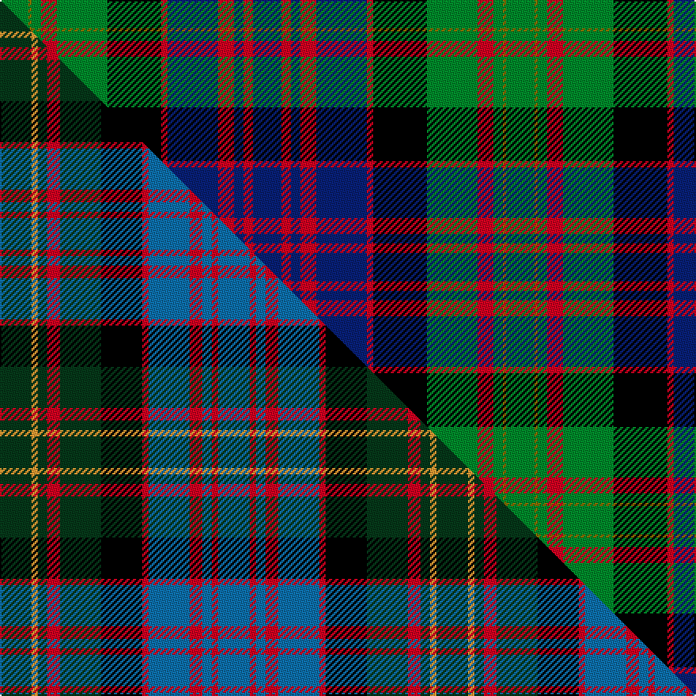

This page is one **sett** — a single exact thread-count. It belongs to the [tartan](/setts/db9r3db3r5db16r2k17g16r5g3y1g9/)
(the same proportion at any scale), whose colour order is pattern [BRBRBRKGRGGG](/stripes/brbrbrkgrggg/).

Part of the [Bowie](/tartans/bowie/) tartan — the named design grouping this sett with its other cloths.

Sourced from weddslist.  It is a [12 stripe tartan](/stripes/stripes12/).

Original link http://www.weddslist.com/cgi-bin/tartans/pg.pl?source=sts

## Thread count
G/18 Y2 G6 R10 G32 K34 R4 DB32 R10 DB6 R6 DB/18

One full sett is **320 threads**.

## Palette
<table><thead><tr><th>Colour</th><th>Shade</th><th>OKLCh</th></tr></thead><tbody><tr><td>DB</td><td><code style="background-color:#082077;">#082077</code> <small style="color:#888">#082077</small></td><td><small style="color:#888">oklch(30.0% 0.149 265.1)</small></td></tr><tr><td>G</td><td><code style="background-color:#008B2A;">#008B2A</code> <small style="color:#888">#008B2A</small></td><td><small style="color:#888">oklch(55.4% 0.170 145.9)</small></td></tr><tr><td>K</td><td><code style="background-color:#000000;">#000000</code> <small style="color:#888">#000000</small></td><td><small style="color:#888">oklch(0.0% 0.000 0.0)</small></td></tr><tr><td>R</td><td><code style="background-color:#D60020;">#D60020</code> <small style="color:#888">#D60020</small></td><td><small style="color:#888">oklch(55.2% 0.224 25.5)</small></td></tr><tr><td>Y</td><td><code style="background-color:#8B6E00;">#8B6E00</code> <small style="color:#888">#8B6E00</small></td><td><small style="color:#888">oklch(55.1% 0.113 90.4)</small></td></tr></tbody></table>

# Sample pattern

## Compared to the master

This cloth is one sett of its design; the master sett (the exemplar the design is anchored on) is below for comparison.

Its **ΔTartan distance** from the master is **1.53** — the same measure the nearest-tartans table ranks by (0 is identical; a re-scale of the same cloth is near 0, a recolour or a different proportion further).

<figure class="master-compare" style="margin:0">

this sett
master sett ★

<figcaption style="color:#888;font-size:smaller">One weave of this sett against the <a href="/setts/dg10lo2dg3r4dg13k13r2t13r4t3r2t10/">master sett ★</a>, split on the diagonal: a shared proportion runs seamlessly across it with only the shades shifting; a different proportion breaks on it.</figcaption>
</figure>

## Nearest variants

The nearest existing variants by ΔTartan distance, with this cloth at the top so the swatches line up against it.

ΔTartan

Threads

Variant

Sett

—

320

<a href="/variants/s12/db9r3db3r5db16r2k17g16r5g3y1g9~x2/">Bowie</a>

<a href="/ttd/edit/#slug=db8r1db2r3db12r1k12g12r3g2r1g8~x2&amp;base=db9r3db3r5db16r2k17g16r5g3y1g9~x2" title="compare in the TTD">0.64</a>

228

<a href="/variants/s12/db8r1db2r3db12r1k12g12r3g2r1g8~x2/">MacDonald</a>

<a href="/ttd/edit/#slug=db8r1db2r3db12r1k12g12r3g2r1g8&amp;base=db9r3db3r5db16r2k17g16r5g3y1g9~x2" title="compare in the TTD">0.64</a>

114

<a href="/variants/s12/db8r1db2r3db12r1k12g12r3g2r1g8/">MacDonald</a>

<a href="/ttd/edit/#slug=db16r2db2r7db31r2k32w3g31r7g2r2g16~x2&amp;base=db9r3db3r5db16r2k17g16r5g3y1g9~x2" title="compare in the TTD">0.85</a>

548

<a href="/variants/s13/db16r2db2r7db31r2k32w3g31r7g2r2g16~x2/">Clanranald, MacDonald of</a>

<a href="/ttd/edit/#slug=db8r1db2r3db12r1k12w1g12r3g2r1g8~x2&amp;base=db9r3db3r5db16r2k17g16r5g3y1g9~x2" title="compare in the TTD">0.94</a>

232

<a href="/variants/s13/db8r1db2r3db12r1k12w1g12r3g2r1g8~x2/">MacDonald of Clanranald</a>

<a href="/ttd/edit/#slug=db8r1db2r3db12r1k12w1g12r3g2r1g8&amp;base=db9r3db3r5db16r2k17g16r5g3y1g9~x2" title="compare in the TTD">0.94</a>

116

<a href="/variants/s13/db8r1db2r3db12r1k12w1g12r3g2r1g8/">MacDonald of Clanranald</a>

<a href="/ttd/edit/#slug=db8r1db2r3db12r1k12g12r3g2r1g4w1~x2&amp;base=db9r3db3r5db16r2k17g16r5g3y1g9~x2" title="compare in the TTD">1.08</a>

230

<a href="/variants/s13/db8r1db2r3db12r1k12g12r3g2r1g4w1~x2/">MacDonell of Glengarry</a>

<a href="/ttd/edit/#slug=db8r1db2r3db12r1k12g12r3g2r1g4w1&amp;base=db9r3db3r5db16r2k17g16r5g3y1g9~x2" title="compare in the TTD">1.08</a>

115

<a href="/variants/s13/db8r1db2r3db12r1k12g12r3g2r1g4w1/">MacDonell of Glengarry D</a>

<a href="/ttd/edit/#slug=db8dr1db2dr3db12dr1k12g12dr3g2dr1g4lb1~x2&amp;base=db9r3db3r5db16r2k17g16r5g3y1g9~x2" title="compare in the TTD">1.08</a>

230

<a href="/variants/s13/db8dr1db2dr3db12dr1k12g12dr3g2dr1g4lb1~x2/">MacDonell of Glengarry - 1914 (Clan)</a>

<a href="/ttd/edit/#slug=k9lo1dg3r5dg16k17r2t16r5t3r3t9~x2&amp;base=db9r3db3r5db16r2k17g16r5g3y1g9~x2" title="compare in the TTD">1.49</a>

320

<a href="/variants/s12/k9lo1dg3r5dg16k17r2t16r5t3r3t9~x2/">Bowie, Black (Name)</a>

1.49

—

<a href="/variants/s12/k9lo1dg3r5dg16k17r2t16r5t3r3t9~x2~t2105244/">Bowie, Black</a>

## Neighbour map

Every grey dot is one of 13620 variants placed by the first two principal components of the ΔTartan feature space (42% of its variance). Red is this tartan; blue dots are its nearest — click one to open its page.

<svg viewBox="0 0 640 380" role="img" style="max-width:100%;height:auto;border:1px solid #e0e0e0;border-radius:4px;display:block" xmlns="http://www.w3.org/2000/svg"><image href="/nn/cloud.v1.png" width="640" height="380"/><a href="/variants/s12/db8r1db2r3db12r1k12g12r3g2r1g8~x2/"><circle cx="135.7" cy="164.2" r="4" fill="#3465a4"><title>MacDonald</title></circle></a><a href="/variants/s12/db8r1db2r3db12r1k12g12r3g2r1g8/"><circle cx="135.7" cy="164.2" r="4" fill="#3465a4"><title>MacDonald</title></circle></a><a href="/variants/s13/db16r2db2r7db31r2k32w3g31r7g2r2g16~x2/"><circle cx="120.8" cy="121.7" r="4" fill="#3465a4"><title>Clanranald, MacDonald of</title></circle></a><a href="/variants/s13/db8r1db2r3db12r1k12w1g12r3g2r1g8~x2/"><circle cx="113.3" cy="142.4" r="4" fill="#3465a4"><title>MacDonald of Clanranald</title></circle></a><a href="/variants/s13/db8r1db2r3db12r1k12w1g12r3g2r1g8/"><circle cx="113.3" cy="142.4" r="4" fill="#3465a4"><title>MacDonald of Clanranald</title></circle></a><a href="/variants/s13/db8r1db2r3db12r1k12g12r3g2r1g4w1~x2/"><circle cx="120.7" cy="137.7" r="4" fill="#3465a4"><title>MacDonell of Glengarry</title></circle></a><a href="/variants/s13/db8r1db2r3db12r1k12g12r3g2r1g4w1/"><circle cx="120.7" cy="137.7" r="4" fill="#3465a4"><title>MacDonell of Glengarry D</title></circle></a><a href="/variants/s13/db8dr1db2dr3db12dr1k12g12dr3g2dr1g4lb1~x2/"><circle cx="138.2" cy="146.4" r="4" fill="#3465a4"><title>MacDonell of Glengarry - 1914 (Clan)</title></circle></a><a href="/variants/s12/k9lo1dg3r5dg16k17r2t16r5t3r3t9~x2/"><circle cx="107.6" cy="140.3" r="4" fill="#3465a4"><title>Bowie, Black (Name)</title></circle></a><a href="/variants/s12/k9lo1dg3r5dg16k17r2t16r5t3r3t9~x2~t2105244/"><circle cx="113.2" cy="141.0" r="4" fill="#3465a4"><title>Bowie, Black</title></circle></a><circle cx="111.7" cy="142.5" r="5" fill="#c00000"/><text x="320" y="376" text-anchor="middle" font-size="11" fill="#999">ground</text><text x="11" y="190" text-anchor="middle" font-size="11" fill="#999" transform="rotate(-90 11 190)">complexity</text></svg>

ID: /variants/s12/db9r3db3r5db16r2k17g16r5g3y1g9~x2/
