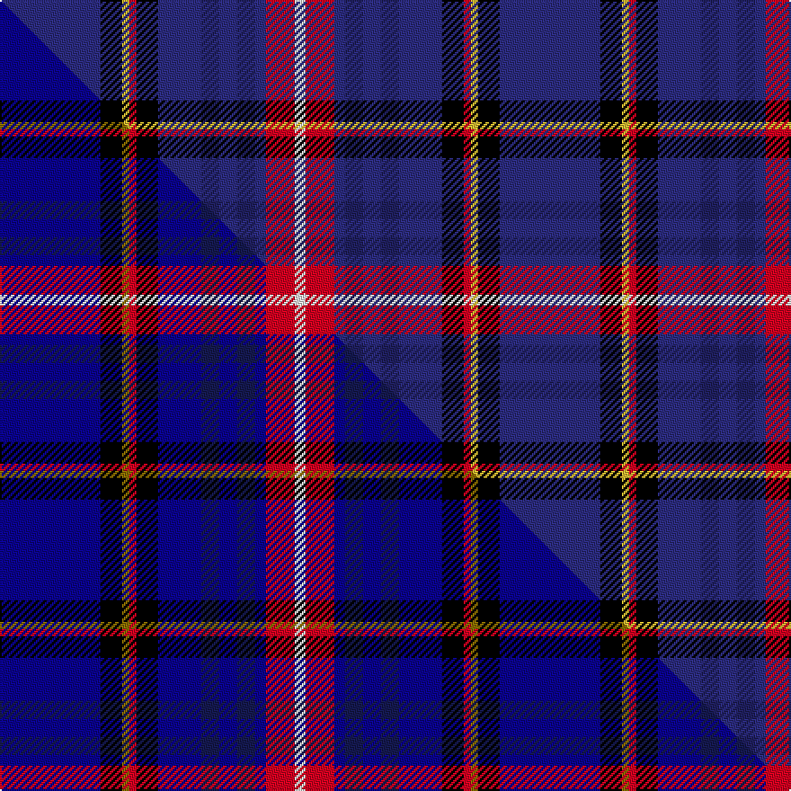

This page is one **sett** — a single exact thread-count. It belongs to the [tartan](/setts/dbi28k6ly2r2k6dbi12db5dbi5db5dbi3r8w3/)
(the same proportion at any scale), whose colour order is pattern [BKYRKBBBBBRW](/stripes/bkyrkbbbbbrw/).

Part of the [Meirhaeghe, Van](/tartans/meirhaeghe-van/) tartan — the named design grouping this sett with its other cloths.

Sourced from tartans-authority.  It is a [12 stripe tartan](/stripes/stripes12/).

Original link http://www.tartansauthority.com/tartan-ferret/display/11014/

## Register references

External register numbers recorded for this tartan.

- Scottish Register of Tartans: [11014](https://www.tartanregister.gov.uk/tartanDetails?ref=11014)
- Scottish Tartans Authority (ITI): 11014

## Thread count
DBi/56 K12 LY4 R4 K12 DBi24 DB10 DBi10 DB10 DBi6 R16 W/6

One full sett is **278 threads**.

## Palette
<table><thead><tr><th>Colour</th><th>Shade</th><th>OKLCh</th></tr></thead><tbody><tr><td>DB</td><td><code style="background-color:#2C2C80;">#2C2C80</code> <small style="color:#888">#2C2C80</small></td><td><small style="color:#888">oklch(35.0% 0.138 276.6)</small></td></tr><tr><td>DB</td><td><code style="background-color:#202060;">#202060</code> <small style="color:#888">#202060</small></td><td><small style="color:#888">oklch(28.9% 0.111 276.9)</small></td></tr><tr><td>K</td><td><code style="background-color:#000000;">#000000</code> <small style="color:#888">#000000</small></td><td><small style="color:#888">oklch(0.0% 0.000 0.0)</small></td></tr><tr><td>R</td><td><code style="background-color:#D60020;">#D60020</code> <small style="color:#888">#D60020</small></td><td><small style="color:#888">oklch(55.2% 0.224 25.5)</small></td></tr><tr><td>W</td><td><code style="background-color:#F7F7F7;">#F7F7F7</code> <small style="color:#888">#F7F7F7</small></td><td><small style="color:#888">oklch(97.6% 0.000 89.9)</small></td></tr><tr><td>LY</td><td><code style="background-color:#DCBC32;">#DCBC32</code> <small style="color:#888">#DCBC32</small></td><td><small style="color:#888">oklch(80.0% 0.150 95.2)</small></td></tr></tbody></table>

# Sample pattern

## Compared to the master

This cloth is one sett of its design; the master sett (the exemplar the design is anchored on) is below for comparison.

Its **ΔTartan distance** from the master is **0.85** — the same measure the nearest-tartans table ranks by (0 is identical; a re-scale of the same cloth is near 0, a recolour or a different proportion further).

<figure class="master-compare" style="margin:0">

this sett
master sett ★

<figcaption style="color:#888;font-size:smaller">One weave of this sett against the <a href="/setts/dbi28k6y2r2k6dbi12db5dbi5db5dbi3r8w3/">master sett ★</a>, split on the diagonal: a shared proportion runs seamlessly across it with only the shades shifting; a different proportion breaks on it.</figcaption>
</figure>

## Nearest tartan variants

The nearest existing variants by ΔTartan distance, with this cloth at the top so the swatches line up against it.

ΔTartan

Threads

Variant

Sett

—

278

<a href="/variants/s12/dbi28k6ly2r2k6dbi12db5dbi5db5dbi3r8w3~x2~dbi1406275-db1204274/">Meirhaeghe, Van</a>

<a href="/ttd/edit/#slug=dbi28k6y2r2k6dbi12db5dbi5db5dbi3r8w3~x2~dbi1208266-db1004274&amp;base=dbi28k6ly2r2k6dbi12db5dbi5db5dbi3r8w3~x2~dbi1406275-db1204274" title="compare in the TTD">0.00</a>

278

<a href="/variants/s12/dbi28k6y2r2k6dbi12db5dbi5db5dbi3r8w3~x2~dbi1208266-db1004274/">Meirhaeghe, Van</a>

## Neighbour map

Every grey dot is one of 13620 variants placed by the first two principal components of the ΔTartan feature space (42% of its variance). Red is this tartan; blue dots are its nearest — click one to open its page.

<svg viewBox="0 0 640 380" role="img" style="max-width:100%;height:auto;border:1px solid #e0e0e0;border-radius:4px;display:block" xmlns="http://www.w3.org/2000/svg"><image href="/nn/cloud.v1.png" width="640" height="380"/><a href="/variants/s12/dbi28k6y2r2k6dbi12db5dbi5db5dbi3r8w3~x2~dbi1208266-db1004274/"><circle cx="229.2" cy="114.9" r="4" fill="#3465a4"><title>Meirhaeghe, Van</title></circle></a><circle cx="236.4" cy="115.6" r="5" fill="#c00000"/><text x="320" y="376" text-anchor="middle" font-size="11" fill="#999">ground</text><text x="11" y="190" text-anchor="middle" font-size="11" fill="#999" transform="rotate(-90 11 190)">complexity</text></svg>

ID: /variants/s12/dbi28k6ly2r2k6dbi12db5dbi5db5dbi3r8w3~x2~dbi1406275-db1204274/
