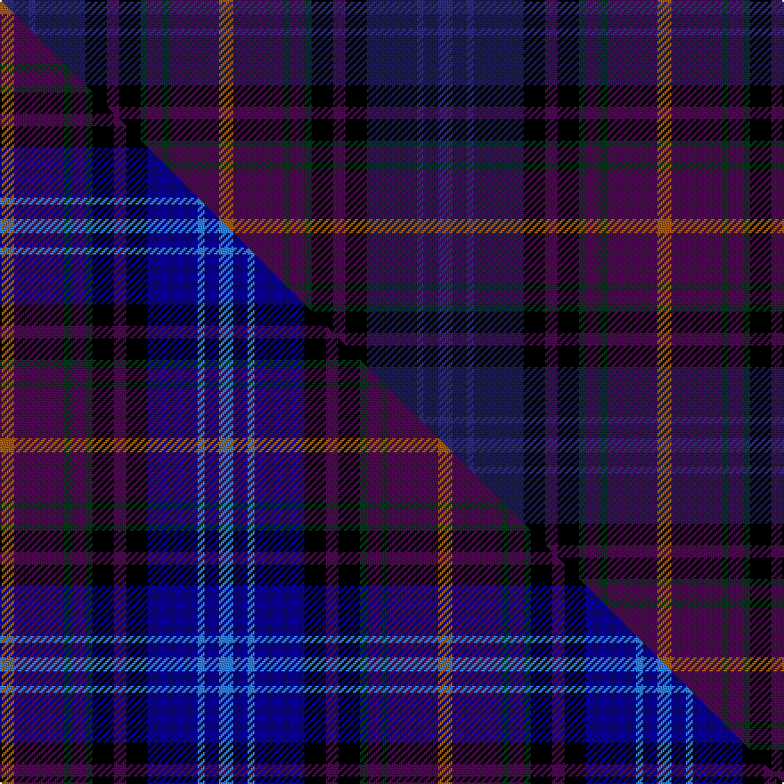

This page is one **sett** — a single exact thread-count. It belongs to the [tartan](/setts/dbi8db8dbi4db28k12dp7k12dg4dp8dg4dp28o8/)
(the same proportion at any scale), whose colour order is pattern [BBBBKBKGBGBR](/stripes/bbbbkbkgbgbr/).

Part of the [Kinloch Anderson Thistle](/tartans/kinloch-anderson-thistle/) tartan — the named design grouping this sett with its other cloths.

Sourced from tartans-authority.  It is a [12 stripe tartan](/stripes/stripes12/).

Original link http://www.tartansauthority.com/tartan-ferret/display/10146/

## Register references

External register numbers recorded for this tartan.

- Scottish Register of Tartans: [10146](https://www.tartanregister.gov.uk/tartanDetails?ref=10146)
- Scottish Tartans Authority (ITI): 10146

## Thread count
DBi/8 DB8 DBi4 DB28 K12 DP7 K12 DG4 DP8 DG4 DP28 O/8

One full sett is **246 threads**.

## Palette
<table><thead><tr><th>Colour</th><th>Shade</th><th>OKLCh</th></tr></thead><tbody><tr><td>DB</td><td><code style="background-color:#2C2C80;">#2C2C80</code> <small style="color:#888">#2C2C80</small></td><td><small style="color:#888">oklch(35.0% 0.138 276.6)</small></td></tr><tr><td>DB</td><td><code style="background-color:#1C1C50;">#1C1C50</code> <small style="color:#888">#1C1C50</small></td><td><small style="color:#888">oklch(26.2% 0.093 277.9)</small></td></tr><tr><td>DG</td><td><code style="background-color:#053819;">#053819</code> <small style="color:#888">#053819</small></td><td><small style="color:#888">oklch(30.0% 0.075 151.3)</small></td></tr><tr><td>K</td><td><code style="background-color:#000000;">#000000</code> <small style="color:#888">#000000</small></td><td><small style="color:#888">oklch(0.0% 0.000 0.0)</small></td></tr><tr><td>O</td><td><code style="background-color:#A65C11;">#A65C11</code> <small style="color:#888">#A65C11</small></td><td><small style="color:#888">oklch(55.0% 0.125 58.3)</small></td></tr><tr><td>DP</td><td><code style="background-color:#4B0B4F;">#4B0B4F</code> <small style="color:#888">#4B0B4F</small></td><td><small style="color:#888">oklch(30.1% 0.125 325.4)</small></td></tr></tbody></table>

# Sample pattern

## Compared to the master

This cloth is one sett of its design; the master sett (the exemplar the design is anchored on) is below for comparison.

Its **ΔTartan distance** from the master is **2.09** — the same measure the nearest-tartans table ranks by (0 is identical; a re-scale of the same cloth is near 0, a recolour or a different proportion further).

<figure class="master-compare" style="margin:0">

this sett
master sett ★

<figcaption style="color:#888;font-size:smaller">One weave of this sett against the <a href="/setts/o8dp28dg4dp8dg4k12dp7k12db28t4db8t8/">master sett ★</a>, split on the diagonal: a shared proportion runs seamlessly across it with only the shades shifting; a different proportion breaks on it.</figcaption>
</figure>

## Nearest variants

The nearest existing variants by ΔTartan distance, with this cloth at the top so the swatches line up against it.

ΔTartan

Threads

Variant

Sett

—

246

<a href="/variants/s12/dbi8db8dbi4db28k12dp7k12dg4dp8dg4dp28o8~dbi1406275-db1004274/">Kinloch Anderson Thistle (Fashion)</a>

<a href="/ttd/edit/#slug=o8dp28dg4dp8dg4k12dp7k12db28t4db8t8~db1208266-t2508259&amp;base=dbi8db8dbi4db28k12dp7k12dg4dp8dg4dp28o8~dbi1406275-db1004274" title="compare in the TTD">0.00</a>

246

<a href="/variants/s12/o8dp28dg4dp8dg4k12dp7k12db28t4db8t8~db1208266-t2508259/">Kinloch Anderson Thistle</a>

## Neighbour map

Every grey dot is one of 13620 variants placed by the first two principal components of the ΔTartan feature space (42% of its variance). Red is this tartan; blue dots are its nearest — click one to open its page.

<svg viewBox="0 0 640 380" role="img" style="max-width:100%;height:auto;border:1px solid #e0e0e0;border-radius:4px;display:block" xmlns="http://www.w3.org/2000/svg"><image href="/nn/cloud.v1.png" width="640" height="380"/><a href="/variants/s12/o8dp28dg4dp8dg4k12dp7k12db28t4db8t8~db1208266-t2508259/"><circle cx="104.4" cy="175.2" r="4" fill="#3465a4"><title>Kinloch Anderson Thistle</title></circle></a><circle cx="166.4" cy="195.6" r="5" fill="#c00000"/><text x="320" y="376" text-anchor="middle" font-size="11" fill="#999">ground</text><text x="11" y="190" text-anchor="middle" font-size="11" fill="#999" transform="rotate(-90 11 190)">complexity</text></svg>

ID: /variants/s12/dbi8db8dbi4db28k12dp7k12dg4dp8dg4dp28o8~dbi1406275-db1004274/
