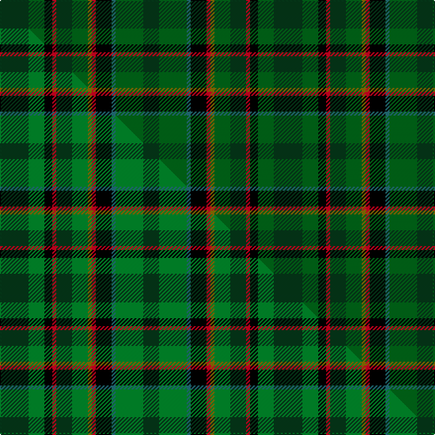

This is one **variant** — a specific cloth: this exact thread count and colourway, with its own
provenance below. It is one weaving of the [sett](/tartans/m/mc/mccamley/) (the scale-free proportion — the
same cloth at any scale or shade), whose colour order is pattern [GGGKRGGGRKGG](/stripes/gggkrgggrkgg/).

Part of the [McCamley](/tartans/m/mc/mccamley/) tartan — the named design grouping this sett with its other cloths.

Sourced from tartans-authority.  It is a [12 stripe tartan](/stripes/stripes12/).

Original link <code>http://www.tartansauthority.com/tartan-ferret/display/7241/</code> — retired · [Internet Archive copy](https://web.archive.org/web/*/http://www.tartansauthority.com/tartan-ferret/display/7241/*)

Dataset <small>— provenance for this record, inherited from the source manifest</small>

<dl class="dataset-prov">
<dt>source</dt><dd><a href="/sources/tartans-authority/">Scottish Tartans Authority</a></dd>
<dt>data captured from</dt><dd><a href="https://github.com/thetartan/tartan-database/blob/master/data/tartans-authority/data.csv">https://github.com/thetartan/tartan-database/blob/master/data/tartans-authority/data.csv</a></dd>
<dt>data date</dt><dd>2007 <small>(this record)</small></dd>
<dt>licence</dt><dd><a href="https://creativecommons.org/licenses/by-nc-nd/4.0/">CC BY-NC-ND 4.0</a></dd>
</dl>

Capture chain <small>— the hands this data passed through, oldest first; each capture carries its own licence</small>

<ol class="capture-chain">
<li><a href="https://www.tartansauthority.com/">Scottish Tartans Authority</a> <small>the heritage body’s archive — its tartan-ferret record browser is retired; dead record links are shown unlinked, with an Internet Archive copy (ITI numbers are not SRT references)</small></li>
<li><a href="https://github.com/thetartan/tartan-database">thetartan/tartan-database</a> <small>2016-2017</small> · <a href="https://creativecommons.org/licenses/by-nc-nd/4.0/">CC BY-NC-ND 4.0</a> <small>Levko Kravets's frozen compilation — the capture we vendored, and where its CC licence text came from</small></li>
<li>this dictionary <small>captured 2026-06-10 · commit 5bf86c7566</small> <small>each re-capture is a git commit to data/sources</small></li>
</ol>

## Register references

External register numbers recorded for this tartan.

- Scottish Tartans Authority (ITI): 7241

## Thread count
DG/29 DGi16 K8 R4 DG16 DGi16 Y4 R4 K16 G4 DGi28 DG/16

One full sett is **277 threads**.

## Palette
<table><thead><tr><th>Colour</th><th>Shade</th><th>OKLCh</th></tr></thead><tbody><tr><td>DG</td><td><code style="background-color:#053819;">#053819</code> <small style="color:#888">#053819</small></td><td><small style="color:#888">oklch(30.0% 0.075 151.3)</small></td></tr><tr><td>G</td><td><code style="background-color:#247078;">#247078</code> <small style="color:#888">#247078</small></td><td><small style="color:#888">oklch(50.3% 0.073 205.1)</small></td></tr><tr><td>DG</td><td><code style="background-color:#006818;">#006818</code> <small style="color:#888">#006818</small></td><td><small style="color:#888">oklch(45.0% 0.142 145.0)</small></td></tr><tr><td>K</td><td><code style="background-color:#000000;">#000000</code> <small style="color:#888">#000000</small></td><td><small style="color:#888">oklch(0.0% 0.000 0.0)</small></td></tr><tr><td>R</td><td><code style="background-color:#D60020;">#D60020</code> <small style="color:#888">#D60020</small></td><td><small style="color:#888">oklch(55.2% 0.224 25.5)</small></td></tr><tr><td>Y</td><td><code style="background-color:#8B6E00;">#8B6E00</code> <small style="color:#888">#8B6E00</small></td><td><small style="color:#888">oklch(55.1% 0.113 90.4)</small></td></tr></tbody></table>

# Sample pattern

## Compared to the master

This cloth is one sett of its design; the master sett (the exemplar the design is anchored on) is below for comparison.

Its **ΔTartan distance** from the master is **0.08** — the same measure the nearest-tartans table ranks by (0 is identical; a re-scale of the same cloth is near 0, a recolour or a different proportion further).

<figure class="master-compare" style="margin:0">

this sett
master sett ★

<figcaption style="color:#888;font-size:smaller">One weave of this sett against the <a href="/setts/dg29g16k8r4dg16g16y4r4k16gi4g28dg16/">master sett ★</a>, split on the diagonal: a shared proportion runs seamlessly across it with only the shades shifting; a different proportion breaks on it.</figcaption>
</figure>

## Nearest tartan variants

The nearest existing variants by ΔTartan distance, with this cloth at the top so the swatches line up against it.

ΔTartan

Threads

Variant

Sett

—

277

<a href="/variants/s12/dg29dgi16k8r4dg16dgi16y4r4k16g4dgi28dg16~dgi1806142-g2003208/">McCamley (Personal)</a>

<a href="/ttd/edit/#slug=dg29g16k8r4dg16g16y4r4k16t4g28dg16&amp;base=dg29dgi16k8r4dg16dgi16y4r4k16g4dgi28dg16~dgi1806142-g2003208" title="compare in the TTD">0.09</a>

277

<a href="/variants/s12/dg29g16k8r4dg16g16y4r4k16t4g28dg16/">MacCamley Clan Tartan</a>

<a href="/ttd/edit/#slug=dg29g16k8r4dg16g16y4r4k16t4g28dg16~t2003208&amp;base=dg29dgi16k8r4dg16dgi16y4r4k16g4dgi28dg16~dgi1806142-g2003208" title="compare in the TTD">0.09</a>

277

<a href="/variants/s12/dg29g16k8r4dg16g16y4r4k16gi4g28dg16~gi2003208/">McCamley (Personal)</a>

<a href="/ttd/edit/#slug=r4k1dg8g2dg8k4g8k1db2k1g8k4dg8k2dg8k1y2~x2~dg1504144-g2007139&amp;base=dg29dgi16k8r4dg16dgi16y4r4k16g4dgi28dg16~dgi1806142-g2003208" title="compare in the TTD">2.45</a>

276

<a href="/variants/s17/r4k1dg8g2dg8k4g8k1db2k1g8k4dg8k2dg8k1y2~x2~dg1504144-g2007139/">Redmond (2014)</a>

<a href="/ttd/edit/#slug=dg10dp2dg3dr4dg13k13dr2g13dr4g3dr2g10~x2&amp;base=dg29dgi16k8r4dg16dgi16y4r4k16g4dgi28dg16~dgi1806142-g2003208" title="compare in the TTD">2.83</a>

276

<a href="/variants/s12/dg10dp2dg3dr4dg13k13dr2g13dr4g3dr2g10~x2/">MacDonald of Denovan Htg (Clan)</a>

<a href="/ttd/edit/#slug=k15lb4dt15dg24y4dg24dt15lb4k15r4~x2&amp;base=dg29dgi16k8r4dg16dgi16y4r4k16g4dgi28dg16~dgi1806142-g2003208" title="compare in the TTD">2.94</a>

458

<a href="/variants/s10/k15lb4dt15dg24y4dg24dt15lb4k15r4~x2/">Haughfoot</a>

<a href="/ttd/edit/#slug=dg19g5k2t3dg5g3t5k2dt3g5w2~x2~t2304245-dt1204274&amp;base=dg29dgi16k8r4dg16dgi16y4r4k16g4dgi28dg16~dgi1806142-g2003208" title="compare in the TTD">2.99</a>

174

<a href="/variants/s11/dg19g5k2t3dg5g3t5k2db3g5w2~x2~t2304245-db1204274/">MacLean, Kenneth, baron of Denboig (Personal)</a>

<a href="/ttd/edit/#slug=dg19dgi5k2n3dg5dgi3lb5k2db3dgi5w2~x2~dgi1605139&amp;base=dg29dgi16k8r4dg16dgi16y4r4k16g4dgi28dg16~dgi1806142-g2003208" title="compare in the TTD">3.07</a>

174

<a href="/variants/s11/dg19dgi5k2n3dg5dgi3lb5k2db3dgi5w2~x2~dgi1605139/">MacLean, Kenneth, Baron of Denboig</a>

<a href="/ttd/edit/#slug=r2dg18g2dg2g2dg2g12db3k13dg10k2g12y2~x2&amp;base=dg29dgi16k8r4dg16dgi16y4r4k16g4dgi28dg16~dgi1806142-g2003208" title="compare in the TTD">3.16</a>

320

<a href="/variants/s13/r2dg18g2dg2g2dg2g12db3k13dg10k2g12y2~x2/">McHeadley Society</a>

<a href="/ttd/edit/#slug=k4dg10k13db3dgi12dg2dgi2dg2dgi2dg18r2~x2~dgi1806142&amp;base=dg29dgi16k8r4dg16dgi16y4r4k16g4dgi28dg16~dgi1806142-g2003208" title="compare in the TTD">3.17</a>

268

<a href="/variants/s11/k4dg10k13db3dgi12dg2dgi2dg2dgi2dg18r2~x2~dgi1806142/">McHeadley Society Corporate Tartan</a>

<a href="/ttd/edit/#slug=k3db11g15dg5g10dgi14dg14ly2~x2~dg1302166-dgi1303152&amp;base=dg29dgi16k8r4dg16dgi16y4r4k16g4dgi28dg16~dgi1806142-g2003208" title="compare in the TTD">3.21</a>

286

<a href="/variants/s8/k3db11g15dg5g10dgi14dg14ly2~x2~dg1302166-dgi1303152/">Brocéliande (Restricted)</a>

## Neighbour map

Every grey dot is one of 13656 variants placed by the first two principal components of the ΔTartan feature space (42% of its variance). Red is this tartan; blue dots are its nearest — click one to open its page. The map is a flat projection of a many-dimensional space — [how to read it](/posts/neighbourhood-maps/).

<svg viewBox="0 0 640 380" role="img" style="max-width:100%;height:auto;border:1px solid #e0e0e0;border-radius:4px;display:block" xmlns="http://www.w3.org/2000/svg"><image href="/nn/cloud.v1.png" width="640" height="380"/><a href="/variants/s12/dg29g16k8r4dg16g16y4r4k16t4g28dg16/"><circle cx="114.1" cy="184.9" r="4" fill="#3465a4"><title>MacCamley Clan Tartan</title></circle></a><a href="/variants/s12/dg29g16k8r4dg16g16y4r4k16gi4g28dg16~gi2003208/"><circle cx="115.2" cy="185.2" r="4" fill="#3465a4"><title>McCamley (Personal)</title></circle></a><a href="/variants/s17/r4k1dg8g2dg8k4g8k1db2k1g8k4dg8k2dg8k1y2~x2~dg1504144-g2007139/"><circle cx="142.8" cy="163.3" r="4" fill="#3465a4"><title>Redmond (2014)</title></circle></a><a href="/variants/s12/dg10dp2dg3dr4dg13k13dr2g13dr4g3dr2g10~x2/"><circle cx="116.8" cy="201.3" r="4" fill="#3465a4"><title>MacDonald of Denovan Htg (Clan)</title></circle></a><a href="/variants/s10/k15lb4dt15dg24y4dg24dt15lb4k15r4~x2/"><circle cx="114.6" cy="200.8" r="4" fill="#3465a4"><title>Haughfoot</title></circle></a><a href="/variants/s11/dg19g5k2t3dg5g3t5k2db3g5w2~x2~t2304245-db1204274/"><circle cx="164.6" cy="152.8" r="4" fill="#3465a4"><title>MacLean, Kenneth, baron of Denboig (Personal)</title></circle></a><a href="/variants/s11/dg19dgi5k2n3dg5dgi3lb5k2db3dgi5w2~x2~dgi1605139/"><circle cx="147.6" cy="138.4" r="4" fill="#3465a4"><title>MacLean, Kenneth, Baron of Denboig</title></circle></a><a href="/variants/s13/r2dg18g2dg2g2dg2g12db3k13dg10k2g12y2~x2/"><circle cx="140.5" cy="151.4" r="4" fill="#3465a4"><title>McHeadley Society</title></circle></a><a href="/variants/s11/k4dg10k13db3dgi12dg2dgi2dg2dgi2dg18r2~x2~dgi1806142/"><circle cx="194.7" cy="152.1" r="4" fill="#3465a4"><title>McHeadley Society Corporate Tartan</title></circle></a><a href="/variants/s8/k3db11g15dg5g10dgi14dg14ly2~x2~dg1302166-dgi1303152/"><circle cx="126.5" cy="233.3" r="4" fill="#3465a4"><title>Brocéliande (Restricted)</title></circle></a><circle cx="149.8" cy="196.2" r="5" fill="#c00000"/><text x="320" y="376" text-anchor="middle" font-size="11" fill="#999">ground</text><text x="11" y="190" text-anchor="middle" font-size="11" fill="#999" transform="rotate(-90 11 190)">complexity</text></svg>

ID: /variants/s12/dg29dgi16k8r4dg16dgi16y4r4k16g4dgi28dg16~dgi1806142-g2003208/
